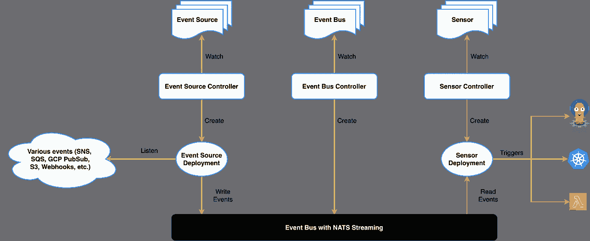
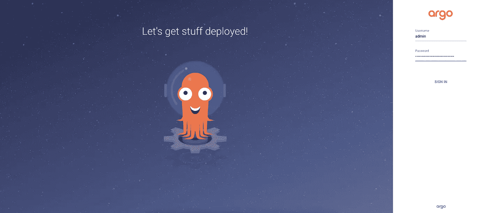
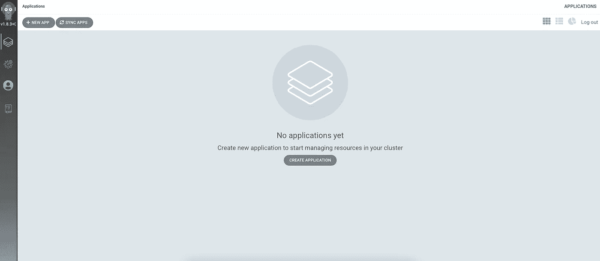
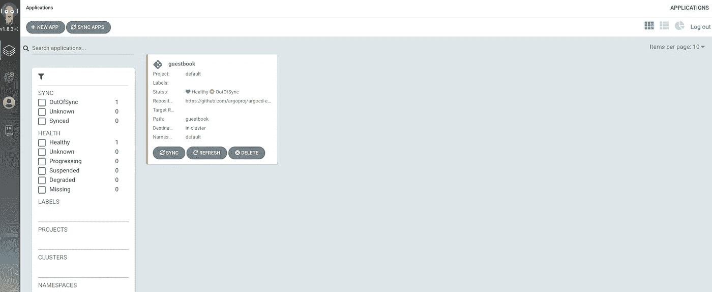
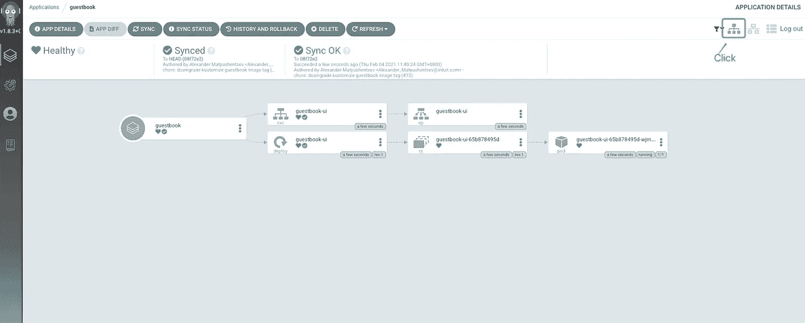

# Argo CD:Kubernetes devo PS 的工具

> 原文：<https://medium.com/geekculture/argo-cd-a-tool-for-kubernetes-devops-c46f2881edfe?source=collection_archive---------9----------------------->

在本帖中，我将向您展示 Argo CD 如何改进 Kubernetes DevOps 流程。在我们开始之前，让我们看一些背景信息。

# Argo CD 功能

# GitOps:起源

你可能已经知道了，Weaveworks 在 2017 年发表了一篇名为[GitOps——通过拉式请求](https://www.weave.works/blog/gitops-operations-by-pull-request)进行操作的帖子。作者 Alexis 介绍了一种使用 Git 作为真实来源的部署方式。

在 GitOps 实践中，我们需要在 Git 存储库中定义和管理软件基础设施。软件基础设施不仅包括 IaaS 和 Kubernetes，还包括应用程序。每个人都可以通过提交“拉”请求来修改软件基础设施，自动程序将执行这些修改。

因此，每个人都将能够专注于开发新功能，而不是担心包括安装、修改和迁移在内的操作和维护。

# 阿尔戈 CD:吉托普斯实现

Argo CD 是一个基于 Kubernetes 的 GitOps 连续交付(CD)工具。这是 Argo CD 社区的示意图。


从图中可以看出:

1.  Argo CD 从 Git Repo 中提取应用程序配置，并在 Kubernetes 集群中部署应用程序。
2.  如果有人想要添加一个新特性，他或她只需要向 Git Repo 提交一个 Pull 请求来修改应用程序部署配置。然后，等待合并。
3.  一旦 Pull 请求被合并，Argo CD 将根据 Webhook 触发器运行更新。
4.  更新应用程序并发送通知。

总结一下，自动化运维，持续交付。简单易懂吧？

# Argo CD:功能强大且可扩展

以上功能将能够覆盖普通 Kubernetes 的运行和维护。如果事情变得更复杂呢？我们无法逃避涉及多云、多平台和多中间件的场景。



Argo CD 在其处理逻辑中定义了四个组件:

*   [事件源](https://argoproj.github.io/argo-events/concepts/event_source/) : An `EventSource`定义了从外部源消费事件所需的配置。
*   [传感器](https://argoproj.github.io/argo-events/concepts/sensor/):它监听 eventbus 上的事件，并作为事件依赖管理器来解析和执行触发器。
*   [Eventbus](https://argoproj.github.io/argo-events/concepts/eventbus/) :连接事件源和传感器，充当 Argo 事件的传输层。
*   [Trigger](https://argoproj.github.io/argo-events/concepts/trigger/):Trigger 是事件依赖关系解决后，传感器执行的资源/工作负载。

更多信息，请参见[架构](https://argoproj.github.io/argo-events/concepts/architecture/)。

对于运维人员来说，你只需要关注两个方面:

*   Argo CD 可以处理的事件:AMQP、AWS SNS、AWS SQS、Cron Schedules、GCP PubSub、GitHub、GitLab、HDFS、基于文件的事件、Kafka、Minio、NATS、MQTT、K8s Resources、Slack、NetApp StorageGrid、Webhooks、Stripe、NSQ、Emitter、Redis 和 Azure Events Hub。
*   Argo CD 可以执行的操作:Argo 工作流、标准 K8s 对象、HTTP 请求、AWS Lambda、NATS 消息、Kafka 消息、Slack 通知、Argo 推出 CR、自定义/构建您自己的触发器和 Apache OpenWhisk。

# Kubernetes 上的 Argo CD

我将使用 Kubernetes v1.18.3 来部署 Argo CD。

# 步骤 1:部署 Argo 光盘

1.  运行以下命令创建命名空间。命名为 argocd。

`kubectl create namespace argocd`

2.运行以下命令来部署 Argo CD。

```
kubectl apply -n argocd -f [https://raw.githubusercontent.com/argoproj/argo-cd/v1.8.3/manifests/install.yaml](https://raw.githubusercontent.com/argoproj/argo-cd/v1.8.3/manifests/install.yaml)
```

*注:*

*Argo CD 社区还通过运行命令* `*kubectl apply -n argocd -f https://raw.githubusercontent.com/argoproj/argo-cd/v1.8.3/manifests/ha/install.yaml*` *提供了一种 HA 部署方法。这是为了在生产中部署。*

3.运行以下命令将服务类型设置为 NodePort。

```
kubectl patch svc argocd-server -p '{"spec": {"type": "NodePort"}}' -n argocdkubectl patch svc argocd-server -p '{"spec": {"type": "NodePort"}}' -n argocd
```

4.运行以下命令查看名称空间`argocd`中的所有服务。

```
$ kubectl -n argocd get svc

NAME          TYPE        CLUSTER-IP   EXTERNAL-IP  PORT(S)     AGE
argocd-dex
-server       ClusterIP   10.233.34.191   <none>    5556/TCP,
                                                    5557/TCP,
                                                    5558/TCP   5m37s
argocd-metrics ClusterIP   10.233.54.3    <none>    8082/TCP   5m36sargocd-redis   ClusterIP   10.233.18.86   <none>    6379/TCP   5m36sargocd-repo
-server        ClusterIP   10.233.3.171   <none>    8081/TCP,
                                                    8084/TCP   5m36sargocd-server  NodePort    10.233.61.3    <none>  80:31808/TCP,
                                                 443:30992/TCP 5m36s
argocd-server
-metrics       ClusterIP   10.233.36.228  <none>    8083/TCP   5m36s
```

# 步骤 2:登录 Argo 光盘

1.  运行以下命令获取管理员帐户的密码。

```
$ kubectl get pod -n argocd |grep argocd-server

argocd-server-7d597d9bcd-6nzct     1/1     Running   0          22m
```

Pod ID 是密码，即`argocd-server-7d597d9bcd-6nzct`。

2.通过`http://{HOST_IP}:31808`访问 Argo 光盘网页，使用`admin/argocd-server-7d597d9bcd-6nzct`作为账号和密码登录。



# 步骤 3:安装 CLI 工具

让我们以 Linux 为例。

1.  运行以下命令下载 CLI 工具并使其可执行。

```
curl -sSL -o /usr/local/bin/argocd [https://github.com/argoproj/argo-cd/releases/download/v1.8.3/argocd-linux-amd64](https://github.com/argoproj/argo-cd/releases/download/v1.8.3/argocd-linux-amd64)
chmod +x /usr/local/bin/argocd
```

2.运行以下命令，使用 CLI 工具登录到 Kubernetes 集群上运行的 Argo CD。确保用您的主机 IP 地址替换`HOST_IP`。

```
$ argocd login {HOST_IP}:31808 --username admin --password argocd-server-7d597d9bcd-6nzct

'admin' logged in successfully
Context '{HOST_IP}:31808' updated
```

3.为了方便起见，您可以使用下面的命令将管理员密码更新为`password`。

```
$ argocd account update-password --account admin --current-password argocd-server-7d597d9bcd-6nzct --new-password password

Password updated
Context '{HOST_IP}:31808' updated
```

# 步骤 4:创建应用程序

我们当然可以通过 Web UI 创建一个应用程序，但是让我们在这里使用 CLI 工具，这样您就可以通过使用下面的命令更好地理解 Argo CD。

1.  运行以下命令创建一个应用程序。

```
argocd app create guestbook --repo [https://github.com/argoproj/argocd-example-apps.git](https://github.com/argoproj/argocd-example-apps.git) --path guestbook --dest-server [https://kubernetes.default.svc](https://kubernetes.default.svc) --dest-namespace default
```

至于命令中的标志:

*   `--repo`:指定 Git 存储库。
*   `--path`:指定 Git 仓库中部署文件的相对路径。
*   `--dest-server`:访问集群的地址。
*   `--dest-namespace`:部署应用程序的名称空间。

如果你去目录`https://github.com/argoproj/argocd-example-apps/tree/master/guestbook`，你可以找到两个 YAML 文件，分别用于部署和服务。

2.过一会儿，您可以查看 Argo CD 网页上显示的创建的服务。



3.单击它以查看其详细信息。也可以点击右上角的图标查看其拓扑图。



4.运行以下命令查看创建的服务。

```
$ kubectl get all -n default

NAME                                READY   STATUS    RESTARTS   AGE
pod/guestbook-ui-65b878495d-wjmxh   1/1     Running   0          60s

NAME          TYPE        CLUSTER-IP     EXTERNAL-IP   PORT(S)   AGE
service
/guestbook-ui ClusterIP   10.233.55.230  <none>        80/TCP    61s service
/kubernetes   ClusterIP   10.233.0.1     <none>        443/TCP   12d NAME                           READY   UP-TO-DATE   AVAILABLE   AGE
deployment.apps/guestbook-ui   1/1     1            1           60s

NAME                                 DESIRED   CURRENT   READY   AGE
replicaset.apps/guestbook-ui
-65b878495d                           1         1         1      60s
```

5.现在，运行以下命令删除应用程序。Argo CD 将从其记录中删除该应用程序，相关工作负载也将在 Kubernetes 中删除。

```
argocd app delete guestbookargocd app delete guestbook
```

# 概述

这个博客带你了解 Argo CD 的基本功能。通过以上演示，我想您已经对如何部署 Argo CD 以及如何用它创建应用程序有了更好的理解。

事实上，Argo CD 的功能超出了这个博客。Argo CD 还可以实现在 Git 库中同步修改以在 Kubernetes 中进行更新，以及在图片修改后自动触发更新等功能。从上面的示意图可以看出，通过事件源和触发器可以满足自动化部署的各种需求。

最后，在更新 Kubernetes 时，Argo CD 还支持各种资源描述方法，包括 Kustomize、Helm、Ksonnet、Yaml、Json 和定制扩展。使用 Kubernetes 难道不会让我们的生活更轻松吗？

# 关于 KubeSphere

KubeSphere 是一个基于 Kubernetes 的开源容器平台，其核心是应用程序。它提供全栈 It 自动化操作和简化的开发运维工作流。

[KubeSphere](https://kubesphere.io/) 已被全球数千家企业采用，如 **Aqara、新浪、奔来、中国太平、华夏银行、国药控股、微众银行、Geko Cloud、VNG 公司、Radore** 。KubeSphere 提供向导界面和各种企业级的运维功能，包括 Kubernetes 资源管理、 [DevOps (CI/CD)](https://kubesphere.io/devops/) 、应用生命周期管理、服务网格、多租户管理、[监控](https://kubesphere.io/observability/)、日志记录、警报、通知、存储和网络管理以及 GPU 支持。有了 KubeSphere，企业能够快速建立一个强大且功能丰富的容器平台。

欲了解更多信息，请访问 [https://kubesphere.io](https://kubesphere.io/)