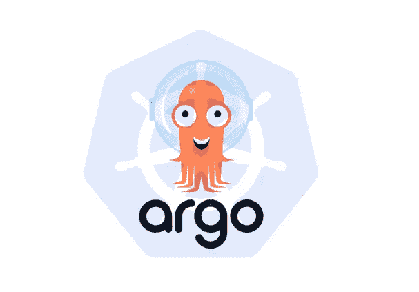

# ArgoCD —部署您的第一个应用程序

> 原文：<https://medium.com/geekculture/argocd-deploy-your-first-application-414d2a1692cf?source=collection_archive---------2----------------------->

## 如何使用 ArgoCD 部署您的第一个应用程序

在我的上一篇文章——“[ArgoCD 简介](https://tonylixu.medium.com/argo-cd-introduction-4b16f50b0d56)”中，我提到过`Argo CD`是一个声明式的，用于 K8s 的 GitOps 连续交付工具。

`Argo CD`支持多种配置管理工具，包括`ksonnet/jsonnet`、`kustomize`、`Helm`和`others`。它扩展了声明式和基于 Git 的优势…