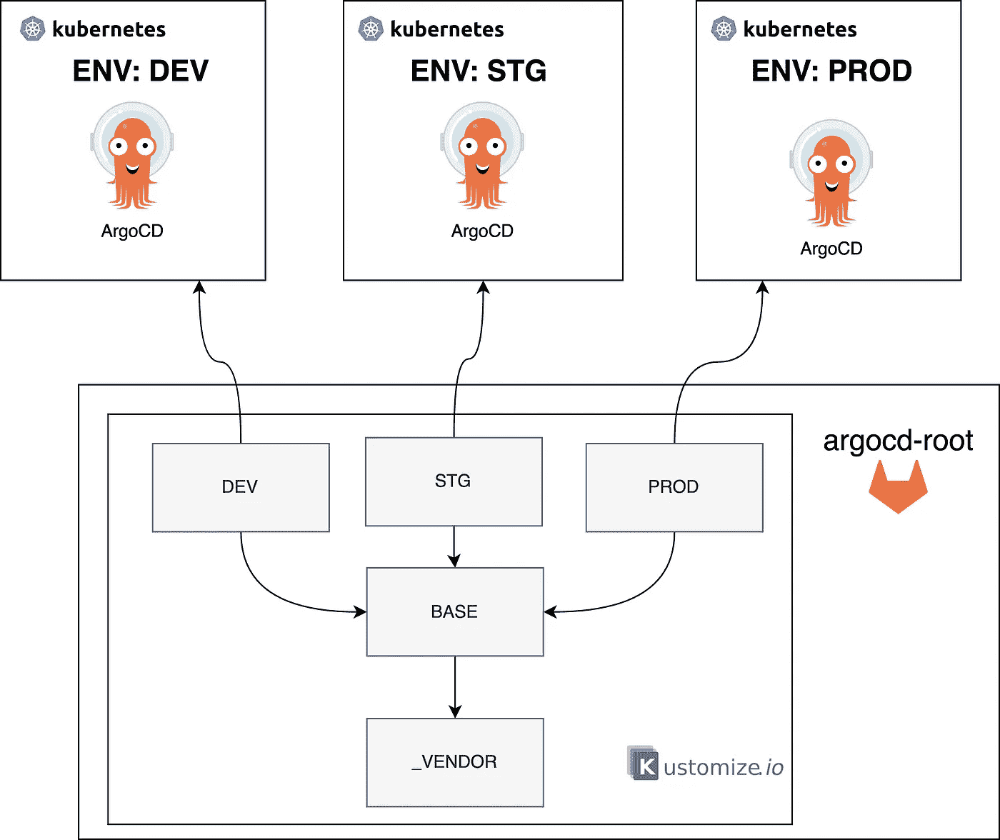
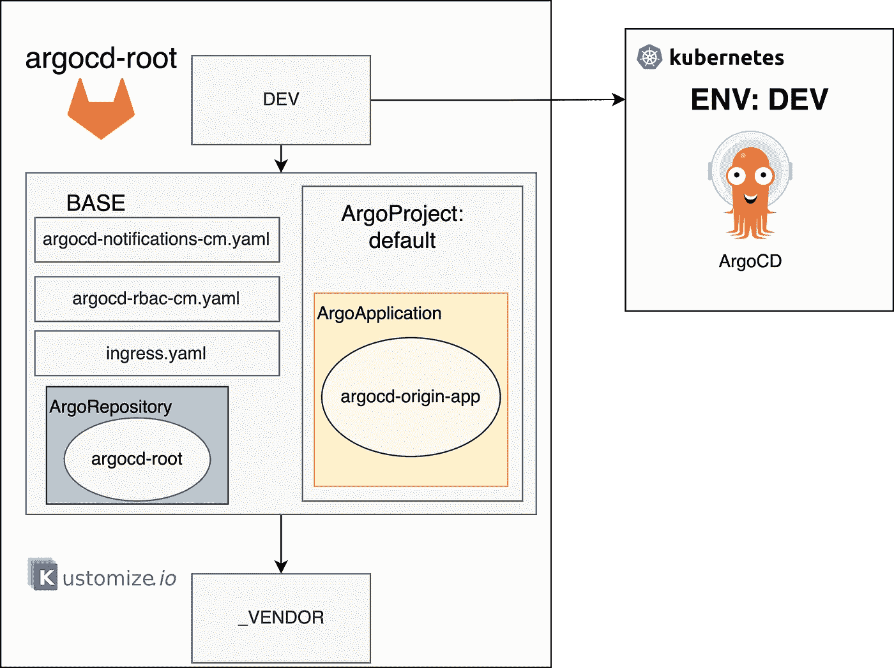
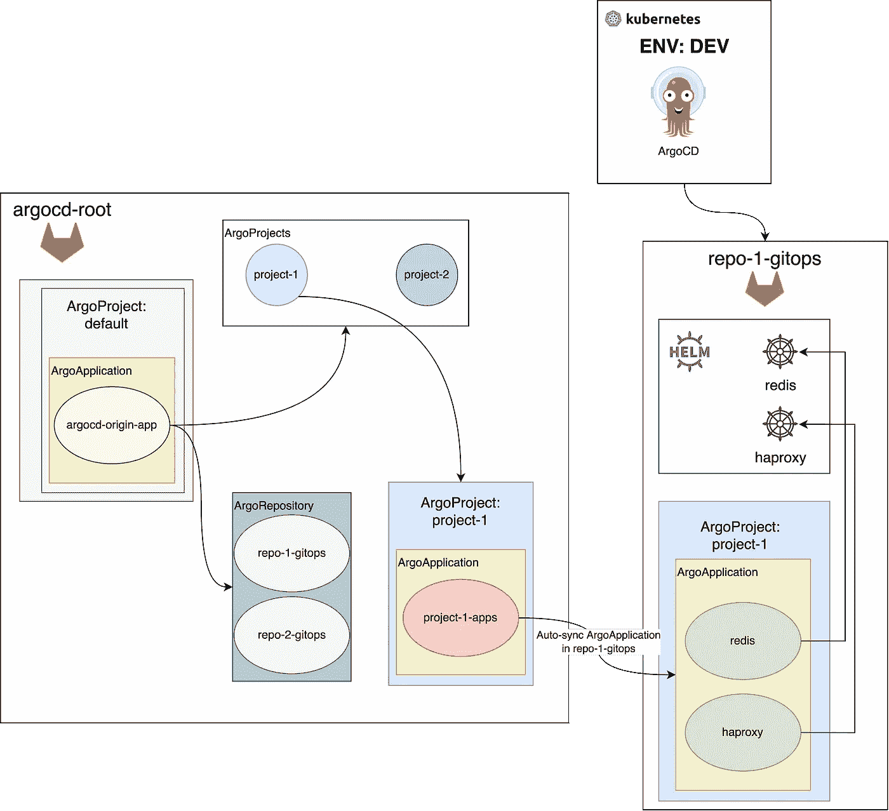

# 2022 年 ArgoCD+git lab+GitOps+Okta+Kustomize

> 原文：<https://medium.com/geekculture/argocd-gitlab-gitops-okta-kustomize-in-2022-45523e953831?source=collection_archive---------2----------------------->


Photo by [Daniel K Cheung](https://unsplash.com/@danielkcheung?utm_source=medium&utm_medium=referral) on [Unsplash](https://unsplash.com?utm_source=medium&utm_medium=referral)

今天我将发布我在 ArgoCD 背后的工作的第一篇文章，以及如何使用 GitLab 实现一个稳定的 GitOps 模式。

> 第一集:2022 年 ArgoCD+git lab+GitOps+Okta+Kustomize
> 第二集:ArgoCD root 源代码和通知调试(即将推出，[获得 ping！](https://pie-r.medium.com/subscribe) )
> 第三集:Gitlab 集成(即将推出，[获得 ping！](https://pie-r.medium.com/subscribe) )
> 第 4 集:最终考虑和安全问题(即将推出，[获得 ping！](https://pie-r.medium.com/subscribe))

目标是部署 ArgoCD 并定义一个模式，以便使用不同的 Gitlab 存储库跨不同的项目部署应用程序。

*免责声明:
我看到许多文章都是从 ArgoCD 文档中复制粘贴的，上面写着“GitOps”。祝你好运，95%的人使用了错误的 git 命令，而且可能他们在演示后从未使用过它。出于这个原因，我写了这篇博客，由你来重塑它。我非常高兴在评论中收到一些反馈！*

**功能:**

*   ArgoCD 版本 2.4.11
*   使用 Okta 的 SAML 认证。
*   使用 RBAC 的 ArgoCD 授权。
*   ArgoCD 孤立资源已启用
*   带有 slack 的 ArgoCD 通知(以及如何调试/编写它们)。
*   子管道和 Gitops 模式的 Gitlab CI。
*   自定义 ArgoCD 图像，带有特定的 kustomize 和头盔版本。
*   有很多`kustomization.yaml`的 Kustomize v4.5.7！

要理解本系列的文章，您需要了解以下方面的知识:

*   我们用它来部署 ArgoCD。
*   ArgoCD:持续部署工具。
*   Helm:用于部署示例应用程序。
*   GitlabCI:管理 GitOps 模式的 CI。
*   GitOps:把 git 作为真理的唯一来源。

如果你有具体的问题，请在评论中提问，因为我不会解释实现中的每一件事和每一个点和逗号，否则需要很长时间！

非常感谢任何掌声、关注或评论！

让我们画出我们想要的东西:

*   ArgoCD 安装在每个环境/集群中。
*   在`argocd-root`存储库中的一些覆盖来管理不同的环境。



ArgoCD 的部署是一系列 IF 语句，您必须在不同的条件之间做出选择。

我的第一个决定是使用 Kustomize 部署 ArgoCD，主要有两个原因:

*   这是官方支持的方式(舵图目前由社区维护)。
*   我对 Kustomize 很满意，我认为它对于某些用例来说是一个很好的工具。有数以千计的教程来使用它，但相对于头盔更容易出错。

第二个决定，哈还是不哈？

*   我遵循高可用性安装。如果你在这里，很可能你应该遵循同样的模式！

另一个复杂的部分是存储库`argocd-root`的结构，其中在根级别有 3 个文件夹:

*   `_backup:`在这里，我放入了我将在这段时间内安装的每个不同版本的清单。我使用它们是为了在不同版本之间进行比较。
*   `kustomize:`包含 ArgoCD 安装的所有 Kustomize 覆盖。
*   `utils:`目前包含一个脚本，用于生成正在使用`bcrypt`的 ArgoCD 的管理员密码。

使用 Kustomize 作为模板机制，我在`kustomize`文件夹中定义了下面的结构:

*   此文件夹包含从特定版本复制粘贴的普通清单。
*   `base:`包含所有环境中通用的补丁和资源。RBAC 策略、通知、入口和根存储库。
*   `dev/stg/prod:`特定于环境的补丁。管理员密码，SAML 配置，通知覆盖。

在这个`kustomize`文件夹中，我定义了我的安装**必须**满足所有环境的特征。在这里，我管理 ArgoCD 的所有配置。

> 我的设置中的挑战是只使用补丁来获得我所期望的。我多次想，让我们更新一下`_vendor`文件夹里的东西，来简化我的生活。但是如果需要更多的时间，我更喜欢困难的方式，因为更容易维护。

最终的结构如下所示:

```
.
├── _backup
│   ├── ha_install_2_4_11.yaml
│   └── ha_install_2_4_8.yaml
├── kustomize
│   ├── _vendor
│   │   ├── ha_install.yaml
│   │   ├── ha_install_crd.yaml
│   │   └── kustomization.yaml
│   ├── base
│   │   ├── argocd-notifications-cm.yaml
│   │   ├── argocd-root-app.yaml
│   │   ├── env
│   │   │   ├── argocd-cmd-params-cm.env
│   │   │   ├── argocd-notifications-secret.env
│   │   │   ├── argocd-rbac-cm-policy.env
│   │   │   └── argocd-rbac-cm.env
│   │   ├── ingress.yaml
│   │   ├── kustomization.yaml
│   │   ├── ns.yaml
│   │   └── root-repository.yaml
│   ├── prod
│   ├── stg
│   └── dev
│       ├── env
│       │   ├── argocd-cm-dex.env
│       │   ├── argocd-cm.env
│       │   ├── argocd-notifications-cm.env
│       │   └── argocd-secret.env
│       └── kustomization.yaml
└── utils
    └── bcrypt_generator.py
```

以下是`base/kustomization.yaml`的一些亮点:

```
base/kustomization.yaml:apiVersion: kustomize.config.k8s.io/v1beta1
kind: Kustomizationnamespace: argocd
bases:
  - ../_vendorresources:
  - ns.yaml
  - ingress.yaml
  - argocd-root-app.yaml
  - root-repository.yamlpatches:
  - argocd-notifications-cm.yamlsecretGenerator:
- behavior: merge
  envs:
  - env/argocd-notifications-secret.env
  name: argocd-notifications-secretconfigMapGenerator:
- name: argocd-cmd-params-cm
  behavior: merge
  envs:
  - env/argocd-cmd-params-cm.env
- name: argocd-rbac-cm
  behavior: merge
  files:
  - policy.csv=env/argocd-rbac-cm-policy.env
  envs:
  - env/argocd-rbac-cm.env
```

为了完成 ArgoCD 语法，对于某些`configMapGenerator`来说，混合了`files`和`envs`。我还使用`argocd-cmd-params-cm.env`来定义环境变量`server.insecure=true`，因为在我的安装中，我使用另一种机制来管理认证，并且需要使用`Dex`而不会有自签名证书的问题。

对于特定环境:

```
env/kustomization.yaml:apiVersion: kustomize.config.k8s.io/v1beta1
kind: Kustomizationnamespace: argocdresources:
- ../baseconfigMapGenerator:
- behavior: merge
  files:
  - dex.config=env/argocd-cm-dex.env
  envs:
  - env/argocd-cm.env
  name: argocd-cm
- behavior: merge
  files:
  - context=env/argocd-notifications-cm.env
  name: argocd-notifications-cmsecretGenerator:
- behavior: merge
  envs:
  - env/argocd-secret.env
  name: argocd-secretpatches:
- patch: |-
    - op: replace
      path: /spec/rules/0/host
      value: xxx.xxx.com
  target:
    kind: Ingress
    name: argocd-ingress
- patch: |-
    - op: replace
      path: /spec/source/path
      value: argocd/argocd-root/dev
  target:
    kind: Application
    name: argocd-root-appimages:
- name: quay.io/argoproj/argocd
  # Override and use a specific version of kustomize
  newName: "quay.io/pie-r/argocd"
  newTag: "argocd-2.4.11_helm-3.9.4_other-0.1"
```

见解:

*   `argocd-cm:`包含特定 kustomize 版本的路径和 SAML 验证使用的 url。在这个配置图中，还有 Okta 使用的 Dex 设置。
*   `argocd-notifications-cm:`我们指定在通知上下文中使用的`argocdUrl`具有更好的 slack 通知。
*   我们定义了`admin`密码。
*   `patches:`入口主机名和`argocd-root-app`覆盖。
*   `images:`我想使用 helm 和 kustomize 的特定版本，而不使用 ArgoCD 提供的内置。因此，我还有一个 docker 文件用于构建 ArgoCD 映像。

我想要实现的目标:



Final result for argocd-root repository

在上图中，我们可以看到三个覆盖图，更有趣的是我们定义了`argocd-origin-app`和`argocd-root`库的`base`。

需要注意的是`argocd-origin-app`是`ArgoProject:default.`的一部分，这是因为默认情况下 ArgoCD 会创建一个名为`default`的项目，您可以从一开始就对其进行微调。

`argocd-origin-app`的目标至关重要。是否有一个`ArgoApplication`可以自动同步维护我们希望应用于当前安装的所有定制，例如:

*   ArgoProjects:我们想要使用多少个项目？
*   ArgoCD 仓库:有多少仓库将使用 ArgoCD？
*   Argo 应用中的应用。

为了更好地理解，我使用`argocd-origin-app`来定义以下资源:

*   每组应用程序都有一个项目(例如项目 1、项目 2)。
*   应用程序清单(例如 haproxy、redis..)都在一个存储库中(repo-1-gitops)，我定义了一个 App of Apps (project-1-apps)来强制 ArgoCD 从这个外部存储库中同步清单。



# 最后备注:

ArgoCD 易于首次使用和安装，对于一些概念验证来说也是如此。安装 ArgoCD 专业版需要对它有深入的了解，并在安装过程中进行一些安全观察，您必须在开始之前了解这些。*更多细节在第四集*。

*你是地球人吗？
我也给 IaaC 写了点好东西:* [*https://medium . com/geek culture/from-terra lith-to-terraservice-with-terraform-ACF 990 e 65578*](https://bit.ly/3zNGg7z)


> [关注我](https://pie-r.medium.com/)和[订阅](https://pie-r.medium.com/subscribe)来获取这个系列和下一个系列的更新！


Photo by [Ali Kokab](https://unsplash.com/@_alikokab_?utm_source=medium&utm_medium=referral) on [Unsplash](https://unsplash.com?utm_source=medium&utm_medium=referral)

参考资料:

*   [1] [安装— Argo 光盘—用于 Kubernetes 的声明性 GitOps 光盘](https://argo-cd.readthedocs.io/en/stable/operator-manual/installation/#kustomize)
*   [2] [架构概述— Argo CD —用于 Kubernetes 的声明性 GitOps CD](https://argo-cd.readthedocs.io/en/stable/operator-manual/architecture/)
*   [3] [发布 kubernetes-sigs/kustomize](https://github.com/kubernetes-sigs/kustomize/releases)
*   [4] [ArgoCD 初学者教程| GitOps Kubernetes CD](https://www.youtube.com/watch?v=MeU5_k9ssrs)