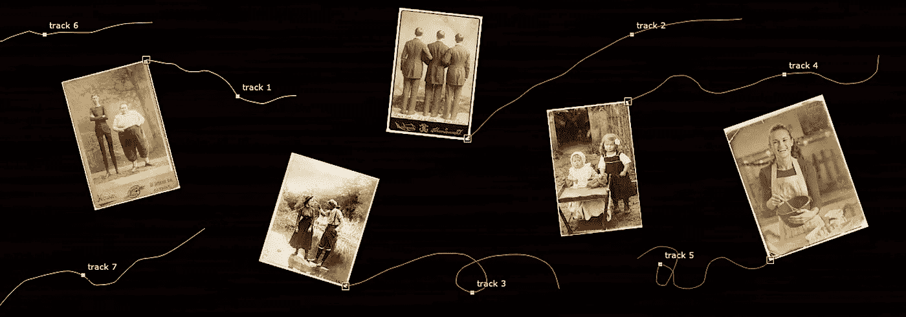
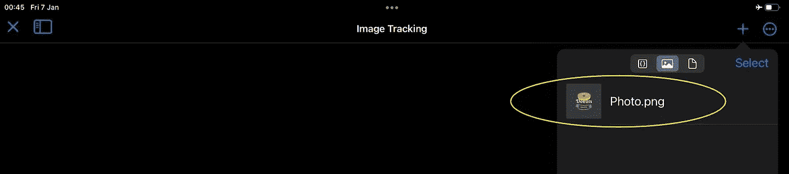
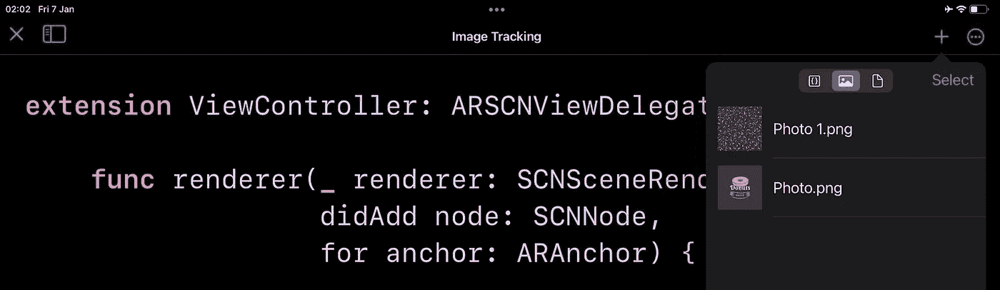
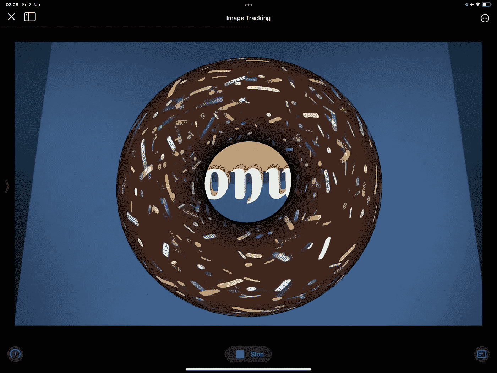

# ARKit 911—Swift 游乐场中的图像跟踪

> 原文：<https://medium.com/geekculture/arkit-911-image-tracking-in-swift-playgrounds-702bc93f9fd1?source=collection_archive---------4----------------------->



In compositing apps like NUKE, 1-point tracker allows you to record a XY-position of image, 2-point tracker — XY-position and Z-rotation, 3-point tracker — XY-position, Z-rotation and scale, and 4-point tracker — corner pinning. Most AR frameworks use these transform cases along with Machine Learning algorithms.

# 这个故事的目的

出于某种无法解释的原因，Swift Playgrounds 不允许我们使用其名称为 ***Resources*** 的文件夹，即使 print 命令很高兴地通知我们:“一切正常，所搜索的图像在 ***Resources*** 文件夹中”。



Screenshot of Swift Playgrounds 4.0 for iPad

```
**print**( Bundle.main.path(forResource: "Photo", ofType: "png")! )
```

打印结果如下所示:

```
/var/mobile/Containers/Data/PluginKitPlugin/
A0E15417-9B30-45D7-AB2D-9B8C03EE97FA/Library/
Application Support/Main Module Resources Bundles/
8EE548B0-9675-438F-9571-242D17EA12F5.bundle/
Contents/Resources/Photo.png
```

因此，在我的故事中，我想告诉你一个小技巧来解决这个问题。若要进一步移动，请将所有参考图像加载到资源文件夹中。

# **Xcode 方法**

许多开发人员习惯于使用***reference images(in group named:bundle:)***类型的方法来加载 Xcode 项目的资产目录中指定的 ***Resources*** 组中的所有参考图像:

```
**class func** referenceImages(inGroupNamed name: String,
                          bundle: Bundle?) -> Set<ARReferenceImage>?
```

它返回可选的 ***集合<ARReferenceImage>***，可以包含多达一百个唯一的参考图像。


**Resources** folder in Assets.xcassets

这里我使用了***ARImageTrackingConfiguration***:

```
**func** imageTrackingConfig() { **guard let** resources = ARReferenceImage.referenceImages(
                                          inGroupNamed: "Resources",
                                                bundle: **nil**)
    **else** { **return** } **let** config = ARImageTrackingConfiguration()
    config.trackingImages = resources **self**.sceneView.session.run(config)
}
```

但是，如果你试图在 Swift Playgrounds 中使用这种方法，你将会失败，因为***in group named***argument 要求你写一个 resources 文件夹的名称，但是你不能。

# 快速游乐场方法

而是要用***ARReferenceImage***类初始化器调用***init(_:orientation:physical width:)***。它从核心图形图像对象创建新的参考图像，其中***physical width***参数是以米为单位的真实宽度。

```
**public init**(**_** image: CGImage,  
        orientation: CGImagePropertyOrientation,
      physicalWidth: CGFloat)
```

将我的方法粘贴到您的***view controller***类中:

```
**fileprivate func** imageTrackingConfig() {

    **let** imageFromWeb = **#imageLiteral**(resourceName: "*Photo.png*")

    **let** image = ARReferenceImage(imageFromWeb.cgImage!, 
                                           orientation: .up, 
                                         physicalWidth: 0.5)

    **self**.trackingImages.insert(image)

    **let** config = ARImageTrackingConfiguration()
    config.trackingImages = trackingImages
    **self**.sceneView.session.run(config)
}
```

剩下的代码看起来很熟悉，不是吗？

```
**import** ARKit
**import** SceneKit **import** PlaygroundSupport**class** ViewController: UIViewController {

    **let** sceneView = ARSCNView(frame: .zero)
    **var** trackingImages = Set<ARReferenceImage>()

    **override func** viewDidLoad() {
        **super**.viewDidLoad() **self**.view = **self**.sceneView

        sceneView.delegate = **self**
        sceneView.scene = SCNScene()
        sceneView.autoenablesDefaultLighting = **true**

        **self**.imageTrackingConfig()
    }
}PlaygroundPage.current.needsIndefiniteExecution = **true**
PlaygroundPage.current.liveView = ViewController()
```

最后是扩展:

```
**extension** ViewController: ARSCNViewDelegate {

    **func** renderer(_ renderer: SCNSceneRenderer,
                 didAdd node: SCNNode,
                  for anchor: ARAnchor) {

        **if let _** = anchor **as**? ARImageAnchor {

            **let** geo = SCNTorus(ringRadius: 0.1, pipeRadius: 0.05))
            **let** donut = SCNNode(geometry: geo) donut.geometry?.firstMaterial?.lightingModel = .phong donut.geometry?.firstMaterial?.diffuse.contents =
                                       UIImage(named: "*Photo 1.png*")
            node.addChildNode(donut)
        }
    }
}
```



“Photo 1.png” is donut’s texture

这个肯定管用。



Donut model tethered with ARImageAnchor

最后，给那些想在 RealityKit 中实现图像跟踪的人一些建议。代码看起来与第一种情况稍有不同，但主要区别是使用了 ***会话(_:didAdd:***实例方法。

```
**import** ARKit
**import** RealityKit
**import** PlaygroundSupport**class** ViewController: UIViewController {

    **let** arView = ARView(frame: .zero)
    **var** trackingImages = Set<ARReferenceImage>()

    **override func** viewDidLoad() {
        **super**.viewDidLoad() **self**.view = **self**.arView
        **self**.arView.cameraMode = .ar

        **self**.arView.session.delegate = **self**

        **self**.imageTrackingConfig()
    }
}
```

你可以看到 ***AnchorEntity*** 类有一个***init(anchor:ARAnchor)***方便的初始化器，帮助我们获得想要的结果。

```
**extension** ViewController: ARSessionDelegate {

    **func** session(**_** session: ARSession, didAdd anchors: [ARAnchor]) {

        **if let** imageAnchors = anchors **as**? [ARImageAnchor] { **for** imageAnchor **in** imageAnchors { **let** entity = ModelEntity(mesh: .generateBox(
                                                        size: 0.1)) **let** anchor = AnchorEntity(anchor: imageAnchor) anchor.addChild(entity) **self**.arView.scene.anchors.append(anchor)
            }
        }
    }
}
```

对于使用 SwiftUI 的用户，需要实现[](https://developer.apple.com/documentation/swiftui/uiviewcontrollerrepresentable/makecoordinator()-32trb)*。SwiftUI 协调员旨在充当 UIKit 视图控制器的代表。你可以在这里 看到怎么做 [***。***](https://stackoverflow.com/questions/60582392/swiftui-passing-data-from-swiftuiview-to-scenekit/60590065#60590065)*

# *捐赠给作者*

**

*Click on the picture to make the QR code bigger*

```
*addr1q9w70n62nu8p7f9ukfn66gzumm9d9uxwppkx7gk7vd7gy0ehfavj97gkncwm8t8l8l8x9e4adzmw2djh4y5gd9rmtewqr99zr3*
```

*目前就这些。*

*如果这篇文章对你有用，请按下 ***拍*** 按钮，按住*即可。在 Medium 上，每个帖子最多可以拍 50 次***。*****

**你可以在我在 [StackOverflow](https://stackoverflow.com/users/6599590/andy-fedoroff) 上的帖子中找到更多关于 ARKit、RealityKit 和 SceneKit 的信息。**

**后会有期！**