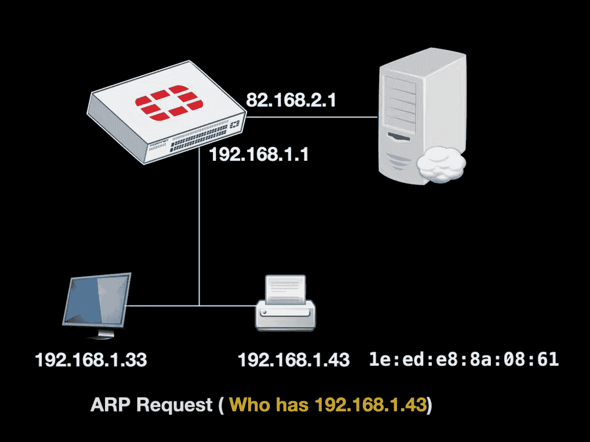
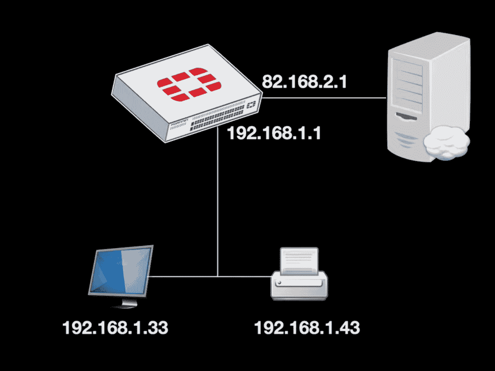
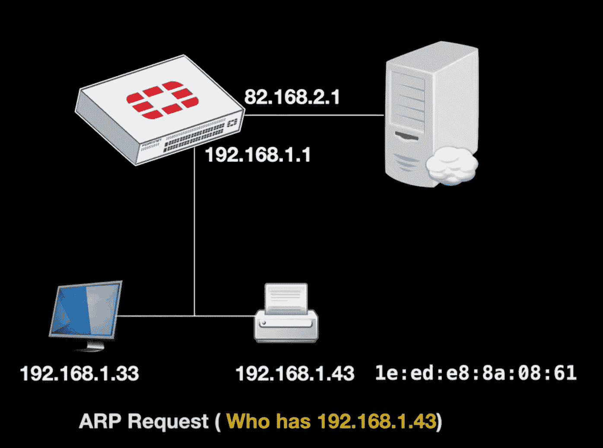
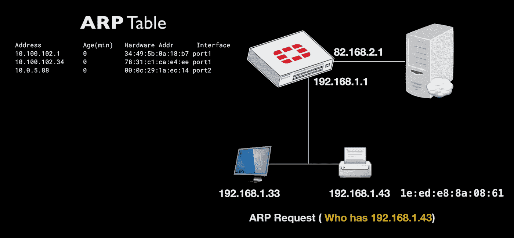
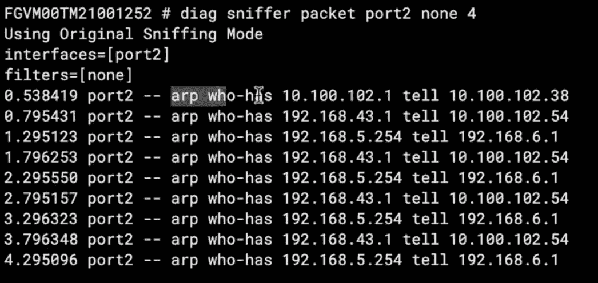
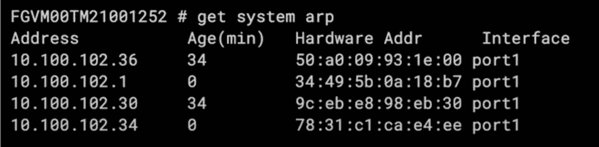
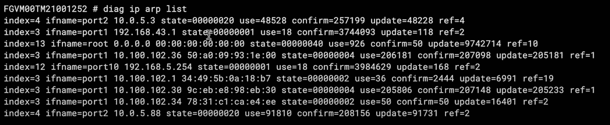
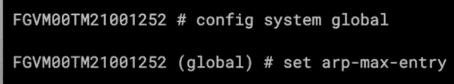
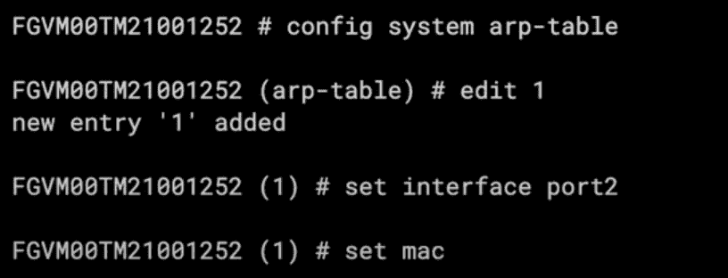

# ARP(地址解析协议)解密

> 原文：<https://medium.com/geekculture/arp-address-resolution-protocol-demystified-63a88d5f8c35?source=collection_archive---------13----------------------->

**每当主机需要联系另一台主机时，无论是在它的子网中还是在另一个子网中，或者可能是在互联网上，它都会发送 ARP(地址解析请求)**

截图是在我的 FortiGate 60F【https://amzn.to/2W1cHkQ 上做的

顾名思义，发送的 ARP 请求实际上是询问**“谁有我需要联系的 IP 地址”**

请求在广播域中发送，或者有时被转发到另一个子网，拥有该 IP 地址的主机发回其 MAC 地址

MAC 地址对于制作数据包本身至关重要。它是 IP 路由中最重要的功能之一。

另一方面，您的 FortiGate 防火墙有一个 ARP 表，其中保存了不同接口上不同 MAC 地址和 IP 地址之间的绑定。所以让我们更深入地看看 ARP 表

**嗅探 ARP**

让我们从检查从我们的局域网发出的 ARP 请求开始

为此，我们将使用**“diag sniffer packet”**，这是一种 FortiGate Wireshark 方法，用于捕获在不同接口之间传输的数据包，并检查发生了什么。

当我们检查数据包时，我们可以使用过滤器来捕获特定的流量。

这里我们将不使用任何过滤器，只使用端口号和详细级别

**“诊断嗅探器数据包端口 2 无 4”**

按回车键，您可以看到不同的 ARP 请求**“谁拥有那个 IP 地址”**。

请求的 IP 地址是网关地址。

**现在让我们看看其他一些命令。**

您可以使用的第一个命令是:

**“获取系统 ARP”**

在这里你可以看到，IP 地址，MAC 地址，以及相关的接口。

第二个命令将显示 ARP 表缓存

**“诊断 ip arp 列表”**

正如 Fortinet 文档中所述，默认的 ARP 超时值是 5 分钟(300 秒),并且可以根据 ARP 条目的状态和正在使用的对象而变化。使用该命令，我们可以看到 ARP 缓存的不同状态(收到 ARP，设备不支持 ARP…)。

**我们的第三个命令是**

我们从“配置系统全局”开始，然后，我们将使用“设置最大值”条目，在这里我们可以输入一个带有条目数量的整数。

接下来，有时您需要删除整个 ARP 表。

我们将使用“执行清除系统 arp 表”

所以我们只看系统 ARP 表。是的，我们只有一个 ARP 表，它的使用时间(以分钟计)为零。所以现在才收到。

我们要看的最后一个命令是“配置系统 arp 表”

现在，我们可以添加特定的 IP 地址，并根据需要绑定特定的 MAC 地址。作为端口 2 的接口。IP、MAC 地址，并将它们关联在一起。

在我的书**“Fortigate 防火墙管理袖珍指南”**【https://amzn.to/37Zobbn 中了解更多关于如何管理您的 Fortigate 防火墙的信息