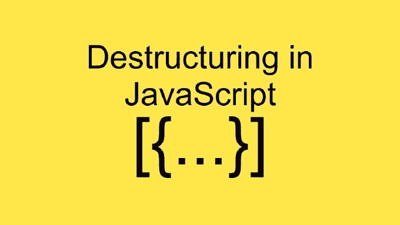

# JavaScript 中的数组和对象析构

> 原文：<https://medium.com/geekculture/array-destructuring-in-javascript-1933cb58049?source=collection_archive---------25----------------------->



ES6 添加到 JavaScript 中最有趣的特性之一是对象和数组析构。通过析构，我们可以很容易地获取数组或对象的一部分。让我们举几个例子来理解

# 数组析构

```
const alphabets = ['A','B','C','D','E','F']
const numbers = ['1','2','3','4','5','6']
```

如果我们必须从字母表数组中选择前两项。传统的方法是，

```
const a = alphabets[0]
const b = alphabets[1]console.log(a)
//*expected output* : Aconsole.log(b)
//*expected output* : B
```

很明显，上述方法非常笨拙，有一种更简单的方法可以做到这一点。使用扩展运算符语法，

```
const [a,b] = alphabetsconsole.log(a)
//*expected output* : Aconsole.log(b)
//*expected output* : B
```

问题是它到底是如何工作的？？
析构背后的想法是，我们把想要析构的数组(**字母表**数组)放在等号的右边。在等号的左边，我们取出想要从数组中取出的变量的数量，并把它放在方括号([])中。这里需要注意的关键点是，左侧数组中的元素遵循与右侧数组相同的顺序。这就是为什么第一个元素 **a** 被赋予第一个元素‘A ’,而第二个元素 **b** 被赋予第二个元素‘B’。

在左侧添加第三个元素 **c** 将导致

```
const [a,b,c] = alphabetsconsole.log(a)
//*expected output* : Aconsole.log(b)
//*expected output* : Bconsole.log(c)
//*expected output* : C
```

如果我们想跳过任何元素比如说 B，我们可以

```
const [a,,c] = alphabetsconsole.log(a)
//*expected output* : Aconsole.log(c)
//*expected output* : C
```

## 扩展运算符的使用

如果我们想把来自字母**的剩余元素放到一个单独的数组中，我们可以简单地使用 [spread](https://developer.mozilla.org/en-US/docs/Web/JavaScript/Reference/Operators/Spread_syntax) 操作符。**

```
const [a,,c, ...rest] = alphabetsconsole.log(a)
//*expected output* : Aconsole.log(c)
//*expected output* : Cconsole.log(rest)
//*expected output*: ['D','E','F']
```

destructuring 和 spread 操作符的另一个真正强大的功能是我们可以用它来组合两个数组。

```
const newArray = [...alphabets, ...numbers]console.log(newArray)
//*expected output:* ['A','B','C','D','E','F','1','2','3','4','5','6']
```

## 用函数析构数组

当我们从一个函数中返回多个参数时，数组析构在处理函数时非常有用。
让我们首先创建一个简单的函数来计算两个数的和与乘。

```
function sumAndMultiply(a,b){
   return [a+b, a*b]
}const result = sumAndMultiply(2,3)
console.log(result)
//*expected output:* [5,6]
```

使用数组析构，

```
const [sum, mul] = sumAndMultiply(2,3)console.log(sum)
//*expected output: 5*console.log(mul)
*//expected output: 6*
```

在这个数组析构中，我们可以做的一件方便的事情是，我们可以设置默认值。假设函数也可以返回除法，如果不返回，我们将简单地设置一些值为**不除法**

```
const [sum, mul, div = 'No division'] = sumAndMultiply(2,3)console.log(sum)
//*expected output: 5*console.log(mul)
*//expected output: 6*console.log(div)
//*expected output:* 'No division'
```

但是，如果我们更改 **sumAndMultiply** 函数来返回除法，输出将为

```
function sumAndMultiply(a,b){
   return [a+b, a*b, a/b]
}const [sum, mul, div = 'No division'] = sumAndMultiply(2,3)console.log(sum)
//*expected output: 5*console.log(mul)
*//expected output: 6*console.log(div)
//*expected output:* 0.6666666666666
```

# 对象析构

析构的真正威力来自于对象，所以让我们来看看对象析构。

```
const personOne = {
    name : 'Vikash',
    age : 25,
    address : {
          city : 'some city',
          state : 'some state'
       }
}
```

当我们想要析构一个对象时，它的工作方式非常类似于一个数组。假设我们想得到物体的名称和年龄。因此，既然我们正在析构一个对象，我们将使用{}而不是[]

```
const {name , age} = personOneconsole.log(name)
//*expected output:* Vikashconsole.log(age)
//*expected output:* 25
```

对象析构的工作方式与数组完全相同，但它不是基于位置，而是基于键的名称。所以{}中的**名**变量与 personOne 对象中的**名**键相同，对于**年龄也是如此。**他们需要匹配。

但是如果我们想使用不同的名字呢？我们可以很容易地做到这一点，只需在花括号内给出实际的名称，然后在其后加上一个冒号，然后是我们想要的变量名。

```
const {name:firstName, age} = personOneconsole.log(firstName);
//*expected output:* Vikash
```

上面的代码所做的是从 personOne 对象中获取 name 属性，并将其映射到我们正在创建的 firstName 变量。

我们甚至可以在对象析构中使用默认值，就像我们在数组析构中使用它一样。假设我们想得到 personOne 对象还没有的东西。我们将从 personOne 对象中删除 name 属性，并尝试使用默认值访问该属性以及新属性 favoriteFood。

```
const personOne = {
    age : 25,
    address : {
          city : 'some city',
          state : 'some state'
       }
}const {name:firstName = 'John', age, favouriteFood='No food present'} = personOneconsole.log(firstName);
//*expected output:* Johnconsole.log(favouriteFood)
//expected *output:* No food present
```

但是如果我们有了这两个属性，我们将得到实际的值，而不考虑任何设置为默认值的值。

```
const personOne = {
    name : 'Vikash',
    age : 25,
    favouriteFood : 'rice'
    address : {
          city : 'some city',
          state : 'some state'
       }
}const {name:firstName = 'John', age, favouriteFood='No food present'} = personOneconsole.log(firstName);
//*expected output:* Vikashconsole.log(favouriteFood)
//expected *output:* rice
```

## 扩展运算符的使用

就像数组解构一样，我们也可以在这里使用 spread 操作符。

```
const {name:firstName,favouriteFood, ...rest} = personOneconsole.log(firstName);
//*expected output:* Vikashconsole.log(favouriteFood)
//expected *output:* riceconsole.log(rest)
//*expected output:* {
     age : 25,
      address : {
          city : 'some city',
          state : 'some state'
       }
}
```

对象析构的另一个好处是我们可以析构嵌套的对象。

```
const {name : firstName, address : {city} } = personOneconsole.log(firstName);
//*expected output:* Vikashconsole.log(city);
//*expected output:* some city
```

我们可以用析构做的另一件事是我们可以组合两个不同的对象。让我们拿两个不同的物体

```
const personOne = {
    name : 'Vikash',
    age : 25,
    address : {
          city : 'some city',
          state : 'some state'
       }
}const personTwo = {
    age : 32,
    favouriteFood : 'rice'
}const personThree = {...personOne , ...personTwo}console.log(personThree)
//*expected output:* {
    name : 'Vikash',
    age : 32, 
    favouriteFood : 'rice',
    address : {
          city : 'some city',
          state : 'some state'
       }
}
```

让我们试着理解在上面的例子中发生了什么。它表示将 personOne 中存在的所有内容放入 personThree 对象，然后再次将 person 2 中的所有内容放入 personThree，但覆盖 personOne 中已经存在的所有内容。

在控制台中，我们得到了 personOne 中的名字**‘Vikash’**。我们得到年龄 **32** ，因为它被第二个人覆盖了。最喜欢的食物显示为**“大米”**，因为它只出现在人员 2 中，而地址与人员 1 中的地址相同，因为它不出现在人员 2 中。

**用函数析构对象** 析构对象的另一个重要且有用的部分是在函数和参数中使用它的能力。我们将在这里使用同一个对象 personOne

```
const personOne = {
    name : 'Vikash',
    age : 25,
    address : {
          city : 'some city',
          state : 'some state'
       }
}
```

让我们创建一个函数，看看一些用例。

```
function printUser(user){
   console.log(user);
}printUser(personOne)//*expected output:*{
    name : 'Vikash',
    age : 25,
    address : {
          city : 'some city',
          state : 'some state'
       }
}
```

如果我们只想在 printUser 函数中打印姓名和年龄，该怎么办？我们可以像这样在函数参数中使用析构

```
function printUser({name, age}){
   console.log('Name is: ${name}. Age is: ${age}');
}printUser(personOne)//*expected output:* Name is Vikash. Age is 25
```

我们还可以设置默认值，如

```
function printUser({name, age, favouriteFood='No food'}){
   console.log('Name is: ${name}. Food is ${favouriteFood}');
}printUser(personOne)//*expected output:* Name is Vikash. Food is No food.
```

如果我们将 favouriteFood 属性添加到我们的对象中，默认值根本不重要。

```
const personOne = {
    name : 'Vikash',
    age : 25,
    favouriteFood : 'rice'
    address : {
          city : 'some city',
          state : 'some state'
       }
}function printUser({name, age, favouriteFood='No food'}){
   console.log('Name is: ${name}. Food is ${favouriteFood}');
}printUser(personOne)//*expected output:* Name is Vikash. Food is rice.
```