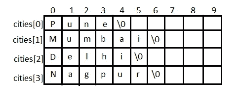

# 字符串数组

> 原文：<https://medium.com/geekculture/array-of-strings-95621fdf85a0?source=collection_archive---------8----------------------->



他的文章是关于如何使用字符串数组的。[如果你想知道数组是什么，检查这个。](/geekculture/arrays-store-multiple-items-using-the-same-variable-7e2af6e2bdf)使用字符串数组没什么大不了的，和在新语言中使用其他数组数据类型是一样的。反正用 C 就不一样了，了解一个字符串数组在 C 中是怎么实现的，有助于了解那些新语言中字符串数组实现的幕后。[要了解琴弦，请查看此处。](/geekculture/string-an-array-of-characters-with-0-a133fd56e9d9)


从图中可以看出，字符串数组是一个[二维数组](/geekculture/arrays-store-multiple-items-using-the-same-variable-7e2af6e2bdf)。[字符串本身是一个一维数组。因此，字符串数组将是一个二维数组。在图像中，城市的名称存储为一个二维数组。要访问一个城市，只需使用“城市[索引]”；](/geekculture/arrays-store-multiple-items-using-the-same-variable-7e2af6e2bdf)

```
cities[0] // Gives Pune
cities[1] // Gives Mumbai
```

# 声明字符串数组

```
char cities[4][6] = {
                      "Pune",
                      "Mumbai",
                      "Delhi",
                      "Nagpur"
                     };
```

“城市[4][6]”意味着最多有 4 行，每行 6 个字符。

# 显示字符串数组中的字符串。

```
printf("%s", cities[0]);
```

输出

```
Pune
```

# 使用字符串数组的测验程序

[我们在这里做了问答节目更简单的功能。](/geekculture/functions-reusable-logic-b1fad28e72cb)我们可以使用字符串数组来简化程序，甚至更多。

现在，程序更加简化，没有多余的代码。

本系列教程到此结束。如果你是一个初学者或者想从不同的角度理解编程的人，我希望这个系列会对你有所帮助。这些是编程的核心概念。这些概念是独立于语言的。如果你有了这些概念，学习新的语言和新概念就容易了，比如面向对象编程。

反馈总是受欢迎和鼓励的。如果您有任何建议或反馈，请使用回复部分。

[**Previous = >功能—可重用逻辑**](/geekculture/functions-reusable-logic-b1fad28e72cb)