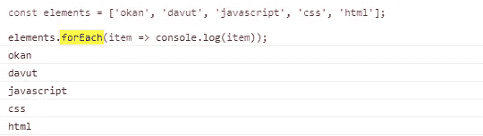
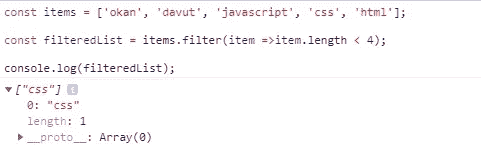
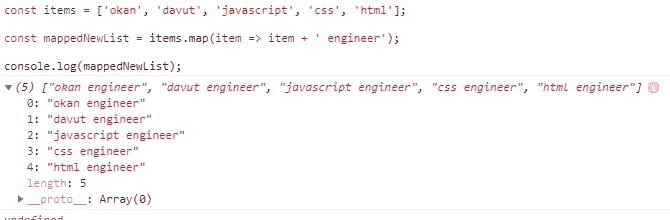
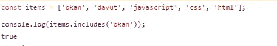
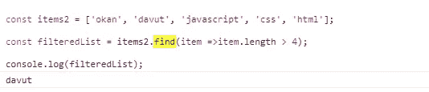
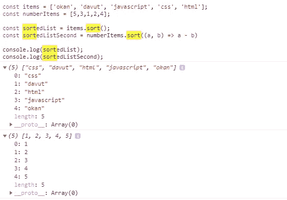
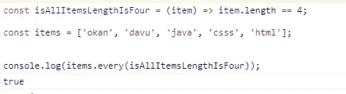
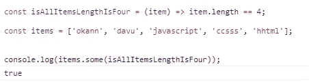

# JavaScript 中的数组操作

> 原文：<https://medium.com/geekculture/array-operations-in-javascript-8f3197f9f746?source=collection_archive---------19----------------------->

大家好，在这篇文章中，我将尝试解释 JavaScript 中的数组操作。也许你可以找到太多关于这个话题的博客帖子和视频，但我记下了我自己，并想分享它。

## 为每一个

forEach 是一个可以到达数组中的项的函数。这不会给你一个新的数组或一个元素作为回报。此功能允许您在列表中进行操作。仅迭代列表中的所有项目。

## 过滤器

您可以根据 if 语句使用“filter”方法筛选项目。filter 方法返回数组的类型。正如你在下面的例子中看到的，我们有一个包含 5 项的数组。我用过滤的方法来得到字母数小于 4 的单词。只有“css”少了 4 个谢字。

## 地图

您可以使用 map 函数用数组的现有元素创建新数组。你可以在函数中使用数组的每个元素。例如，页面中有一个表格，你需要获取数组中的项目并对其进行更改。对于此操作，您可以使用地图功能。

## 包含

您可以使用“包含”功能检查元素是否包含在数组中。在下面的例子中，我检查了数组是否有“okan”项。

## 发现

你可以用 find 函数得到数组中的一个元素。就像在 filter 方法中，你给定一些条件去寻找，它给你数组中第一个与你的条件匹配的元素。您还可以使用 filter 方法获得元素的第一个发现。但不同的是“查找”函数在找到项目后停止迭代。find 和 filter 的另一个区别是 find()方法不能在 IE < = 11 中使用，但是 filter()方法可以在所有浏览器(IE9+)中使用。

## 分类

使用排序功能，您可以根据需要对数组中的项目进行排序。在下面的例子中，字符串数组按照升序排序。对于第二个数组例子，我们给出了排序方法的参数。

## 每个

您可以使用每个功能检查所有符合您条件的项目。在下面的例子中，我们检查了所有项目的长度是否为 4。函数迭代所有项目并检查项目是否是 4 个字母。

## 一些

您可以使用“some”方法检查数组中的一个项目是否与您的条件匹配。与 every 的不同之处在于，当找到元素后,“some”方法停止遍历列表。所以对性能更好。

在本文中，我尽可能多地讨论了数组方法。将来我可以在这里做些补充。你可以在这里找到所有的代码。

> *感谢您的阅读。分享和掌声会增加动力:)。*