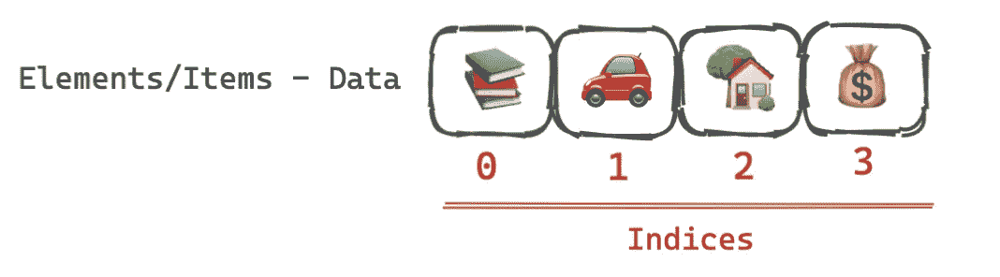
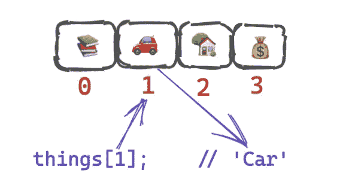
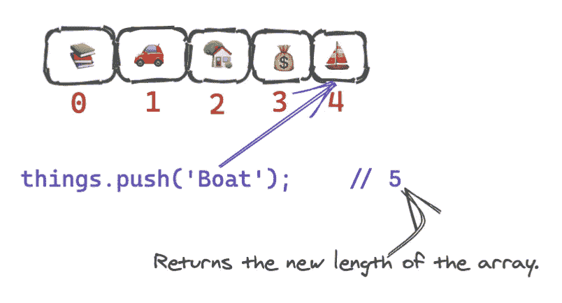
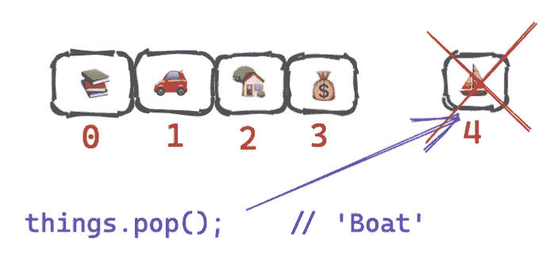
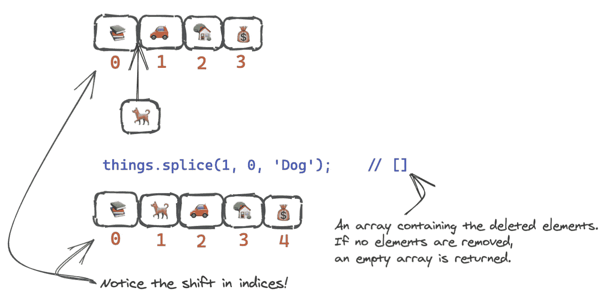
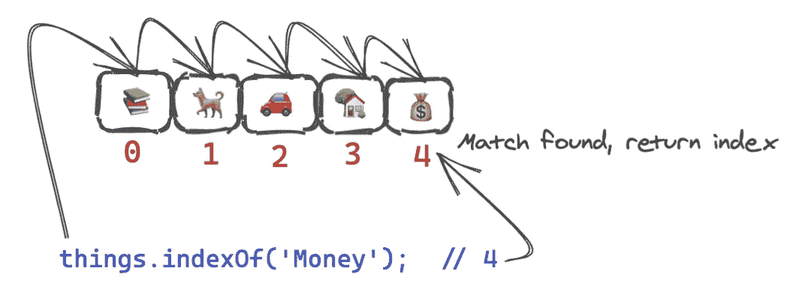

# 数组基本操作— JavaScript

> 原文：<https://medium.com/geekculture/arrays-basic-operations-javascript-558c155489ab?source=collection_archive---------26----------------------->

这是 JavaScript 中对数组执行的最常见操作的列表。我们将看到它们的用法和它们的时间复杂度。

首先，让我们考虑我想拥有的一组`things`。

```
const things = ['Books', 'Car', 'Home', 'Money'];
```



Array — Things I want to own (Made with [Excalidraw](https://excalidraw.com/))

有了这个列表，我们将看到在阵列上执行的不同操作。

# 查找(如果您知道索引)

在一个数组中寻找一个索引已知的项。换句话说，我们可以说这就是我们从数组中访问元素的方式。

*时间复杂度=* `*O(1)*`



Lookup at Index 1

```
things[1];    // 'Car'
```

# 推

[将一个或多个元素推到数组的末尾。](https://developer.mozilla.org/en-US/docs/Web/JavaScript/Reference/Global_Objects/Array/push)

*时间复杂度=* `*O(1)*`



Push a new item at end of the array — I want a boat.

```
things.push('Boat');    // 5console.log(things);    // ['Books', 'Car', 'Home', 'Money', 'Boat']
```

# 流行音乐

从数组中移除最后一个元素。此方法更改数组的长度。

*时间复杂度=* `*O(1)*`



Remove the boat from my list — It is expensive.

```
things.pop();    // 'Boat'console.log(things);    // ['Books', 'Car', 'Home', 'Money']
```

# 插入

在位添加一个或多个元素。

*时间复杂度=* `*O(N)*` *，其中* `*N*` *是数组的长度。*



It would be nice to own a dog — Insert

```
things.[splice](https://developer.mozilla.org/en-US/docs/Web/JavaScript/Reference/Global_Objects/Array/splice)(1, 0, 'Dog');    // []console.log(things);    // ['Books', 'Dog', 'Car', 'Home', 'Money']
```

# 搜索

在数组中查找一个元素。在 JavaScript 中有不同的方法来查找数组中的元素。

*时间复杂度=* `*O(N)*` *，其中* `*N*` *是数组的长度。*



Search — Is Money available in the list?

```
things.[indexOf](https://developer.mozilla.org/en-US/docs/Web/JavaScript/Reference/Global_Objects/Array/indexOf)('Money');  // 4things.[findIndex](https://developer.mozilla.org/en-US/docs/Web/JavaScript/Reference/Global_Objects/Array/findIndex)(item => item === 'Money');  // 4things.[find](https://developer.mozilla.org/en-US/docs/Web/JavaScript/Reference/Global_Objects/Array/find)(item => item === 'Money');  // "Money"things.[includes](https://developer.mozilla.org/en-US/docs/Web/JavaScript/Reference/Global_Objects/Array/includes)('Money'); // true
```

# 删除

从数组中移除一个或多个元素。

*时间复杂度=* `*O(N)*` *，其中* `*n*` *是数组的长度。*


Delete/Remove Car from my list — I would prefer walking!

```
things.[splice](https://developer.mozilla.org/en-US/docs/Web/JavaScript/Reference/Global_Objects/Array/splice)(2, 1);    // ['Car']console.log(things);    // ['Books', 'Dog', 'Home', 'Money']
```

# 你能用这个列表做什么？

还可以执行更多的操作，但是这里列出的是 JavaScript 中的数组入门。

当开始使用数组(JavaScript)时，尝试并实现它们是一个很好的练习。这将有助于你复习一点数据结构。

[](https://darshnarekha09.medium.com/ds-with-js-arrays-11e9e5e4db6a) [## 带 JS 的 DS—数组

### 数组非常适合查找、推送、弹出和排序项目。让我们用 JavaScript 实现一些操作。

darshnarekha09.medium.com](https://darshnarekha09.medium.com/ds-with-js-arrays-11e9e5e4db6a)