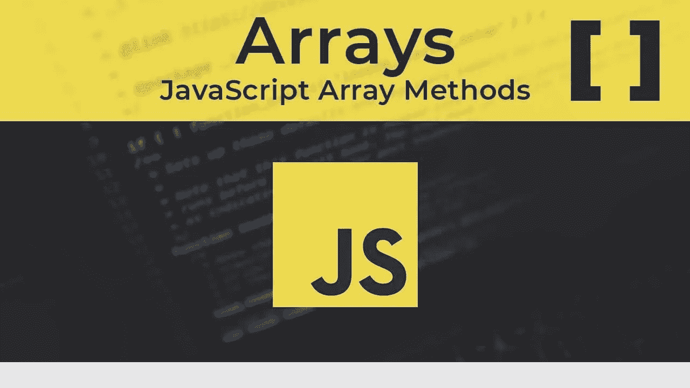

# Javascript 中的数组

> 原文：<https://medium.com/geekculture/arrays-in-javascript-ec1a74cdb729?source=collection_archive---------23----------------------->



JS-Arrays

**简介**

在这篇博客中，我将介绍我们日常使用的 Javascript 中不同的数组方法。

javascript —数组定义

```
var carmodels = ["Tesla", "Audi", "BMW", "Benz"];
```

**阵列方法**