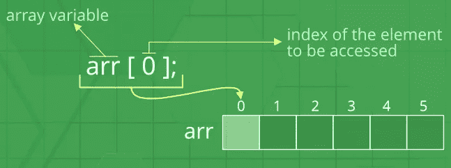
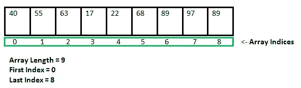
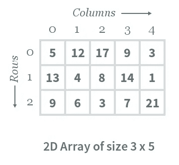
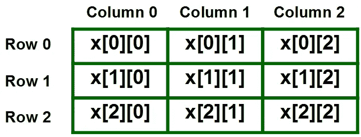

# 数组—使用同一个变量存储多个项目。

> 原文：<https://medium.com/geekculture/arrays-store-multiple-items-using-the-same-variable-7e2af6e2bdf?source=collection_archive---------10----------------------->



V [变量用来存储数值。](https://medium.datadriveninvestor.com/code-factory-variables-and-data-types-aa20cfccfe80)每个变量都像一个盒子。该框将包含一个值。盒子可以被打开，一个值可以被存储在其中。那么该值可以在任何需要的时候使用。打开盒子，取值就行了。它非常有用

但是想象一个场景，其中要存储五个科目的分数。为此，可以创建五个变量:subjectt1、subject2、subject3、subject4 和 subject5，每个主题的标记都可以存储在其中。

**但是如果需要存储一百个学生的名字呢？手动创建一百个变量并存储它们的值很容易让所有人发疯。数组作为救世主出现了。**

# 数组

如果变量像盒子，数组就像储物柜。同一个隔间里的每个储物柜都存放相似的物品。每个储物柜都可以使用储物柜编号进行唯一标识。每个储物柜按顺序放置在一个单独的隔间中。

同样，数组也是按顺序放置的。



索引就像储物柜的号码。索引用于唯一标识每个数组。数组的值可以通过它的索引来访问。从上图可以看出，如果访问索引 6，将检索到值 89。

# 声明数组

```
int marks[5];
```

声明数组与声明变量是一样的，除了最后一个方括号和其中的数字。方括号表示特定的变量是一个数组。数字 5 告诉计算机分配存储 5 个值的空间。这个数字被称为数组的大小。如果数组是锁，括号中的数字表示需要多少锁。这里将分配 5 个储物柜。

# 在数组中存储值

```
marks[0] = 90;
marks[1] = 80;
marks[2] = 45;
marks[3] = 100;
marks[4] = 67;
```

在 LHS 中，给出了应该存储值的索引和数组，在 RHS 中，给出了值。为了访问一个值，只需使用带有索引的数组名。marks[3]'将给出值 100，marks[2]将给出值 45，依此类推。

所有的索引可以像这样在声明的时候一起赋值

```
int marks[] = { 90, 80, 45, 100, 67};
```

这里，不需要明确指定数组的大小，因为编译器会在初始化时自动计算它；

***注意:一个大小为 5 的数组的索引是 0，1，2，3，4。这是因为数组从 0 开始。索引 0 将是数组的第一个位置。***

现在，可以使用单个变量名存储标记，而不是为每个变量创建新名称。

# 程序存储和显示任何数量的标记

输出

```
Enter the size: 5
Enter mark 1: 78
Enter mark 2: 90.5
Enter mark 3: 76
Enter mark 4: 56
Enter mark 5: 73.5Here goes the marks...Mark 0 ----------- 78.00
Mark 1 ----------- 90.50
Mark 2 ----------- 76.00
Mark 3 ----------- 56.00
Mark 4 ----------- 73.50
```

这里使用了两个“for 循环”:一个用于存储数组值，另一个用于显示值。循环可以用来有效地处理数组。

这些数组是一维的。但是也有二维数组！

# 2D 阵列



2D 阵列就像一个 2 x 2 的矩阵。从上图可以看出，数字 14 可以使用[1][3]来访问。[1]是行索引，[3]是列索引。

# 声明 2D 数组

```
int x[3][3];
```

除了额外的索引之外，它与声明 1D 数组是一样的。应该提到行索引和列索引的总数。这里，将创建一个 3 行 3 列的数组。

***注意:由于数组从 0 开始，这三行将是，第 0 行，第 1 行，第 2 行。这三列将是列 0、列 1 和列 2。***



可以使用 x[1][2]访问第 1 行和第 2 列的值。

# 在 2D 数组中存储值

```
It’s simple, 
x[0][0] = 5;
x[0][1] = 7; //and go on till the end
........
........
x[2][2] = 9;
```

值可以像这样在声明时存储。

```
int x[3][3] = { {1, 2, 3}, {4, 5, 6}, {7, 8, 9} };
```

上述数组的矩阵格式将是

```
1 2 3
4 5 6
7 8 9
```

它不仅限于 2D，阵列可以是 3D、4D 等等。使用它们的原则保持不变。

# 使用 2D 阵列制作矩阵

输出

```
Enter number of rows: 3
Enter number of columns: 3
Enter the values in order:
1 2 3
4 5 6
7 8 9Your matrix...1 2 3 
4 5 6 
7 8 9
```

了解如何使用嵌套的 for 循环在 2D 数组中输入和显示值。第一个 for 循环用于行，第二个 for 循环用于列。

让我们称“循环 1”为 f1，“循环 2”为 f2。

变量‘I’在 f1 中递增，变量‘j’在 f2 中递增。最初，i = 0，j = 0。然后在 f2 中的一个循环之后，值变成 i = 0 和 j = 1，并且以这种模式继续下去。

嵌套的 for 循环可用于处理多维数组。

[**上一篇文章= >重新获得编程中的逻辑**](/geekculture/repeating-logic-in-programming-4035ebf392d5)

[**Next article =>String—带有' \0**](/geekculture/string-an-array-of-characters-with-0-a133fd56e9d9) 的字符数组