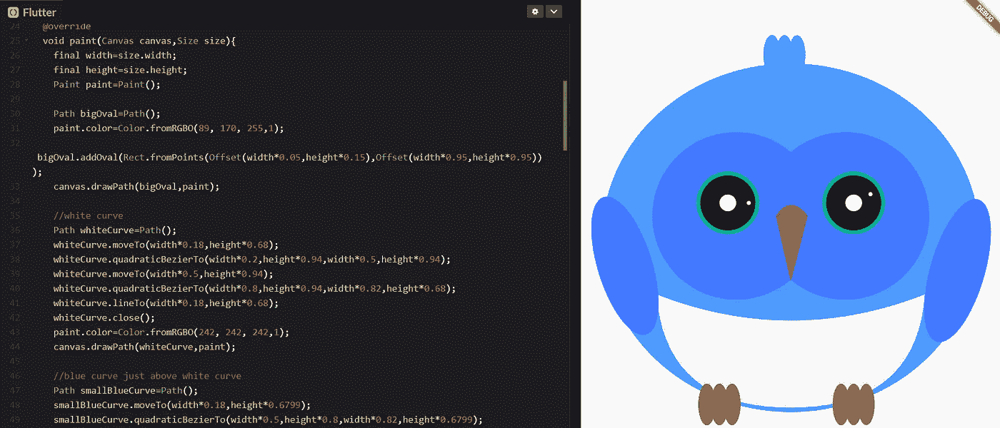
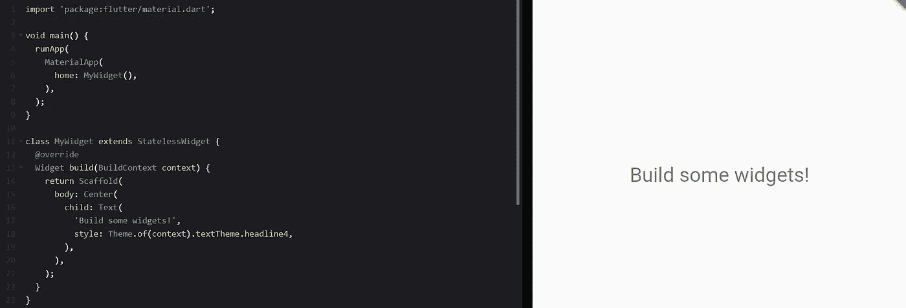
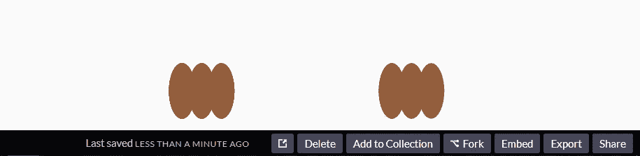
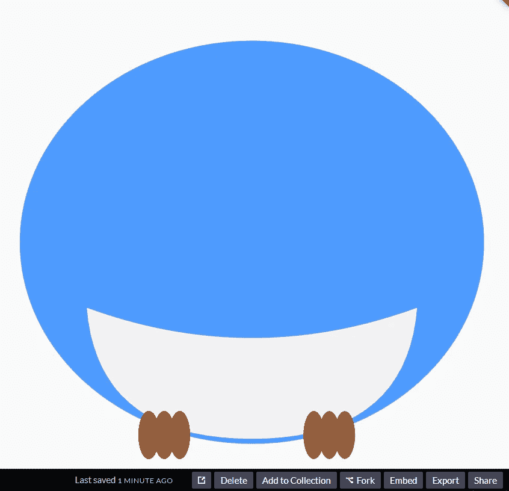
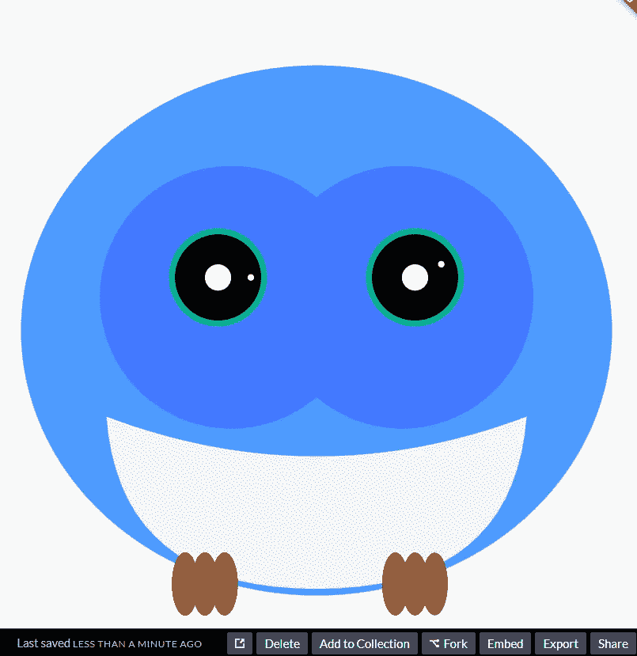

# 省道艺术🎯

> 原文：<https://medium.com/geekculture/art-with-dart-d35c98611acc?source=collection_archive---------31----------------------->



绘画是一种在画布上展示创造力的艺术形式。如果你是一个程序员，也是一个画家，这将是一个致命的组合🔥。画家通过摆弄画笔和颜色来创造艺术。类似地，编码者玩一些键盘按键，创造神奇的艺术，这就是我将在这个博客中展示的。所以，让我们开始吧…

## 我们将创造什么？

在这篇博客中，我将指导你创建 Dash bird，它是 [Flutter](http://flutter.dev) 的官方吉祥物(因为我是 Flutter 粉丝)。我们要创建的艺术已经显示在博客的标题中。看起来很棒，对吧😍？

## 创造魔力的成分…

我们将使用 Flutter 框架来创建这个美丽的艺术品。我们不需要为这个博客安装任何框架或 IDE。我们将使用 [Codepen](http://codepen.io) 在线 IDE，在那里我们将使用 Dart 语言编写代码。您也可以通过安装 Flutter 框架，在本地机器上使用任何 IDE 来实现这一点。

# 我们开始吧🚀🚀🚀

打开 Codepen IDE，从左侧菜单中创建一个新的 Flutter pen。一旦笔被创建，您将看到一些样板代码在颤动，输出显示在右侧。它将看起来像下面的图像。



现在，创建一个名为`**DashBird**` 的新类，它将扩展`[**CustomPainter**](https://api.flutter.dev/flutter/rendering/CustomPainter-class.html)` **。** CustomerPainter 是一个 dart API，用于创建各种类型的形状和组件，这些形状和组件无法使用 Flutter 的预定义 UI 小部件来创建。

之后，我们需要覆盖 **DashBird** 类中的两个方法`void paint`和`bool` `shouldRepaint()`。在`MyWidget`类中，移除脚手架主体内的中心小部件，并添加`CustomPaint`小部件来代替它。在`painter`属性中，调用`DashBird()`构造函数并将一个空容器传递给子对象。

```
...
body: CustomPaint(
        painter:DashBird(),
        child: Container(),
      ),
...
```

好了，现在设置准备好了。让我们开始画吧…

首先，我们将在`Size`对象的帮助下获得`paint()`方法中画布的尺寸，并创建一个 Paint 对象来指定我们的画笔的样式。

```
...
final width=size.width;
final height=size.height;
Paint paint=Paint();
...
```

现在，我们将开始制作仪表板的**爪**。为了制作爪子，我们需要画一些椭圆形。为了绘制形状，我们将创建一个路径对象。

```
...
Path oval=Path();
paint.color=Color.fromRGBO(139, 94, 60,1); // Color of legs
...
```

借助路径对象的`addOval()`方法绘制椭圆形。在`addOval`方法中，以矩形(角)的形式提供椭圆形的坐标。要提供坐标，使用`Offset()`类。用颜色填充这个椭圆将使用`canvas`对象的`drawPath()`方法。在`drawpath()`方法中，我们必须提供路径和 paint 对象作为参数。

为了创建 dash 的左爪，我们需要 3 个椭圆。

```
...
//left claw
    oval.addOval(Rect.fromPoints(Offset(width*0.28,height*0.885),Offset(width*0.32,height*0.98)));
canvas.drawPath(oval,paint);
  oval.addOval(Rect.fromPoints(Offset(width*0.31,height*0.885),Offset(width*0.35,height*0.98)));
canvas.drawPath(oval,paint);
  oval.addOval(Rect.fromPoints(Offset(width*0.34,height*0.885),Offset(width*0.38,height*0.98)));
canvas.drawPath(oval,paint);
...
```

为了创建右爪，我们需要 3 个相同颜色的椭圆。

```
...//right claw
oval.addOval(Rect.fromPoints(Offset(width*0.64,height*0.885),Offset(width*0.6,height*0.98)));
canvas.drawPath(oval,paint);
  oval.addOval(Rect.fromPoints(Offset(width*0.67,height*0.885),Offset(width*0.63,height*0.98)));
canvas.drawPath(oval,paint);
  oval.addOval(Rect.fromPoints(Offset(width*0.7,height*0.885),Offset(width*0.66,height*0.98)));
canvas.drawPath(oval,paint);
...
```



The output will look like this till now…

站立支撑准备冲刺。现在我们将创建**主体**部分。为此，我们首先用蓝色创建一个椭圆形，然后用另一个椭圆形创建白色部分。

```
...
Path bigOval=Path();
paint.color=Color.fromRGBO(89, 170, 255,1);
    bigOval.addOval(Rect.fromPoints(Offset(width*0.05,height*0.15),Offset(width*0.95,height*0.95)));
canvas.drawPath(bigOval,paint);//white curve
Path whiteCurve=Path();
whiteCurve.moveTo(width*0.18,height*0.68);
    whiteCurve.quadraticBezierTo(width*0.2,height*0.94,width*0.5,height*0.94);
whiteCurve.moveTo(width*0.5,height*0.94);
    whiteCurve.quadraticBezierTo(width*0.8,height*0.94,width*0.82,height*0.68);
whiteCurve.lineTo(width*0.18,height*0.68);
whiteCurve.close();
paint.color=Color.fromRGBO(242, 242, 242,1);
canvas.drawPath(whiteCurve,paint);

//blue curve just above white curve
Path smallBlueCurve=Path();
smallBlueCurve.moveTo(width*0.18,height*0.6799);
    smallBlueCurve.quadraticBezierTo(width*0.5,height*0.8,width*0.82,height*0.6799);
paint.color=Color.fromRGBO(89, 170, 255,1);
canvas.drawPath(smallBlueCurve,paint);
...
```



现在我们将为仪表板创建眼睛。为此，我们将使用 canvas 对象的`drawCircle()`方法。提供中心的偏移量作为第一个参数，半径作为第二个参数，绘制对象作为第三个参数。

```
...
//big blue circles for eyes
paint.color=Color.fromRGBO(61, 145, 255,1);
    canvas.drawCircle(Offset(width*0.37,height*0.5),width*0.2,paint);
canvas.drawCircle(Offset(width*0.63,height*0.5),width*0.2,paint);//black circles
paint.color=Color.fromRGBO(0,0,0,1);
    canvas.drawCircle(Offset(width*0.35,height*0.47),width*0.07,paint);
canvas.drawCircle(Offset(width*0.65,height*0.47),width*0.07,paint);
```

这将创建眼睛的外部。没有眼球看起来很吓人😂。所以，我们来创造眼球吧。

```
//eye border
Paint paintBorder=Paint()..color=Color.fromRGBO(32, 170, 140,1)
      ..style=PaintingStyle.stroke
      ..strokeWidth=6.0;
    canvas.drawCircle(Offset(width*0.35,height*0.47),width*0.07,paintBorder);  canvas.drawCircle(Offset(width*0.65,height*0.47),width*0.07,paintBorder);

//big white circles
paint.color=Colors.white;
    canvas.drawCircle(Offset(width*0.35,height*0.47),width*0.02,paint);
canvas.drawCircle(Offset(width*0.65,height*0.47),width*0.02,paint);//tiny white circle    canvas.drawCircle(Offset(width*0.40,height*0.47),width*0.005,paint);
canvas.drawCircle(Offset(width*0.69,height*0.45),width*0.005,paint);
```



Output till now…

我们的仪表板有眼睛，可以看到这个美丽的世界…现在让我们让它飞起来。为了创建翅膀，我们再次创建两个椭圆形，并根据我们想要的位置旋转它们。

```
//left wing
Path wing1=Path();
paint.color=Color.fromRGBO(61, 145, 255,1);
    wing1.addOval(Rect.fromPoints(Offset(width*0.035,height*0.45),Offset(width*0.165,height*0.78)));
canvas.translate(width*0.1,height*0.6);
canvas.rotate(-38);
canvas.translate(-width*0.1,-height*0.6);
canvas.drawPath(wing1,paint);//right wing
Path wing2=Path();
paint.color=Color.fromRGBO(61, 145, 255,1);
    wing2.addOval(Rect.fromPoints(Offset(width*0.805,height*0.53),Offset(width*0.935,height*0.87)));
canvas.translate(width*0.6,height*0.75);
canvas.rotate(32);
canvas.translate(-width*0.6,-height*0.75);
canvas.drawPath(wing2,paint);
```

Dash 已经准备好起飞了。但是等等它怎么呼吸，我们忘记了鼻子😬。再补充一下吧…

要创建一个锥形形状，使用 Path 对象的`moveTo()`方法将指针指向一个特定的点。使用`quadraticBezierTo()`方法画一个圆弧。提供弧的端点作为参数。然后用`lineTo()`方法画一条线。`close()`方法会把指针指向我们开始画鼻子的那个点，这样我们就得到一个封闭的颜色路径。

```
//nose
Path nose=Path();
nose.moveTo(width*0.465,height*0.5);
nose.quadraticBezierTo(width*0.5,height*0.45,width*0.54,height*0.5);
nose.lineTo(width*0.5,height*0.65);
nose.close();
paint.color=Color.fromRGBO(139, 94, 60,1);
canvas.drawPath(nose,paint);
```

Dash 快好了。现在需要在顶部放一颗小樱桃。再补充一下吧…

```
//head fur
Path head=Path();
paint.color=Color.fromRGBO(89, 170, 255,1); 
    head.addOval(Rect.fromPoints(Offset(width*0.435,height*0.085),Offset(width*0.475,height*0.175)));
canvas.drawPath(head,paint);
    head.addOval(Rect.fromPoints(Offset(width*0.465,height*0.085),Offset(width*0.505,height*0.175)));
canvas.drawPath(head,paint);
 head.addOval(Rect.fromPoints(Offset(width*0.495,height*0.085),Offset(width*0.535,height*0.175)));
canvas.drawPath(head,paint);
```


HoolaKaboola!! Dash is ready…

最后，仪表板准备好了。虽然它不能适应所有的屏幕尺寸，但它看起来很漂亮😍😍。这样，我们可以通过编写几行代码来创建大量的艺术作品。

在[这里](https://codepen.io/yashpaneliya/pen/VwvMJRo)找到完整的源代码。

如果你喜欢冲刺，那就用掌声表达你的爱吧…