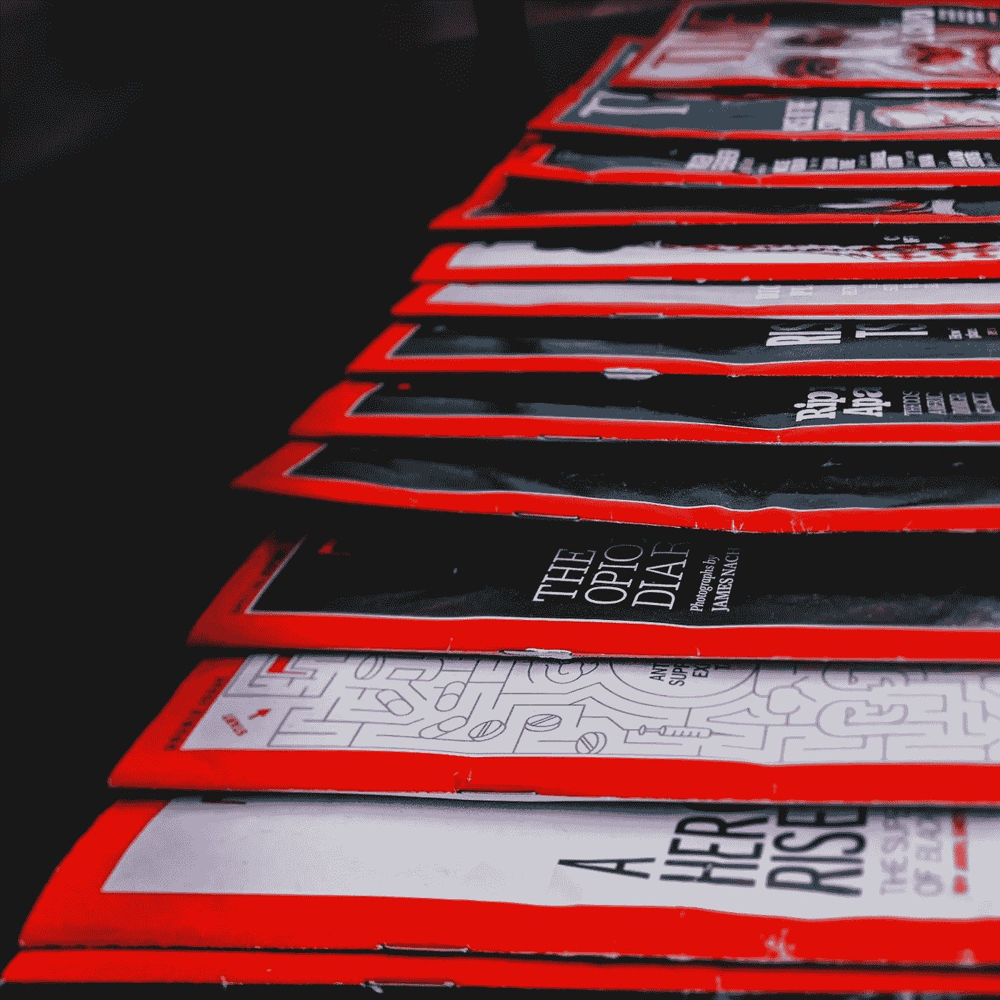

# Kotlin Coroutine 的文章

> 原文：<https://medium.com/geekculture/article-of-articles-for-coroutine-c499681793f6?source=collection_archive---------16----------------------->

Photo by [Ali Shah Lakhani](https://unsplash.com/@lakhani?utm_source=unsplash&utm_medium=referral&utm_content=creditCopyText) on [Unsplash](https://unsplash.com/?utm_source=unsplash&utm_medium=referral&utm_content=creditCopyText)

## 这三篇文章非常有助于了解协程的基础知识: