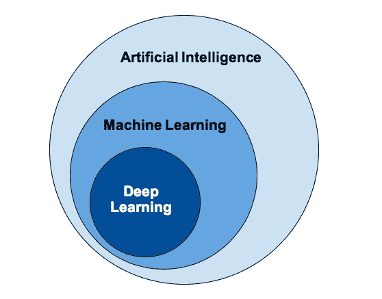

# 人工智能(AI) vs 机器学习 vs 深度学习

> 原文：<https://medium.com/geekculture/artificial-intelligence-ai-vs-machine-learning-vs-deep-learning-84c22143b047?source=collection_archive---------30----------------------->

## 人工智能、机器学习和深度学习的区别

大家好，

今天我们要学习人工智能、机器学习和深度学习之间的区别。我们还将了解一些常见的使用案例。让我们进入主题。

Photo by [Possessed Photography](https://unsplash.com/@possessedphotography?utm_source=medium&utm_medium=referral) on [Unsplash](https://unsplash.com?utm_source=medium&utm_medium=referral)

> 我们听过很多 ai 人工智能的词汇。我们听说过机器学习。我们听说过深度学习。有时，我们谈论了许多事情，特别是如果你看了很多电影，你可能会听到这些话，特别是你可能听说过人工智能将毁灭人类，并将攻击世界。有很多讨论都在进行人工智能的未来是什么实际上人工智能是什么机器学习和站在当下这三个东西有什么区别？

## AI vs 机器学习 vs 深度学习

我认为现在这些问题非常简单，如果你仔细思考人工智能、机器学习和深度学习之间的区别，这就是我们要进入这篇文章的地方。

Image Source: [https://www.sumologic.com/blog/machine-learning-deep-learning/](https://www.sumologic.com/blog/machine-learning-deep-learning/)

这些东西之间有很大的区别，我认为最大的伞总是人工智能，我的意思是它是最大的伞，其他一切都在人工智能之下，这就是它的美妙之处，如果你仔细想想人工智能，人工智能的主要目标是提供一套算法和一些信息来解决一些问题，这对像我们这样的人来说是非常直观和完全自动化的 让我们想一个例子，让我们看看此刻你能从眼睛里看到什么，想一想你能在你的环境里看到什么？ 我可以看到很多事情，我可以解释所有这些事情，它会自动发生。我甚至不需要思考，好吧，让我想想我的一杯水，这是一杯水，我甚至不需要有目的地思考，因为它已经在我体内很长时间了，它会自动发生。它非常直观，它的特点是这种能力，如果你能把它给一台机器，这是你能从人工智能的角度思考的最终目标 比方说，人工智能的目标是赋予机器像我们人类一样思考和采取行动的能力，现在图像的内容理解图像的内容是直观的，这是完全自动的，就像你和我现在理解的那样。 这很复杂，不是吗？我的意思是，即使是一个小孩子也能做到这一点，但给机器赋予这种能力是一件非常令人兴奋的事情，这就是人工智能的目标。如果你需要了解一些典型的技术术语，你可以称之为自动机器推理。

Photo by [Hitesh Choudhary](https://unsplash.com/@hiteshchoudhary?utm_source=medium&utm_medium=referral) on [Unsplash](https://unsplash.com?utm_source=medium&utm_medium=referral)

你知道人工智能内部的图表，通常称为机器学习，机器学习的目标是人工智能的一个较小版本，通常，目标是识别模式并从数据中学习，所以如果你想从数据中学习，也识别从数据中出现的模式，这通常是机器学习的目的。

我们有深度学习，事实上，它是一个更深层次的版本， 你可能已经听说过像神经网络这样的词，它是机器学习的一种形式，有多种类型的算法，多种形式的类和神经网络，特别是人工神经网络是机器学习的一种，人工神经网络的一个特定部分叫做深度学习，它包含多种深度水平的机器学习，是机器学习的一个更加专业化的版本，这就是我们通常所说的深度学习 这个问题很简单，也很重要，我们有三个层次，人工智能，机器学习和深度学习。

# 一般使用案例

1.  声音:声音识别、语音搜索、欺诈检测、情感分析。
2.  文本:情感分析、威胁检测、欺诈检测、增强搜索、主题检测、自然语言处理。
3.  图像:面部识别，图像搜索，机器视觉，照片聚类。
4.  视频:运动检测，实时威胁检测，情感检测，视频监控。

还有许多更专业的用例。上面给出的用例也在多个行业中使用。例如，实时威胁检测用于机场监视、军事基地监视、银行监视等。

我相信你已经理解了今天讨论的主题。如果您有任何问题或任何澄清，不要犹豫，通过回复部分与我联系。感谢您花费宝贵的时间阅读这篇文章。

干杯…

Photo by [Howie R](https://unsplash.com/@howier?utm_source=medium&utm_medium=referral) on [Unsplash](https://unsplash.com?utm_source=medium&utm_medium=referral)

## 参考

 [## 人工智能 vs .机器学习 vs .深度学习:有什么区别？相扑逻辑

### 虽然深度学习、机器学习和人工智能(AI)似乎是同义的，但也有…

www.sumologic.com](https://www.sumologic.com/blog/machine-learning-deep-learning/)