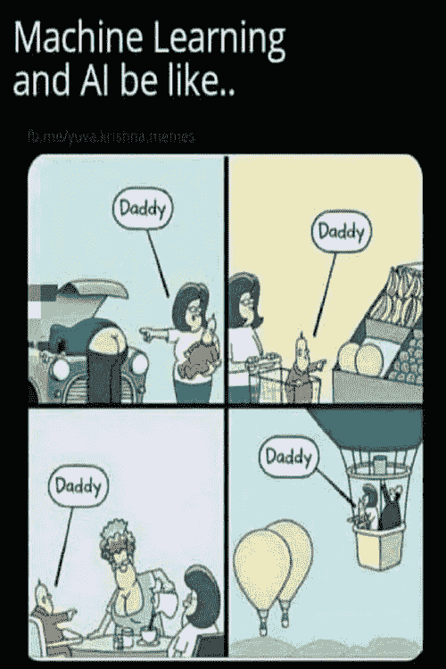
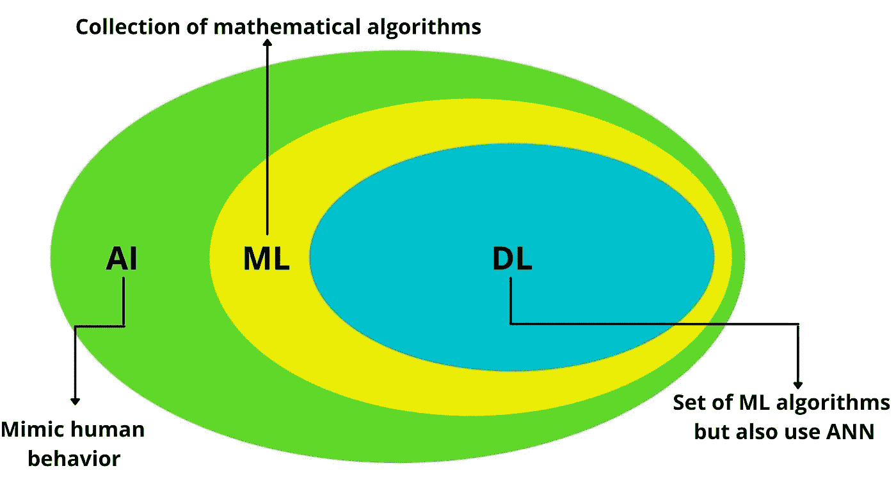

# 人工智能和术语

> 原文：<https://medium.com/geekculture/artificial-intelligence-and-terminologies-9f70cb60d240?source=collection_archive---------22----------------------->

Credits:- [weired.com](https://www.wired.com/story/what-is-a-robot/)

在开始**机器学习工程师**或**数据科学家**的旅程之前，我们需要了解这些术语的实际含义，以及它们与机器学习、深度学习和人工智能的不同之处，以及它们之间的联系。

现在，让我们从被称为**人工智能**的术语开始，许多人认为，有一天它会毁灭世界。

Credits:- [primogif.com](https://www.primogif.com/p/67RCy4sOyixOg)

什么是 **AI** ( **人工智能**)？

简而言之，它包括创造一种智能，这种智能可以:

*   像人类一样思考。
*   模仿人类行为。
*   执行类似人类的任务。

对于人造这个词，我们指的是人造的，如人造卫星(阿耶波多)或人造水果(由塑料或泡沫制成，用于装饰)。

但有一点要注意的是，今天所有的人造物品实际上都是相应的自然物品的复制品，如月亮和自然水果。

同样，人工智能只是人类制造的智能，是自然智能的复制，而自然智能就是人类本身。

因此，如果你拿任何一台机器，比如笔记本电脑、电视、洗衣机，让它模仿人类的行为，比如做决定，那么它就会被称为人工智能。

Walking TV, Credits:- [gifer.com](https://gifer.com/en/R87W)

现在，问题出现了，我们如何才能让机器复制人类的行为，这个问题的答案是使用**机器学习**和**深度学习。**

但在此之前，首先让我们试着了解，AI 试图复制的自然智能(人类)所执行的任务是什么。

不同的任务需要不同的能力来完成，比如:

需要**决策的任务:**

*   开着车。
*   玩电子游戏

需要**视觉能力的任务:**

*   人脸识别
*   物体检测。

需要**语言处理能力的任务:**

*   垃圾邮件检测
*   情感分析
*   语言翻译

虽然我们人类可以完成所有这些任务，但今天没有机器可以完成所有这些任务，但有许多人工智能可以单独完成这些任务。

比如，

*   驾驶汽车:-特斯拉
*   玩视频游戏:-机器人
*   物体检测:-谷歌镜头

还有更多..

以上各种东西都可以用**机器学习**和**深度学习**来做。

这两个术语不过是让机器从**数据中学习。**

比如，孩子们如何通过看苹果的图像来学习**苹果**的 **A** ，就像机器从数据中学习一样。

Machines learning from data. Credits:- [pinterest.com](https://www.pinterest.com/pin/667940188483844737/)

现在我们有了 **ML** (机器学习)和 **DL** (深度学习)的基本思路，现在让我们通过了解它们的联系和区别来更具体一些。

现在，在上图中，我们可以简单明了地理解 AI、ML 和 DL 的区别和联系。

但疑惑的是，上图中 DL 定义中的那个**安**是什么？

这意味着**人工神经网络，**再次使用人工这个词，我们可以清楚地理解它实际上是我们大脑中存在的自然神经网络的副本。

为了理解 ANN 是如何工作的，以一个正在学习不同物体的名称的小男孩为例。因此，在给他看苹果的图像时，他的父母告诉他这是“苹果”,所以后来当他看到一个红色的球时，他也认为是苹果，然后他的父母向他提供反馈“是”或“否”,基于反馈，他开始观察红色球和苹果之间的细微差异，他大脑中的神经元通过理解这些细微差异开始变得更加密集。

我现在不会更深入地解释 ANN，因为这需要一篇单独的文章。

感谢阅读…

快乐学习:)

**参考文献:** [技术为所有](https://www.youtube.com/watch?v=BaugYzw5G64&list=PLbyNUEb72lTwf15PSSZc2Nf8erSxsyUFM&index=8)