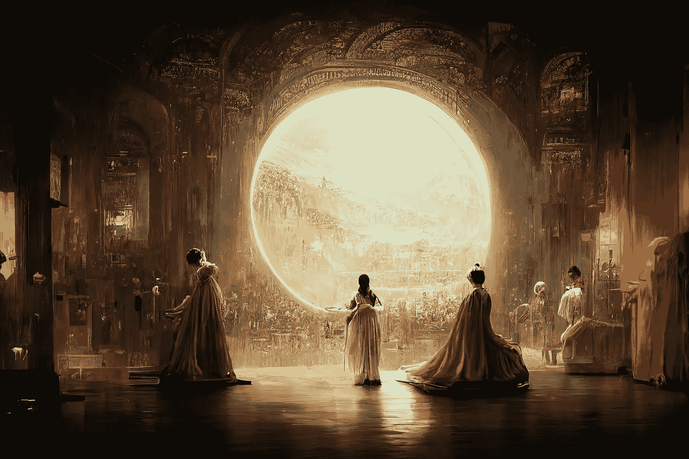

# 随着苹果推出新产品，人工智能正在接管艺术

> 原文：<https://medium.com/geekculture/artificial-intelligence-is-taking-over-art-as-apple-launches-new-products-9e1ff7a85350?source=collection_archive---------11----------------------->

“Théâtre D’opéra Spatial” by Jason M. Allen via Midjourney

本周，一幅由人工智能生成的画作赢得了艺术比赛，引发了争议。苹果公司在每年 9 月的发布会上推出了一系列新产品。美国经济正在恶化，同时也在改善，这让分析师们感到困惑。利兹·特拉斯在选举中战胜了里什·苏纳克，成为危机时期的英国首相…