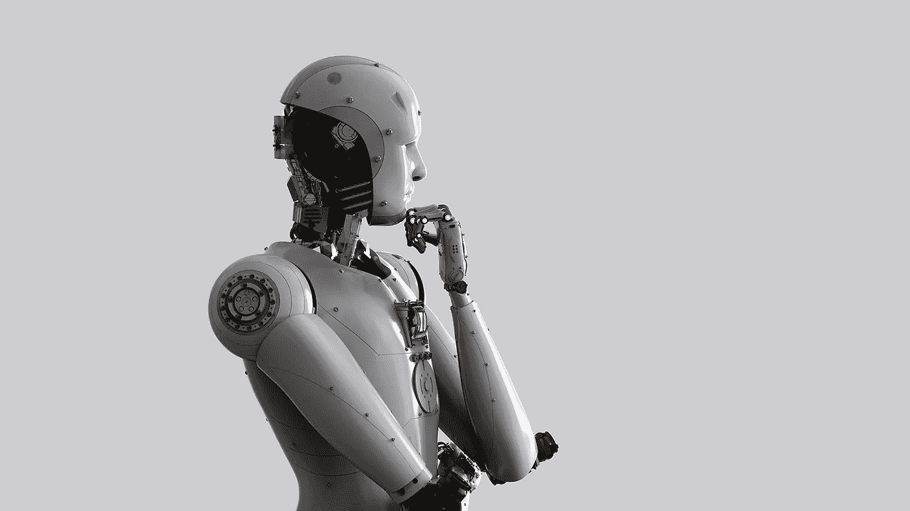
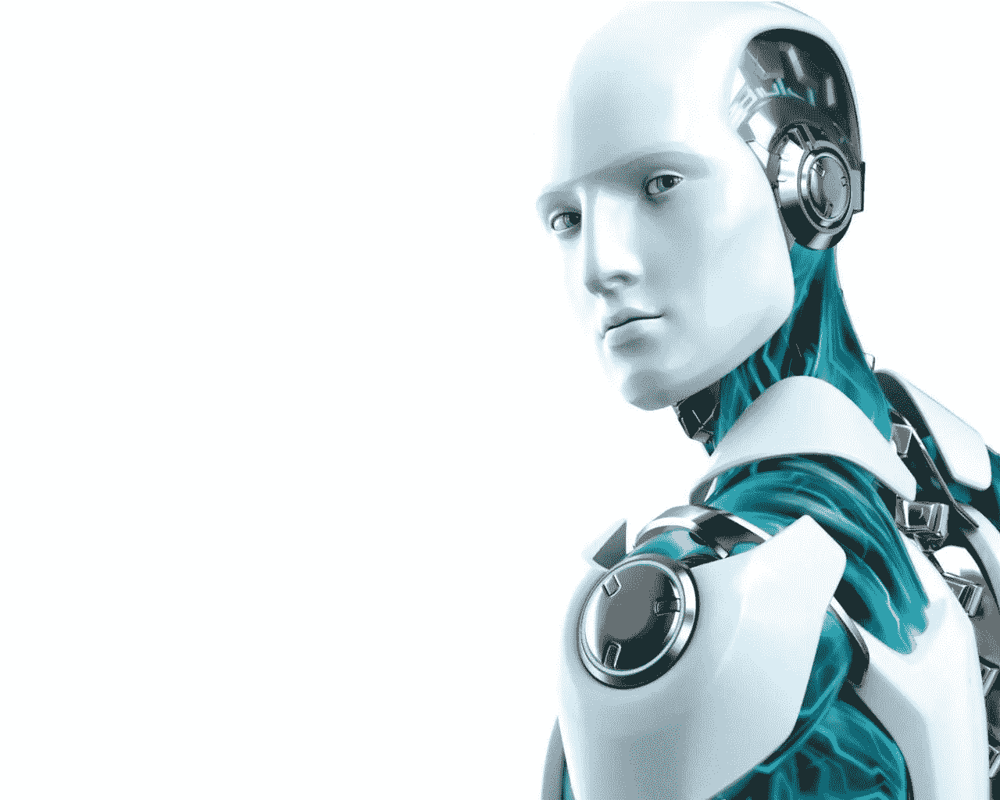
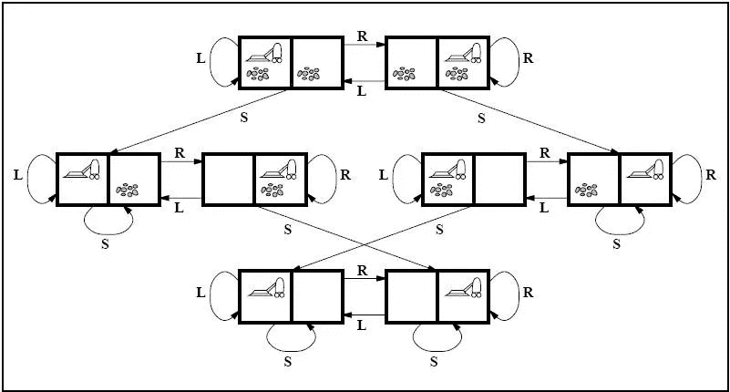

# 人工智能系列:问题解决代理

> 原文：<https://medium.com/geekculture/artificial-intelligence-series-problem-solving-agents-2ee405ddf4d0?source=collection_archive---------3----------------------->

在本系列的前几篇文章中，我们已经讨论了代理程序的各种结构。

 [## 人工智能系列:智能体的结构

### 在人工智能系列的第三篇文章中，我们将讨论各种智能代理的结构和类型。

medium.com](/geekculture/artificial-intelligence-series-structure-of-agents-1f74cc8e9ecd) 

在本文中，我们将讨论**问题解决代理**，它是一种基于**目标的代理**。由于简单反射代理从状态到动作的直接映射对于复杂环境来说太大而无法存储，所以我们使用基于目标的代理，它可以考虑未来的动作和结果的合意性。

# 问题解决代理

智能代理应该最大化其**性能测量**。如果代理可以采用一个**目标**并致力于满足它，那么实现这一点可以简化。

设定目标有助于代理通过限制代理试图实现的目标来组织其行为，从而限制其需要考虑的行动。这个**目标制定**基于当前情况和代理的绩效衡量是解决问题的第一步。

我们认为代理的目标是一组状态。代理的任务是找出现在和将来的动作，这些动作可以从当前状态到达目标状态。**问题公式化**是在给定一个目标的情况下，决定考虑什么动作和状态的过程。

> “具有几个未知价值的即时选项的代理可以通过首先检查最终导致已知价值状态的未来动作来决定做什么”

在目标制定和问题制定之后，代理必须寻找一系列达到目标的动作。这个过程被称为**搜索**。搜索算法将问题作为输入，并将一系列动作作为输出返回。

在搜索阶段之后，代理必须执行搜索算法推荐的操作。这个最后阶段被称为**执行**阶段。

> 制定—搜索—执行

因此，代理有一个制定，搜索和执行的设计。

# 问题和解决方案

在我们进入更多关于问题形成阶段之前，我们需要首先从问题解决代理的角度理解什么是问题。

这个问题可以正式定义为五个部分:

1.  初态
2.  行动
3.  过渡模型
4.  目标测试
5.  路径成本

## 初态

描述问题的第一个组件是代理启动时的初始状态。例如，如果出租车代理需要到达位置(B ),但是出租车当前在位置(A ),那么问题的初始状态将是位置(A)。

## 行动

描述问题的第二个组件是对代理可用的可能的**动作**的描述。给定一个状态 *s* ，**动作(s)** 返回可以在 *s.* 中执行的动作集合，我们说这些动作中的每一个都是**适用的**在 *s.*

## 过渡模型

第三个组成部分是对每个动作做什么的描述，称为**转换模型**。它由函数 **Result(s，a)** 指定，该函数返回在状态 *s.* 中执行动作 *a* 所产生的状态

初始状态、动作和转换模型一起定义了问题的**状态空间**，它是通过任何动作序列从初始状态可达的所有状态的集合。状态空间形成一个**图**，其中节点是状态，节点之间的链接是动作。

## 目标测试

目标测试确定给定的状态是否是目标状态。有时有一组明确的可能的目标状态，测试只是检查给定的状态是否是其中之一。有时目标是由抽象的属性指定的，而不是由一组明确列举的状态指定的。

## 路径成本

问题的最后一部分是**路径成本**，这是一个为每条路径分配数字成本的函数。问题解决代理选择反映其自身性能度量的成本函数。

问题的**解**是从初始状态到目标状态的行动序列，解的质量由路径成本函数来衡量。在所有解决方案中，最优解决方案的路径成本最低。

# 一个示例问题公式

让我们以本系列开始时介绍的真空世界为例，有一个真空吸尘器代理，它可以向左或向右移动，它的跳跃是从地板上吸取灰尘。

State space for vacuum world.

真空世界的问题可以表述如下:

**状态:**状态由试剂位置和污垢位置决定。该代理位于两个位置中的一个，这两个位置可能包含灰尘，也可能不包含灰尘。所以有 2 x 2 **= 8** 个可能的世界状态。

一个更大的环境会有 n x 2 的 n 次方个状态。

**初始状态:**在这种情况下，任何状态都可以被指定为初始状态。

**动作:**在这个环境中有三个动作，*向左移动，向右移动，吸起脏东西。*

**过渡模型:**所有动作都有预期效果，除了当代理人在最左边的方格且动作是*左*时，当代理人在最右边的方格且动作是*右*且动作是*吸时方格是干净的。*

**目标测试:**目标测试检查所有方块是否干净。

**路径成本:**每一步成本为 1，所以路径成本就是路径中的步数。

真空世界问题是一个玩具问题，只涉及离散的位置、离散的灰尘等。所以这个问题是一个**玩具问题**。有许多现实世界的问题，比如自动出租车世界。尝试将现实世界的问题公式化，看看会有什么样的状态，可以选择什么样的行动等等。

在这篇文章中，我们主要讨论了问题的形成。在本系列的下一篇文章中，我们将讨论使用**搜索方法**寻找解决方案。

# 参考

**人工智能:现代方法**，作者彼得·诺维格和斯图尔特·j·拉塞尔