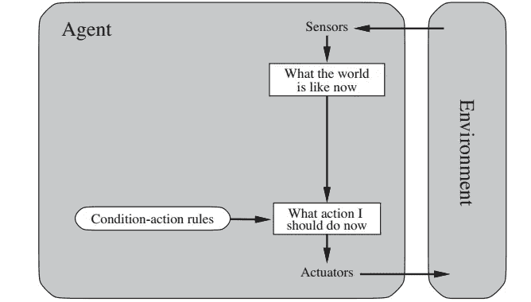
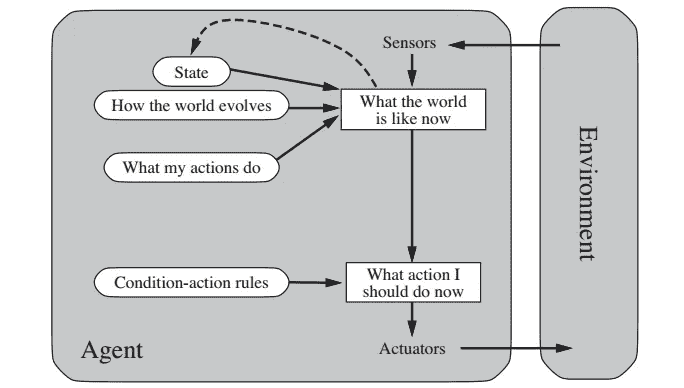
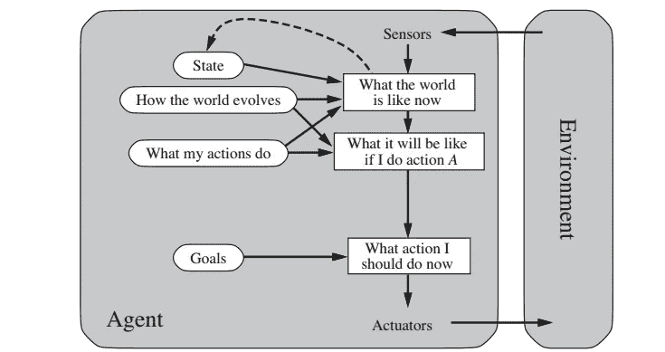
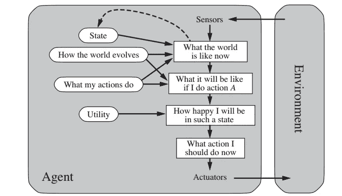
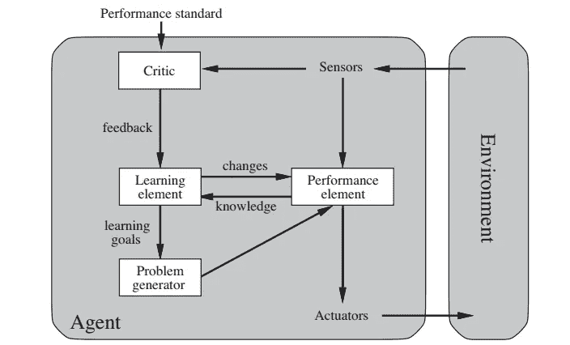

# 人工智能系列:智能体的结构

> 原文：<https://medium.com/geekculture/artificial-intelligence-series-structure-of-agents-1f74cc8e9ecd?source=collection_archive---------14----------------------->

Photo by [Michael Dziedzic](https://unsplash.com/@lazycreekimages?utm_source=medium&utm_medium=referral) on [Unsplash](https://unsplash.com?utm_source=medium&utm_medium=referral)

在本系列的前几篇文章中，我们已经讨论了智能代理及其工作环境的类型。查看文章以了解更多信息。

 [## 人工智能系列:智能代理

### 在这个系列的介绍中，我们谈到了智能、理性和理性代理人的概念…

medium.com](/@1runx3na/artificial-intelligence-series-intelligent-agents-617ca2312867) 

对于那些想从这个系列的开头开始的人来说，

 [## 人工智能系列:简介

### 自从计算机的革命性发明以来，科学家和工程师们一直在提出这样一个问题，“能不能…

medium.com](/@1runx3na/artificial-intelligence-series-introduction-7b17e7d77585) 

> 人工智能的工作是设计一个实现代理功能的智能代理程序。

代理不仅是程序，也是程序运行的架构。例如，如果程序有一个类似于*行走*的动作指令，那么架构必须支持这种动作的能力。所以代理是架构和在架构上运行的程序的结合。

在本文中，我们将集中讨论代理程序及其各种类型。

# 代理程序

**代理程序**将当前感知作为输入，并向执行器返回一个动作。同时一个**代理函数**将整个感知历史作为它的输入。

Photo by [hobijist3d](https://unsplash.com/@hobijist3d?utm_source=medium&utm_medium=referral) on [Unsplash](https://unsplash.com?utm_source=medium&utm_medium=referral)

有四种基本的代理程序，它们体现了几乎所有智能系统的基本原理。

1.  简单反射剂
2.  基于模型的反射代理
3.  基于目标的代理
4.  基于实用程序的代理
5.  学习代理

# 简单反射剂

这些是简单的代理，它们根据当前的感知输入选择动作，忽略其余的感知历史。简单的反射行为可以在各种复杂的环境中观察到。

例如，在自动出租车中，如果出租车前面的车辆施加制动，那么出租车也应该施加制动。这些类型的 **if-then 连接**被称为**条件-动作规则**。

> **如果**前车制动**则**启动制动

simple reflex agent

这种类型的代理简单快速，但智能有限。这种类型的智能体只有在仅基于当前感知做出正确决策的情况下才会起作用，也就是说，只有在环境完全可观察的情况下才会起作用。

如果我们以之前文章中讨论的真空吸尘器为例，并使环境部分可观察，即真空代理只有一个*灰尘传感器*而没有一个*位置传感器*，那么由于空间限制，代理进入一个不可避免的循环。

为了避免无限循环，代理应该**随机化**它的动作。

# 基于模型的反射代理

为了处理环境的部分可观察性，代理应该有一个**内部状态**来跟踪世界上现在不可观察的部分。内部状态取决于感知历史。

Model-Based Reflex Agents.

内部状态应该随着时间的推移而更新，这需要在代理程序中编码两种知识。

1.  世界如何独立于主体而进化。
2.  代理人自己的行为如何影响世界。

这种关于“世界如何运转”的知识被称为世界的**模型**，使用这种模型的代理被称为基于**模型的代理**。

# 基于目标的代理

这种类型的代理选择其行动，以实现目标。代理需要某种描述理想情况的**目标信息**。

例如，如果我们采用简单反射代理的**条件-动作规则**，如果汽车前方车辆的尾灯打开，则可以建立应用制动的连接。但是在基于目标的代理中，目标是确定的。

这里定义的目标是*不会撞到车辆*。因此，如果出租车前面的车辆刹车，出租车自然也会刹车，以免撞到前面的车辆。

Goal-Based Agents

基于目标的代理更加灵活，因为支持其决策的知识是显式表示的，并且可以修改。

# 基于实用程序的代理

在基于目标的代理中，自动出租车的最终目标是到达目的地，但它没有说明它应该走长路线还是短路线，这使得基于目标的代理效率较低。如果我们说，如果目标实现了，代理人是“快乐的”,如果目标没有实现，代理人是“不快乐的”,那么**效用**测量代理人有多快乐或不快乐。

代理的**效用函数**是性能测量的内在化。如果内部效用函数与外部绩效度量一致，那么根据外部绩效度量，选择最大化其效用的代理将是理性的。

Utility-Based Agents

基于理性效用的主体选择最大化行动结果预期效用的行动。

# 学习代理

学习允许代理在最初未知的环境中操作，并随着时间的推移变得有能力。学习代理可以分为四个概念部分。

1.  学习元素
2.  性能元素
3.  批评家
4.  问题生成器

Learning Agent

**学习元素**负责改进。

**性能元素**负责选择外部动作。

评论家将代理的表现反馈给学习单元，并决定如何改进绩效单元，以便将来做得更好。

**问题生成者**负责建议能够带来新的有益体验的行动。

# 参考

**人工智能:现代方法**，作者彼得·诺维格和斯图尔特·j·拉塞尔