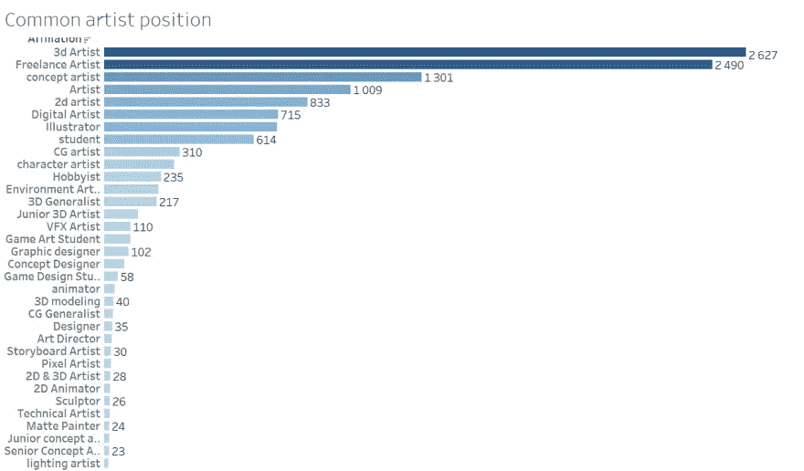
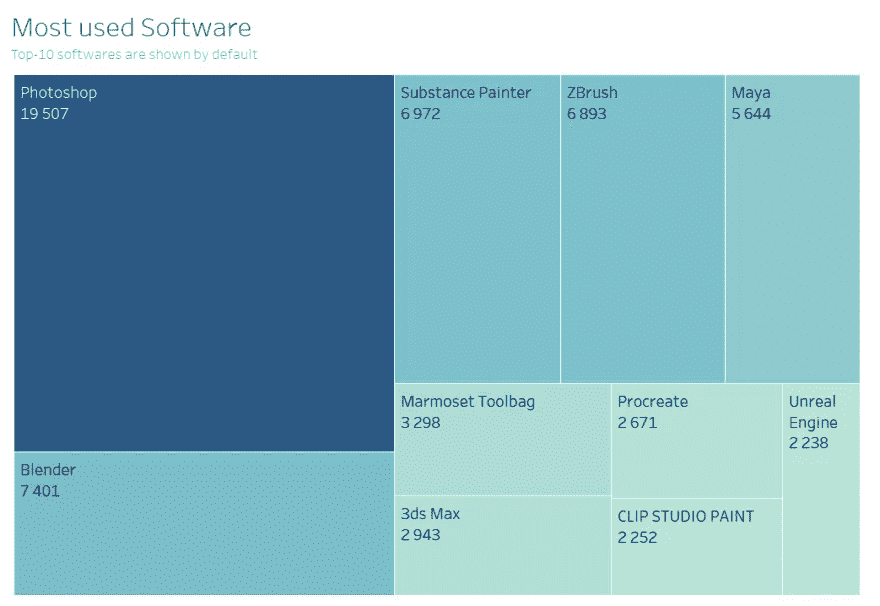
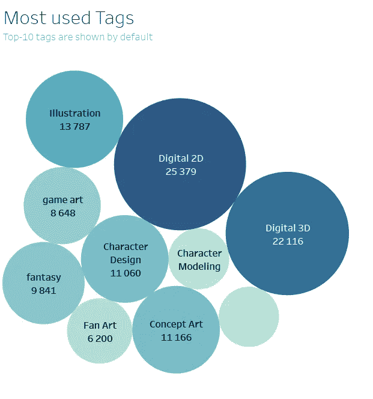

# 艺术站数据分析项目

> 原文：<https://medium.com/geekculture/artstation-data-analysis-project-e58532fe4ab5?source=collection_archive---------28----------------------->

内容:[项目目标](#2dfb)，[所用工具](#8118)，[数据提取](#9a96)，[数据清洗](#426b)，[数据可视化](#37e0)，[观察](#c482)，[结论](#2c1b)， [kaggle-github 链接](#52b3)。

## 项目目标

该项目的目标是更好地理解使用行业工具收集数据、处理、清理、分析和可视化的过程。除此之外，我想了解什么是 Artstation 上最受欢迎的软件、标签和艺术家之间的联系。

## 使用的工具

为了收集数据，使用了以下 Python 库/包:

*   `requests`
*   `json`
*   `googlesheets api`
*   `selenium`
*   `regex`

要清理、分析和可视化数据:

*   `googlesheets`
*   `tableau`

## 数据析取

为了提取数据，使用了 Python。跳转到 GitHub 源代码:

*   [刮掉作品链接](https://github.com/dimitryzub/artstation-artwork-analysis/blob/main/scrape_links.py)
*   [刮掉艺术品本身](https://github.com/dimitryzub/artstation-artwork-analysis/blob/main/scrape_artworks.py)

## 数据清理

为了清理和准备数据，我使用了 Google Sheets。使用的功能:

```
=IMPORTRANGE()
=FILTER()
=SPLIT() or =SPLIT() + CHAR(10)
=IF() or =IF() + =ISBLANK()
=ISBLANK()
=COUNTIF()
=ROW()
```

`=IMPORTRANGE("SHEET_URL","'SHEET_NAME'!RANGE")`用于将特定的色谱柱导入到不同的样品板上，以便进行清洗和分析。

`=FILTER()`用于从范围中过滤特定的单词，例如`=FILTER(A1:A, A1:A="Student")`将从整个列中过滤单词“Student”。

`=SPLIT()` + `CHAR(10)`用于拆分多行细胞:

```
# multi-line cell 
ZBrush 
Maya 
Substance 
Painter 
Mari 
Photoshop =SPLIT(A1,CHAR(10)) will split multiline cell to separate columns like so: 
ZBrush Maya Substance Painter Mari Photoshop
```

`=IF()`用于检查单元格是否为空，留空。

`=ISBLANK()`与`=IF()`结合使用，检查单元格是否为空。

`=COUNTIF()`用于统计特定范围内的单词出现次数，如`=COUNTIF(SHEET_NAME!RANGE,"Word or cell reference")`

`=ROW()`用于创建唯一的 ID，例如`=ROW(A1)-1`将创建`ID 1`，而不是`ID 2`，因为有减法运算。

## 数据可视化

[Tableau 公共仪表盘](https://public.tableau.com/app/profile/dimitry.zub/viz/Artstationanalysis/ArtstationDashboard)



注意:*以下可视化包含数据偏差。由于数据提取的困难和我犯的错误，不是每一个标签，从属关系都被计算在内。*

## 观察

对个人所犯错误的观察:

**问题**是每个单元格都包含多行`string`，当我试图使用`\n`分隔符`=SPLIT()`时，它什么也不做。相反，我不得不使用`=SPLIT(CELL,CHAR(10))`

其中一个选择是将标签直接分配给 Python 代码中的不同变量，并将它们输入到不同列下的表中，这样就不会浪费时间。

最好立即在表中检查我是否得到了预期的结果🙂

关于 Artstation 的观察:

在大多数情况下，对隶属关系的角色/类型的描述不清楚、混乱、不具体。

在这点上，从招聘人员的角度来看，可能很难找到候选人，因为在简短的角色描述中简单地指出了其他事情。虽然从专业角度来看，这位艺术家可能非常优秀。

结果——一个艺术家可能根本不在招聘人员或其他寻找特定艺术家角色的人的视野之内。

在我看来，应该使用下拉列表、关键字搜索或任何类似于发布艺术品时所用程序选择的方式来规范雇佣类型。

这里的一切都清晰易懂，例如“使用的软件:Blender，Photoshop”，一点也不像:

*   *“获奖纹身师、数字艺术、3d 人物艺术*”:一行太多，如何理解一个人在哪个位置会最亮？
*   *“我画的东西*”:不清楚，不具体，令人困惑。

## 结论

艺术家的分析很有意思。下一步可能是了解以下各项之间的关系:

*   点赞和评论的浏览量。
*   所用程序的浏览次数。
*   视图数和使用的标签数。
*   十大热门节目和十大热门标签。

明白，什么是最受欢迎的流派，为什么。

## 链接:

*   [Kaggle 数据集](https://www.kaggle.com/dimitryzub/artstation)
*   [GitHub 储存库](https://github.com/dimitryzub/artstation-artwork-analysis)包含用于从 Artstation 提取数据的可用源代码。

*谢谢你一路走来的这些话！希望你能从这篇文章中得到一点价值。*