# 像冰山一样冷静

> 原文：<https://medium.com/geekculture/as-cool-as-iceberg-bb7d93084c72?source=collection_archive---------7----------------------->

source: [https://iceberg.apache.org/](https://iceberg.apache.org/)

我们一直面临着数据维护的挑战，以及为您的分析提供一站式解决方案的效率。

当谈到实现最佳存储性能时，我们总是倾向于考虑支持序列化或压缩的文件格式。

然后是支持分析用例的基础设施。

但是我们很少谈论你的文件格式和计算之间的薄层。

你的计算像 Spark，Hive 或者 Flink 会直接和文件格式对话。

然后应用所有类型过滤器，如分区、谓词下推等。

但是，如果我们可以在您接触文件格式之前应用该规则，并根据您的查询忽略您不感兴趣的文件，会怎么样呢？

**输入 Apache 冰山 a 表格式。**

# 表格格式适合哪里

Apache Iceberg 是 parquet 或 ORC 等文件格式之上的一层，计算将在存储的文件格式之上使用这种表格格式。

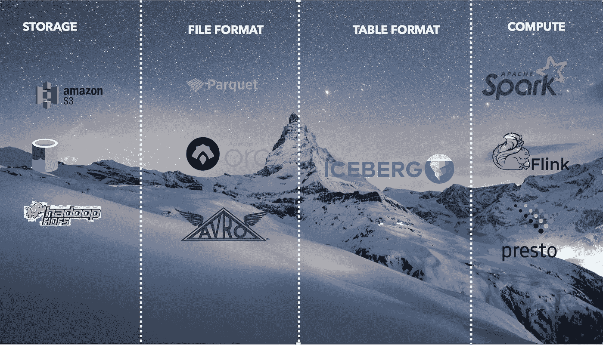

# 介绍

**Apache Iceberg 是一种用于大型分析数据集的开放表格格式。** Iceberg 向 Spark、Trino、PrestoDB、Flink 和 Hive 等计算引擎添加了表格，这是一种高性能的表格格式，其工作方式类似于 SQL 表格。

来源:https://iceberg.apache.org/

# 背景

阿帕奇冰山是由网飞发明的，后来开源给阿帕奇基金会。

它在 2020 年 5 月成为 ASF 高级项目。

冰山的主要用户是网飞和苹果。

# **冰山的目标**

冰山试图回答我们在当前这一代数据中的许多痛点。

1.  **支持就地文件格式。我们如何在不改变管道或文件格式的情况下，从我已经拥有的数据中获得最佳性能？**
2.  **图式进化**。随着时间的变化，图式也会发生变化。我们如何能够在不影响下游应用程序的情况下支持模式随时间的演变。
3.  **big data 中的原子操作**。在大数据世界中，实现 ACID 合规性是一项艰巨的任务。
4.  **清除目录和文件列表**。每个查询都需要一个基于页脚(拼花地板)的文件列表和丢弃。
5.  **随着时间的推移改变分区列**，并且应该支持以前的和新的分区列。
6.  **读写隔离**。
7.  隐式分区我希望引擎能照顾好我的分区列。
8.  **版本控制和时间旅行**。

还有很多。

这是一个地狱的要求。坦率地说，冰山回答了所有的问题。

Photo by [Sebastian Herrmann](https://unsplash.com/@officestock?utm_source=medium&utm_medium=referral) on [Unsplash](https://unsplash.com?utm_source=medium&utm_medium=referral)

# 冰山答案

## **1。支持就地文件格式**

正如我们已经讨论过的，Iceberg 不是一种文件格式，而是一种表格格式。

如果你使用 ORC、Avro 或 Parquet，使用 Iceberg 并不需要你改变文件格式。

它与当前的文件格式集成得很好，并在这些文件格式的基础上增加了一层。

此外，冰山是以这样一种方式构建的，它可以在当前的执行引擎上运行，如 Hive、Spark 或 Presto。

## 2.模式演变

Iceberg 支持对列进行添加、删除、重命名、更新或重新排序。

模式的发展或变化只会影响元数据。这意味着你不需要改变或重写整个数据了。

**注意**映射键不支持添加或删除会改变等式的结构字段。

## 3.原子操作

所有写操作将始终独立工作，不会影响元数据中的当前读操作或当前模式。

读者将永远无法读取部分提交的数据。

一旦操作完全成功，原子操作将被提交，并将对读者可见。

## **4。清除目录和文件列表**

传统的文件格式要求您在分区的情况下读取目录列表，列出分区内的所有文件，并根据页脚排除不在 filter 子句中的文件。

尽管我们并不需要大部分的分区和分区中的字段，但我们最终还是列出了每个查询的每个时间。

这是很多的清单。

Iceberg 不需要文件列表。它维护清单中的数据。

我们将在架构中更多地讨论它。

## 5.改变分区列

我们多年前定义的架构将无法支持我未来的所有用例。

类似地，在对数据进行分区的情况下，随着时间的推移，基于我们定义的列的数据分布将需要改变。

例如，我们可能希望在不重写整个数据的情况下，按月更新分区列。

Iceberg 支持同一模式下不同级别的分区。

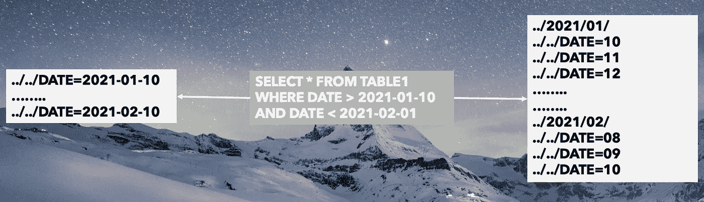

## 6.读写隔离

Iceberg 维护着随着时间推移而改变的文件快照。这将支持并行但独立地进行读取和写入。

除非提交新的写入，否则该快照将不可读取。

这将确保您的数据和模式不会破坏或读取部分数据。

## 7.隐式分区

定义分区不应该是强制性的。因为 m 需求会随着时间而变化。在运行时了解分区将会成倍地提高查询性能。

冰山就是这么做的。将隐式地获取和读取分区列。

## 8.时间旅行

正如我们已经讨论过的，Iceberg 支持版本控制。这使得时间旅行成为可能，如果你被要求按照你的要求回到以前的版本。

# 元数据架构

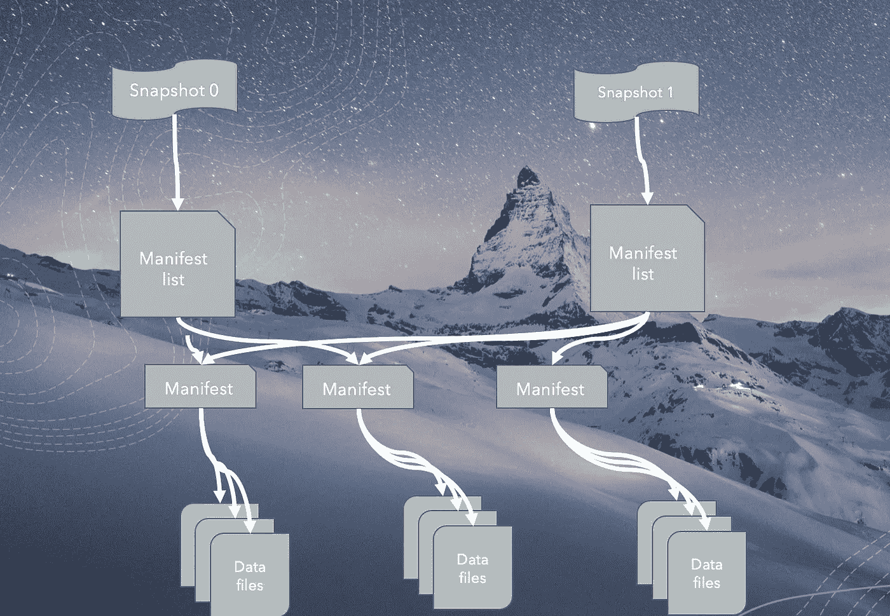

Iceberg 将 medata 与数据文件并行存储。

**快照元数据文件:**它存储表规范，如表模式、分区列和清单列表的路径。

**清单列表:**一个清单可以有多个清单。每个清单文件指向该文件的特定版本。这包含数据文件计数、分区列、数据的最小最大值等。

数据文件:基本上是你的数据在你给定的文件格式，如 parquet，orc 或 Avro。

# 演示时间

让我们创建一个虚拟表，写为 iceberg 并列出文件夹路径。

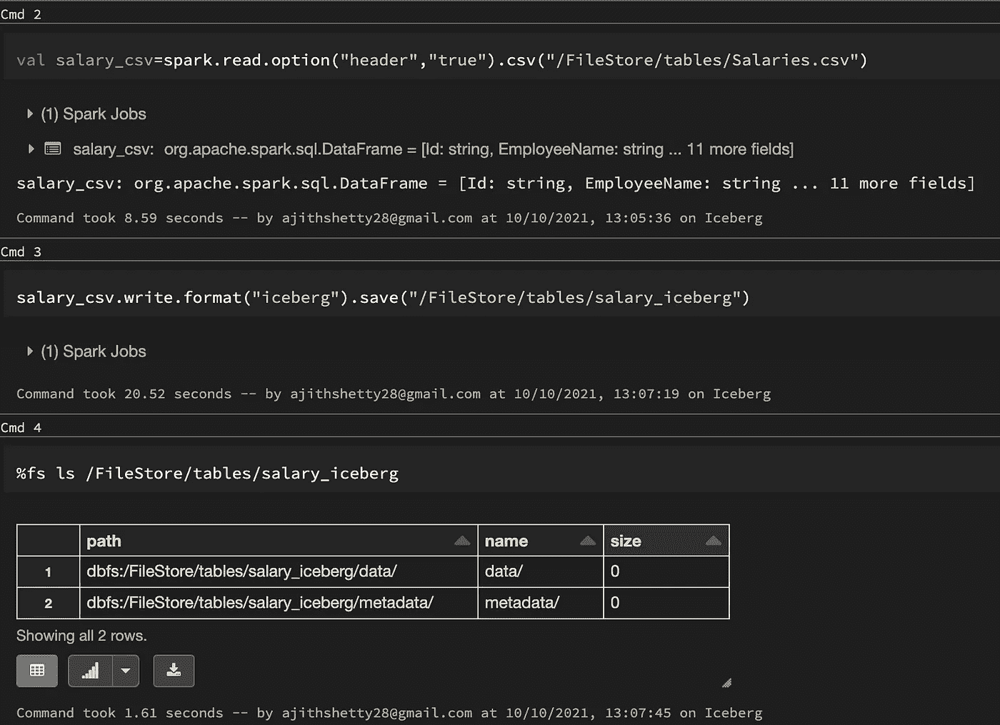

我们看到主表路径下有两个文件夹。

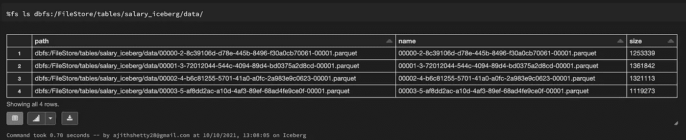

数据文件夹包含了拼花地板中的实际文件。

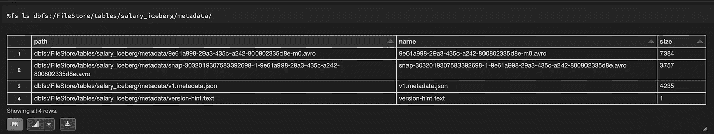

元数据文件夹包含清单。

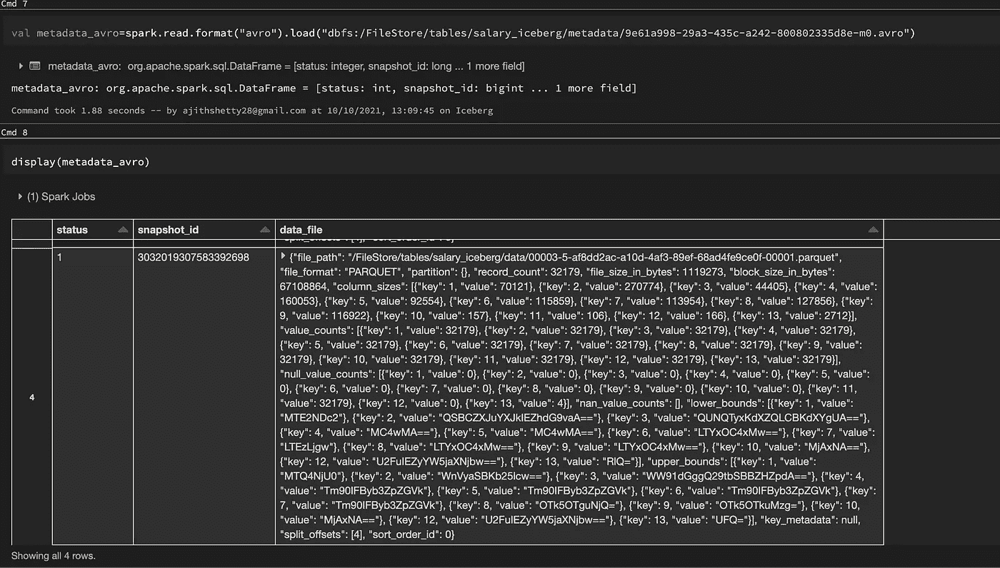

Avro 文件包含 4 条记录。每个记录代表数据目录中的一个文件。

它包含路径、文件格式、记录数、块大小、分区列和更多信息。

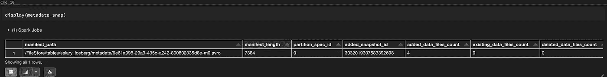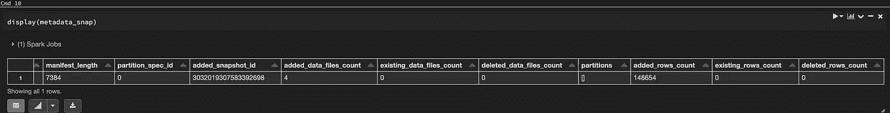

元数据快照文件包含路径、清单和版本详细信息。

因为只有一次写入，所以我们有一个快照记录。

最后，metdata 包含每一列的 metdata 以及文件的路径和版本细节。

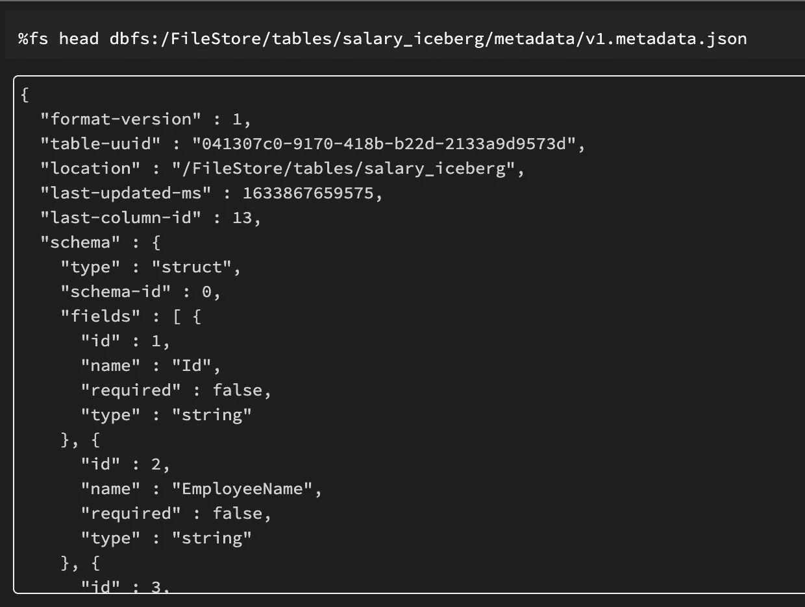

当我们再次将相同的数据写入相同的 iceberg 路径时，我们可以看到它创建了一个新版本的文件，其中创建了一个新版本的 json 文件。

它还为新写入的文件添加了一个新的 avro 文件。

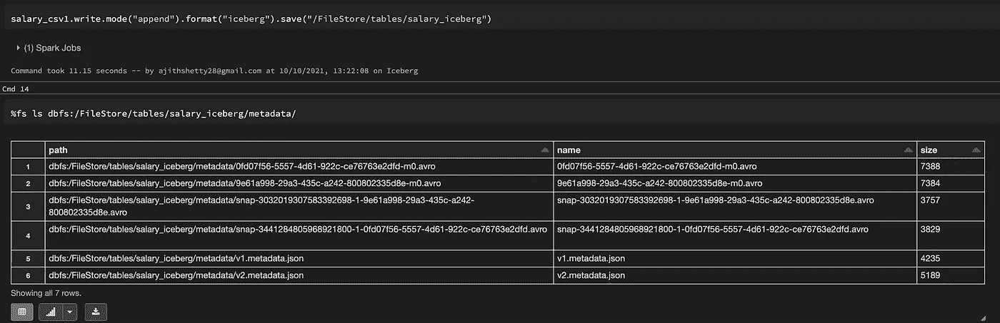

# 使用冰山时的一些提示

快照数量不断增加:随着时间的推移，您会不断添加文件的新快照，这些快照会不断增长，甚至元数据文件也会如此。

建议保留几个版本，并根据您的使用情况使用过期快照。

孤立数据元数据文件:这些是未提交的文件，可能在写入时失败。

您可以使用 API RemoveOrphanFilesAction 来删除它们。

# 参考

 [## 关于-阿帕奇冰山

### Apache Iceberg 是一种用于大型分析数据集的开放式表格格式。Iceberg 为计算引擎添加了表格，包括…

iceberg.apache.org](https://iceberg.apache.org/)  [## GitHub-Apache/Iceberg:Apache Iceberg

### Apache Iceberg 是一种新的表格格式，用于存储大型、移动缓慢的表格数据。它旨在改进…

github.com](https://github.com/apache/iceberg) 

您可以在我的 github 链接中找到示例代码

 [## GitHub - ajithshetty/IcebergDemo

### 通过在 GitHub 上创建一个帐户来为 ajithshetty/IcebergDemo 开发做贡献。

github.com](https://github.com/ajithshetty/IcebergDemo) 

**阿吉特·库玛尔·谢蒂**

大数据工程师—大数据、分析、云和基础设施。

[订阅](https://ajithshetty28.medium.com/subscribe) ✉️ || [更多博客](https://ajithshetty28.medium.com/)📝|| [挂靠在](https://www.linkedin.com/in/ajshetty28)📊|| [个人资料页面](https://ajithshetty.github.io/)📚|| [Git 回购](https://github.com/ajithshetty/)👓

**对获取全球大数据分析的每周更新感兴趣，请订阅我的:** [**每周简讯**](https://justenoughdata.substack.com/)