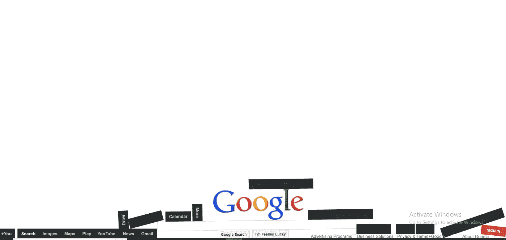
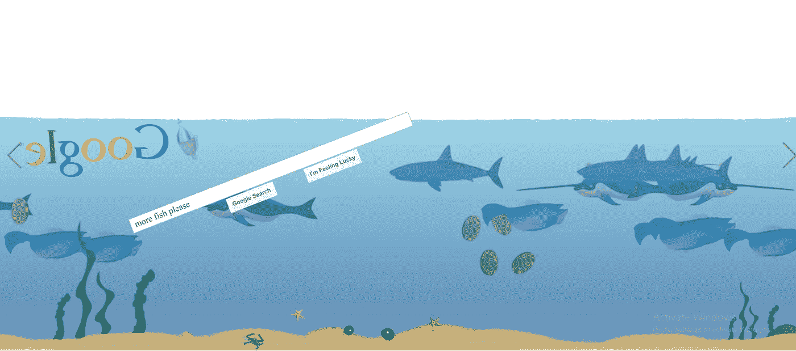
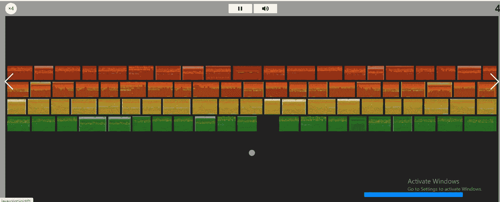
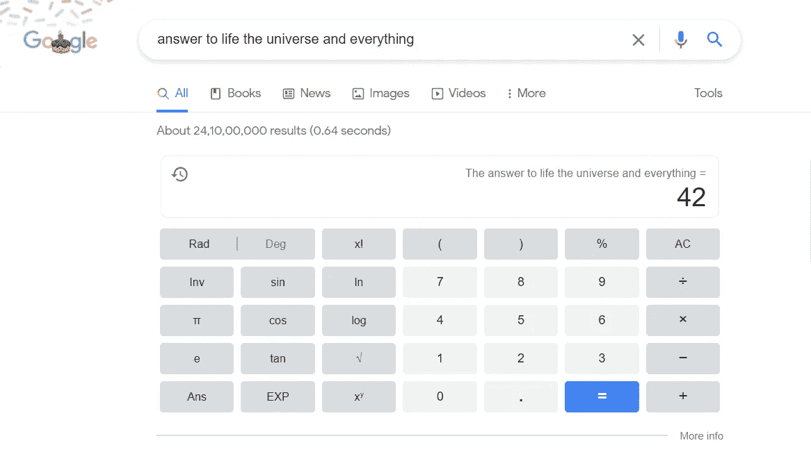
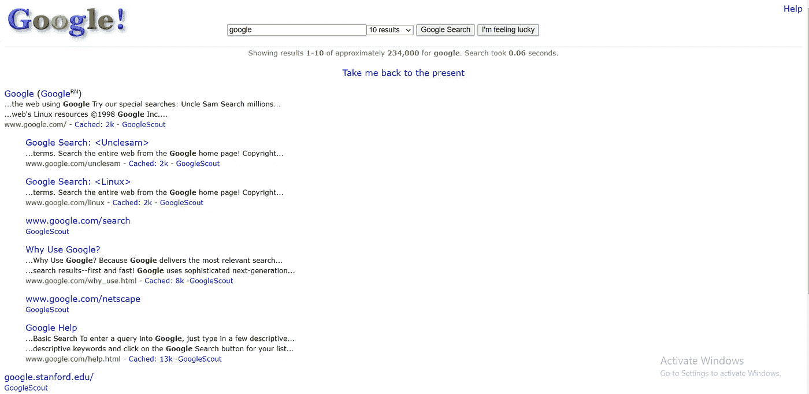
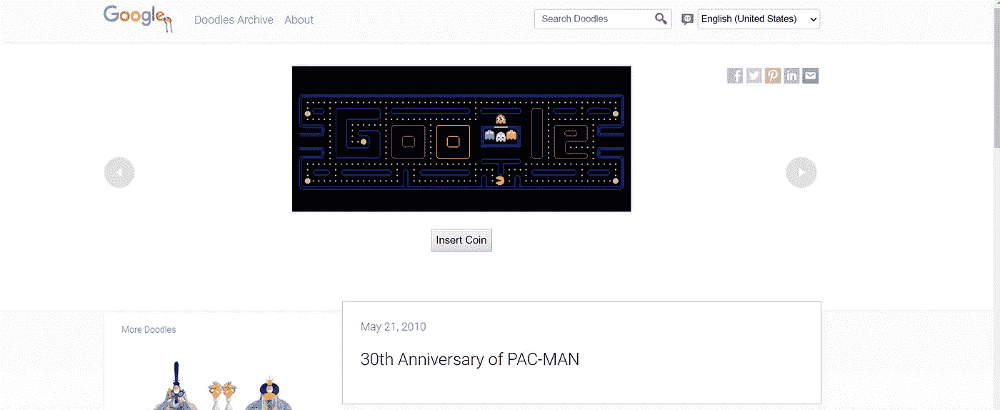
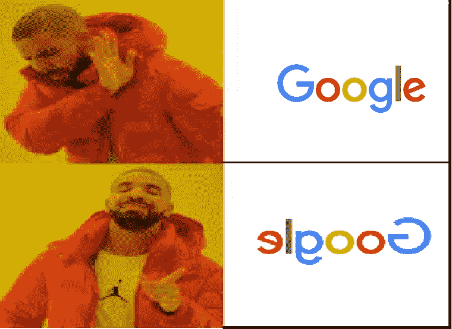

# 在 Google 的生日到来之际，让我们来看看一些非常有趣和独特的主页吧！！

> 原文：<https://medium.com/geekculture/as-today-is-googles-birthday-let-s-look-at-some-very-interesting-and-unique-home-pages-google-has-dc09a7e37fea?source=collection_archive---------37----------------------->

谷歌上有数百个这样的复活节彩蛋，我在这里提到了我的首选。让我们不要浪费太多时间，让我们开始吧！

***注* : *大奖金*** *结尾*

> **重要提示:前 4 名和奖励积分是必须尝试的！**

# 1)无视重力！

[反重力谷歌页面](http://www.mrdoob.com/projects/chromeexperiments/google-gravity/)

在这里你可以看到挑战重力的内容🤯它把搜索引擎分成几个部分，你可以在屏幕上拖动和反弹。
这样做真的很好玩！

如果你正在使用手机，你可以旋转你的手机(自动旋转设置为“关”)，让它们倒向一边。

# 2)水下乐趣！

[在水下玩得开心](https://elgoog.im/underwater/)

非常有趣的页面！点击回车或点击“谷歌搜索”来添加更多的鱼。
点击“我感到幸运”,将硬币和奖品丢入水中。
点击水，在海里制造骚动。

# 3)休息一下，砸几块砖！

[玩雅达利突围](https://elgoog.im/breakout/)

想休息一下吗？只需进入谷歌图片并输入“雅达利突破”
你就会被重定向到一个有砖块破碎游戏图片的页面，最终所有的图片都会变成一块单独的砖块，你可以在那里进行破坏。试试吧！

# 4) Zergs 吃光搜索结果！

[打楚格拉什](https://elgoog.im/zergrush/)

“虫族”是流行的《星际争霸》视频游戏系列中的一个昆虫类外星人种族。如果你在谷歌上搜索“zerg rush”，谷歌上的操作系统就像小狗一样，开始啃食搜索结果。你可以点击他们来降低他们的生命值并摧毁他们！

## 5)一切的答案都是 42！如果下次你不知道什么，用“42”！

键入“生命、宇宙和一切的答案”，谷歌有一个非常明确的答案:42。

这一搜索结果是对道格拉斯·亚当斯的《银河系漫游指南》的肯定，该指南声称这个数字实际上是生命的答案。

(同样，输入“最孤独的数字”将得到:1)

## 6)时光倒流！

[1998 年的谷歌](https://www.google.com/search?q=google+in+1998)

你会看到怀旧的谷歌主页。google 就是这么起家的！它已经走了很长一段路了，对吗？

## 7)是否倾斜？

你喜欢倾斜的浏览器吗？输入“歪斜”,整个屏幕会向右下方倾斜一点。

## 8)不只是倾斜，它还可以做桶滚！

键入“做一个桶滚”并点击搜索，你的浏览器窗口将桶滚。键入“z 或 r 两次”将得到相同的结果。试试吧，很好玩的！

## 9)吃豆人 30 周年！

[玩吃豆人](https://www.google.com/doodles/30th-anniversary-of-pac-man)

插入一枚硬币(点击按钮)，玩传说中的吃豆人游戏。

你坚持到了最后！所以是时候做一个奖金网站了！

**奖金时间** : [埃尔戈](https://elgoog.im/) →这里面几乎包含了所有的复活节彩蛋。最好的方法是让自己休息一下，并访问有趣的网页来获得乐趣！

它有“灭霸快照”，“让它下雪”，“蛇游戏”，“谷歌的吃豆人”等等。试一试就好，值得！

当你在这里的时候，你应该看看我其他一些受欢迎的博客:

[**我黑了 Chrome 恐龙游戏。我是这样做的**](https://javascript.plainenglish.io/an-immortal-dinosaur-and-the-fastest-too-hack-the-dino-game-7c5716c53e8b)

[**脚本下载 Google Drive**](https://mohithgupta.medium.com/how-i-coded-a-script-to-download-the-download-restricted-files-of-google-drive-718e74c55a68?source=your_stories_page-------------------------------------) 的“下载受限”文件

[**只需点击一下**](https://python.plainenglish.io/play-youtube-videos-in-vlc-with-just-1-click-2baca84c03f3) 即可在 VLC 播放 YouTube 视频

[**皈依你的’。py '到 a '。exe '文件，只需两个命令**](https://python.plainenglish.io/convert-your-py-to-exe-with-just-2-commands-4c6cefe9af4c)

[**关于 JavaScript**](https://javascript.plainenglish.io/all-you-need-to-know-about-the-fetch-api-6929930572a8) 中的“获取 API”你需要知道的一切

[**C++代码绘制一张印度地图**](/geekculture/c-code-to-draw-an-india-map-and-maybe-other-countries-too-9b0236f76d40)

我希望你喜欢这篇文章，并发现它很有用。今天的帖子到此为止！下一集再见！安永！

请在评论中分享你的想法。如有任何疑问或其他问题，你可以在 mohithguptak@gmail.com 上联系我，或者在推特上找到我。