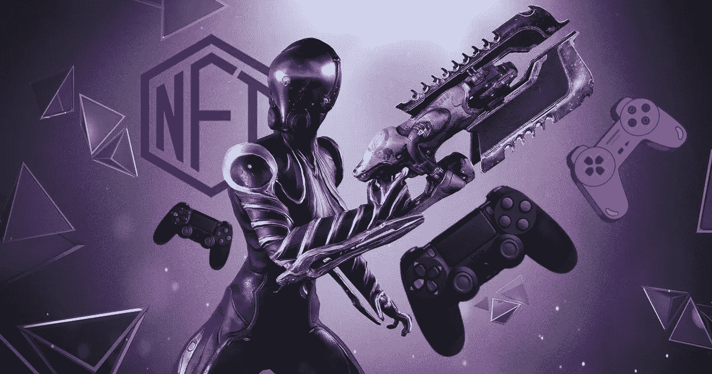
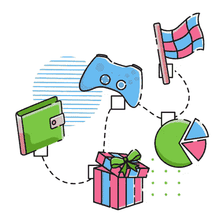

# P2E·NFT 游戏开发公司在 NFT 游戏市场的崛起

> 原文：<https://medium.com/geekculture/ascend-in-the-nft-gaming-market-with-p2e-nft-game-development-caee0b13af10?source=collection_archive---------20----------------------->

**P2E NFT Game Development**

博彩业从一开始就一直享受着丰厚的利润。该行业随着时间的推移而发展，并随着每一项新技术的进步而自我更新。随着区块链技术的出现，P2E·NFT 博彩公司使博彩业焕发了青春。由于其有利可图的特性，这种独特的游戏模式在游戏领域获得了显著的优势。与传统游戏不同，玩家和开发者都可以通过[**【P2E】NFT**游戏开发](https://bit.ly/3EeZOak)获得金钱利益。这鼓励了许多领先的游戏开发公司如 Epic games 和 Sega 进入区块链游戏领域。你是一个游戏发烧友，希望参与这个回报丰厚的 NFT 游戏市场吗？如果是的话，我们就开门见山吧。

## **P2E NFT 运动会**

P2E NFT 游戏是建立在区块链技术上的，用户可以在市场上以 NFT 的形式创造游戏资产。所有游戏资产，如武器、皮肤、轨道、汽车、装备等。，可以作为非功能性食物在市场上出售。这为玩家提供了一个独特的机会来将他们投入游戏的时间和精力货币化。

**P2E NFT Games**

## **P2E NFT 游戏的主要特点**

✪ **安全性:** NFT 游戏提供强大的安全性，保护您的数据免受任何安全漏洞的侵害，并提供安全的代币交易。

✪ **透明性:**NFT 游戏平台中的所有过程都是完全透明的，游戏中的购买都是在高度安全的情况下进行的。

✪ **稀有度:** NFT 市场提高了与平台相关的代币的稀有度。本机令牌可以提高可用性和实用性。

✪ **跨链合规:**通过跨链合规，游戏可以在不同的区块链上进行，资产可以从一个区块链移动到另一个。

✪ **有效性和可验证数据:**用户和开发者都可以访问和验证 P2E 游戏平台上的交易。

✪ **存储:** P2E 游戏平台以最小的延迟提供最大的存储。

## **开发区块链上的 P2E NFT 游戏**

👉**需求和构思:**任何游戏项目的第一步都是构思和决定游戏需求。决定需求，如利基，故事情节，游戏资产等。

👉设计:一旦你构思好了游戏，你需要设计游戏的原型。设计你的游戏角色，元素，环境等。

👉**发展:**下一个阶段就是发展过程。一旦你决定了你想在区块链网络上开发你的游戏，就开始前端和后端的开发。致力于您平台的智能合约、兑换功能、游戏内货币和支付集成开发。

👉**测试:**在您的平台上运行一系列多重测试，由 QA 专家在您的平台上检查 bug 和错误。

👉**发布:**一旦你解决了所有的 bug 和错误，你就可以公开发布你的 P2E·NFT 游戏了。

## **NFT 游戏的好处**

★游戏玩家可以对自己的游戏资产拥有完全的所有权。

★用户有各种变现机会，高端安全，创造游戏内资产。

★NFT 游戏平台的透明性确保了可用性的提高。

★NFT 游戏平台提供了更大的可扩展性。用户可以赚取和投资密码。

★由于其分散性，游戏资产可用于在同一区块链网络上运行的不同游戏生态系统。

★从商业的角度来说，代币的价值越来越高，最终会提高你游戏的价值。

★在你的 NFT 游戏平台上部署付费会员，你也可以有一笔被动收入。

★可以出售独特的 NFT，通过向用户介绍入场费来赚取。

## **P2E NFT 运动会的类型**

🎮动作游戏

🎮冒险游戏

🎮街机游戏

🎮棋盘和赌场游戏

🎮赛车和体育游戏

🎮PvP 对战游戏等等

## **P2E NFT 游戏开发**

你可以用两种方式开发你自己的 P2E NFT 游戏，一种，你可以从头开始构建你的游戏，或者从专业的 P2E NFT 游戏开发公司获得一个 [**白标解决方案**](https://bit.ly/3fKqqGT) 。一些流行的 NFT P2E 白标游戏是沙盒类游戏，Axie infinity 类游戏，外星世界游戏等。从头开始构建一个 NFT 游戏可能会很耗时，而且会花很多钱。因此，许多创业公司更喜欢白标解决方案。

## **包装**

最近，两家主要的游戏公司，育碧和 Take-two Interactive 带着他们的新游戏“Skyweaver”进入了 NFT 的游戏领域 Epic games 等其他领先的游戏公司已经对总部位于区块链的 NFT 游戏公司感兴趣。这清楚地显示了 NFT 博彩业近年来的成功和膨胀。如果你对这种回报丰厚的游戏模式感兴趣，你也可以 [**聘请专业的 P2E NFT 游戏开发公司开发自己的 P2E NFT 游戏**](https://bit.ly/3EeZOak) 。