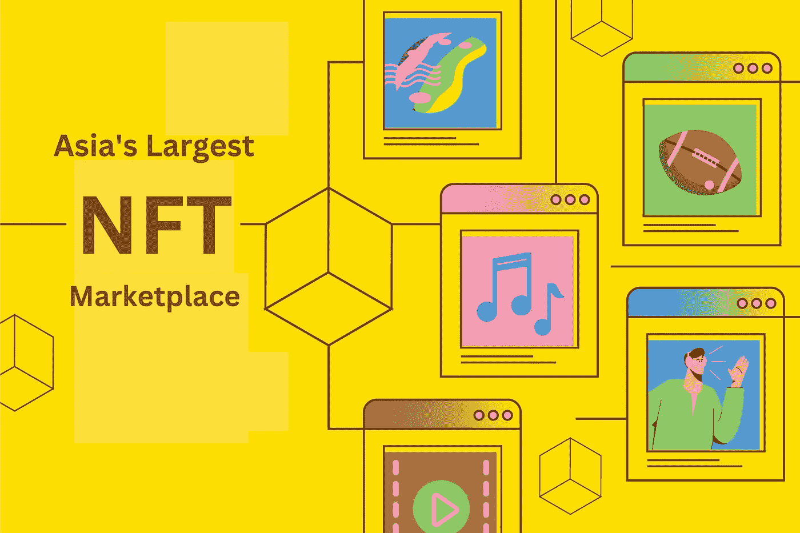

# 亚洲最大且增长最快的 NFT 市场

> 原文：<https://medium.com/geekculture/asias-largest-and-fastest-growing-nft-marketplace-8a99fce72375?source=collection_archive---------15----------------------->

从全球来看，NFT 为投资设定了一个巨大的标准。这种趋势也蔓延到了印度市场，我们可以看到印度人对交易非功能性交易表现出兴趣。随着加密货币的成功，现在是 NFT 品尝市场成功的时候了。很长一段时间，印度人对投资加密货币或数字资产感到担忧。但现在，他们不再怀疑它们，因为他们已经开始投资 NFT 和加密货币。正因为如此，印度现在已经成为 NFT 创业公司最喜欢的地方。

2021 年对 NFTs 和区块链科技来说是特别的一年，因为越来越多的人冒险进入 NFT 交易。印度市场见证了新的 NFT 企业迅速启动。这清楚地表明了市场对不可替代的交易代币是多么有利。

# NFT 是如何吸引人们进入他们的空间的？

非功能性测试引发的趋势已经在全球范围内广泛传播。通过拥有 NFT，个人不仅可以获得所有权，还可以利用它进行投资和交易。非金融交易带来的财富是巨大的，这也是人们蜂拥到 NFT 投资的原因。不可替换的代币本质上是不可分割的，并且可以在全球任何数量的人之间进行交易。

当一个人买了一件 NFT，他们意识到的第一件事是，他们拥有的东西是稀有和独特的。NFTs 提供的这种产品是导致他们购买 NFTs 的因素。他们还可以立即向公众出售或拍卖这些 NFT。考虑到 NFTs 带来的所有这些好处，人们开始投资交易数字收藏品。这些 NFT 是在区块链技术的支持下建立和运行的，该技术将所有数据和交易记录在数字分类账中。当一些东西被记录在区块链中时，它仍然是安全的，不会落入黑客和其他第三方之手。

任何满足独特和稀有意识形态的物品和产品都可以被标记为 NFT。这些也可以是现实世界中存在的实物资产。但唯一要考虑的是那些产品或物品的稀有性。NFT 已经扩展到不同的领域，在这些领域中，它们可以被标记为 NFT。市场上发现的一些不同形式的非功能性测试如下:

*   艺术作品
*   录像
*   音乐文件
*   gif
*   运动配件
*   游戏收藏品
*   虚拟土地

所有这些数字收藏品都可以在市场上作为 NFT 进行交易。有指定的 NFT 平台处理一系列独家非功能性交易的买卖。NFT 收藏品被记录在防篡改的数字分类账的不同块中。因此，NFTs 的数据和交易保持安全。

## **关于 NFTs 的一些有趣数字**

*   采用非功能性食物疗法最多的前五个国家来自亚洲
*   NFT 市场的净值超过 400 亿美元。
*   NFT 的销售额从 2020 年的增长已经上升到 2021 年的 131 倍。
*   2021 年，近 2860 万个 NFT 钱包被交易。
*   2021 年，Nyan cat GIF 以价值 59 万美元的加密货币售出。
*   Twitter 上的第一条推文以 NFT 的名字卖出了 290 万美元。
*   著名数字艺术家毕普卖出了他的 NFT 作品《每一天:前 5000 天》以 6930 万美元的价格售出。

## **为什么 NFT 平台的数量会突然增加？**

NFT 市场利润丰厚，预计在未来几年将会迅猛增长。这为企业家在 NFT 市场创业提供了广阔的空间。在其存在的几年内，市场在全球范围内不断发展。印度市场极具竞争力，有利于 NFT 企业的蓬勃发展。这就是为什么企业家们会想出令人兴奋的新点子来开始他们在 NFT 的生意。

NFT 市场是一个平台，用户可以创建，铸造，标记，购买和出售他们的非功能性交易。NFT 平台是创业者创收的最佳方式。对于平台内发生的每一笔交易和活动，用户都必须为此付费。这样，NFT 市场的所有者将获得更可观的收入。

# **jump . trade——亚洲最大的购买板球 NFTs 的 NFT 市场**

如果你是一个伟大的 NFT 迷，你一定听说过 Jump.trade。这是一个著名的 NFT 平台，因为是世界首届 P2E 板球 NFTs 的市场而闻名。这个受欢迎的市场是几个月前推出的。marketplace 在市场上取得了巨大的成功。此外，它们是第一个用先进技术开发的 NFT 市场。

在不到 9 分钟的时间内，他们所有的 NFT(超过 55，000 件)都被售出。你可以使用 NFT 玩 [**元板球联赛**](https://www.jump.trade/mcl-game) ，但是你也可以在 Jump.trade 市场上向其他玩家出售你的玩家和球棒 NFT。

## **市面上常见的 NFT 市场**

NFT 世界充斥着几个 NFT 市场，帮助用户毫不费力地交易他们的 NFT。NFT 市场将建立一个论坛，以促进购买和销售非功能性交易。NFT 平台由区块链技术支持，该技术保护 NFTs 的数据和交易。除了 Jump.trade，市场上还有其他各种各样的 NFT 平台。一些受欢迎的市场有 OpenSea、Rarible、Foundation、NBA Top Shots 等。

亚洲的 NFT 市场正在高速增长，这些非功能性食品的销量也在与日俱增。当我们在这里，在这个国家的某个地方，忙于讨论非功能性交易时，现在有人会买 NFT，这就是 NFT 的销售和交易如何激增的。