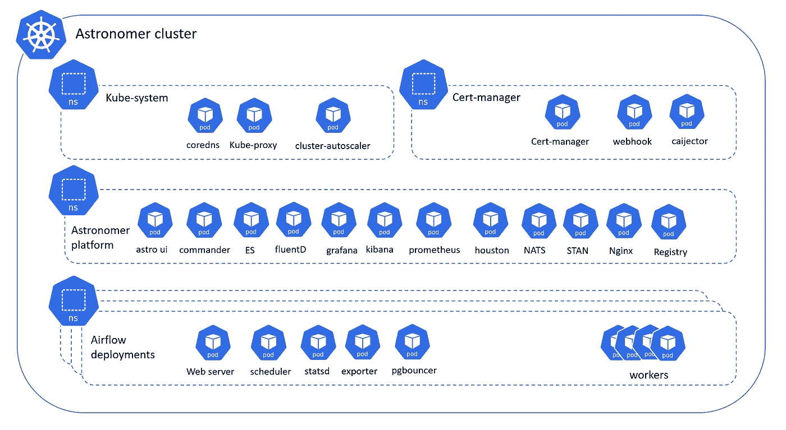
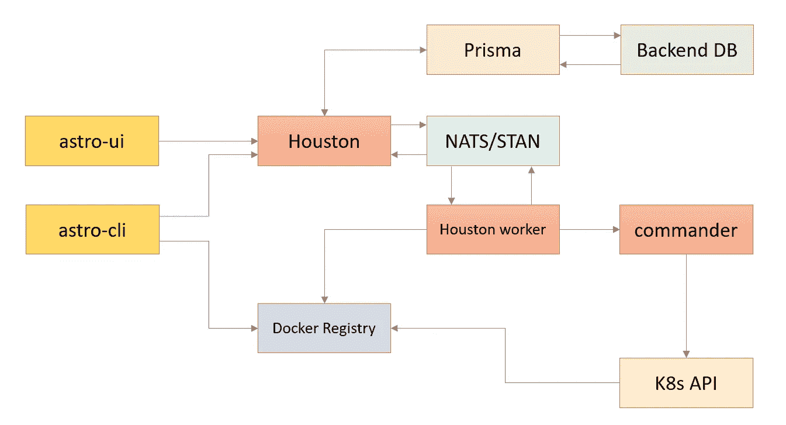
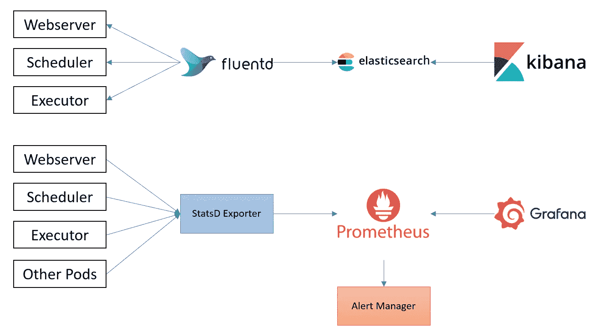
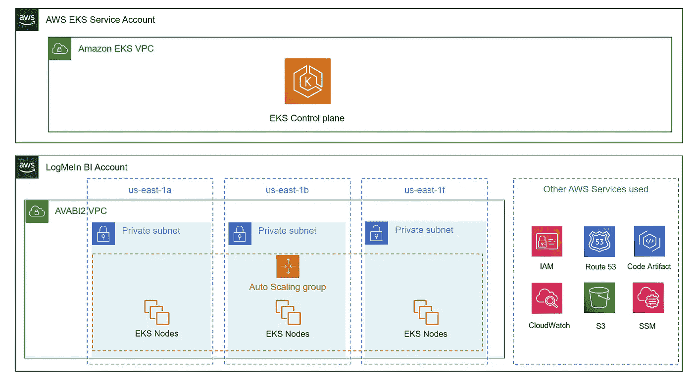
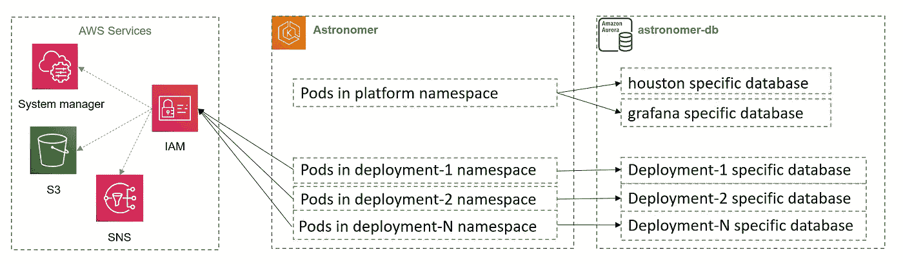
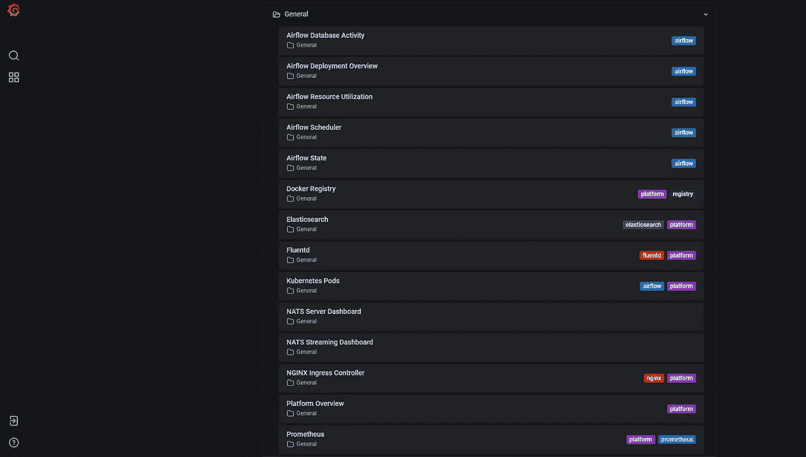

# 天文学家管理的气流

> 原文：<https://medium.com/geekculture/astronomer-managed-airflow-bf283bd4054a?source=collection_archive---------7----------------------->

Image source — Google

天文学家平台概述

天文学家提供气流管理服务。它允许单击一下即可提供气流实例。此外，它还为日志记录、监控和身份验证提供辅助服务。在生产中，它通常会部署在 Kubernetes 集群上。

Astronomer Platform K8s components

## 平台

天文学家平台主要由以下组件组成:

**Astro UI** — Web 界面(react)
**Astro CLI** —与平台交互的命令行界面
**Commander** —休斯顿&K8/赫尔姆(gRPC on 50051)
**休斯顿** —控制平面，为 graphql API 供电，也有 workers
**Prisma**—ORM for back end database(Postgres)
**nginjx**

Communication between platform major components

## 记录

天文学家提供开箱即用的测井工具，包括以下组件:

**FluentD** —日志收集守护进程(to ES)
**elastic Search**—客户端、导出器、数据、主机，它使用 EBS 卷进行存储
**Kibana** —搜索仪表板以查找 ES

## 监视

天文学家平台配有以下监控组件:

**Grafana** —指标仪表板
**Prometheus** —带有时间序列的中央指标
**StatsD** —将气流&系统指标推送到 Prometheus
**警报管理器** —发送健康通知

Logging & Monitoring In Astronomer

## 气流部件

在与 Kubernetes executor 一起运行时，天文学家中的每个部署主要有以下组件。

**webserver** —为 airflow UI
**调度器** —运行 airflow 调度器和执行器电池
**statsd** —将日志从 airflow & K8s 推送到 Prometheus
**pg bouncer**—充当 airflow 后端数据库
**执行器** — Pod 的 Db 连接池，用于每个 airflow 任务。自动缩放&归零

## 授权和认证:

天文学家平台有三类角色。此外，该访问角色适用于系统、工作区和部署级别。

> 管理员—完全访问
> 编辑器—操作角色(一些 CRUD，但不是 IAM)
> 查看器—只读无 CRUD

Astronomer infra components used

在上图中，我们有外围 AWS 服务，它们有助于建立强大的生产设置。

**S3** —日志存储& Docker 注册表后端
**代码神器** — Python 私有 repo for airflow 插件&包
**SSM** — Airflow 变量&机密存储
**CloudWatch** —日志 for K8s
**route 53**—DNS for the platform
**IAM**—控制 K8s 集群对其他资源的访问

## 工作空间

它是部署的逻辑集合。它也可以是业务或组织级别的分组。

## 部署

这是气流环境的单一实例。每个部署都可以有单独的设置，并且可以容纳独立的 Dag。

Workspace-deployment-namespace-database mapping

每个部署都有额外容量(执行器)、调度程序和 web 服务器容量的资源配额。

## 用户

在天文学家中，您创建/附加用户。为此，您可以邀请他们或从 IdP 导入用户。对于不同的天文学家构造，如工作空间、部署或平台，每个用户可以被授予不同的权限。部署角色被映射到 RBAC 航空公司。

天文学家部署角色到气流角色映射

> 管理员→管理员、编辑者→用户、查看者→查看者

## 服务帐户

对于 CICD 或自动化，您可以使用具有给定角色的服务帐户。它可以在工作区级别或部署级别。工作空间管理或部署管理服务帐户将能够通过天文学家 CLI 或 Graphql APIs 采取管理措施。

## 韵律学

天文学家提供平台和部署级别的指标。一些在 UI 中可用，而另一些在 Grafana 中可用。

在天文学家用户界面显示使用配额。

在 Grafana 中，我们有关于平台和部署的每个组件的指标。

Grafana metrics

在这篇博客中，我试图给出一个平台的概述。希望这是有帮助的！！

*免责声明:天文学家的内部工作没有公开记录。这是我对平台版本 v0.25 的理解.*