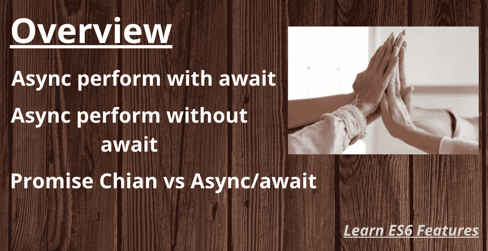
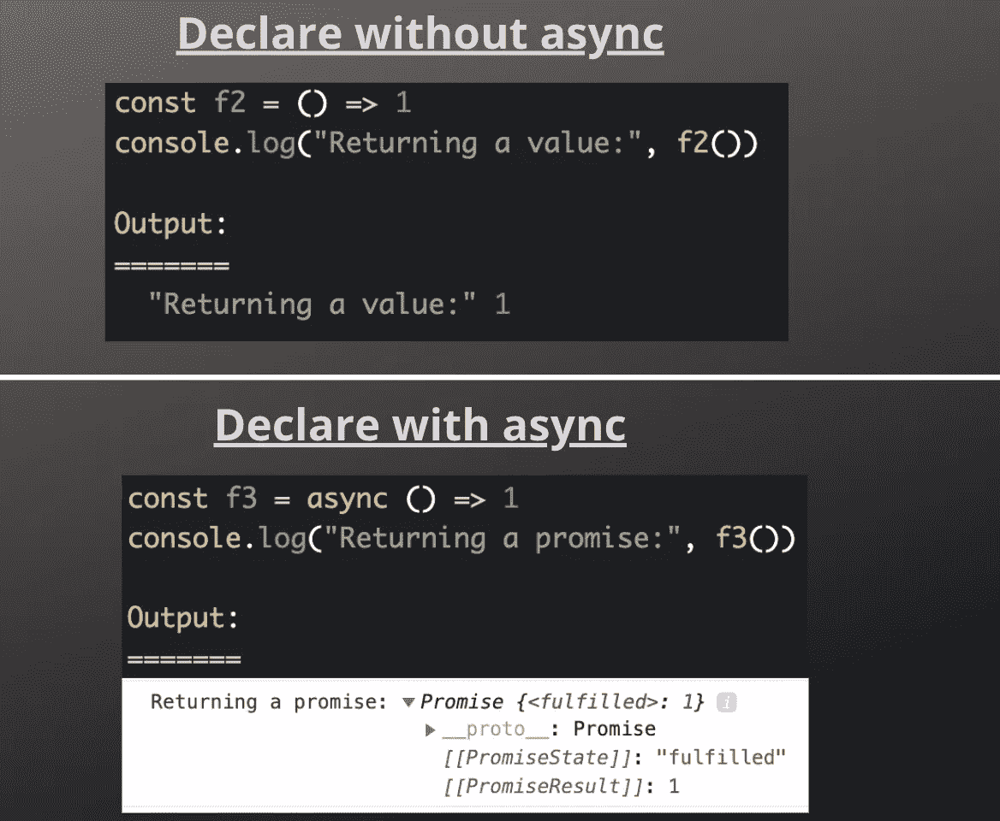
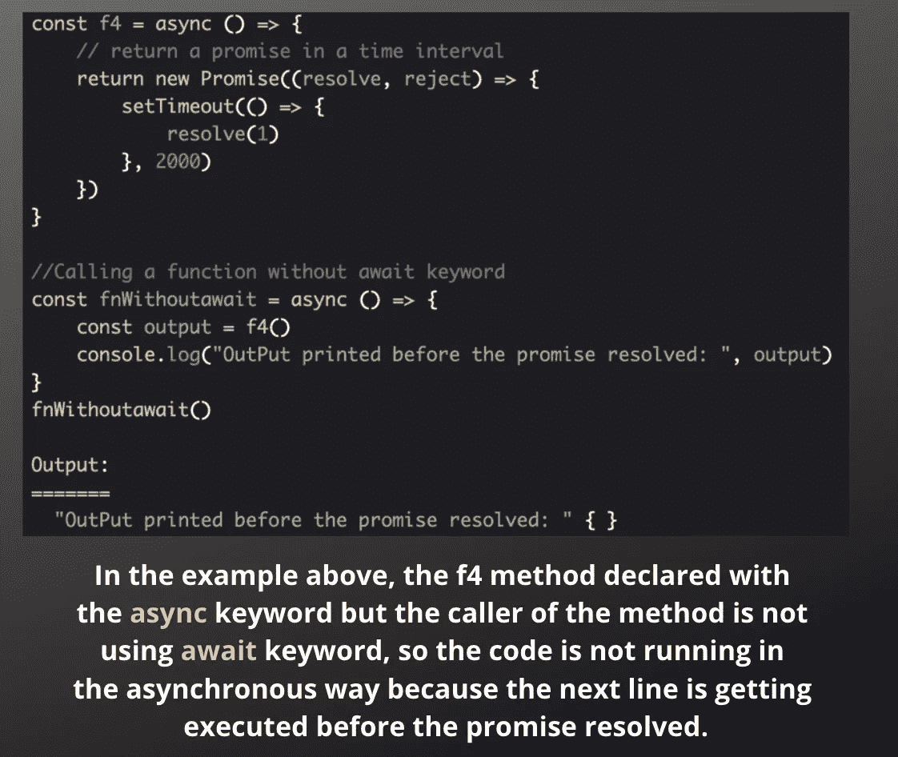
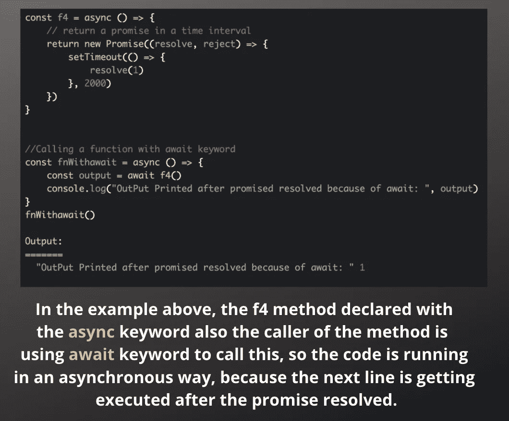
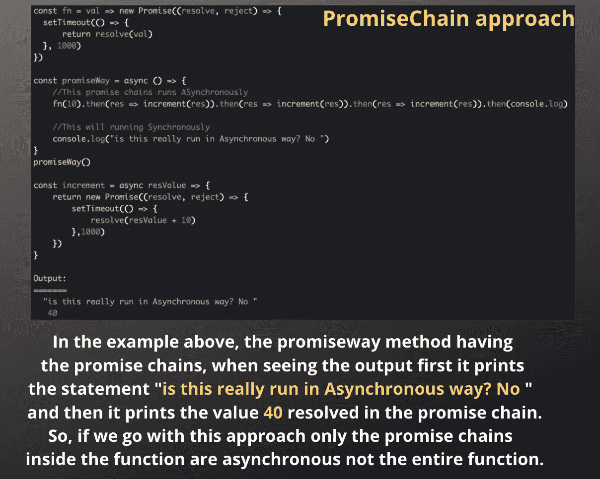
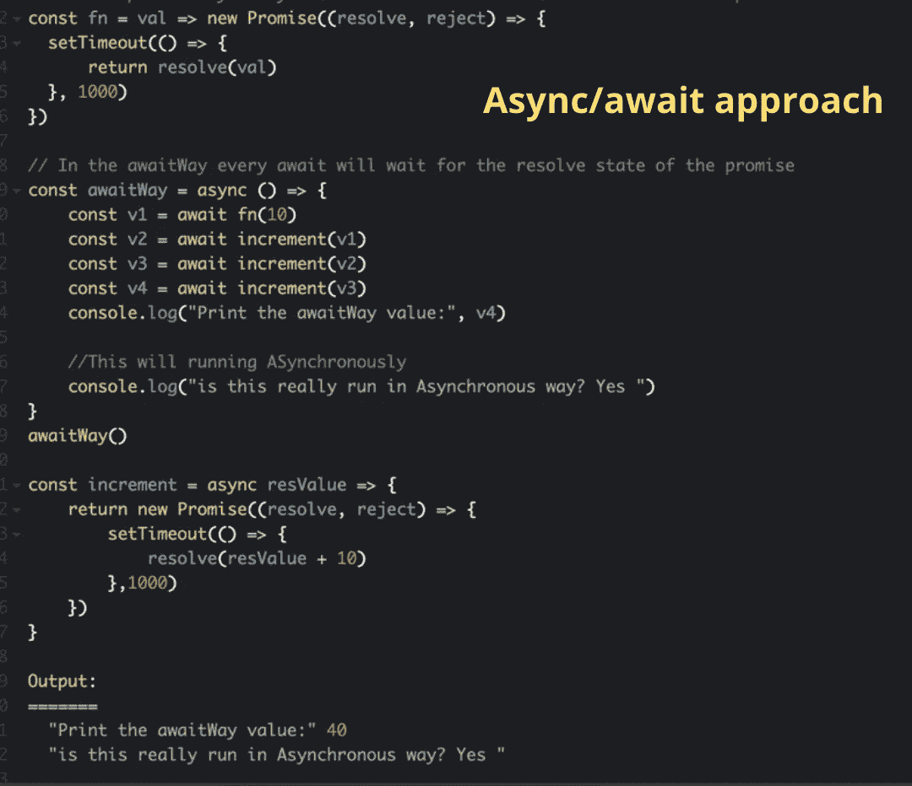

# 异步/等待

> 原文：<https://medium.com/geekculture/async-await-eee7948fe954?source=collection_archive---------26----------------------->

**Table of Contents**

在 promises 中，对象创建启动异步功能的执行。这里的 **await** 只阻塞了**异步**函数中的代码执行。 [**码笔**](https://codepen.io/071eE211/pen/GRrbpyQ)

**async** 关键字，您将它放在函数声明的前面，以将其转换为返回 Promise 对象的 **async** 函数。 **await** 关键字只在异步函数内部被接受。

在下面的示例中，f2 方法没有用 async 关键字声明，该关键字返回值。f3 方法在用 async 关键字声明时返回一个 promise。

**await** 关键字导致异步函数执行暂停，直到承诺完成(完成或拒绝)。

## 使用和不使用 await 关键字异步函数如何执行？

**情况 1:执行时没有 await 关键字** [**码笔**](https://codepen.io/071eE211/pen/GRrbpyQ)

**Perform without await keyword**

**情况 2:用 await 关键字** [**代码笔**](https://codepen.io/071eE211/pen/GRrbpyQ) 执行

**Perform with the await keyword**

希望这有助于理解 async/await 函数。

## ***使用*** ***承诺链 vs 异步/等待*** [**码笔**](https://codepen.io/071eE211/pen/GRrbpyQ)

我们知道回调如何变成承诺，然后是承诺链，现在是异步/等待。如果一个函数使用了承诺链，那么只有承诺链是异步的，而不是整个函数。但是在 async/await 中，整个函数是异步的。

**Promise chain approach**

## 相同的代码如何与 Async/await 方法一起工作？

**Async/await approach**

在 ***awaitWay*** 方法中，我们用 ***await*** 关键字将所有的承诺链修改为单独的函数调用。这意味着整个函数将一直等待，直到带有 ***await*** 关键字的函数被解析。

当看到这里的输出时，首先打印出值 **40** ，然后打印出语句**“这真的是以异步方式运行的吗？是的"**。在承诺链中，反之亦然

希望它能让你对 Async/await 有一个基本的了解，如果你有任何疑问或修正，请写下你的问题。

我们从 ES 特征中了解到的信息足以启动反应堆。让我们开始下一个关于 React 基础知识的话题。

下一个话题 **:** [**从头学起**](https://svignesh90-vs.medium.com/learn-react-from-scratch-18fc9e89e8d2)