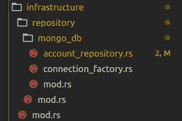
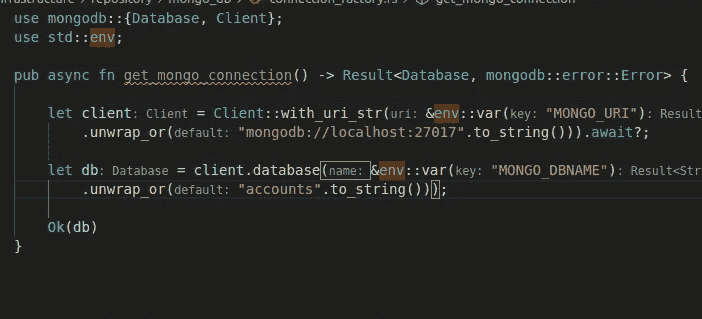
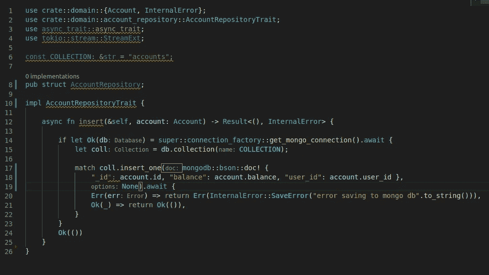
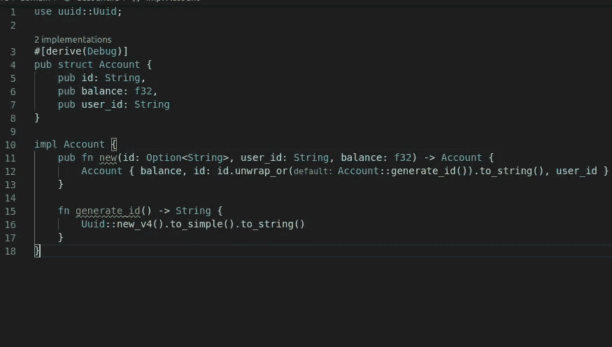
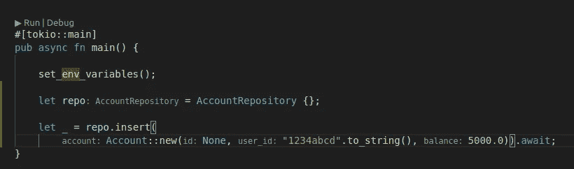

# 使用 Tokio 和 MongoDB 的异步 Rust

> 原文：<https://medium.com/geekculture/async-rust-with-tokio-and-mongodb-ae75594c65b8?source=collection_archive---------0----------------------->


Photo credit: [Chandler Cruttenden](https://unsplash.com/@chanphoto)

在过去的两个月里，我利用一些在线课程和 YouTube 视频在 Rust 上投入了一些时间。我的第一印象:我真的很喜欢它！

在本文中，我打算以一种客观的方式展示如何将一些有用的包(或者 Rust 方言中的板条箱)包含到您的 Rust 项目中。

我假设你已经安装了 Rust。

要创建一个新项目，选择一个文件夹并在终端上执行以下命令:`cargo new example --bin`。

在 Cargo.toml 文件中，添加如下依赖项:

```
[dependencies]
tokio = { version = "0.3", features = ["full"] }
mongodb = { version = "1.1.1", default-features = false, features = ["async-std-runtime"] }
```

通过添加 async-std-runtime 特性和 default-features=false，可以为 mongo 包使用异步特性。否则你会得到这个非常讨厌的错误(它发生在我的表弟身上，他发现有点难以察觉):

```
thread 'tests::repositories::account::should_insert_account' panicked at 'there is no timer running, must be called from the context of Tokio runtime'
```

设置完依赖关系后，您必须替换您的 main 函数，在自动生成的 main.rs 文件中，为下面的代码启用 *Tokio* 特性，并使您的 main 函数异步。

```
#[tokio::main]pub async fn main() {}
```

我创建了一个连接工厂来获取 MongoDB 连接和一个存储库文件来放置数据访问代码。



Structure of my infrastructure layer

在我的项目中，我还包括了抽象它们的特征，但这不是本文的目标。

获取数据库连接的代码如下。您必须包括 mongodb 机箱中的数据库和客户端依赖项。



MongoDB connection factory code

在这段代码中，我试图读取 env 变量来获取 MongoDB URI 和 DB 名称，但是如果不包含这些变量，它将通过使用 *unwrap_or()* 函数来获取默认值。注意，这也是一个异步函数。

如前所述，存储库包含与数据库通信的逻辑。注意，这也是一个异步函数，它在调用返回 *Futures* 的函数时使用 await，Futures 是异步函数产生的值(类似于 JavaScript 承诺)。



The Repository struct implementation

这个用作参数的 Account 结构是我在程序的域层中创建的结构。内部错误是我通过实现 std::error::Error 特性创建的自定义错误。注意，文件顶部的导入将这些模块带到这里使用。



Account struct

在集合上插入文档后，我检查是否有任何错误，并在结果中返回一个自定义错误。否则我将返回一个空对象。函数 *insert_one* 在结果中返回插入的 id。如果它是有用的，你可以归还它。

最后，您可以从 main.rs 文件或测试文件中调用存储库插入函数。由于该函数接收一个*自身*参数，它是一个方法，因此您必须创建它的一个“实例”才能调用它。



Example of call to the repository insert function

这里是到 GitHub 库的[链接和完整的代码。请不要关注乱七八糟的，正在建设中而且只是一个 POC =)。](https://github.com/paoloposso/rust-mongo-poc)

就这些了，伙计们。再见。