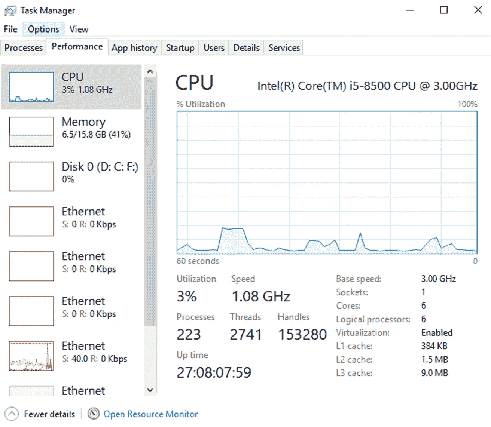
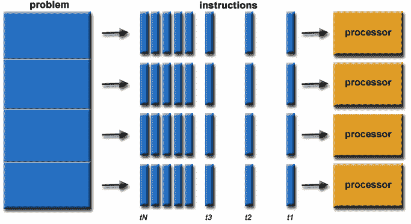
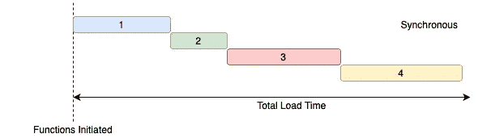
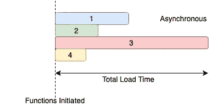
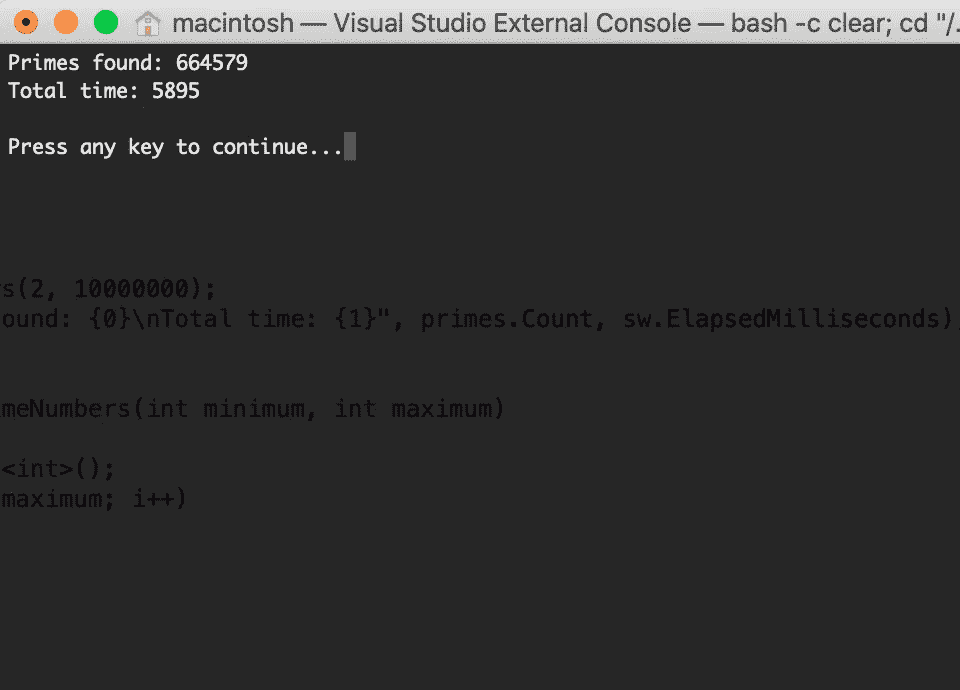
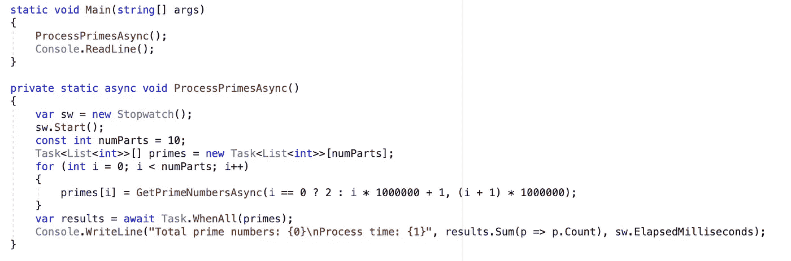
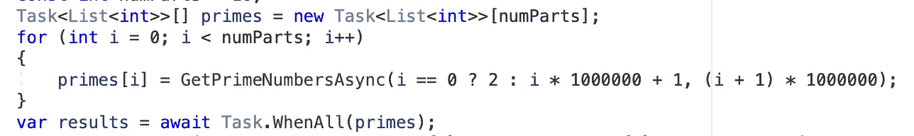
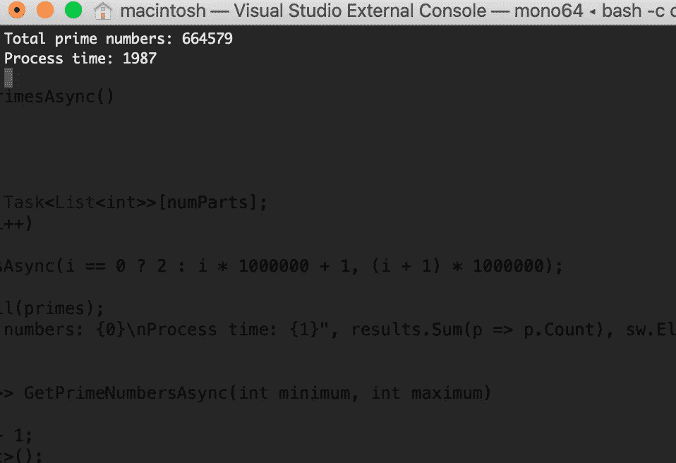

# C#中的异步和并行编程。网

> 原文：<https://medium.com/geekculture/asynchronous-and-parallel-programming-in-c-net-1e0f14e1db80?source=collection_archive---------0----------------------->

Photo by [Alexandre Debiève](https://unsplash.com/@alexkixa?utm_source=medium&utm_medium=referral) on [Unsplash](https://unsplash.com?utm_source=medium&utm_medium=referral)

# 语境

上周，在喝咖啡的时候，我和我的同事就**异步**和**并行编程**进行了长时间的讨论。虽然那是一个很老的话题，但是我相信他们之间还是有很多困惑的。这就是我决定写这篇文章的原因。

**异步**和**并行编程**都能让我们更快地完成任务。但是你们中有多少人仍然认为它们是一样的东西，只是术语不同而已？

让我们浏览这篇文章，找到上述问题以及其他问题的答案，比如“它们是什么？”以及“如何在真实的例子和. NET 应用程序中使用它们？”

# 并行编程

如今，多核处理器(2 核、4 核、8 核……)变得非常流行。甚至它们可以在大多数设备中找到。(您可以打开任务管理器来查看您的计算机有多少个内核)

figure 1: computer with 6 cores

然而，许多开发人员没有利用多核处理器的优势来开发更好的软件应用。他们跟 90 年代的开发人员做的一样:创建单线程应用程序。换句话说，它们没有利用所有额外的处理能力。假设您有许多功能需要交付，并且有许多开发人员准备实现这些功能。但是您只分配给一个开发人员来实现所有功能，而其他人都可以使用。太没效率了！

我将给你带来一个现实生活中的例子。

Photo by [Nathan Dumlao](https://unsplash.com/@nate_dumlao?utm_source=medium&utm_medium=referral) on [Unsplash](https://unsplash.com?utm_source=medium&utm_medium=referral)

让我们想象一下，你有一家餐馆。几年前，当你开始的时候，你只有很少的钱，没有足够的钱雇佣其他员工。你做过厨师，服务员，收银员(明显是经理:)。结果，你一次只能服务一个顾客。你尽最大努力在一天内服务更多的顾客，但你做不到。那时，你开始从服务员、厨师和收银员那里雇佣其他员工。现在，除了你之外，你的餐馆有 3 名员工，你的餐馆每天可以服务的顾客数量增加了大约三倍。

## 到底什么是并行编程？

image source: [https://computing.llnl.gov/tutorials/parallel_comp/](https://computing.llnl.gov/tutorials/parallel_comp/)

简单来说，就是使用多核处理器(甚至多台机器)来执行一项任务。这种类型的编程接受一项任务，将其分解成一系列更小的任务，发送指令，处理器同时执行解决方案。许多计算机和设备，如笔记本电脑、台式机、手机和平板电脑，在其硬件中使用这种编程来确保任务在后台快速完成。

## 不足之处

使用并行编程有一些缺点。第一，可能很难学。以并行架构为目标的编程一开始可能会让人不知所措，所以完全理解它确实需要时间。此外，代码调整并不简单，必须针对不同的目标体系结构进行修改，以适当提高性能。最后，功耗是另一个问题；为了冷却您的计算机，需要各种冷却技术。

# 异步编程

在说**异步**之前，先说一下**同步**。让我们跳回到上面的“餐馆”例子。

Photo by [Jay Wennington](https://unsplash.com/@jaywennington?utm_source=medium&utm_medium=referral) on [Unsplash](https://unsplash.com?utm_source=medium&utm_medium=referral)

最近，很多顾客抱怨你们餐厅的服务质量。作为一名餐厅经理，你做了一些调查，发现顾客光顾你的餐厅时，通常会点一份饮料(可乐或啤酒)、开胃菜(沙拉)、主菜(牛排)和甜点(提拉米苏)。但这里的问题是，他们必须等到他们点的东西都准备好了(甚至是饮料)才能开始吃。那就是**同步**。为了给顾客带来更好的体验，你要求你的员工一旦一道菜做好了，就应该马上端给顾客。显然，这让顾客更加满意。那就是**异步**。

回到编程！

使用**同步**，您的应用程序将按顺序运行所有任务。换句话说，您触发每个任务的执行，然后等到它完成后再触发下一个任务。

figure 2: Synchronous

因此，应用**同步**可能会停止用户界面(UI)线程。通常，这些应用程序只有一个 UI 线程，当您将它用作阻塞操作时，您的程序中会出现旋转的轮子(标题中还有“不响应”)——这不是您的用户的最佳体验。当您可以让其他任务在另一个处理器内核上运行并让您知道它何时完成时，坐在那里等待是没有意义的，因为它不使用多核处理器。

相比之下，当异步执行时，程序不会按顺序运行所有任务:它触发任务，然后等待它们结束。

figure 3: Asynchronous

**异步**消除了同步的缺点。它不会挂起 UI 线程(因为它可以作为后台任务运行)，它可以使用你机器中的所有内核，更好地利用机器资源。

## 不足之处

*   您必须同步任务。假设在图 3 中，您运行一个任务，该任务必须在其他四个任务完成后执行。您必须创建一种机制，在启动新任务之前等待所有任务完成。
*   您必须解决并发问题。如果你有一个共享的资源，比如一个列表在一个任务中写，在另一个任务中读，确保它保持在一个已知的状态。
*   程序逻辑完全被打乱了。再也没有逻辑顺序了。这些任务可以在任何时候结束，并且您无法控制哪个任务先完成。

# 异步和并行编程是一回事吗？

Photo by [Jørgen Håland](https://unsplash.com/@jhaland?utm_source=medium&utm_medium=referral) on [Unsplash](https://unsplash.com?utm_source=medium&utm_medium=referral)

[Visual Studio magazine](https://visualstudiomagazine.com/articles/2011/03/24/wccsp_asynchronous-programming.aspx) 将“异步编程”定义为“…一种并行编程的方式，其中一个工作单元独立于主应用程序线程运行，并通知调用线程其完成、失败或进度。”我认为这个定义有些局限性，因为**它可能在 20 世纪 90 年代是正确的。网游世界**。以 Javascript 为例，根据定义，Javascript 是单线程语言。然而，您仍然可以使用异步模式(例如回调、承诺或 async/await)。javascript 解释器处理这种情况的方式是在单个事件循环中执行代码。这里有这个[的详细解释。](https://www.sohamkamani.com/blog/2016/03/14/wrapping-your-head-around-async-programming/)

# 用 C#实现异步和并行编程。网

异步和并行编程在 C# .NET 中都不是新东西，**异步编程模型(APM)** 是。NET，从 1.0 版本开始就可以使用了。因为实现起来很复杂，微软在年引入了一个新的模型。NET 2.0:**基于事件的异步模式(EAP)** 。 **EAP** 把事情简化了，但这还不够。所以在。NET 4.0 中，微软实现了一个新的模型:任务并行库(TPL)。与以前的型号相比， **TPL** 是一个巨大的改进。它简化了并行处理，更好地利用了系统资源。有了 TPL，我们可以用 C#实现并行编程。NET 非常容易。

**异步**和**等待**关键字是微软在 C# 5.0 中引入的。当您使用“ **Async** ”关键字时，您可以像编写同步代码一样编写代码。编译器会处理所有的复杂性，让您自由地做您最擅长的事情:编写逻辑。编写异步方法有一些规则:

*   方法签名必须有 async 关键字。
*   方法名应该以 Async 结尾(这不是强制的，但这是最佳实践)。
*   该方法应该返回 Task、Task <t>或 void。</t>

要使用此方法，您应该等待结果(即使用 await 方法)。遵循这些准则，当编译器找到 await 方法时，它开始执行该方法，并将继续执行其他任务。当方法完成时，执行返回到它的调用者。

## 是时候练习了！

Photo by [Jordan Sanchez](https://unsplash.com/@jordaneil?utm_source=medium&utm_medium=referral) on [Unsplash](https://unsplash.com?utm_source=medium&utm_medium=referral)

现在，我有一个 C#示例，使用同步编程来查找从 2 到 10，000，00 的质数，如下所示:

> 注意:我是通过“googling”复制了寻找素数的逻辑，所以不要太关注算法。如果你有更好的算法来寻找质数，请通过回复发送。

这是结果

figure 4: find prime number synchronously

总素数: **664579**

处理时间: **5895 毫秒**

让我们试着用 **TPL** 来实现**并行编程**

正如你所看到的，使用并行程序，我把 2 到 10，000，000 的列表分成 10 部分并行运行

figure 5: running system with 10 parts

这是结果

figure 6: find prime number parallel

总素数: **664579**

处理时间: **1757 毫秒(好很多)**

我试图将“numParts”更新为 20，但似乎我的计算机无法运行得更快，因为处理时间是 **1737。—** 我的电脑处理器是 2.2 GHz 四核英特尔酷睿 i7。

现在，让我们试试**异步**

请注意，有一个新的 ProcessPrimesAsync 方法。当在方法中使用 await 时，必须将其标记为 async。

**注意**:在 C# 7.1 之前，不能为 Main 方法标记 Async。为了应用异步，您的代码应该如下所示:

figure 7: before C# 7.1

当 Main 在没有 await 关键字的情况下执行该方法时，它会启动该方法，但不会等待完成。因此，我们需要一个命令“控制台”。ReadLine”(否则程序会在执行前结束)。

你知道我为什么要创建 10 个任务吗？

figure 7: 10 async tasks

因为，如果我只有一个任务，那么应用程序仍然需要等待，直到这个任务完成。同步也是如此。

下面是结果(运行 10 个任务):

figure 8: find prime number async

总素数: **664579**

处理时间: **1987 毫秒(还不错)**

您可以在此处找到示例的源代码:

 [## thanhle0212/FindPrimeNumbers

### 这是一个在 c#中应用异步和并行编程来寻找素数的项目

github.com](https://github.com/thanhle0212/FindPrimeNumbers) 

# 结论

在本文中，我们已经介绍了异步和并行编程的基本定义，并一起制作了一个例子。但是有更多的事情你应该知道，而不是我在这篇文章中提到的，比如并发问题、任务取消、异常处理和任务协调…

我们再次得出结论，这两种方法使我们能够更快地完成任务(利用等待时间和空闲资源)。但它们有细微的不同。

# 参考

 [## 并行计算

### 并行计算是一种计算类型，在这种计算中，许多计算或进程的执行都是在…

en.wikipedia.org](https://en.wikipedia.org/wiki/Parallel_computing)  [## C#中的异步编程

### 任务异步编程模型(TAP)提供了异步代码的抽象。你写代码就像…

docs.microsoft.com](https://docs.microsoft.com/en-us/dotnet/csharp/programming-guide/concepts/async/)  [## 用 C#进行并行编程

### 布鲁诺·索尼诺多核处理器已经出现了很多年，今天，它们可以在大多数设备中找到…

software.intel.com](https://software.intel.com/en-us/articles/parallel-programming-with-c-sharp)