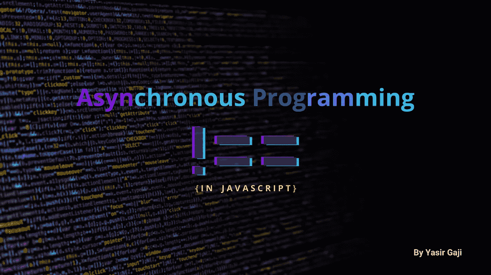
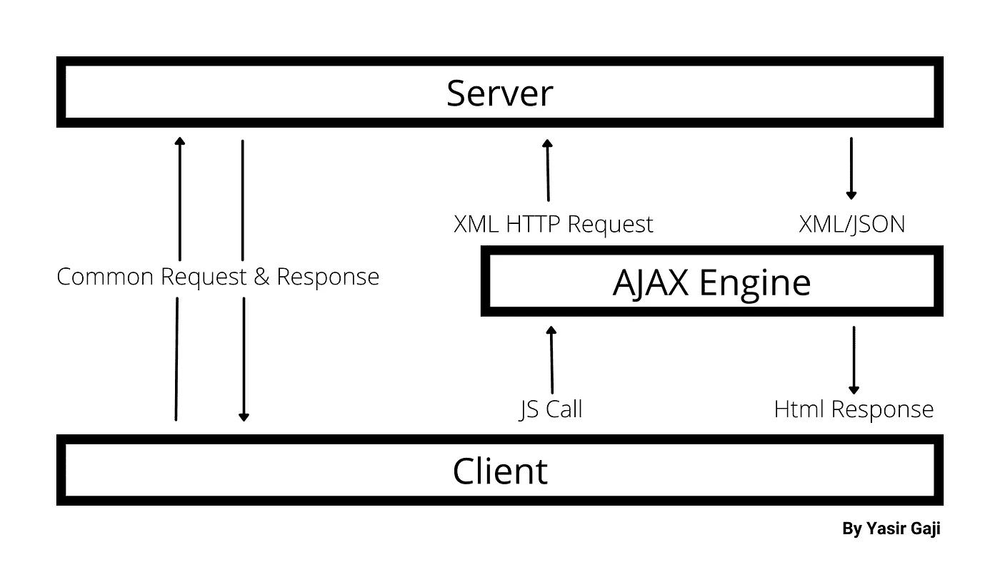
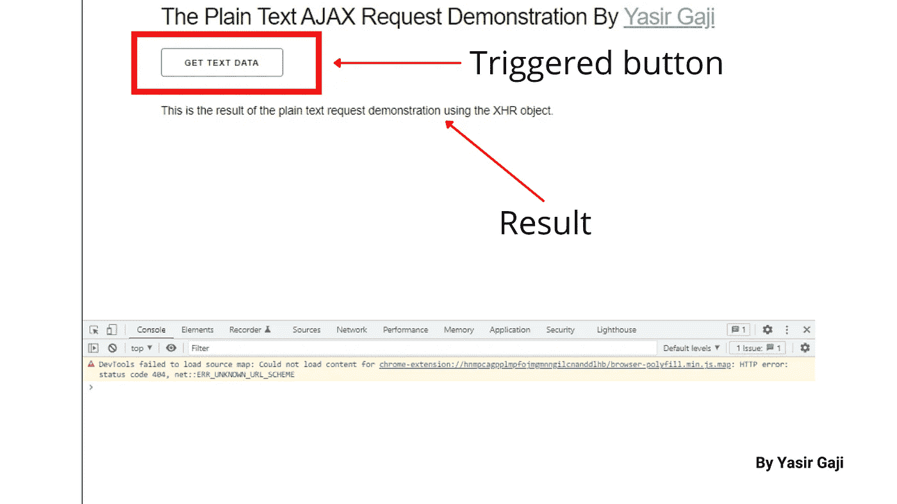
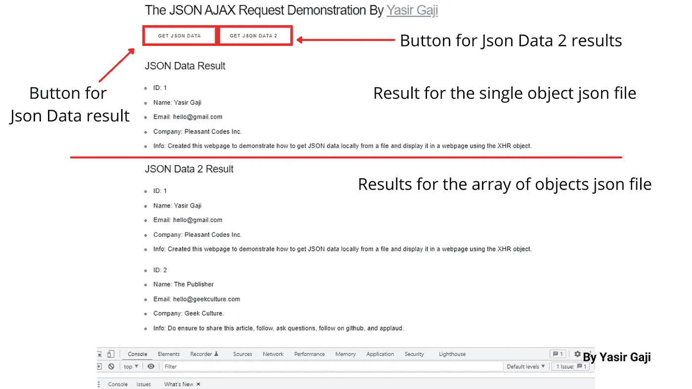

# Javascript 中的异步编程

> 原文：<https://medium.com/geekculture/asynchronous-programming-in-javascript-e1f47b3bf606?source=collection_archive---------12----------------------->

Asynchronous Programming Image By [**Yasir Gaji**](https://yasirgaji.com)

异步编程基本上是一种并行编程的形式，它允许一个工作单元与主要的应用程序代码块分开执行/运行，而不会阻塞其他操作。这仅仅意味着它是一种编写代码以确保代码同时执行的方法。

javascript 中的异步编程在使用像 **AJAX 和 Fetch API** 这样的技术时是可能的并且更有效，Fetch API 用于对内部或外部的文件、服务和浏览器/服务器 API 进行 HTTP 请求，在 javascript 中使用异步代码时有几个关键概念，我们有回调、承诺和异步/等待。

# 阿贾克斯和 XHR

异步 Javascript & XML (AJAX)不是一种编程语言、框架或库，而是一组从客户端服务器异步发送和接收数据的 web 技术，它在后台无缝执行，无需干预或重新加载网页的当前状态。

The AJAX workflow Image By [**Yasir Gaji**](https://yasirgaji.com)

上图显示了普通请求过程和 AJAX 工作流过程之间的区别，在客户端下面是浏览器，在服务器上面是本地或远程的，通常当我们访问浏览器上的 URL/链接时，我们会向服务器发送一个普通的 HTTP 请求，服务器会返回一个包括整个网页的普通响应。 而使用 AJAX，我们可以在后台异步发出请求，而不必重新加载整个页面，其方式是首先发出一个异步 javascript 调用，该调用通过 AJAX 引擎，然后 AJAX 引擎使用 XML HTTP 请求(XHR)对象向服务器发送一个普通请求，然后服务器返回一个通常为 JSON 格式的数据，但也可以是 XML 格式的数据，该数据随后通过 AJAX 引擎并作为 Html 响应返回，在这种情况下是不需要重新加载页面的网页。

虽然 XML 包含在 AJAX 的首字母缩写词中，但是 JSON 已经在很大程度上取代了它，因为它更快更容易，这就是为什么在本文中我会使用 JSON 进行演示。

XML HTTP 请求(XHR)对象是 AJAX 的核心技术。它由浏览器的 javascript 环境提供。它的方法是在客户机和服务器之间或浏览器和服务器之间传输数据。它还可以与 HTTP 之外的其他协议一起使用，也可以处理除 XML 之外的其他数据，如 JSON 和本文演示中使用的纯文本。

## 纯文本演示

利用 XHR 对象，通过此 [***Html 集合***](https://gist.github.com/YasirGaji/d702c8ab10c8017a2018ccce457e06ad) 和此 [***从内部服务器本地获取文本数据。txt 文件***](https://gist.github.com/YasirGaji/04becb8212643ecd090d13ed20bd84d5) 。

请参见下面的代码演示:

Code representation of how to get local text data using the XHR object By [**Yasir Gaji**](https://yasirgaji.com)

这使用了`.open`属性，该属性接受请求类型`GET`、文本文件`textData.txt`和描述它是异步的`true`语句作为参数，然后在 XHR 对象被设置为`.onload`方法之后，该方法被分配给一个函数，该函数接受一个条件语句，该条件语句在输出结果之前确保其 HTTP 状态为`200`和就绪状态为`4`。`.send`方法确保将 XHR 对象发送到服务器进行处理，您可以看到下面的代码结果图，并在这里测试*:*

**

*Image of the Plain Text Request result using the XHR object By [**Yasir Gaji**](https://yasirgaji.com)*

## *JSON 演示*

*在这里，我们将使用 XHR 对象从内部服务器本地获取 JSON 数据，该对象带有这个 [***Html 集合***](https://gist.github.com/YasirGaji/9dd1400d8b15186ebeef514ffb30046d) 和这些 JSON 文件:[***file 1***](https://gist.github.com/YasirGaji/b8ab897ff892c410d0f7218e0e21b4bc)和[***file 2***](https://gist.github.com/YasirGaji/41e847ba667519bef8492a41e6bd80d2)。*

*为了打印单个`jsondata`数据，我们可以使用该程序，参见下面的代码表示:*

*Code representation of how to get JSON Data locally By [**Yasir Gaji**](https://yasirgaji.com)*

*为了用多个 JSON 属性获得第二个`jsondata`数据，我们可以遵循以下步骤:*

*Code representation of how to get JSON data from an array object of JSON file By [**Yasir Gaji**](https://yasirgaji.com)*

*参见下面的代码结果图，并在这里测试*:**

****

**Image of the JSON Request result using the XHR object By [**Yasir Gaji**](https://yasirgaji.com)**

**通常，您会处理外部 API，这意味着您必须从外部获取数据，这样做的过程类似于我们在本文中从内部获取数据的方式，但由于每个 API 都不同，我建议您浏览它们的文档，但系统总是相同的。**

# **结论**

**AJAX 和 XML HTTP 请求是较老的技术，但是非常可靠，而 Fetch 是较新的标准。**

**大多数异步代码都是 API 或库的一部分，比如:
。XHR &取
。JQuery AJAX & Axios
。Node.js 文件系统模块**

**Async/Await 允许我们像简单的同步代码/操作一样编写异步代码/操作，这是编写异步代码的最佳方式。**

**HTML 和 XML 是相互关联的，其中 HTML 显示数据并描述网页的结构，XML 像 JSON 一样存储和传输数据。**

**API 需要在我们可以使用它们之前授予权限，这被称为 CORS 使能，它允许跨域通信，而一些 API 需要一种被称为 OAUTH 的身份验证形式。**

**所有浏览器都拥有 javascript 环境。**

**还有其他内部和外部库/技术和方法可用于发出 HTTP 请求，例如 Fetch API、Axios、Superagent、Node HTTP 和 JQuery 等。**

**分别在这里 和 [***这里***](https://developer.mozilla.org/en-US/docs/Web/API/XMLHttpRequest/readyState) 了解更多关于 HTTP 状态码和就绪状态值 [***。***](https://developer.mozilla.org/en-US/docs/Web/HTTP/Status)**

**一定要问问题来澄清，并提出纠正和建议，我希望他们这样做。**