# 角度异步测试

> 原文：<https://medium.com/geekculture/asynchronous-testing-in-angular-d2e9b3f6f6df?source=collection_archive---------26----------------------->

# 介绍

这是 Angular 教程系列中[单元测试的最后一个教程。在本教程中，我们将讨论如何为异步作业(如 API 调用)编写单元测试。在现代 web 应用程序中，前端需要与后端通信和交换数据是非常常见的。虽然我们希望在测试中涵盖这些特性，但是我们不希望前端在测试过程中向后端发送实际的 API 调用。相反，我们希望验证我们的应用程序向后端发送了正确的数据，并且在后端响应时做出了正确的反应。Angular 提供了一套方便的工具，允许我们执行这种测试。我们将在本教程中浏览它们。](https://simpleweblearning.com/tag/unit-test-in-angular/)

# 演示应用程序介绍

对于本教程，我们准备了一个简单的论坛应用程序，它使用了由 [JSON 占位符](https://jsonplaceholder.typicode.com/guide/)(一个供开发者模拟 API 调用的公共 API 资源)提供的 API。

论坛应用程序由三个页面组成:

主页—列出所有帖子

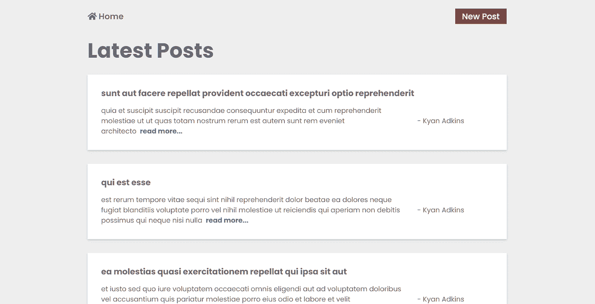

Forum Application — Home Page

单篇文章页面—显示单篇文章的内容。也可以修改或删除帖子。

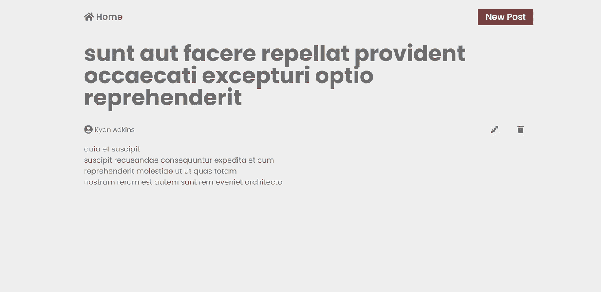

Form Application — Single Post Page

新帖子页面—允许用户创建新帖子或修改现有帖子。

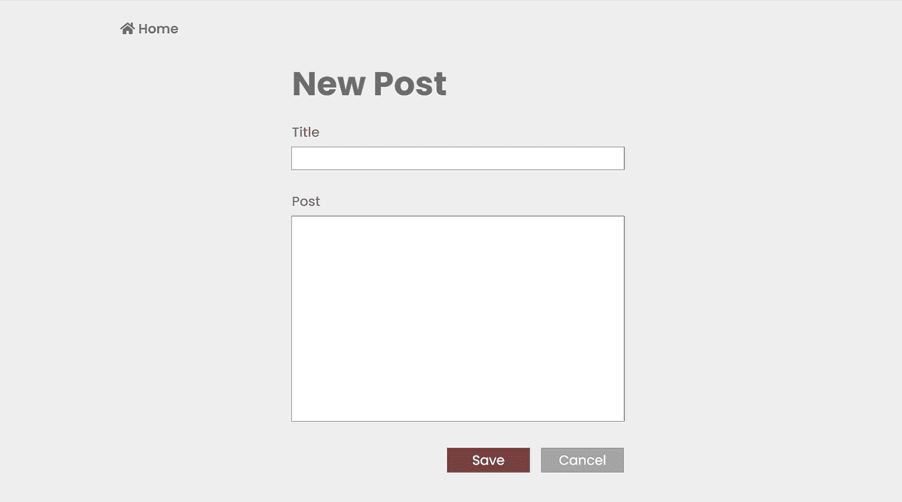

Form Application — Create New Post

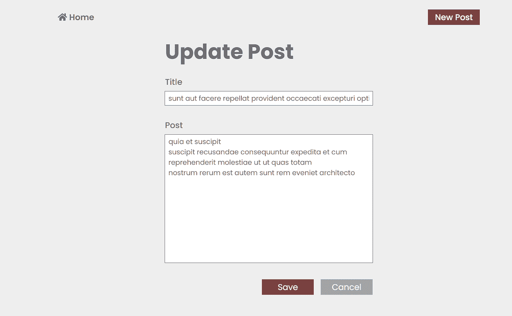

Form Application — Update Post

此应用程序使用的 API:

*   列出所有帖子【https://jsonplaceholder.typicode.com/posts 得到
*   得到一个帖子
    得到[https://jsonplaceholder.typicode.com/posts/:id](https://jsonplaceholder.typicode.com/posts/:id)
*   创建一个职位
    职位[https://jsonplaceholder.typicode.com/posts/](https://jsonplaceholder.typicode.com/posts/:id)
*   更新一贴
    补丁[https://jsonplaceholder.typicode.com/posts/:id](https://jsonplaceholder.typicode.com/posts/:id)
*   删除一个帖子
    删除[https://jsonplaceholder.typicode.com/posts/:id](https://jsonplaceholder.typicode.com/posts/:id)

# 性能试验

这个应用程序的所有 API 调用都在 PostService 文件中定义。

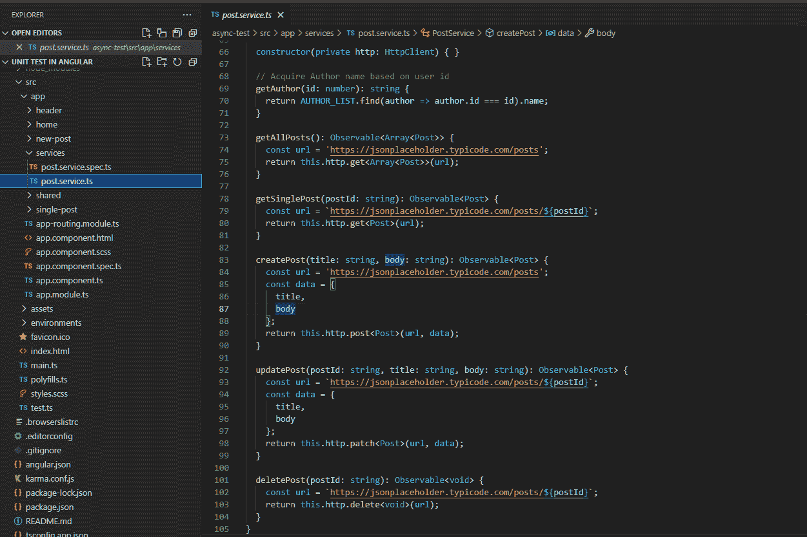

PostService

当我们为服务中定义的功能编写测试时，我们希望确保我们的测试涵盖以下几点:

*   API URL
    对于每个方法，API 是否被发送到正确的 URL？
*   HTTP 方法
    对于每种方法，是否使用了正确的 HTTP 方法？
*   Parameters & Body
    应用程序是否以正确的格式发送数据？

## 准备试验台

为了测试 API 调用而不实际发送 API 到后端，Angular 为我们提供了 **HttpClientTestingModule** 和 **HttpTestingController** 。

[HttpClientTestingModule](https://angular.io/api/common/http/testing/HttpClientTestingModule) 是一个测试专用模块，在测试过程中替代普通的 HttpClientModule。它将让我们在测试环境中访问 HttpClient。

另一方面， [HttpTestingController](https://angular.io/api/common/http/testing/HttpTestingController) 允许我们完全控制测试期间的所有请求。

使用 HttpTestingController，我们可以:

*   捕获所有在没有 HttpTestingController 的情况下会被发送到后端的 API 调用
*   用我们的模拟数据刷新请求，以模拟后端响应
*   捕获 API 请求并验证它们的方法和主体

有了这个想法，这就是我们的测试平台的设置。

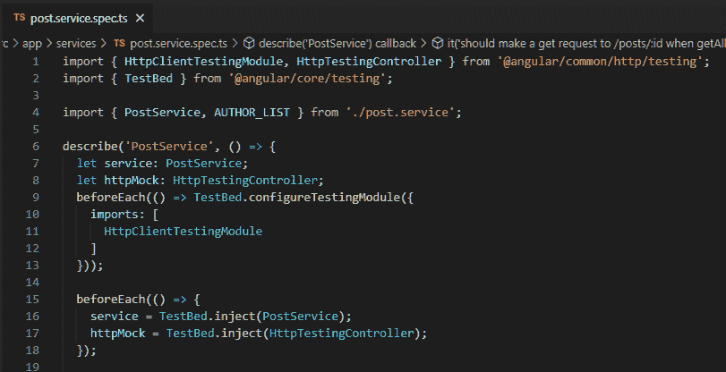

PostService TestBed

## 捕获 API 调用并验证其 HTTP 类型

让我们开始为 getAllPosts 方法编写测试。

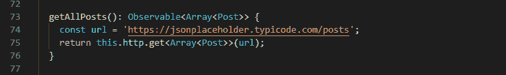

Get All Posts Method

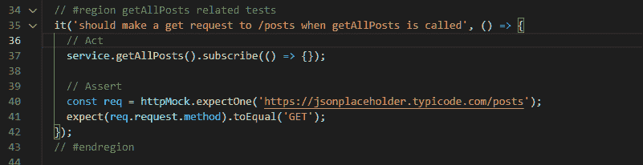

Get All Posts Test

在上面的测试用例中，我们从调用 getAllPosts 方法开始，并订阅结果，就像我们通常在第 37 行进行 API 调用一样。

一旦我们进行了 API 调用，我们就可以通过使用来自 HttpTestingController 的 **expectOne** 方法来捕获请求(第 40 行)。HttpTestingController 将为我们测试是否确实收到了具有给定 URL 的请求，并且它将返回一个 [TestRequest](https://angular.io/api/common/http/testing/TestRequest) 对象，以便我们稍后执行更多验证。

然后，我们可以通过访问**test request . request . method**属性来测试请求的 HTTP 类型。请记住，HTTP 类型将在所有大写情况下返回。

## 测试 HTTP 主体

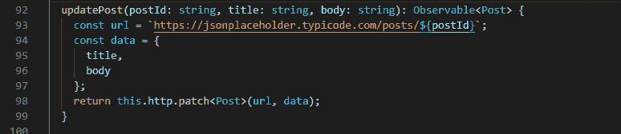

Update Post Method

对于在 http 主体(POST/PATCH)中带有附加数据的请求，我们也可以用 TestRequest 对象测试它们。

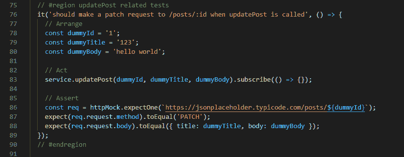

Update Post Test

HTTP 请求体可以从**test request . request . body**属性中获取。然后，我们可以比较 http 主体是否与传递给服务方法的数据相匹配。

# 部件试验

当测试一个使用服务的组件时，我们希望确保我们的测试涵盖了以下几点。

*   调用相应的组件方法时，会调用正确的服务方法，并且传递给它们的数据是正确的
*   组件可以正确处理成功的 API 响应
*   组件可以正确处理错误 API 响应

重要的是要记住，从组件的角度来看，我们对服务方法是如何实现的不感兴趣。服务方式对我们来说就像一个黑匣子。我们只想关注我们需要传递给他们什么数据(输入)以及当 API 返回时我们如何反应(输出)。服务相关的测试应该包含在服务自己的测试套件中。

## 准备试验台

为了在组件测试中测试服务，有两种方法来准备测试床。

1.  创建一个服务的模拟实例，并将其注册到测试床
    中。这种方法的好处是无需担心在所有测试中 HttpTestingController 是否捕获到请求。
2.  将真正的服务直接注入测试床
    这种方法允许我们直接使用 HttpTestingController 测试服务请求，但它也带来了一个风险，即您需要手动确保所有涉及 API 调用的测试都受到 HttpTestingController 的保护。

我们将采用第一种方法，下面是我们用于组件测试的测试床设置。

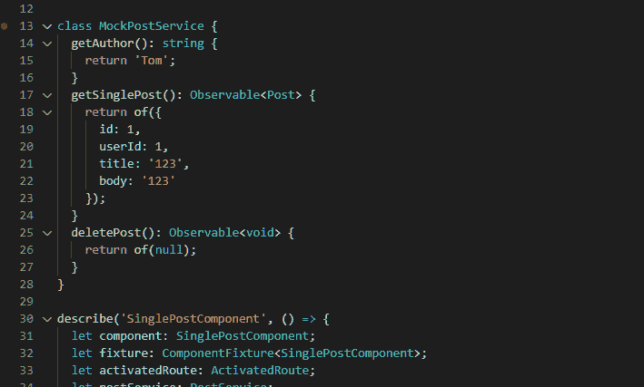

MockPostService

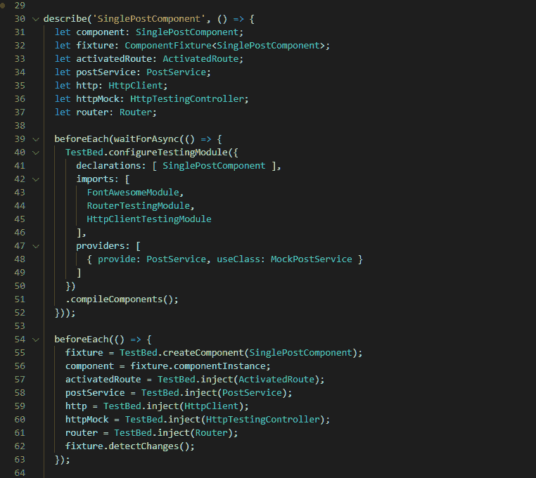

SinglePostComponent TestBed

## 测试服务方法调用

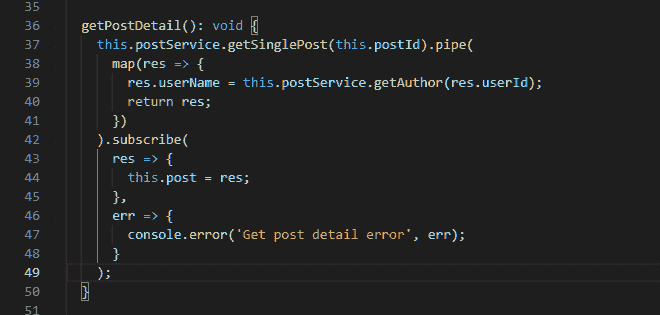

Get Post Detail Method from the SinglePageComponent

上面是来自 SinglePostComponent 的 getPostDetail 方法。在 getPostDetail 方法中，我们调用 PostService.getSinglePost。我们可以在测试中使用我们在另一个教程中介绍的[间谍](https://simpleweblearning.com/working-with-spies-in-angular-unit-test)来轻松验证这一行为。

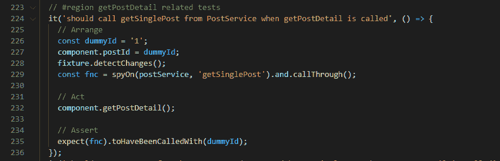

Verify API Call

## Sunny Case API 响应测试

对于 sunny case API 测试，我们希望准备由 API 返回的模拟数据，并查看我们的组件是否正确执行了 after 操作。(更新表单、导航到另一个页面等)

下面是将在更新模式中使用的 NewPostComponent 中的一个方法。当 API 返回时，我们希望用服务器返回的最新数据来修补表单。

Get Post Detail Method from the NewPostComponent

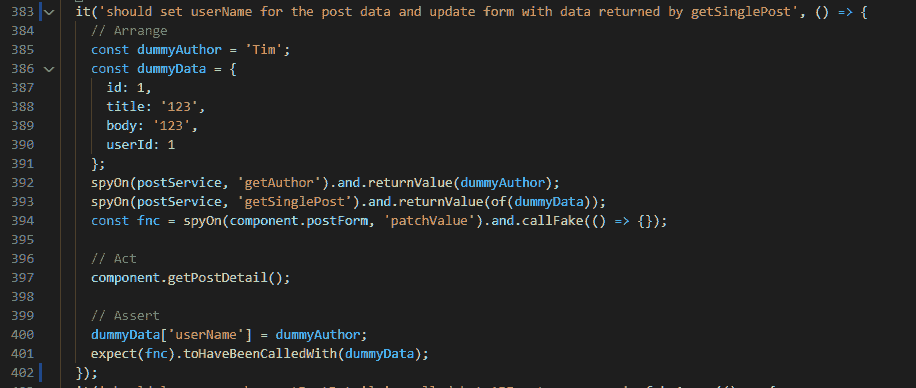

Sunny Case API Test

我们可以通过使用 Spy 的 **returnValue** 方法轻松覆盖响应数据，并验证 **patchValue** 函数是否确实是用我们从 API 返回的模拟数据调用的。

## 错误案例 API 响应测试

错误 API 响应的模拟比 sunny 的情况要厚一点，因为 Jasmine Spy 不能模拟 HTTP 状态代码。幸运的是，我们可以使用 HttpTestingController 来完成这项任务。

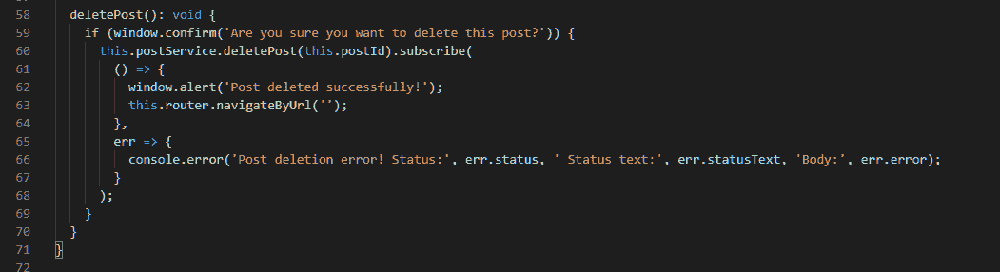

Delete Post Method

上面是来自 SinglePostComponent 的 deletePost 方法。当 API 返回一个错误时，我们希望将它的 HTTP 状态、HTTP 状态文本和错误响应主体记录到控制台。

回想一下，我们通过创建一个模拟类将 PostService 注入到我们的测试环境中，我们需要覆盖我们想要测试的 API 方法，以便它实际上向我们的 HttpTestingController 发出一个 API 请求。

因为我们对服务方法是如何实现的不感兴趣，所以我们可以在安排阶段准备一个虚拟 url 来模拟 API 调用。(lne 382 ~ line 386)。

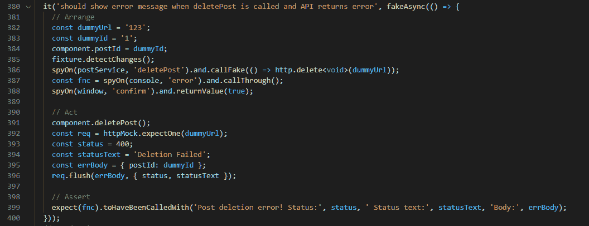

Error Response Test

在代理阶段，我们调用组件的 deletePost 方法，并期望在我们的 HttpTestingController 上接收对虚拟 url 的传入请求。

我们准备了错误响应主体、HTTP 状态和 HTTP 状态文本，我们将使用它们来模拟 API 错误，最后刷新它们(在第 396 行)以将响应发送回前端。

在断言阶段，我们验证是否使用我们为 API 准备的伪数据调用了 console.error。

我们可以看到我们的数据确实被传回前端，并被记录到控制台。

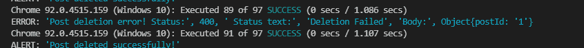

Error Log in the Console

注意。在使用 HttpTestingController 的测试中，如果在测试中有您不希望使用 HttpTestingController 的其他 API 调用，您可以调用[HttpTestingController . verify](https://angular.io/api/common/http/testing/HttpTestingController#verify)方法。verify 方法将确保所有的 API 调用在终止测试用例之前结束(包括不匹配的 API)。

# 结论

恭喜你到达角度系列[单元测试的最后一个教程！我们已经讨论了很多话题。现在有了这些知识，你应该能够为超过 90%的常见场景编写单元测试。论坛应用程序及其测试的完整列表可以在](https://simpleweblearning.com/tag/unit-test-in-angular/) [GitHub](https://github.com/chen1223/unit-test-in-angular) 的 **async-test** 目录下找到。

为了准备本教程，总共有 97 个测试。

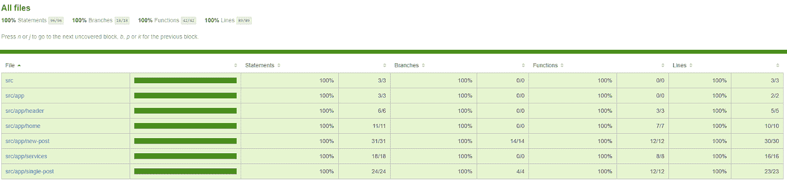

Test Coverage of the Forum Application

原帖:
[https://simple web learning . com/asynchronous-testing-in-angular](https://simpleweblearning.com/asynchronous-testing-in-angular)