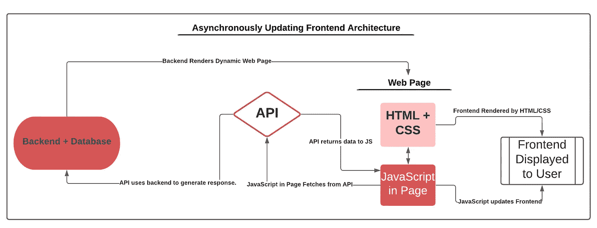
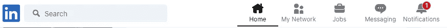
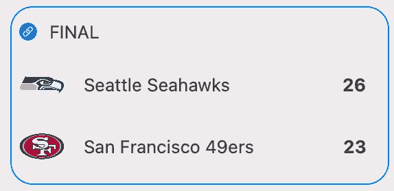

# 在标准 HTML/CSS/JS 前端异步更新网页

> 原文：<https://medium.com/geekculture/asynchronously-updating-a-webpage-in-a-standard-html-css-js-frontend-8496a3388c01?source=collection_archive---------0----------------------->



Diagram of Implementing an Asynchronously Updating Frontend Feature (Image by Author)

异步更新数据的能力是我们经常使用的许多 web 应用程序的一个重要特性。用户收到的通知数量、收件箱中的电子邮件数量，甚至是雅虎财经(Yahoo Finance)等平台上的股票价格，都是经常更新的信息，无需用户刷新页面。在我的例子中，我最近开发了一个记分牌应用程序来显示用户喜欢的球队的实时比分，我的目标是在用户不刷新页面的情况下更新这些比分。今天，我将回顾在没有 React 等旨在简化这一过程的框架的情况下实现这种异步刷新功能的关键步骤和注意事项。我还会介绍一些需要这样做的情况。



The number of notifications in the LinkedIn toolbar asynchronously reloads (screenshot directly from website)

# 问题是

像 HTML 和 CSS 这样的语言最初的设计目标是创建静态网页，这是互联网的起源。通过向服务器发送请求并接收网页前端返回的响应来呈现网站。通过重复这个过程并等待服务器满足另一个请求来处理任何后续的重新呈现。即便如此，刷新时很少会有页面发生变化，因为大多数内容都是静态的。

现在，我们更常用 JSP 或 Jinja 模板等技术来处理动态网页。这些允许我们将后端数据注入我们的网页，并根据情况动态地改变它们的内容。然而，这仍然需要创建 HTML 服务器端，并且需要后续刷新来更新任何信息。在许多这样的 web 框架中，异步重载仍然不容易得到支持。

今天，我们已经有了诸如 React 这样的前端框架，它们处理客户端的渲染，并且被设计成处理异步更新。然而，如果您已经开始使用 Flask 这样的框架，并且已经使用 Jinja 模板、JSP 或其他不在客户端呈现的解决方案设计了您的前端，会发生什么呢？您总是可以迁移您的前端来使用像 React 这样的解决方案，但是如果您有一个大型的 web 应用程序，这并不总是可行的。幸运的是，只要有点创造力，还是有可能实现网页数据异步更新的功能。

# 通解

让我们回顾一些通用步骤，这些步骤将允许我们在标准前端中异步更新显示的数据。

1.  **确定所需数据-** 首先确定您的更新前端功能需要从后端获得哪些信息至关重要。需要哪些用户信息才能使其显示依赖于用户？实际显示的是什么数据？这些必需的信息将决定下一步的设计。
2.  **在你的后端设置一个 web 服务/API 端点-** 这一步是在网页中实现异步更新的关键。我们可以在自己的后端设置一个端点，并使其作为 web 服务提供我们在步骤 1 中确定需要的数据。我们现在有了一个从前端访问相关数据的地方。
3.  **添加结构到你的 HTML -** 这一步是能够更新我们的 HTML 页面的关键。一旦我们获取了对前端进行更新所需的数据，我们将需要能够在网页上找到必须显示新数据的元素。有效地使用 HTML 元素的 id 和 class 属性将使这变得更容易。
4.  **使用 JavaScript 获取数据并进行更新** **-** 我们现在已经准备好将所有东西与嵌入到我们网页中的一些 JavaScript 结合在一起。使用 JavaScript，我们可以使用 AJAX 调用从我们在步骤 2 中设置的端点获取数据。然后，我们可以通过利用步骤 3 中实现的结构，使用这些数据来更新我们的 HTML。最后，我们可以使用 JavaScript 的 setInterval 函数定期运行这个函数。例如，我们可以编写类似 setInterval(update，10000)的代码；每 10 秒运行一次名为 update 的功能。

通过遵循这四个步骤，您将能够有效地实现前端异步更新的特性。我现在将跳转到一个详细的例子来演示这个策略是如何有效的。


Diagram of how the steps above work together (Image by Author)

# 例子

这个例子基于我最近参与的一个项目，我为用户最喜欢的运动队创建了一个实时记分牌。我需要在用户不刷新页面的情况下更新这些分数，因为体育赛事的状态在进行中会经常变化。然而，当我最初开始这个项目时，我使用 Flask 作为后端 web 框架，前端使用 Jinja 模板。将我的前端切换到像 React 这样的选项对于一个特性来说是非常耗时的。幸运的是，我能够遵循上面的四个步骤，有效地实现了一个不刷新页面就能异步更新的记分板。

# 确定所需的数据

这个过程的第一步是从后端确定所需的数据，这样我们就可以设计后端 API 端点。例如，假设我想在我的记分牌上显示一个体育赛事，如下图所示。



Simple display of an event in my scoreboard (Image by Author)

这里有一些关键的信息需要从前端获取。必须首先显示团队。此外，我们需要他们的徽标图像和团队名称的 URL。我们还想显示和更新每个队的分数，所以我们必须在我们的 web 服务中提供这些信息。在左上方，您会注意到一个表示 FINAL 的字符串，它表示我们事件的状态。如果游戏正在进行中，它还可以显示即将到来、中场休息，甚至 Q3 | 10:45。这个信息也必须由我们的 API 返回。最后，我们需要为该事件提供一个链接，以便显示画面左上角的链接可以将我们带到该游戏的相关网页。

# 设置 API 端点

现在我们已经确定了要提供的数据，我们可以为事件数据设置一个 API 端点。这一步的实现取决于您设计应用程序所用的后端，但最终目标是返回事件的标准化表示。一个好的做法通常是在应用程序中任何与 API 相关的端点前加上“/API”或其他一些唯一的标识符。这将它们与应用程序中的其他页面区分开来(较大的应用程序可能有一个完全独立的 API 域)。

让我们看看事件端点基于步骤 1 返回的数据的基本结构。这将由后端事件模型上的一个实例方法返回，该实例方法为特定事件创建 JSON 表示。

```
data = { 
    “id”: self.id,
    "sport": self.sport.value, 
    “status”: self.status.value, 
    “espn_url”: self.espn_url, 
    “away_team”: self.away_team.to_dict(), 
    “home_team”: self.home_team.to_dict(), 
    “away_score”: self.away_score, 
    "home_score”: self.home_score 
}
```

注意，团队的字段正在调用团队对象上的另一个方法。这些其他方法为团队对象返回一个定义的结构，如下所示，为响应数据添加了更多的结构。

```
team_ data = {
    "id": self.id,
    "name": self.name,
    "logo_url": self.logo_url,
    "sport": self.sport
}
```

现在，我们设置一个端点函数，它接收事件的 id，查询该事件的实例，然后使用实例方法检索并返回适当的 JSON 响应。

```
@bp.route(‘/api/events/<int:event_id>’, methods=[‘GET’])
def get_espn_event_info(event_id):
    event = # query for event by event id here
    if event is None: 
        return {} 
    else: 
        return event.to_dict() # returning the event's JSON data
```

这个 API 端点现在可用于前端。当提供事件 id 时，它将返回关于该事件的必要信息。

# 向 HTML 添加结构

下一步是正确构建前端的 HTML，使其可以通过页面中嵌入的 JavaScript 轻松更新。为此，JS 代码必须能够识别检索到的数据所属的元素。让我们来看一个很好的例子，看看我们如何开始为一个事件构造 HTML 来满足我们的需求。

```
<div class="event" id="NFL-1234">
    <span id="NFL-1234-status">FINAL</span><br />
    Seattle Seahawks
    <strong class="score" id="NFL-1234-away-score">26</strong><br />
    San Francisco 
    <strong class="score" id="NFL-1234-home-score">23</strong><br />
</div>
```

请注意，我们需要更新的每个元素是如何使用我们活动的运动和 id 来识别的。在本例中，我们有一个 id 为 1234 的 NFL 事件。因此，我们可以在从内部 API 获取数据后，通过组合事件的 sport 和 id 来找到包含事件信息的 div。然后，我们可以将“-status”、“-away-score”等添加到 sport 和 id 中，以找到与该事件相关的其他元素的 id，并更新它们的值。团队徽标和名称没有被赋予唯一的 id(尽管它们可以有),因为它们不需要更新。

在静态网页中，不可能使用后端数据创建这些 id。尽管静态 web 页面很少首先与后端交互，但是您仍然可以通过硬编码每个元素的 id 来应用这种技术。然而，当使用 JSP 或 Jinja 模板等技术时，这一步在任何动态网页中都非常有效。从后端接收数据、将其作为元素 id 的值注入并生成一个结构良好的动态 web 页面将变得很容易，在这个页面中，每个可更新的元素都可以通过其 id 和/或类轻松地识别。

# **使用 JavaScript 获取数据并更新前端**

现在，在最后一步，所有东西都与一些 JavaScript 代码结合在一起。我们的目标是创建一个获取必要数据的函数，隔离其值需要更新的元素，然后使用获取的数据进行更新。然后，我们想在计时器上设置这个函数，让它在我们的 web 页面的后台定期运行。

```
function updateAllEvents() { 
    //events_in_progress is a list of endpoints with event data   
    events_in_progress.forEach(function (event_endpoint, index) { 
        $.get(event_endpoint, function(data, status){
            updateEvent(data); 
        }); 
    }); 
}
```

上面的函数从遍历包含用于更新的事件数据的端点列表开始。这些基本上是一个端点列表，就像在步骤 2 中创建的那样，但是填充了事件 id 值(例如“/api/events/1234”)。你的模板语言将帮助你做到这一点。该函数使用异步 get 请求从每个端点获取数据，然后对结果数据调用另一个函数 updateEvent()。让我们看看 updateEvent()。

```
function updateEvent(data) { 
    var event_tile_id = data.sport + “-” + data.id; 
    var away_score = document.getElementById(event_tile_id + “-away-score”); 
    var home_score = document.getElementById(event_tile_id + “-home-score”); 
    if (away_score && home_score) { 
        away_score.innerHTML = new_data.away_score;     
        home_score.innerHTML = new_data.home_score; 
    } 
}
```

在上面的函数中，获取的数据用于导出应该更新的相关 HTML 元素的 id(event _ tile _ id)。例如，sport NFL 和 id 1234 将包含在提取的数据中，允许我们构建 HTML id NFL-1234。这就是为什么步骤 3 中的 HTML 结构化如此重要。然后，我们能够使用 id 来隔离需要更新的特定元素，并用新获取的值替换它们的值。这将异步更新我们的前端。上面的函数只是为了更新主客场分数而实现的，但是更新其他元素很容易。

现在，我们还有最后一步，就是定期运行这个后台任务。有很多方法可以做到这一点，但是最简单的方法是使用 JavaScript 的内置函数 setInterval。

```
// using 10000 runs the task every 10 seconds
setInterval(updateAllEvents, 10000);
```

这就是我们要实现的一切！我们的功能现在已经完全可用，将来可以使用相同的策略进行扩展。

# 结论

异步更新前端在许多 web 应用程序中是一个有用的特性。虽然有 React 这样的框架使这些特性更容易实现，但我们可能没有用 React 这样的工具来构建我们的 web 应用程序，并且迁移整个前端通常太耗时了。幸运的是，我们仍然可以使用普通的 HTML/CSS/JavaScript 网页来实现异步更新特性。希望上面的步骤能帮助你开始这样做，并帮助你的 web 应用程序更上一层楼。