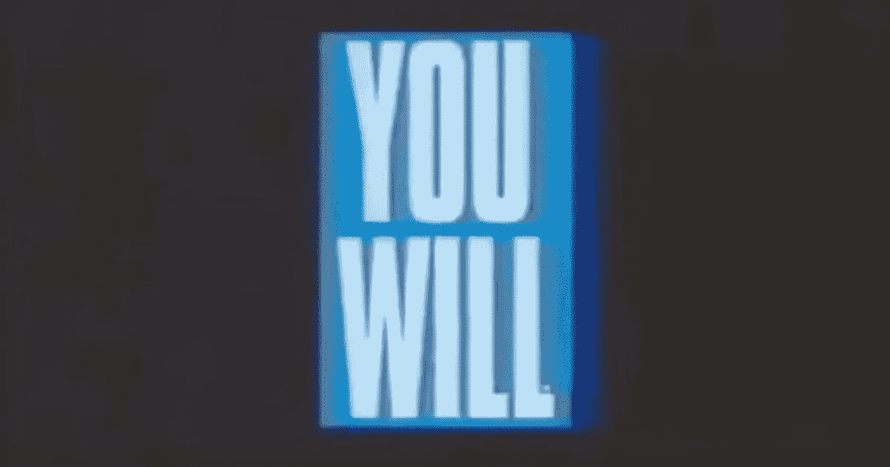

# 美国电话电报公司预言了未来，但他们无法赢得未来

> 原文：<https://medium.com/geekculture/at-t-predicted-the-future-but-they-couldnt-win-it-ef1aa46a78b1?source=collection_archive---------8----------------------->

## “你会的”但他们没有

Source: AT&T

1993 年，电信巨头美国电话电报公司推出了一个品牌宣传活动，预测了未来 30 年的发展——所有的一切都伴随着一些甜美的 90 年代音乐和汤姆·塞立克舒缓的旁白。

在一系列商业广告和其他广告中，该公司提出了一系列假设的“你曾经……”问题，所有这些问题的答案都只有一个:*你会的。*以下是其中的一些:

你曾经…

*   …有一个生活在你电脑里的助手？
*   …光着脚去开会？
*   …没有停下来问路就穿越了这个国家？
*   …在你的手腕上接到一个电话？
*   …没有减速就付了通行费？
*   …和一个千里之外的同学一起学习？
*   …在你想看的时候看你想看的电影？
*   …当你不在家时，照看你的家？
*   …用一种你不懂的语言开展业务？
*   ……借了一本书，千里之外？

在 1993 年，这些任务只是科幻小说的一个台阶。现在，我们所有人都做了几乎所有的事情。按顺序，今天这些梦想场景每天都有可能实现:Alexa、Zoom、谷歌地图、Apple Watch、EZ Pass、FaceTime、网飞、Nest、谷歌翻译和 [Libby](https://www.benguttmann.com/blog/one-good-thing-libby-library-app-review) 。尽管没有喷气背包，事实上，我们生活在未来。

这场运动也碰巧直接创造了未来的一部分。“你会的”是互联网[第一个横幅广告](http://thefirstbannerad.com/)中的号召语，1994 年在《连线》杂志的网站上播出，当时的点击率达到了前所未有的 44%。今天，在数十亿的广告之后，互联网广告现在是一个 5660 亿美元的生意。

在整个活动中，他们唯一弄错的部分是每个广告的最后一句:“将它带给你的公司……美国电话电报公司”

尽管列出了这些明智的预测，但美国电话电报公司没有一个预测成功。作为全球收入最高的电信公司，美国电话电报公司远非失败者，但它基本上是一家公用事业公司，而非科技公司。美国电话电报公司提供了实现所有这些技术的网络。矛盾的是，网络同时也是整个等式中最商品化和不可或缺的部分。

当事情进展顺利时，没人会关心网络。就像事情进展顺利时，你并不真的关心水是如何进入你的管道或电是如何进入你的插座的。当人们关心公用事业时，通常是因为它们失败了。

但是，没有真正的电信创业公司能像他们那样纵横全国乃至全世界。他们的护城河又大又深，有时他们被视为我们经济和社会的重要组成部分，以至于该公司实际上是作为联邦政府的一个部门在运作。加勒特·格拉夫(Garrett Graff)在《美国冷战应急计划史》(a history of the United States ' s Cold War emergency plans)中写道，“几乎在每一个层面上，美国电话电报公司都是美国战时通信系统的支柱……美国电话电报公司与五角大楼的联系如此紧密，以至于国防部干预阻止了司法部以反垄断为由拆分这家强大公司的努力，认为这样做会对‘国家安全造成危害’"

几十年后，或者尝试了所有其他方法，现在看来，电信公司终于满足于做电信公司了。威瑞森在过去十年中收购了早期的互联网巨头美国在线和雅虎，试图将它们合并成一家名为 Oath 的新公司，但没有成功，然后放弃了，并于去年将它们出售。在[将 DirectTV 和 WarnerMedia 剥离之前，T 拥有并努力将其合并。康卡斯特在 2009 年收购了 NBC 环球，这是迄今为止最大的一笔交易。](https://www.nytimes.com/2022/04/08/business/media/discovery-warner-media.html)

当美国电话电报公司在 1993 年梦想未来的时候，他们有(现在仍然有)一些最聪明的头脑在为它工作。但大多数将它带入生活的公司在那时并不存在。没有人能保证成功，不管他们有多强大。没有哪一个巨人大到不能被打倒。

【https://www.benguttmann.com】最初发表于**。在那里阅读更多精彩内容，或者在 Twitter 上关注我，地址:*[*https://twitter.com/guttmann*](https://twitter.com/guttmann)*。**