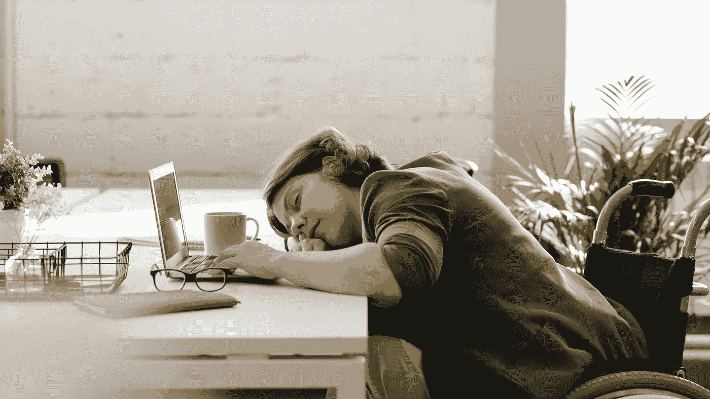

# 阿特拉斯耸耸肩，这可能不是一件坏事。

> 原文：<https://medium.com/geekculture/atlas-shrugged-and-that-may-not-be-such-a-bad-thing-27e6c2a55c43?source=collection_archive---------13----------------------->

最近一直在看关于大辞职的视频。我们都知道为什么服务行业的人会离开。除了最绝望的人，没有人想在接种疫苗前暴露自己。现在它在 2021 年冬天再次上升，我们再次看到像理发师这样的人离开他们的工作。

> 不想回来工作的最大原因是…