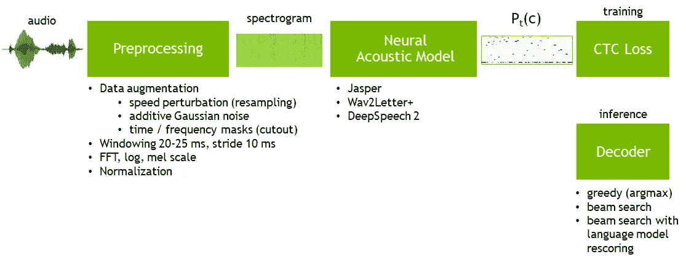
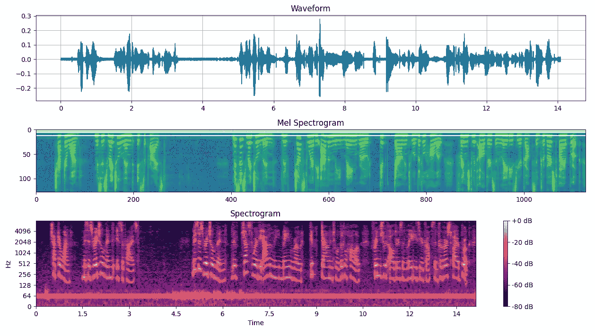
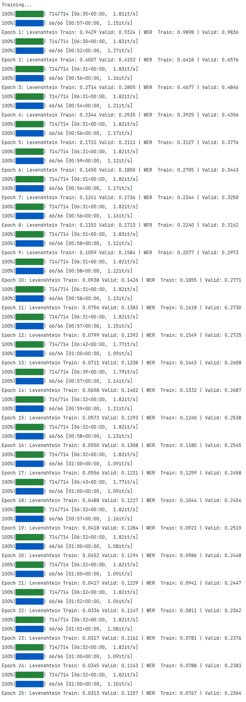
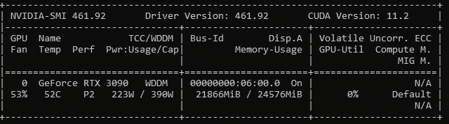
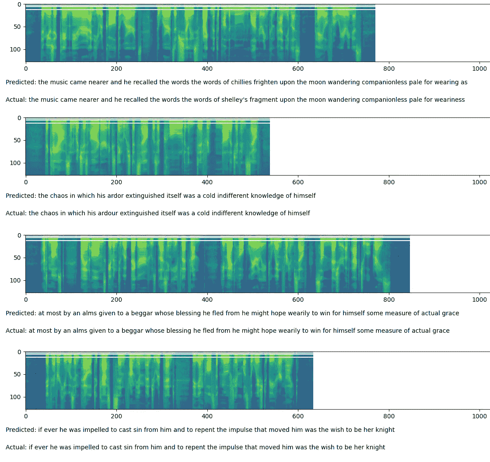

# 使用 CRNN、CTC Loss、DeepSpeech Beam Search 解码器和 KenLM Scorer 的语音识别

> 原文：<https://medium.com/geekculture/audio-recognition-using-crnn-ctc-loss-beam-search-decoder-and-kenlm-scorer-24472e43fb2f?source=collection_archive---------5----------------------->


Photo by [**Matt Botsford**](https://unsplash.com/@mattbotsford) on Unsplash

# 理论

今天最流行的三款端到端 ASR(自动语音识别)机型分别是[**Jasper**](https://arxiv.org/pdf/1904.03288.pdf)[**wave 2 letter+**](https://arxiv.org/pdf/1712.09444.pdf)**[**Deep Speech 2**](https://arxiv.org/pdf/1512.02595.pdf)。现在它们[](https://nvidia.github.io/OpenSeq2Seq/html/speech-recognition.html#speech-recognition)**作为英伟达 [**OpenSeq2Seq**](https://github.com/NVIDIA/OpenSeq2Seq) 工具包的一部分。所有这些 ASR 系统都基于神经声学模型，该模型在每个时间步 **t、**的所有目标人物 **Pt(c)** 上产生概率分布**Pt(c)**，该概率分布又由 [**CTC 损失**](https://pytorch.org/docs/stable/generated/torch.nn.CTCLoss.html) 函数评估****:********

****

**Summarization of CTC ASR pipeline’s architectures by [**Nvidia**](https://nvidia.github.io/OpenSeq2Seq/html/speech-recognition.html#introduction)**

**本质上，本文中描述的端到端语音识别系统由几个简单的部分组成:**

*   **使用[**【librosa】**](https://librosa.org/doc/latest/index.html)**或**[**torchaudio**](https://pytorch.org/audio/stable/index.html)将原始波形转换为 [**频谱图**](https://en.wikipedia.org/wiki/Spectrogram) 。 [**本文**](/analytics-vidhya/understanding-the-mel-spectrogram-fca2afa2ce53) 提供了对 **mel 光谱图**和 [**的直观理解。**](https://haythamfayek.com/2016/04/21/speech-processing-for-machine-learning.html)******

****How to convert **waveform to spectrogram** using **librosa** and **torchaudio******

********

****Waveform converted to spectrogram****

*   ****声谱图是一幅图像，我们可以用 [**卷积层**](https://d2l.ai/chapter_convolutional-neural-networks/conv-layer.html) 从中提取特征。在这篇文章中，我将使用一个流行的组合，一个 [**Conv2d**](https://pytorch.org/docs/stable/generated/torch.nn.Conv2d.html) 层和 [**GELU**](https://pytorch.org/docs/stable/generated/torch.nn.GELU.html) 激活函数(因为 [**比**](https://arxiv.org/pdf/1710.05941.pdf)**[**ReLU**](https://pytorch.org/docs/stable/generated/torch.nn.ReLU.html)**在一系列实验中更好)和 [**退出**](https://jmlr.org/papers/volume15/srivastava14a/srivastava14a.pdf) 进行正则化。此外，我认为使用 [**层归一化**](https://arxiv.org/pdf/1607.06450.pdf) 和 [**跳过连接**](https://arxiv.org/pdf/1712.09913.pdf) 对于更快的收敛和更好的泛化是有益的。因此，神经网络的第一部分将由以下层组成:********

```
**# First Conv2d layer** Conv2d(1, 32, kernel_size=(3, 3), stride=(2, 2), padding=(1, 1))**# 7 blocks of these layers
# Skip connection is added to this Conv2d layer** LayerNorm((64,), eps=1e-05, elementwise_affine=True)
GELU()
Dropout(p=0.2, inplace=False)
Conv2d(32, 32, kernel_size=(3, 3), stride=(1, 1), padding=(1, 1))
```

*   **同时，声谱图是时间序列数据，所以使用双向[](https://d2l.ai/chapter_recurrent-neural-networks/rnn.html)**层如[**【GRU】**](https://arxiv.org/pdf/1409.1259.pdf)从 **CNN** 层检测到的特征中捕捉时频模式是很自然的。出于与之前相同的原因，我将使用一个图层正常化和下降:****

```
****# I will use 5 blocks of these layers**
LayerNorm((512,), eps=1e-05, elementwise_affine=True)
GELU()
GRU(512, 512, batch_first=True, bidirectional=True)
Dropout(p=0.2, inplace=False)**
```

*   ****实际上，我们需要的是将声谱图图像的每个小垂直切片映射到某个字符，因此我们的模型将为每个垂直特征向量和每个字符产生一个概率分布。这可以使用[**线性**](https://pytorch.org/docs/stable/generated/torch.nn.Linear.html) (完全连接)层来完成:****

```
****# Input for this layer is an output from the last GRU layer
# We need to gradually reduce number of outputs from 1024 to the number of characters used in LibriSpeech dataset - 28 + 'blank'**
Linear(in_features=**1024**, out_features=**512**, bias=True)
GELU()
Dropout(p=0.2, inplace=False)
Linear(in_features=**512**, out_features=**29**, bias=True)**
```

*   ****然后我们可以使用**贪婪解码器**或**波束搜索解码器**来产生最终的转录。
    一个[**贪婪解码器**](https://d2l.ai/chapter_recurrent-modern/beam-search.html#greedy-search) 接受模型的输出，对于每个垂直特征向量，它选择概率最高的字符。
    一个[**光束搜索解码器**](https://d2l.ai/chapter_recurrent-modern/beam-search.html#id1) 稍微复杂一些。波束搜索基于一种试探法，该试探法假定具有高概率的随机变量链具有相当高的概率条件。基本上，它取 **p(x1)** 的 **k** 个最大概率解，然后对其中每一个取 **k** 个最大概率解 **p(x2|x1)** 。然后我们需要取那些值最高的 **k** 为 **p(x2|x1) * p(x1)** 并重复。
    我认为吴恩达的 [**这个视频**](https://www.youtube.com/watch?v=RLWuzLLSIgw&ab_channel=DeepLearningAI) 和 [**这篇文章**](https://machinelearningmastery.com/beam-search-decoder-natural-language-processing/?utm_source=dlvr.it&utm_medium=twitter) 是关于这个主题最直观的指南。
    据[**本文**](https://arxiv.org/pdf/1703.03906.pdf) 关于 NMT 由谷歌、**“…我们发现…一个调好的波束搜索对获得最先进的结果至关重要。”******
*   ******CRNN** 车型照常， [**CTC 损耗**](https://pytorch.org/docs/stable/generated/torch.nn.CTCLoss.html) 将在训练过程中使用。你可以在这里[**这里**](https://xiaodu.io/ctc-explained/)**或者 [**这里**](https://distill.pub/2017/ctc/) 阅读更多关于这个损失函数的内容。******
*   ****同样，使用 [**Levenshtein 距离**](https://en.wikipedia.org/wiki/Levenshtein_distance) 和[**WER**](https://en.wikipedia.org/wiki/Word_error_rate)**作为衡量原始话语和生成的转录之间差异的度量也是相当方便的。******

********生成的模型具有以下架构:********

****Speech recognition model’s architecture **(1,645,181 trainable parameters)******

# ****实践****

## ****资料组****

****在本文中，我使用了大约 **1000 小时**的分割和对齐的英语语音的 [**LibriSpeech ASR 语料库**](https://www.openslr.org/12) ，这些语音来自阅读有声读物。该数据集中的话语由 **28** 个字符组成(目标类):****

****然后我们需要使用[**Mel spectrogram**](https://pytorch.org/audio/stable/transforms.html#melspectrogram)**将波形转换成频谱图，并定义函数将文本转换成整数，反之亦然:******

******该校对功能对于准备我们的模型所需的张量**光谱图和标签及其长度**是必要的。这些“长度”张量稍后将由 CTC 损失函数使用:******

****现在，我们必须使用训练和验证数据集初始化 [**数据加载器**](https://pytorch.org/docs/stable/data.html#loading-batched-and-non-batched-data)**，并将随机种子设置为固定值，以获得可重现的结果:******

## ******培养******

******下一步是定义训练和验证循环，选择优化器、超参数和指标来评估训练进度。我决定使用 [**AdamW**](https://pytorch.org/docs/stable/_modules/torch/optim/adamw.html#AdamW) 优化器，学习率相当低的 **5e-4，**为 **25** 个时期训练这个模型，并使用[**levenshtein**](https://pypi.org/project/levenshtein/)**和[**jiwer**](https://pypi.org/project/jiwer/)**包来计算质量度量:**********

****Training and validation loops****

****Model implementation directly follows the architecture described in the previous paragraph****

****为了推论，我使用了 [**光束搜索解码器**](https://deepspeech.readthedocs.io/en/latest/Decoder.html) 通过 [**深度语音**](https://github.com/mozilla/DeepSpeech) **。**它允许我们基于[**KenLM**](https://kheafield.com/code/kenlm/)**工具包使用一个 [**外部语言模型评分器**](https://deepspeech.readthedocs.io/en/latest/Scorer.html#scorer-scripts) 。******

****Generation of the [**custom alphabet mapping file**](https://github.com/mozilla/DeepSpeech/blob/master/data/alphabet.txt) that will be used for [**Alphabet**](https://github.com/mozilla/DeepSpeech/blob/master/native_client/ctcdecode/__init__.py#L41)initialization****

****KenLM model and external .scorer generation****

****Inference process using [**ds-ctcdecoder**](https://pypi.org/project/ds-ctcdecoder/)****

********

****Training and validation results****

****这里可用[](https://github.com/dredwardhyde/speech-recognition-examples/blob/main/weights.pth)****预训练模型权重，这里可用**[](https://github.com/dredwardhyde/speech-recognition-examples/blob/main/librispeech.scorer)**生成评分器。另请注意，批量大小是根据可用 GPU 内存量选择的，该型号在培训期间消耗了大约**22 GB****VRAM**:************

********

****CUDA device used for this project****

## ****测试****

****出于测试目的，我从测试集中随机抽取了 20 个光谱图:****

****Model inference and displaying spectrograms****

********

****Results for a few random samples from the test set****

****正如你所看到的，这个相对较小的模型肯定能够识别人类语音，并在 LibriSpeech 数据集上表现出良好的性能。****

******这个项目在我的 GitHub** **上也有** [**。**](https://github.com/dredwardhyde/speech-recognition-examples)****