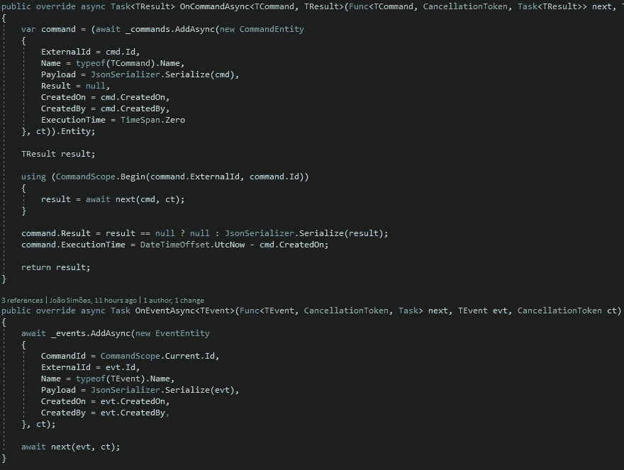

# ASP.NET 核心中的中介管道审计

> 原文：<https://medium.com/geekculture/auditing-with-mediator-pipelines-in-asp-net-core-be34cf3551b?source=collection_archive---------0----------------------->

## 审计命令和存储具有横向行为的事件

当实现一个 web 应用程序时，对所有的客户端交互进行某种审计是一个好主意，或者跟踪它们随时间的行为，以确保任何安全漏洞都会被正确记录，或者只是帮助分析系统缺陷。