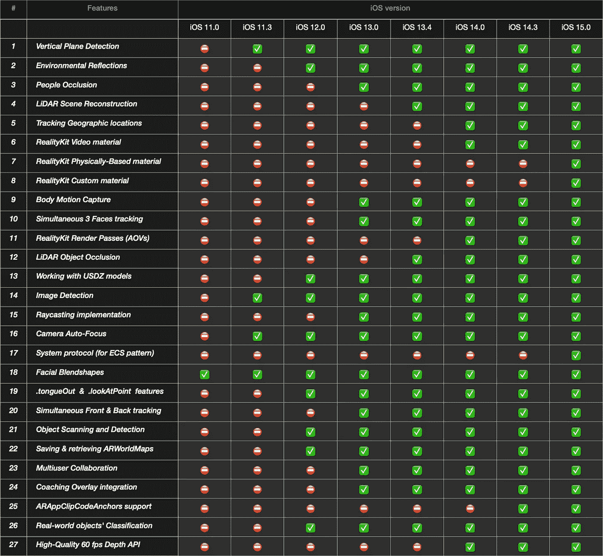
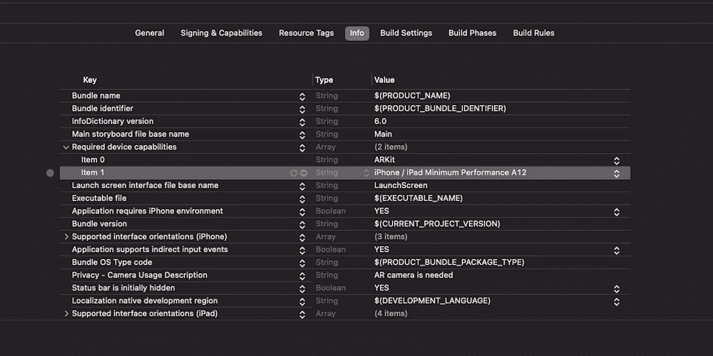

# 增强现实 911—ARKit 和 RealityKit 中基于 iOS 的必要功能的数据透视表

> 原文：<https://medium.com/geekculture/augmented-reality-911-pivot-table-of-available-features-in-arkit-and-realitykit-807dc03aa298?source=collection_archive---------12----------------------->


尽管 2017 年年中发布的 ARKit 的第一个版本包含了一堆基本功能(没有这些功能，很难想象任何现代 AR 框架的价值)，但下表并没有包含所有这些基本功能——它包含了最新的成熟功能。

# 以 iOS 为中心的功能

下面的数据透视表旨在让苹果开发者清楚地了解 ARKit 5.0 和 RealityKit 2.0 在特定 iOS 版本中将为他们提供哪些关键功能。



在 Xcode 中，您可以检查您感兴趣的配置是否受支持。例如，以下代码片段可帮助您的示例应用程序检查设备是否支持应用程序入口点的地理追踪。将此代码粘贴到 *AppDelegate* 文件中。

```
**import** ARKit**@main class** AppDelegate: UIResponder, UIApplicationDelegate { **var** window: UIWindow? **func** application(_ application: UIApplication, 
                 didFinishLaunchingWithOptions launchOptions:       
                 [UIApplication.LaunchOptionsKey: **Any**]?) -> Bool { **if** !ARGeoTrackingConfiguration.isSupported { **let** storyboard = UIStoryboard(name: "Main", bundle: **nil**) window?.rootViewController = storyboard
    .instantiateViewController(withIdentifier: "Unsupported Config")
        } **return true** }
}
```

或者，你可以在 *ViewController* 中查看用户的 iOS 设备是否支持全球追踪会话中的面部追踪。

```
**override func** viewWillAppear(_ animated: Bool) {  
    **super**.viewWillAppear(animated)

    **guard** ARFaceTrackingConfiguration.isSupported,
          ARFaceTrackingConfiguration.supportsWorldTracking
    **else** { 
        fatalError("Can't fulfil a simultaneous tracking") 
    } **let** config = ARFaceTrackingConfiguration()
    config.isWorldTrackingEnabled = **true** arView.session.run(config)
}
```

这个*卫士*的声明不言自明:

```
**guard** ARWorldTrackingConfiguration.supportsSceneReconstruction(
                                            .meshWithClassification)
**else** {
    print("A device with a LiDAR scanner is required.")
    **return**
}
```

# 以芯片为中心的特性

除了基于 iOS 版本的限制，苹果还引入了基于芯片组版本的限制。如果您使用的是比配有 ***A12 仿生*** 型号更早的设备，您将无法使用以下重要功能:

*   真实世界表面的分类
*   同时 3 个人脸跟踪
*   人群遮挡
*   前后摄像头同步跟踪
*   光线跟踪阴影支持
*   真实世界身体 MoCap
*   地理位置跟踪*(需要 GPS 传感器)*

因此，不要忘记为 Xcode 的*信息*标签提供"*最低性能 A12"* 功能。



***提示:*** Xcode 13 已经没有单独的 ***Info.plist*** 文件了。

然而，在 Xcode 12 中，或者如果您在 Xcode 13 中打开以前的 Xcode 项目，
您将能够在 ***Info*** 属性列表文件中写入 XML 代码。

```
<plist version="1.0">
    <dict> <key>**UIRequiredDeviceCapabilities**</key>
        <array>
            <string>**arkit**</string>
            <string>**armv7**</string>
            <string>**iphone-ipad-minimum-performance-a12**</string>
        </array>

        <key>**NSCameraUsageDescription**</key>
            <string>**Your AR camera is needed**</string> </dict>
</plist>
```

# 支持的设备

下表是 iOS 15 支持 ARKit 5.0 的 iPhones 列表。

```
|-----------------|--------------|--------------|--------------|
|      **Model**      |     **Chip **    |  **Process**, **nm** | **Tera Ops/sec** |
|-----------------|--------------|--------------|--------------|
|    iPhone6s    |      A9      |      16      |     0.250    |
|-----------------|--------------|--------------|--------------|
|   iPhoneSE.1   |      A9      |      16      |     0.250    |
|-----------------|--------------|--------------|--------------|
|    iPhone7     |      A10     |      16      |     0.365    |
|-----------------|--------------|--------------|--------------|
|    iPhone8     |      A11     |      10      |     0.600    |
|-----------------|--------------|--------------|--------------|
|    iPhoneX     |      A11     |      10      |     0.600    |
|-----------------|--------------|--------------|--------------|
|  iPhoneXr/Xs   |      A12     |       7      |     5.000    |
|-----------------|--------------|--------------|--------------|
|    iPhone11    |      A13     |       7      |     5.500    |  
|-----------------|--------------|--------------|--------------|
|   iPhoneSE.2   |      A13     |       7      |     5.500    |
|-----------------|--------------|--------------|--------------|
|    iPhone12    |      A14     |       5      |    11.000    |
|-----------------|--------------|--------------|--------------|
|    iPhone13    |      A15     |       5      |    15.800    |
|-----------------|--------------|--------------|--------------|
```

# 捐赠给作者


Click on the picture to make the QR code bigger

```
addr1q9w70n62nu8p7f9ukfn66gzumm9d9uxwppkx7gk7vd7gy0ehfavj97gkncwm8t8l8l8x9e4adzmw2djh4y5gd9rmtewqr99zr3
```

目前就这些。

如果这篇帖子对你有用，请按下 ***拍下*** 按钮，按住*即可。在 Medium 上，每个帖子最多可以拍 50 次*。**

**你可以在我在 [StackOverflow](https://stackoverflow.com/users/6599590/andy-fedoroff) 上的帖子中找到更多关于 ARKit、RealityKit 和 SceneKit 的信息。**

**后会有期！**