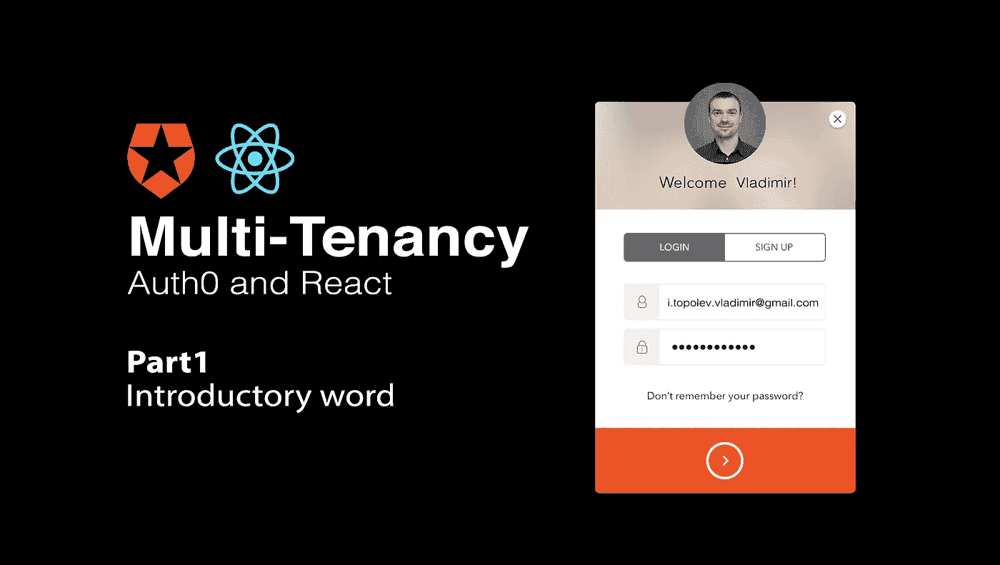
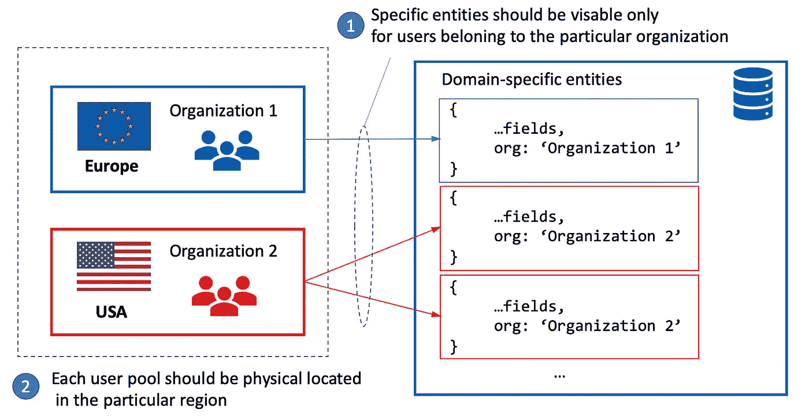
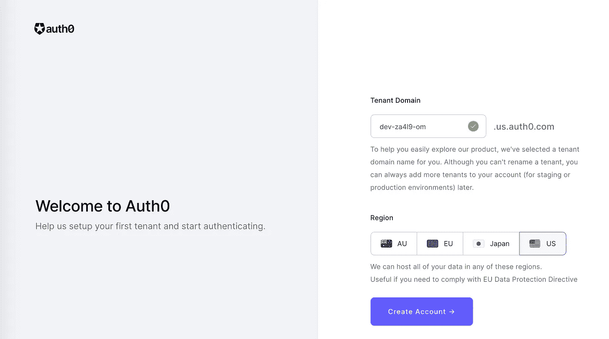
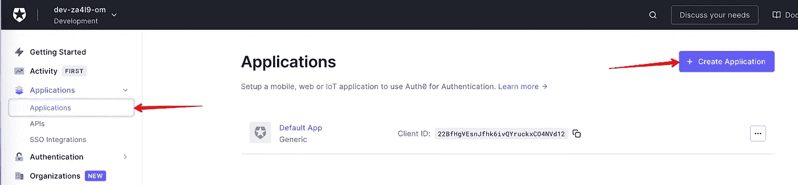
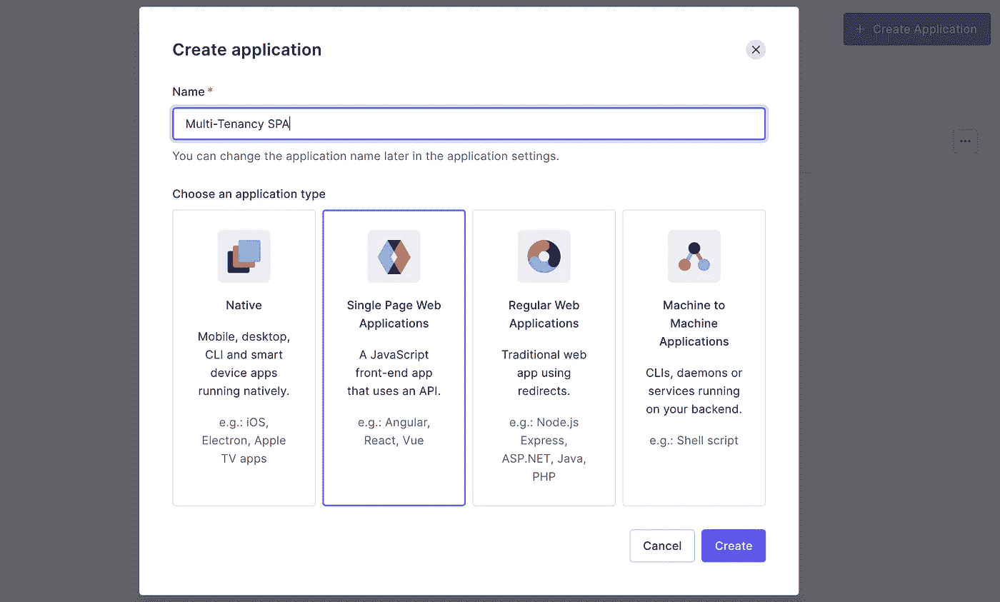
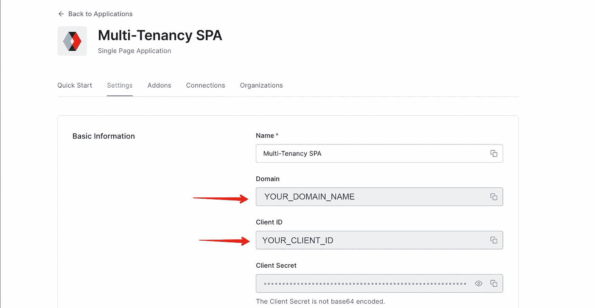
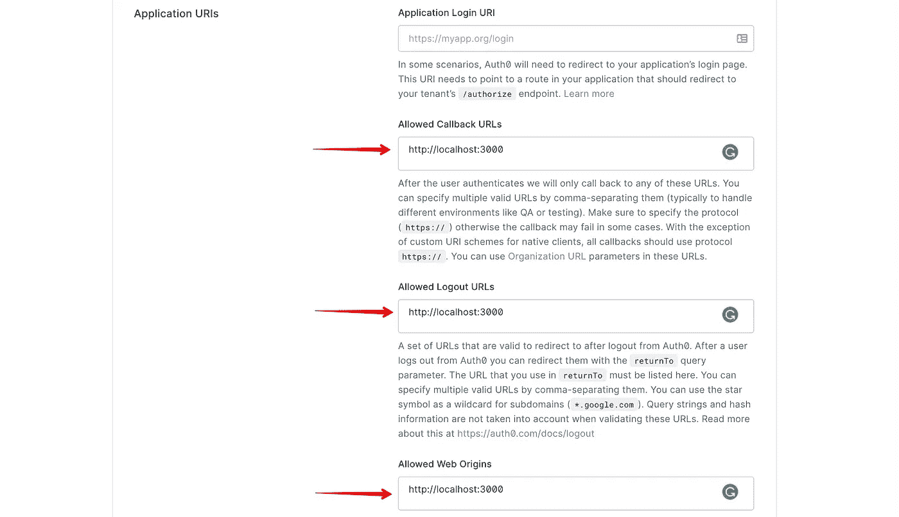
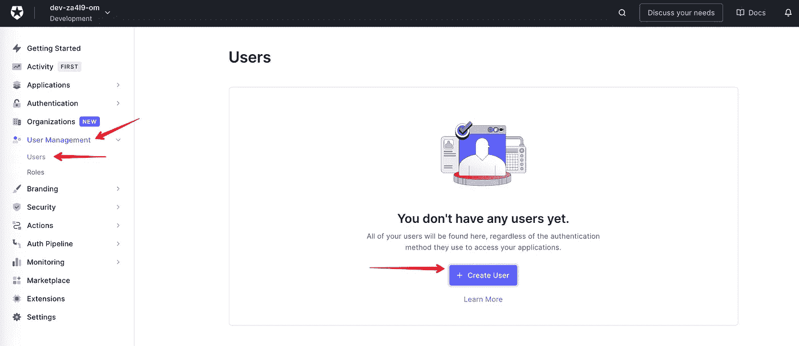
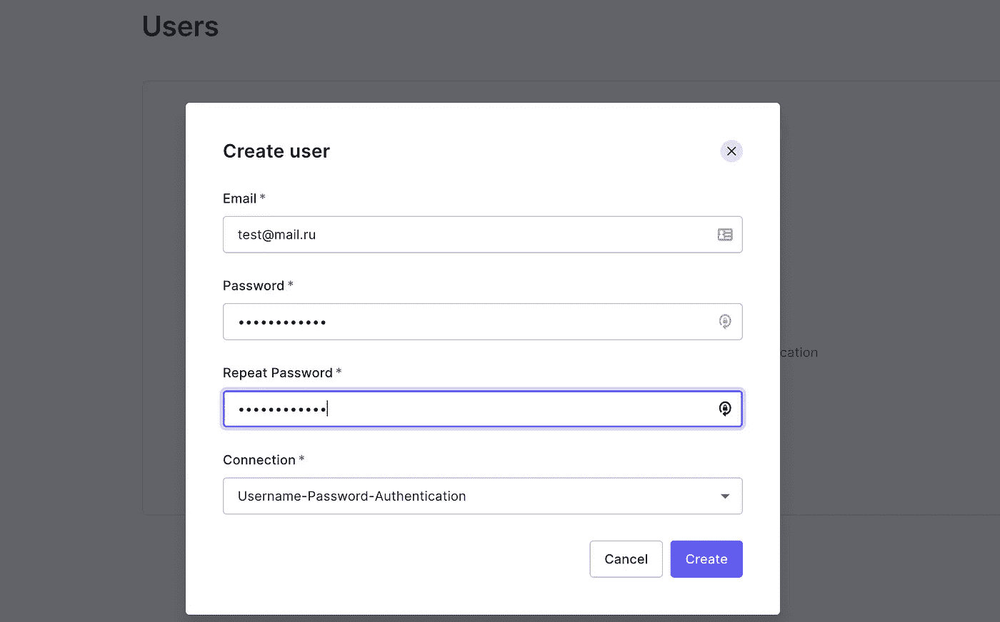

# 带 React 的 Auth0 多租户。第一部分:引言

> 原文：<https://medium.com/geekculture/auth0-multi-tenancy-with-react-part1-introductory-word-7f2782cf71d?source=collection_archive---------26----------------------->

## 这是一组介绍使用 React 和 Auth0 构建多租户架构的可能方法的文章。我们将为每个可用选项实施 POC(概念验证),并强调每个选项的利弊。它让你清楚地了解为当前项目选择哪些选项。



# **文章系列内容:**

1.  带 React 的 Auth0 多租户。第一部分:引言— **我们现在正在读这篇文章**
2.  [Auth0 多租户与 React。第 2 部分:多租户，其中一个 Auth0 租户将特定于租户的元数据附加到用户](/geekculture/auth0-multi-tenancy-with-react-part2-multi-tenancy-attaching-tenant-specific-metadata-to-the-user-e125aa585e32)
3.  带 React 的 Auth0 多租户。第 3 部分:具有不同数据库连接的一个 Auth0 租户的多租户
4.  带 React 的 Auth0 多租户。第 4 部分:具有多个授权租户的多租户— **TBD**

您可以自己实现授权，但它不适用于企业应用程序，在企业应用程序中，您更可能使用已经实现的决策，如 Auth0、Azure Active Directory 等。这里我们要考虑更深层次的 Auth0。

Auth0 针对任何知名技术(React、Angular、Vue、NodeJS 等)发布的帮助单租户应用集成 Auth0 的文章有很多:[*auth 0*](https://auth0.com/docs/quickstarts)入门。

在这里，我们将重点关注多租户架构和一些可能的实现方式。有几种方法可以做这件事。

# 什么是多租户？

> **多租户**是指一个软件实例运行在一台服务器上，多组用户可以访问该服务器。

# 多租户何时适用？

例如，您正在开发一个可能由不同组织使用的应用程序，并且您有一些特定于领域的实体，这些实体必须仅对属于特定组织的用户可见。当你的应用被认为是一个刚起步的小应用时，将用户的所有个人数据保存在一个数据库中可能是一个好主意，但当它增长时，最好将每个组织的用户分开。有时，它还可以帮助以更公平的方式在组织之间分摊基础架构成本(组织拥有的用户越多，应该支付的成本就越多)。所有这些业务案例都应该提前考虑，并反映在架构决策中。或者，您应该为项目制定一个路线图，并根据项目的成功程度，从单租户架构迁移到多租户架构，查看所有迁移选项，并估计可能需要的工作量。

此外，如果您的应用程序应该在不同的地区工作，如美国、欧洲，一些法律要求可能会强制您将用户存储在数据库中，该数据库实际上位于用户来自的特定地区(图 1)。



Figure 1 — Reasons to apply multi-tenancy architecture

Auth0 提供了几种分离用户的方法:

1.  Auth0 允许**在特殊属性** `app_metadata`或`user_metadata`中存储与用户相关的任何应用程序属性，例如，您可以保存用户属于哪个组织。这些属性可以在用户创建期间通过 Auth0 Dashboard 或通过 [Auth0 管理 API](https://auth0.com/docs/api/management/v2) 保存
2.  Auth0 允许**在一个租户**中创建多个连接，每个连接将用户存储在一个单独的数据库中。
3.  Auth0 允许**为每个组织**创建多个租户，您可以选择哪个区域更适合您

我们将回顾每一个可用的选项，将会有一堆文章，每篇文章都致力于每一个选项。我们将考虑利弊，并深入了解每个选项的适用范围。

但是在进一步讨论之前，让我们将 Auth0 集成到用于单租户架构的 React 应用程序中。

# 设置授权 0 租户

如果您已经知道如何做，您可以跳过这一节，但它也将用于下一篇文章，至少是对这一节的快速回顾。

## 租户创建

在继续之前，我只是快速地跟随着您抛出创建租户的过程。一旦创建了您的 Auth0 帐户(它是免费的)，您需要创建第一个租户(图 2)。



Figure 2 — Tenant creation

在这里，您需要提出一个租户域名，并根据您的法律要求选择所需的区域。

## 应用程序创建

我们将开发一个单页面应用程序，因此让我们为此创建一个应用程序:



Figure 3 — Application creation flow

将应用程序名称和应用程序类型定义为 SPA:



Figure 4 — Create an Application for SPA

在**设置**选项卡中创建应用程序后，您将看到 ***域*** 和 ***ClientID*** ，稍后我们将在 React 应用程序中使用它们:



Figure 5 — Application settings

在我们继续之前，我们需要完成应用程序设置并定义以下字段: ***允许回拨 URL、允许注销 URL、允许 Web 源*** 。我们将在本地开发 React 应用程序，它将在`http://localhost:3000`中运行，因此我们需要为所有提到的字段设置此 URL:



Figure 6 — Tenant redirect URI settings

我们现在完成了 Auth0 应用程序设置。

# 用于单租户架构的 Auth0 与 Auth0 集成

让我们用`create-react-app`搭建 React 应用程序，并安装由 Auth0 团队和`material-ui`开发的 [Auth0 React SDK](https://www.npmjs.com/package/@auth0/auth0-react) ，作为所有必要组件的库:

```
npx create-react-app auth0-multitenancy --template typescript
npm i -S @auth0/auth0-react @material-ui/core
```

首先，让我们创建一个`Layout`组件，它使用`Logout`按钮为任意页面呈现任意内容的静态标题:

之后，让我们实现一个页面来呈现用户的个人信息:

最后，将该页面放入`App.tsx`组件，并用 Auth0 库中的`Auth0Provider`进行包装:

请注意，我们用`withAuthenticationRequired`高阶组件(第 5 行)包装`IndexPage`、HOC(关于 HOC 模式的更多细节，您可以在这篇[文章](https://enlear.academy/all-about-high-order-component-and-render-props-patterns-60bc2492548b)中查看)，并且该页面仅对授权用户可见，否则，用户将被重定向到 Auth0 服务器的通用登录页面。在运行应用程序之前，确保在`.env`文件中定义了图 5 中的两个变量:

```
REACT_APP_AUTH0_DOMAIN=YOUR_DOMAIN_NAME
REACT_APP_AUTH0_CLIENT_ID=YOUR_CLIENT_ID
```

> 你可以在*分支的[回购](https://github.com/vladimirtopolev/auth0-multi-tenancy)中找到完整的代码。*

*让我们通过 Auth0 Dashboard 创建第一个用户。进入**用户管理/用户**选项卡，在此创建一个用户，设置电子邮件和密码:*

****

*在应用程序运行之后，当您转到`localhost:3000` URL 时，应用程序会将您重定向到 Auth0 通用登录页面。填写电子邮件和密码后，您将看到此页面:*

**