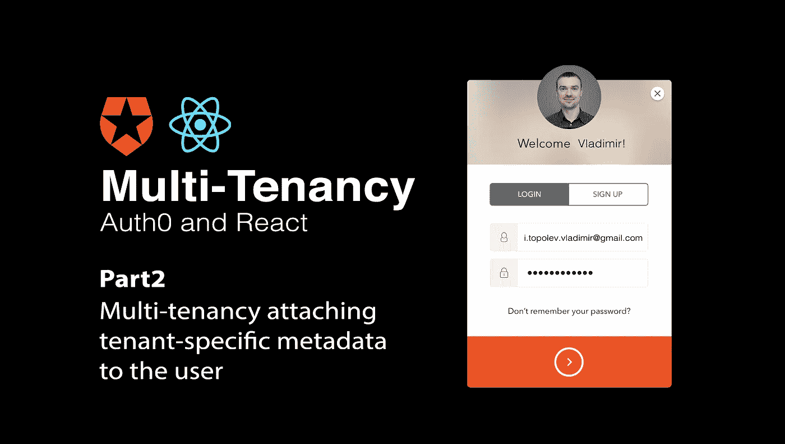
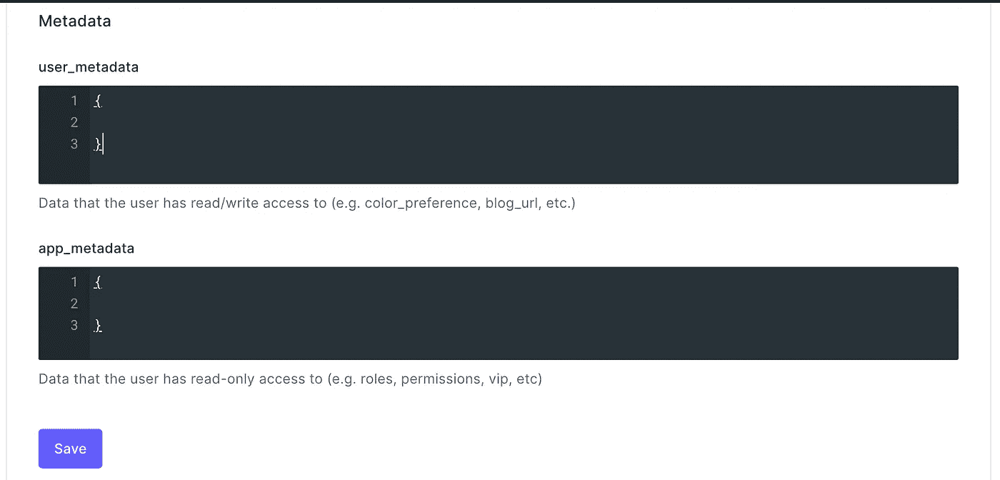
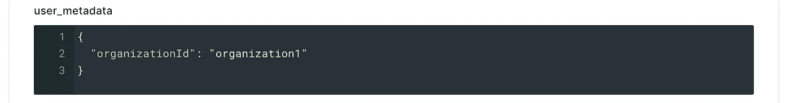
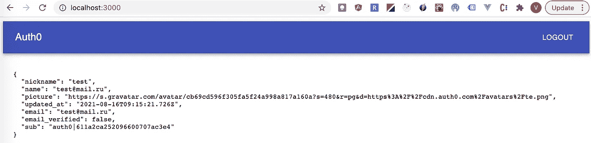
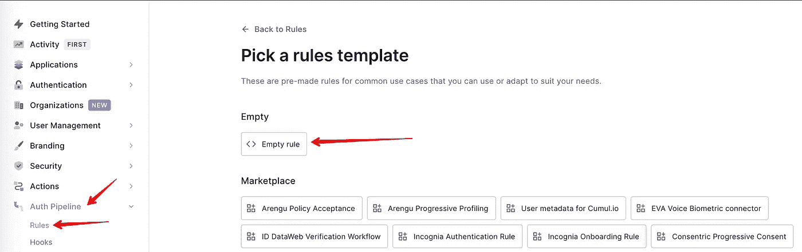
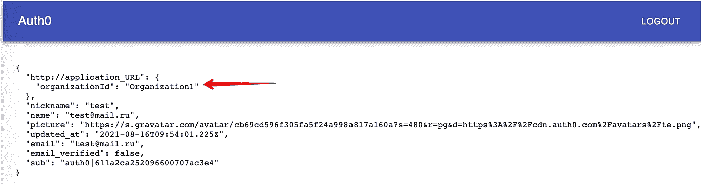
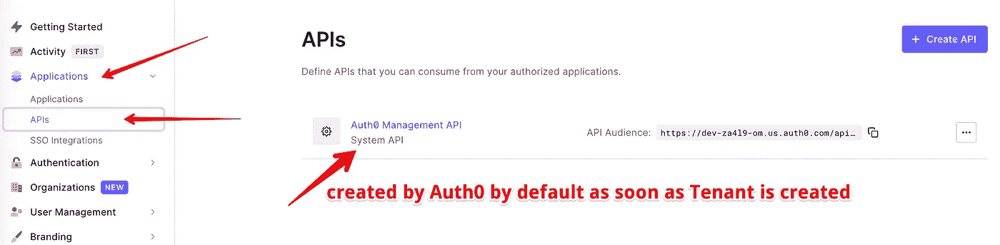
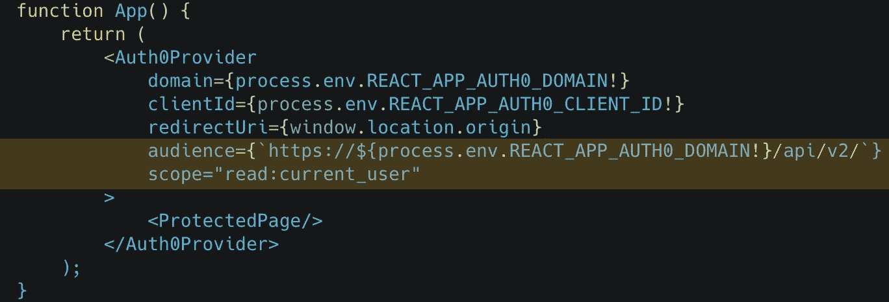
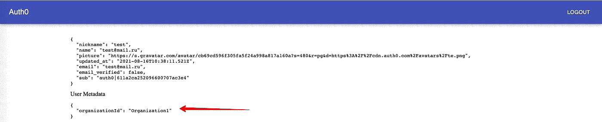

# 带 React 的 Auth0 多租户。第 2 部分:多租户将特定于租户的元数据附加到用户

> 原文：<https://medium.com/geekculture/auth0-multi-tenancy-with-react-part2-multi-tenancy-attaching-tenant-specific-metadata-to-the-user-e125aa585e32?source=collection_archive---------24----------------------->

## 这是一组介绍使用 React 和 Auth0 构建多租户架构的可能方法的文章。我们将为每个可用选项实施 POC(概念验证),并强调每个选项的利弊。它让你清楚地了解为当前项目选择哪些选项。



# 文章系列的内容:

1.  [带 React 的 Auth0 多租户。第一部分:介绍词](/geekculture/auth0-multi-tenancy-with-react-part1-introductory-word-7f2782cf71d)
2.  带 React 的 Auth0 多租户。第 2 部分:一个 Auth0 租户将特定于租户的元数据附加到用户的多租户— **我们现在正在阅读这篇文章**
3.  [带 React 的 Auth0 多租户。第 3 部分:具有不同数据库连接的一个 Auth0 租户的多租户](/geekculture/auth0-multi-tenancy-with-react-part3-multi-tenancy-with-multiple-db-connections-b6b86ba94e10)
4.  带 React 的 Auth0 多租户。第 4 部分:具有多个授权租户的多租户— **TBD**

这是实现多租户架构的最简单的方法，即使您最初采用单租户架构，并且需要将其重建为多租户架构，也不会花费太多时间进行迁移，并且对于已经在使用您的应用程序的用户来说，迁移将会顺利进行。

Auth0 允许将任何自定义应用程序元数据附加到`app_metadata`或`user_metadata`部分。在我们的例子中，我们只是给每个用户添加了`organizationId`。由你决定是否使用`app_metadata`或`user_metadata`——从 Auth0 的角度来看，它们具有相同的行为。

附加元数据有两种方式:
-通过 Auth0 仪表板
-通过 [Auth0 管理 API](https://auth0.com/docs/api/management/v2)

我们同意附加元数据的第一种选择。让我们将`organizationId`附加到我们在上一篇文章中创建的用户上([链接](/geekculture/auth0-multi-tenancy-with-react-part1-introductory-word-7f2782cf71d))。当您点击特定用户并向下滚动页面一点点时，您会看到两个部分，您可以将任何 JSON 对象附加到`app_metadata`或`user_metadata`:



让我们为该用户将`organizationId`连接到`user_metadata`(不要忘记通过点击适当的按钮来保存更改):



当您运行在上一篇文章中创建的应用程序时，您没有发现任何差异，您在页面上的`user_metadata`中根本看不到这个附加字段。



好了，下面介绍两种从`user_metadata` tp 前端应用传播`organizationId`的方法。

## 通过 Auth0 规则传播 user_metadata 属性

这种方式不应该在我们之前实现的应用程序中进行任何代码修改，但它需要设置一个特殊的 [Auth0 规则](https://auth0.com/docs/rules)，该规则会将用户自定义字段传播到 ID 令牌。让我们转到 Auth0 仪表板的 **Auth Pipeline/Rules** 部分，创建一个新的空规则:



规则应该包含显式传播`user_metadata`部分中的`organizationId`属性的逻辑:

```
function addAppMetadata(user, context, callback) {
  context.idToken['[http://application_URL'](http://application_URL')] = {
       organizationId: user.user_metadata 
                  && user.user_metadata.organizationId
  };
  callback(null, user, context);
}
```

保存并重新登录用户后，您将看到以下内容:



## 通过 Auth0 管理请求 user_metadata 属性

让我们开发一个自定义的 React 挂钩，它负责通过 Auth0 管理 API 请求`user_metadata`属性:

请注意，当我们请求`token`时，我们需要明确定义:

*   `audience` —这是我们将要使用的 API(auth 0 管理 API，它是我们在创建租户时创建的):



Figure 1 — Auth0 creates API for Auth0 Management API as soon as we create Tenant

*   `scope`哪个会给权限做这个请求。

让我们在我们的`IndexPage`组件中使用它:

最后一件事是，我们需要向我们的`Auth0Provider`添加两个额外的参数(`scope`和`audience`)，在登录期间，这两个参数会要求用户确认同意从 Auth0 管理 API 获取`user_metadata`信息:



当您重新登录当前用户时，它会要求您获取新的许可，您将会看到`user_metadata`



你可能在这个 [repo](https://github.com/vladimirtopolev/auth0-multi-tenancy) 中发现的所有代码变更，之前已经切换到еру分支[**get-user-metadata-via-auth 0-manag ment-API**](https://github.com/vladimirtopolev/auth0-multi-tenancy/tree/get-user-metadata-via-auth0-managment-api)**。**

## 我应该选择哪种方式来提取用户元数据？

这取决于你选择一种更可取的方式来提取`user_metadata`，这取决于这些字段被需要的频率。毫无疑问，几乎对于每个服务器请求，都需要在服务器上使用`organizationId`来根据组织 ID 过滤特定于域的实体，因此我会选择通过 Auth0 规则提取这些字段，而不是每次都请求。

# 结论

**"+"** 这是模拟多租户架构最简单的方法，如果您以前使用单租户架构，实施甚至迁移它都不需要花费太多时间。

**"+"** 当您需要在应用程序中为新组织引入用户池时，不会增加维护成本，因为应用程序针对一个授权单租户运行，并且所有配置都已在之前完成。

但是有很多缺点，其中最主要的是我们存储用户的方式。我们需要开发特殊的工具和 API，这将允许我们显示特殊的统计数据，例如，有多少用户属于每个组织。

**"-"** 另一个重大缺陷是，当我们决定在一个新的地点建立一个新的组织时，我们没有办法在物理上分离用户。这个国家可能有一些具体的法律要求，迫使我们遵守规则，将所有个人信息物理存储在特殊区域。在我们的例子中，所有用户将被保存在我们创建该租户的区域的内部 Auth0 DB 中，我们无法用这种方法满足这一要求。