# 带 React 的 Auth0 多租户。第 3 部分:具有多个数据库连接的多租户

> 原文：<https://medium.com/geekculture/auth0-multi-tenancy-with-react-part3-multi-tenancy-with-multiple-db-connections-b6b86ba94e10?source=collection_archive---------13----------------------->

## 这是一组介绍使用 React 和 Auth0 构建多租户架构的可能方法的文章。我们将为每个可用选项实施 POC(概念验证),并强调每个选项的利弊。它让你清楚地了解为当前项目选择哪些选项。

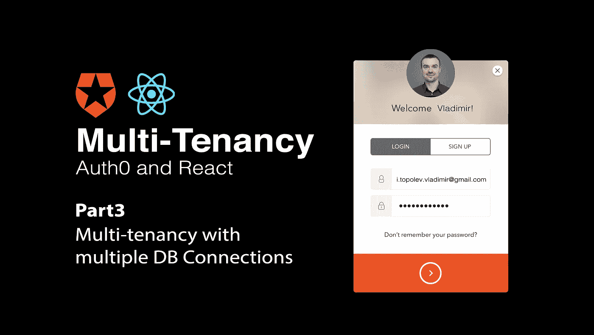

# 文章系列的内容:

1.  带 React 的 Auth0 多租户。第一部分:介绍词
2.  [Auth0 多租户与 React。第 2 部分:多租户，其中一个 Auth0 租户将特定于租户的元数据附加到使用中](/geekculture/auth0-multi-tenancy-with-react-part2-multi-tenancy-attaching-tenant-specific-metadata-to-the-user-e125aa585e32)
3.  带 React 的 Auth0 多租户。第 3 部分:具有多个数据库连接的多租户— **我们现在正在阅读这篇文章**
4.  带 React 的 Auth0 多租户。第 4 部分:具有多个授权租户的多租户— **TBD**

Auth0 允许为每个 Auth0 租户创建多个连接。

> 连接是 Auth0 和用户源之间的关系(图 1)。

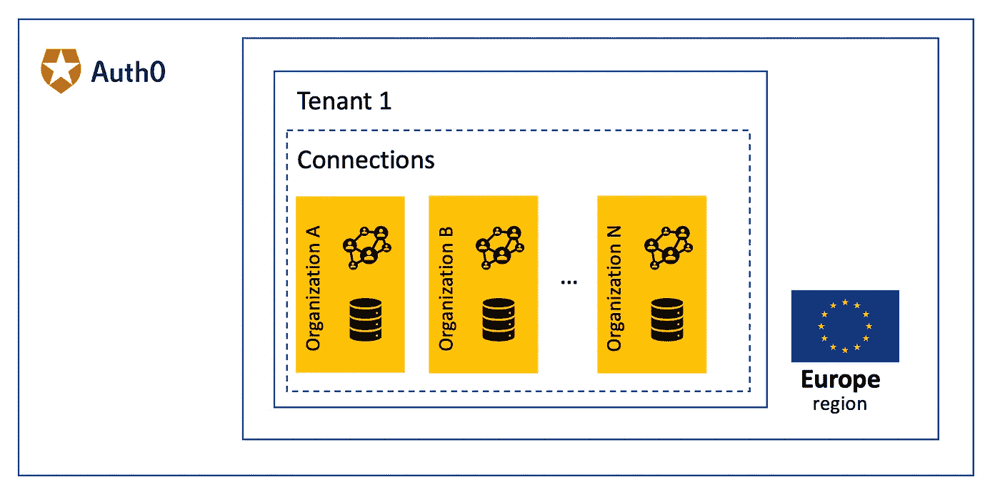

Figure 1 — Multi-Tenancy Architecture with multiple DB Connections

一旦您创建了第一个 Auth0 租户，Auth0 就会为我们创建第一个默认连接，名称为 ***用户名-密码-身份验证*** 。您可以通过 Auth0 Dashboard 仔细检查，然后转到**认证/数据库部分**:

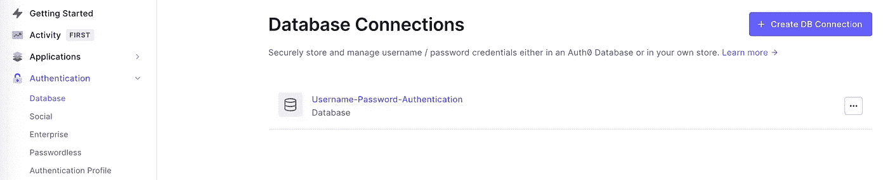

Figure 2— Default connection

目前，您正在创建的所有用户都将使用此连接进行存储，默认情况下，Auth0 将所有个人用户数据存储在内部数据库中，该数据库与创建 Auth0 租户的区域相同。

## 创建 Auth0 DB 连接

在我们的例子中，我们有两个属于两个不同组织的用户池。让我们为每个组织创建两个连接(单击 Create DB Connection 按钮，图 1)，每个连接对于每个授权租户都有一个唯一的名称:

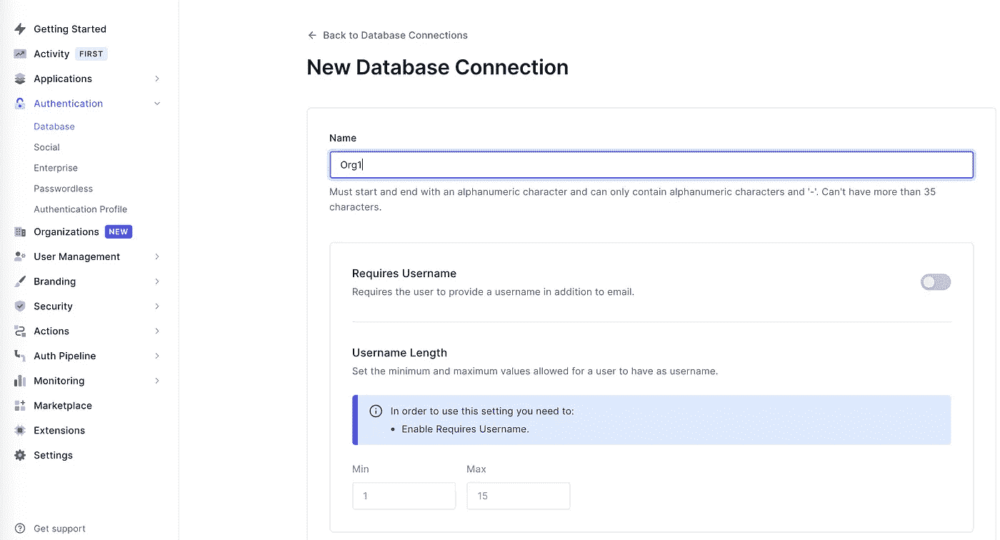

Figure 3— Create new DB Connection for Organization1

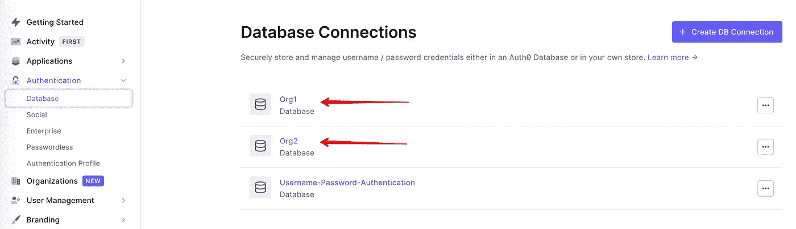

Figure 4— DB Connections for each Organization

一旦创建了连接，就转到它并启用 API，我们可以在这些应用程序中使用它。转到**应用**选项卡，并启用多租户 SPA，它已在上一篇文章中创建([链接](/geekculture/auth0-multi-tenancy-with-react-part1-introductory-word-7f2782cf71d)):

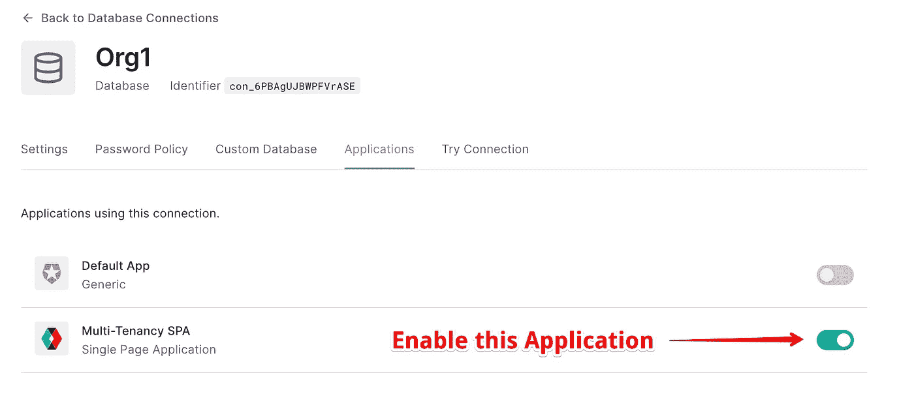

Figure 5 — Enabling SPA Application for Connection

## 属于不同连接的用户创建

出于测试目的，让我们创建两个属于不同组织(连接)的用户。您可以通过两种方式创建它们:

*   通过 Auth0 仪表板
*   通过 [Auth0 管理 API](https://auth0.com/docs/api/management/v2)

我们遵循第一种方式，转到 Auth0 仪表板的**用户管理/用户**并点击**创建用户**按钮。像往常一样，您需要定义电子邮件、密码，因为我们创建了多个连接，所以为第一个用户选择了`Org1`连接:

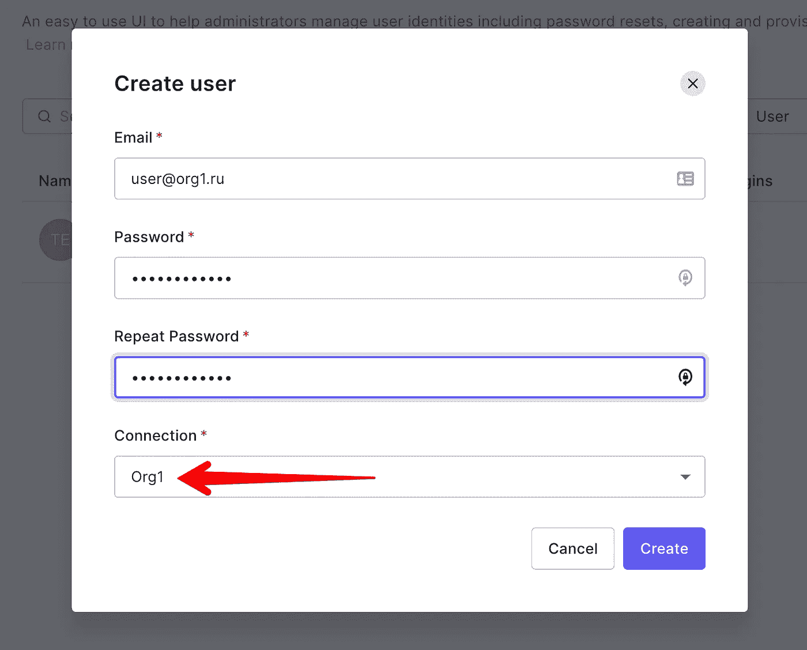

Figure 5 — User creation for Connection belongs to Organization 1

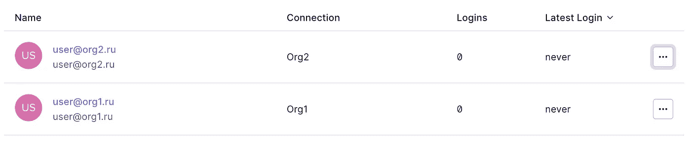

Figure 6 — Created users belong to different Organizations (Connections)

## 反应应用程序实施

您可能已经从以前的文章中了解到，我们用`Auth0Provider`包装所有的 React 树，其中我们定义了`domain`、`clientId`和`redirectUri`

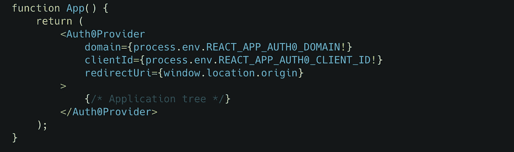

由于我们为每个组织使用不同的数据库连接，我们还需要定义我们将使用哪个连接:

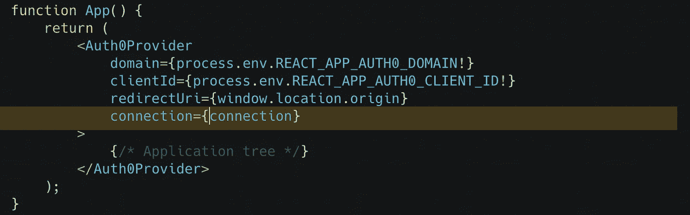

我们需要回答的第一个问题是，我们如何在前端发现用户试图从哪个组织登录？

有两个选项可以实现

## 用组织选择器区分组织

在用定义了特定名称`connection`的`Auth0Provider`包装应用程序树之前，我们需要让用户选择他/她来自哪个组织(图 4)。

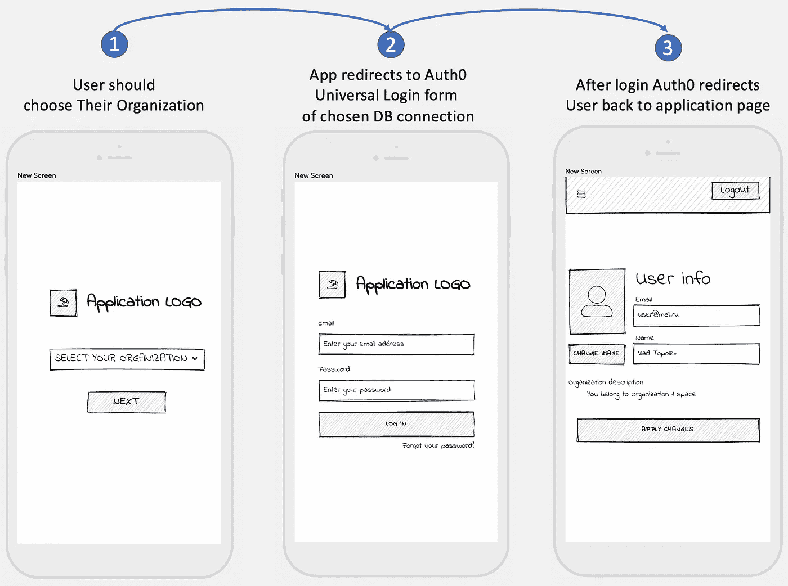

Figure 7 — User workflow to login

只有在这之后，我们才可能知道特定组织的连接名称。让我们创建一个 JSON 文件，它包含一个对象数组，这些对象包含可用组织的元数据以及与之相关联的 Auth0 连接的名称:

```
export const ORGANIZATIONS = [
   {
      "name": "Organization One",
      "connection": "Org1"
   },
   {
      "name": "Organization Two",
      "connection": "Org2"
]
```

让我们实现`OrganizationSelector`组件，没有什么特别的，我们只是将`ORGANIZATIONS`列表传递给包含来自`material-ui`库的简单`Select`组件的组件:

我们实现的核心是负责定义所需连接的`MultiTenancyAuth0Provider`。在我们查看特定的实现之前，让我们讨论一些细节。假设用户选择了我们保存在内存中的组织，并点击**下一步**按钮。下一步是使用通用登录将用户重定向到 Auth0 服务器。在用户被成功授权后，Auth0 重定向回我们的应用程序(图 8)。

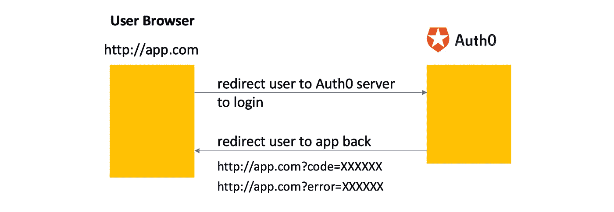

Figure 8 — Redirections to Auth0 server and back

在这种情况下，保存在内存中的组织将被移走。因此，我们需要将其保存在`localStorage`或`sessionStorage`中。由于该过程应该在一个浏览器选项卡中发生，`sessionStorage`更适合于此目的。该算法将具有以下逻辑:

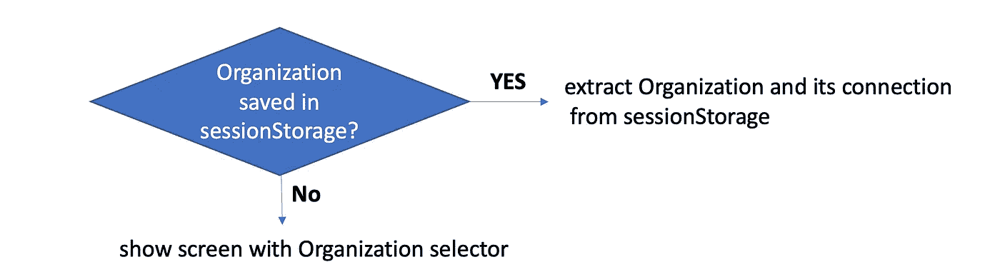

Figure 9 — Logic to define Organization Connection

这里还有一个问题。让我们假设用户不小心选择了我们在`sessionStorage`中保存的错误组织。你有什么方法可以让我们不通过浏览器开发工具手动清除`sessionStorage`而选择另一个组织吗？按照这种逻辑，每次当我们在同一个浏览器选项卡中点击应用程序 URL 时，应用程序都会用错误的连接将我们重定向到 Auth0。我们可以避免在应用程序中引入两个变量来保持我们选择的组织。第一个是`temporaryOrganization`——它只是为未授权用户提供存储，允许我们在重定向到 Auth0 服务器的阶段暂时保留用户选择。只要 Auth0 将我们重定向回应用程序(我们可以通过分析重定向 URL 的查询属性来定义它，参见图 8:包含查询参数`code`或`error`的每个 URL 都被认为是来自 Auth0 的重定向)。一旦我们发现这是应用程序的重定向阶段，我们就将组织从`temporaryOrganization`移动到`localStorage`到属性`authorisedOrganization`并删除`temporaryOrganization`。逻辑将如下:

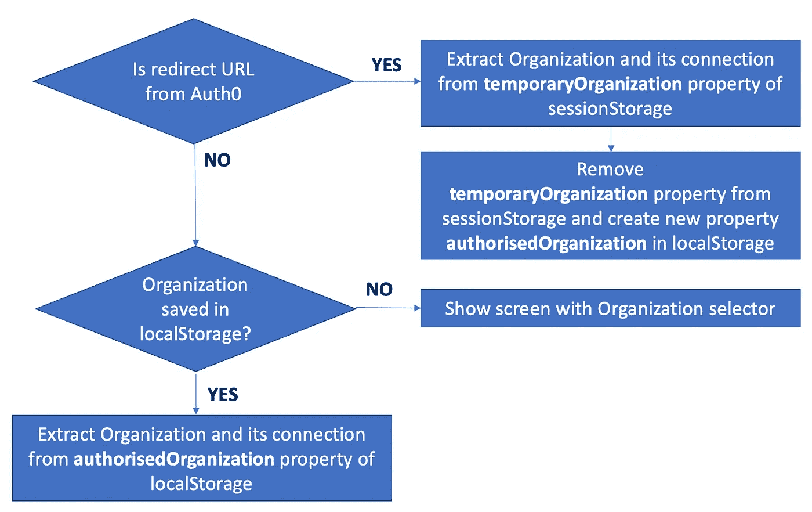

好了，我们来实现`MultiTenancyAuth0Provider`:

让我们改变我们的`App.tsx`组件:

此外，一旦用户想要注销，我们需要清除`Layout.tsx`组件中的所有组织存储:

您可以在分支 [**多租户连接**](https://github.com/vladimirtopolev/auth0-multi-tenancy/tree/multi-tenancy-with-connections) 中的[回购](https://github.com/vladimirtopolev/auth0-multi-tenancy)中找到所有代码

让我们来看看演示:

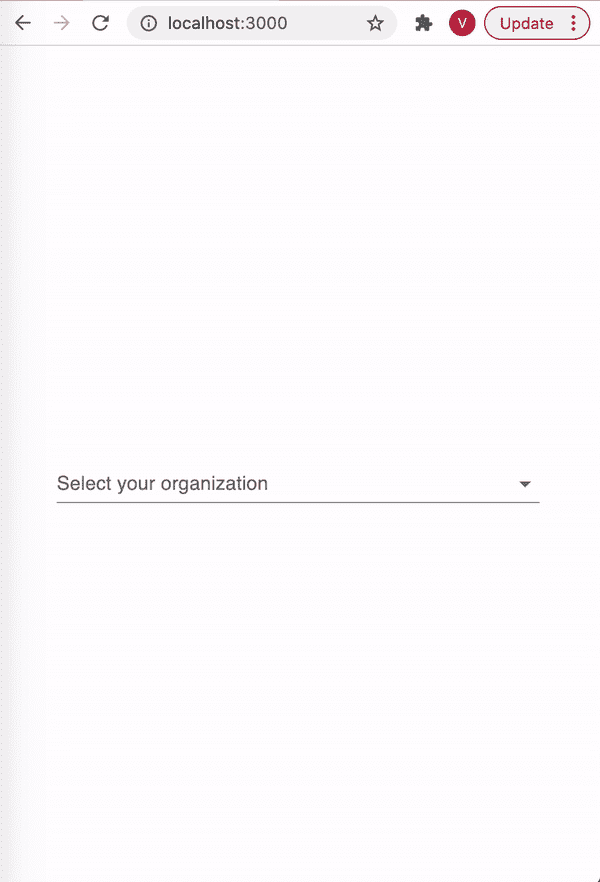

## 通过子域名区分组织

实现这一点的另一种方法是为每个组织使用子域名。例如，如果您通过域`https://app.com`托管您的应用程序，那么您可以使用 URL 的子域作为特定组织的唯一标识符:`https://{organizationName}.app.com`。在我们的例子中，我们可以定义以下 URL:

```
https://org1.app.com
https://org2.app.com
```

# 有没有办法将一个连接的每个用户池放置到不同的区域？

答案是肯定的。Auth0 是一个灵活的系统，当您创建新连接时，默认情况下 Auth0 会将所有用户存储在内部数据库中，该数据库位于您创建 Auth0 租户的同一区域。Auth0 允许连接一个外部数据库，它可以放在您想放的任何地方(图 9)

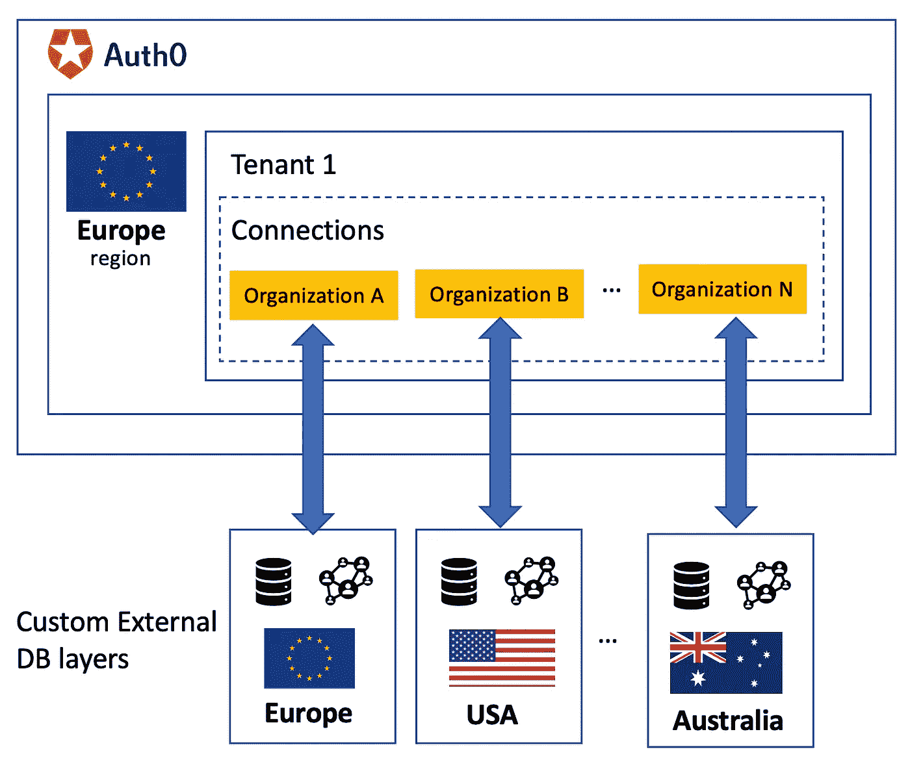

Figure 9 — Connection with Custom DB layers are placed in the necessary region

要了解有关如何连接您自己的数据库存储的更多信息，请阅读此[文章](https://auth0.com/docs/connections/database/custom-db/create-db-connection)。

# 结论

"+"您可以控制个人信息的物理存储位置。Auth0 connection 允许您连接每个连接的外部数据库，该连接可以放置在您想要的任何区域

**"+"** 很容易提取统计信息，如每个组织有多少用户，因为它已经被单独的连接分开

**"+/-"** 用这种架构实现应用程序并不困难，但是比这篇[文章](/geekculture/auth0-multi-tenancy-with-react-part2-multi-tenancy-attaching-tenant-specific-metadata-to-the-user-e125aa585e32)中提供的选项要复杂一点

**"-"** 它增加了维护成本，因为当您将新客户端加载到您的应用程序时，您需要为它创建一个单独的连接，并将其包含在应用程序配置中。