# 向 JWT 认证 Go-GraphQL

> 原文：<https://medium.com/geekculture/authenticate-go-graphql-with-jwt-436c74340d?source=collection_archive---------8----------------------->


## 用 JWT 保护您的 API

当你开发一个 web 应用程序时，当然，认证和授权是应用于你的应用程序的正常事情；限制来宾访问您的资源的某些内容。
一个 web 应用的认证和授权有几种方式，其中最著名的是[**【JWT】**](https://jwt.io/introduction)。

# 什么是 JWT？

JWT (JSON Web Token)是使用 JSON 格式在各方之间安全传输信息的媒介。JWT 可以用秘钥( [**HMAC**](https://www.geeksforgeeks.org/hmac-algorithm-in-computer-network/) 算法)或公钥( [**RSA**](https://www.geeksforgeeks.org/rsa-algorithm-cryptography/) 或 [**ECDSA**](https://www.hypr.com/elliptic-curve-digital-signature-algorithm/) )签名

JWT 结构分为三部分`xxxxx.yyyyy.zzzzz`:

*   页眉
*   有效载荷
*   签名

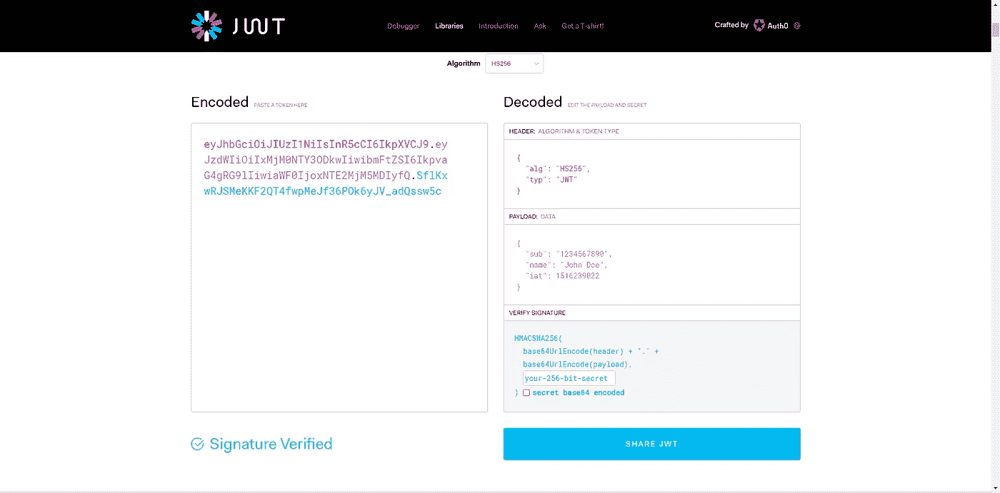

[https://jwt.io](https://jwt.io)

**头**包含令牌使用的算法，以及“ *JWT* ”。
**有效载荷**包含了关于数据的声明(信息)。
**签名**包含哈希头的符号、有效载荷、秘密和算法，这部分用来验证 JSON 是否有效。

# **要求**

*   github.com/99designs/gqlgen
*   github.com/dgrijalva/jwt-go
*   gorm.io/gorm
*   github.com/gorilla/mux
*   github.com/google/uuid
*   docker & docker-compose(数据库/可选)

当然，还有一些 go 编程和 GraphQL 模式的基础知识。这样你们就能更好地理解我的工作了。

使用 [**gqlgen**](https://gqlgen.com) ，我们将生成我们的 GraphQL 服务器。对于数据库，我们将使用 MySQL 并使用 [**GORM**](https://gorm.io) ， [**mux**](https://github.com/gorilla/mux) 连接到数据库，对于 HTTP 路由器，使用 [**jwt-go**](https://github.com/dgrijalva/jwt-go) 生成并验证 jwt。

知识库:[https://github.com/david-yappeter/go-graphql-jwt](https://github.com/david-yappeter/go-graphql-jwt)

# **Graphql 服务器**

首先，我们将创建项目目录并初始化 go 模块:

```
$ mkdir go-graphql-jwt && cd go-graphql-jwt && go mod init myapp# Init Graphql Server
$ go get github.com/99designs/gqlgen
$ go run github.com/99designs/gqlgen init
```

项目目录应该如下所示


After gqlgen init

然后我们将在`schema.graphqls`中创建我们的用户模型:

为了帮助你更快地生成代码，试着把它写在你的`graph/resolver.go`里

`//go:generate go run github.com/99designs/gqlgen`

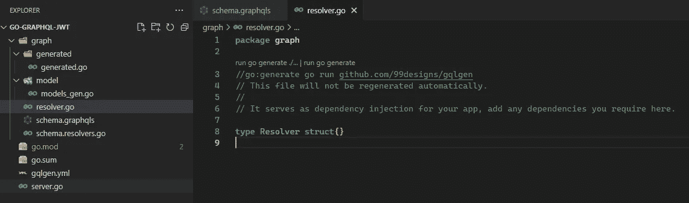

然后，您将能够通过在您的终端上运行`go generate ./...`来生成代码。

在生成你的代码之后，应该会有一些剩余的代码给你一个错误，只需要删除那部分。

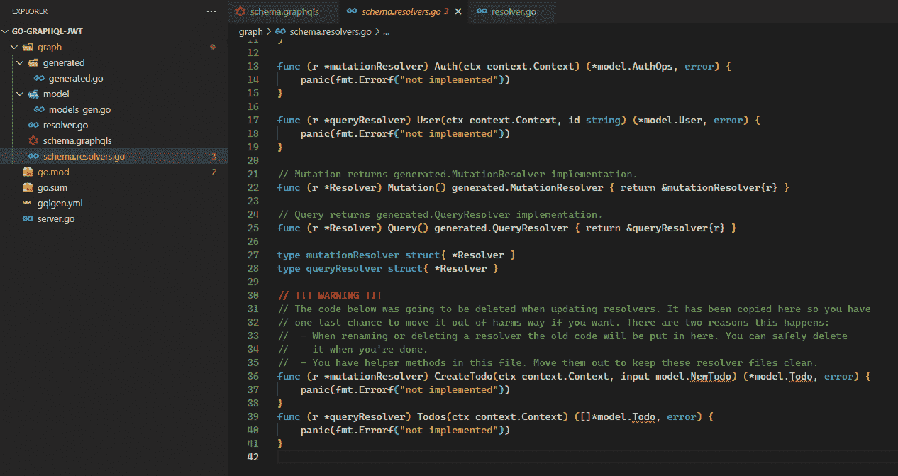

Remove leftover code

然后我们将把我们的`User`模型移到外面，以避免被生成器覆盖。

我们将向模型添加`Password`属性，这样 GORM 就可以自动插入密码。

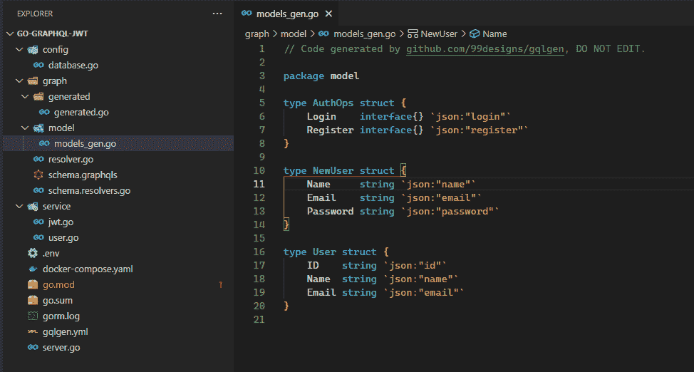

将`gorm`标签添加到模型中，这将有助于我们稍后的表迁移。

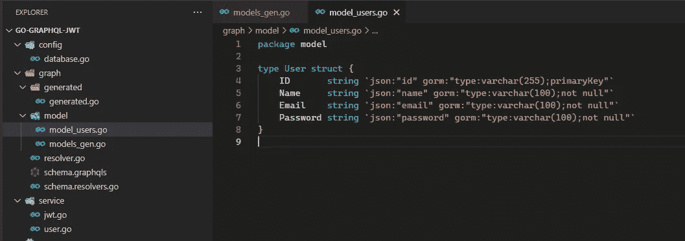

# 数据库配置

下一步是创建我们的数据库连接，我们将使用 GORM，它是一种帮助我们更快开发和更好维护代码的形式。

`config/database.go`

可选地，我们可以在我们的`server.go`上添加数据库 close

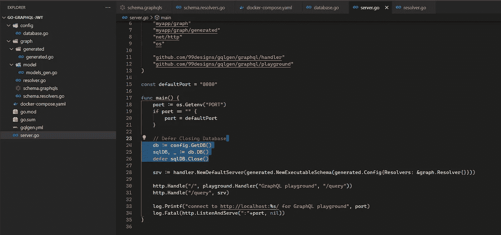

database defer close (optional)

# **带有 Docker & Docker-Compose** 的 MySQL 数据库

在根目录下添加一个`docker-compose.yml`文件:

并使用以下命令运行它:

`docker-compose up -d`

不要忘记在数据库配置的根目录中添加`.env`，示例如下:

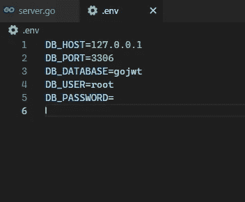

# **JWT &用户服务**

我们将在`service`目录中编写我们的 JWT 和用户服务。
Jwt 会有`JwtGenerate`和`JwtValidate`。
用户将有`UserCreate`、`UserGetByID`、`UserGetByEmail`、
授权将有`UserRegister`和`UserLogin`。

`service/jwt.go`

通过`jwt.NewWithClaims`，它将创建一个带有我们的*自定义声明*的令牌，我们传入第二个参数，在本例中为`JwtCustomClaim`。创建令牌后，我们需要用我们的`JWT_SECRET`值对令牌进行签名，以确保令牌的安全。

稍后，为了验证令牌，我们使用`JwtValidate`,它将令牌作为参数，并返回`*jwt.Token`作为返回值。
`jwt.ParseWithClaims`回调是如何工作的，首先，我们检查令牌的签名方法，我们使用一个秘密`HS256`来签名令牌，所以我们检查令牌的签名方法是否是`*jwt.SigningMethodHMAC`，如果是，我们将返回秘密，所以如果‘秘密’有效，`Jwt.ParseWithClaims`将返回< nil >错误。

稍后，我们将从中间件部分的`*Jwt.Token`中获取`JwtCustomClaim`值。

在我们转向`User`服务之前，我们将首先创建一个密码哈希工具。

`tools/bcrypt.go`

Hash using Bcrypt

然后我们将创建我们的`User`服务

`service/user.go`

在我们创建用户之前，首先我们散列密码，然后给出由`github.com/google/uuid`生成的随机`uuid`。

然后继续进行`auth.go`维修。

`service/auth.go`

在`UserRegister`中，我们会先找到用户。如果找不到用户，我们可以创建帐户并返回 JWT。

对于`UserLogin`，我们会找到用户。如果找到用户，我们返回 JWT。

然后我们将该函数应用于`schema.resolvers.go`

`graph/schema.resolvers.go`

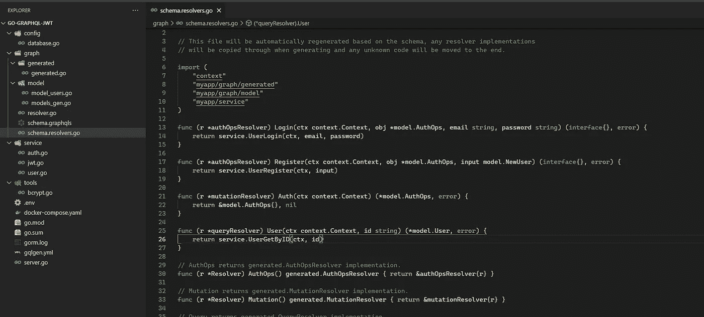

assign the function

# **添加数据库表迁移**

我们将在`migration`目录下创建迁移。

`migration/migration.go`

我们需要将它应用于`server.go`:


apply the migration to server.go

# **认证中间件&指令**

对于中间件，我们将在`middlewares`目录下创建它。

`middlewares/auth.go`

`AuthMiddleware`将被分配给`mux`路由器，稍后，它将从头部获取`Authorization`的值并验证令牌，然后将其分配给请求`context`，稍后我们可以通过调用从`context`获取 CustomClaim 的`CtxValue`来使用该值。

在此之后，我们将创建`Auth`指令，该指令将应用于 GraphQL 受保护的资源，我们将需要更改我们的`graph/schema.graphqls`

`graph/schema.graphqls`

然后再次生成我们的解析器。将在`schema.resolvers.go`中添加“受保护”

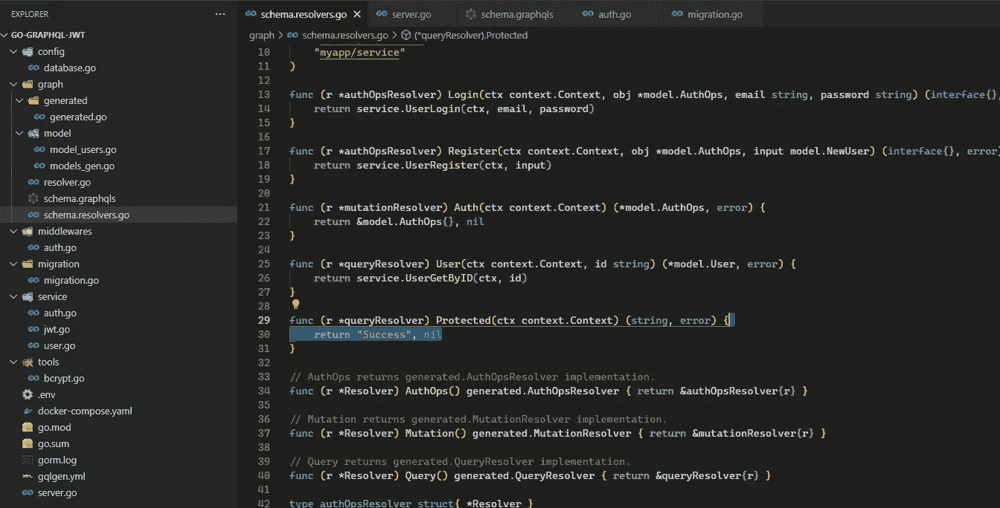

添加一个简单的返回“成功”，nil。

我们需要做的最后一件事是，创建函数并将其应用到指令中

通过复制该部分将其应用于`server.go`

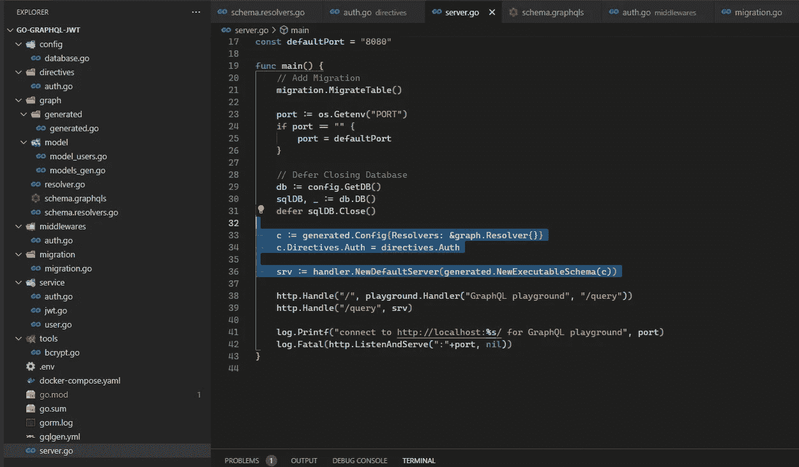

Apply directives

我们的中间件和指令部分已经完成

# **应用中间件**

我们将在`server.go`创建新的`mux`路由器

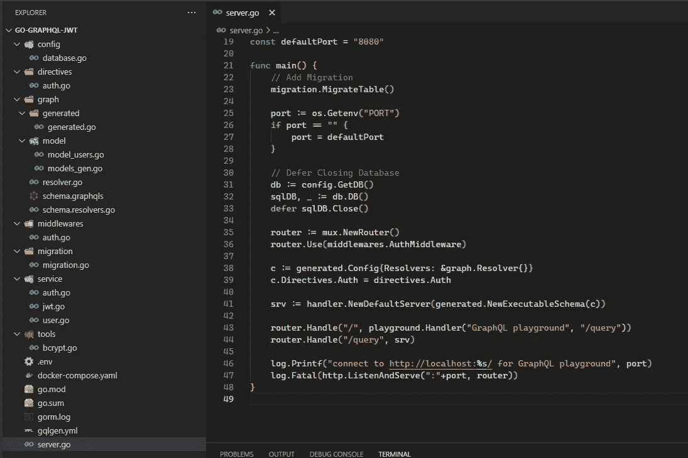

Initialize router and apply middleware

`router.Use(middlewares.AuthMiddleware)`将完成认证工作，而`Auth`指令将在 GraphQL 中处理授权。

# **测试**

使用`go run server.go`运行我们的代码。

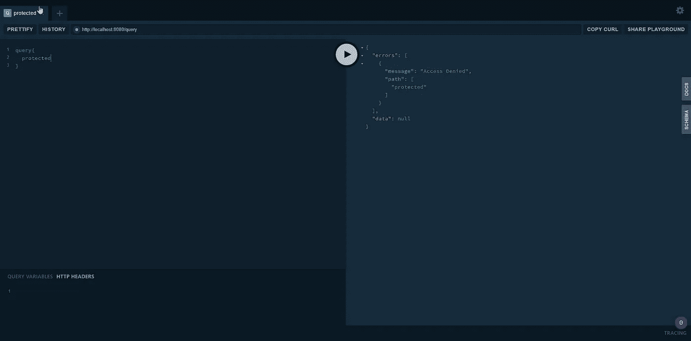

Access Protected without JWT

当我们试图在没有 JWT 的情况下访问`Protected`时，它会返回我们从指令中得到的`Access Denied`。

所以让我们试着注册用户&登录。

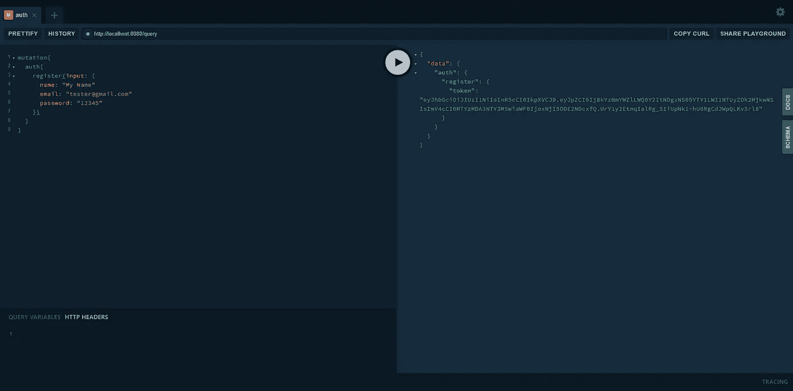

Register User

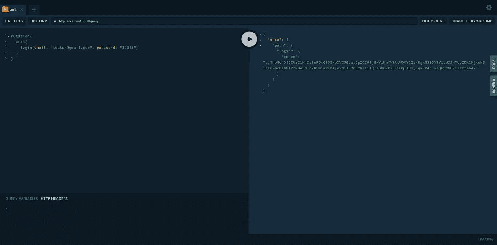

Log in

现在，我将尝试将令牌添加到标头`Authorization`

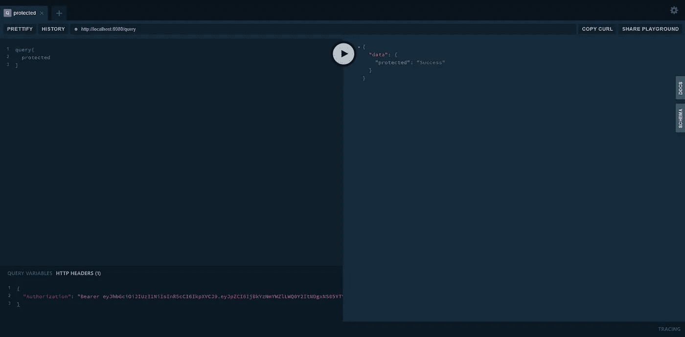

Access protected with token

现在它不会返回任何错误。

这是 Go-GraphQL JWT 的文章的结尾。希望对你有帮助:)。