# 认证和授权

> 原文：<https://medium.com/geekculture/authentication-and-authorization-a5a2eafdde16?source=collection_archive---------7----------------------->

## 真实世界应用程序开发

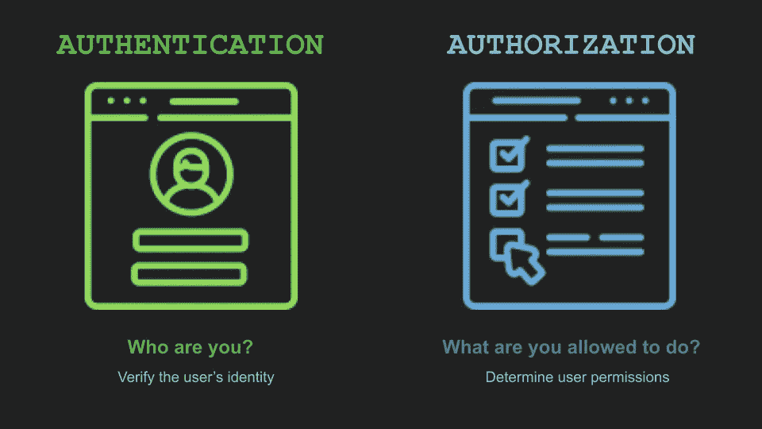

本主题旨在分享在您的应用中实现安全层的正确方法，无论是 Web、移动还是后端服务。

在构建应用程序时，常见的错误是由于它的实现而不是它的设计。尤其是在处理安全问题时。


**安全性**是应用程序中最 ***最重要的*** 部分之一，它经常被忽视，因为时间不够、疏忽、不是优先事项，或者因为技术设计仍在发展中。因此，它导致了一个意外的复杂性，如技术差距，安全漏洞和互联网上的身份被盗。


作为我们团队价值观的一部分，保护我们构建的任何应用程序与其业务功能一样重要。


作为不重视应用程序安全性的代价的一个例子，Parler 由于对其应用程序安全层过于天真而成为技术行业的中心。

最近在 2021 年 1 月发生了一起涉及帕勒的安全事故。上面写着他们的资源是被一个女程序员刮走的，这个女程序员的 twitter 处理程序是@donk_enby。她获得了价值 80 TB 的大量数据。


她甚至把帕勒的档案情况描述为“一群人跑进一栋着火的大楼，试图尽可能多地拿走东西。”

她描述了 Parler 的应用程序，其系统的主要缺陷是:

*   薄弱的 API 安全层(身份验证和授权)
*   数据库标识(ID)不是唯一生成的(UUID)
*   没有数据库查询限制
*   原始资产(视频、图像)

这导致投资回报和应用程序可信度的巨大损失，正如你可以想象的那样:数据的“神圣性”及其安全性应该是社交媒体的重中之重。


因为我们已经知道了应用程序开发中缺乏安全性的代价和后果。现在的问题是，我们如何以及在哪里开始实现安全性？

我们将讨论认证和授权，因为@donk_enby 将这些层描述为她从 Parler 获取所描述的信息量的入口。

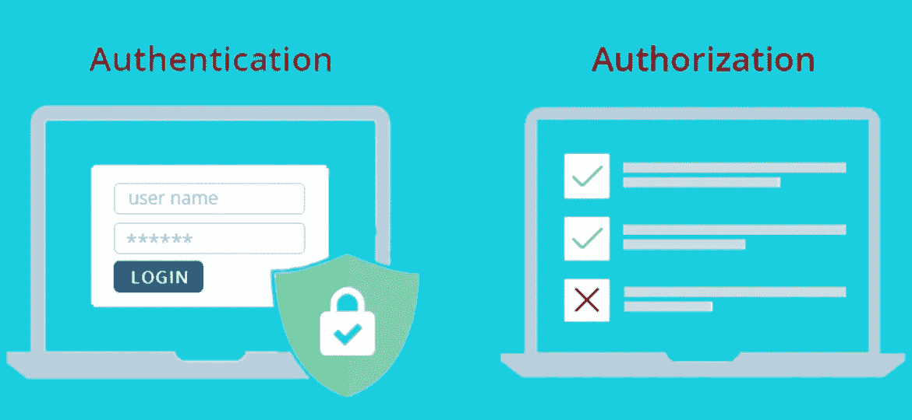

首先，我们需要了解身份验证和授权之间的区别，以及它们如何在您的应用程序中相互配合。

从更高的角度来看，他们的目标是验证用户的身份，并限制用户在应用程序中可以访问的资源列表。

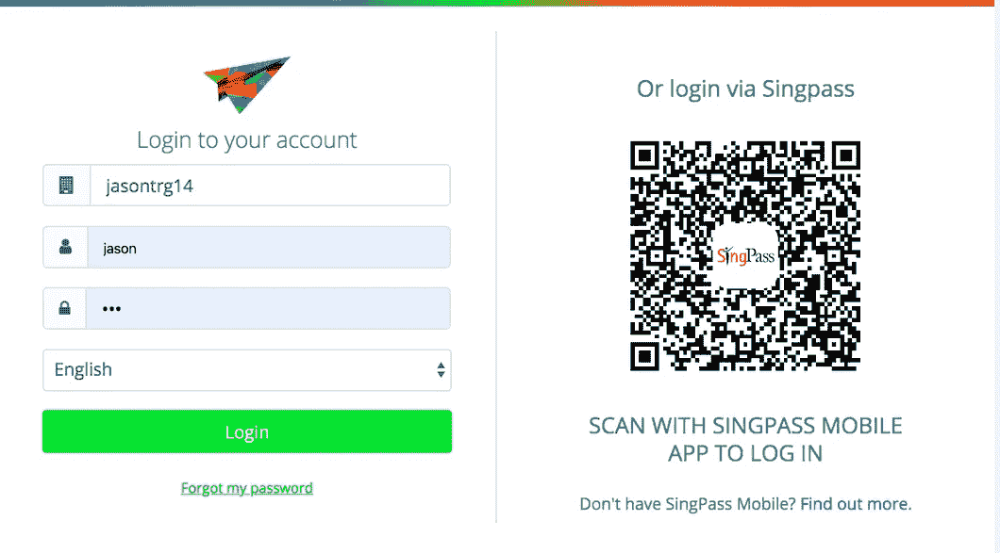

一般来说，身份验证层是这样实现的:当客户端填充必填字段时，请求将传输到服务器或后端服务，然后后端对凭据进行身份验证，如果成功，它会将 JWT 格式的访问令牌返回给客户端。

这是身份验证登录如何工作的基本原则。

在现实世界中，仅仅保证身份验证层的安全是不够的。

我们这样做的方式不同。虽然我们仍然使用第一张图中的相同原则，但是我们通过增加几个步骤来提升它。

这个步骤称为挑战-响应认证。

质询-响应身份验证是一系列协议，其中一方提出质询，另一方必须提供有效答案才能通过身份验证。


我们使用 NONCE 作为从后端发送到前端服务的质询响应。

随机数或加密随机数是随时间变化的任意数量或比特的字符串，仅用于特定目的，以验证数据仅被使用一次。

在你的网络或手机到你的后端服务之间的网络流量中，密码不应该以简单的形式直接发送。

即使哈希密码仍然不够强大，仍然可以被中间人攻击渗透。

# 💡**想法**

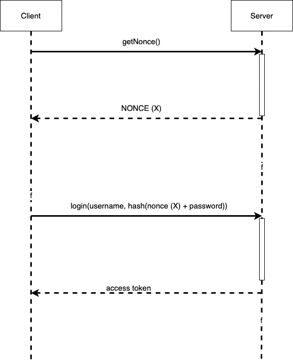

在身份验证层，前端将向后端服务发送一个请求，在有效负载中包含一个公钥。

后端将检查请求的来源，以确保它在预期的域中。然后生成加密随机数，并使用客户端给出的公钥对其进行哈希运算。

生成的随机数将是响应挑战。

该质询将被发送回前端，并使用密钥进行解密以获得随机数。

现在密码将被散列使用 NONCE 作为一个盐。

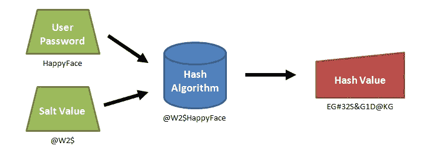

SALTS 用于保护您的密码，作为您的哈希函数的附加属性，以形成一组新的随机字符串。

通过使用这种方法，您可以防止实际的密码暴露给中间人攻击。

然后，一旦用户登录，用户名和散列密码将被发送到后端服务。

然后，后端将使用随机数作为 salt 来验证哈希密码。

验证后，后端将生成一个 JWT，作为响应发送回前端。

有一些高级方法可以实现这一原则，它通常用于安全消息、身份验证和区块链。

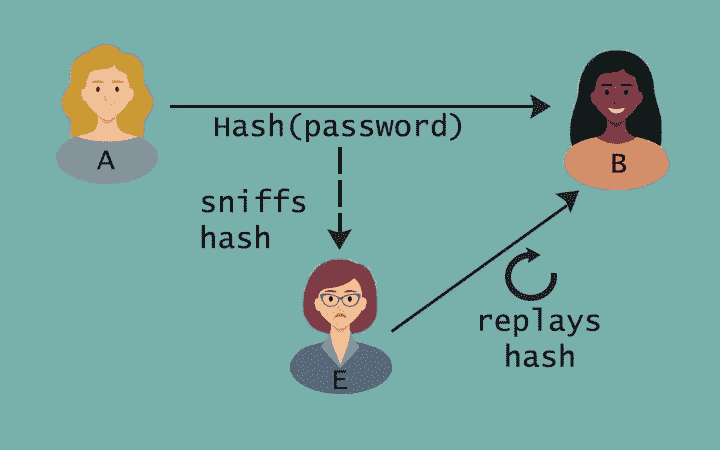

拥有一个好的身份验证实现可以解决中间人攻击或来自应用程序的重放攻击的问题。

# 动态密码|一次性 PIN


它还伴随着另一层安全措施，称为 OTP 服务或一次性 PIN，通过向短信或电子邮件发送一个任意的唯一号码来确认用户身份的合法性，该号码仅在短时间内对一次登录会话有效。

这解决了传统的基于密码的身份验证的问题。也就是说，当有人知道你的真实密码时，就没有办法阻止对你账户的访问。

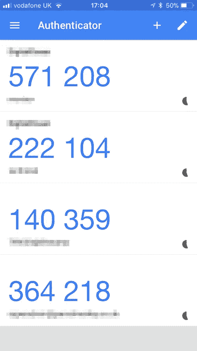

OTP 有多种实现方式，如通过 SMS 的 OTP、第三方验证软件，如 google 验证器或 Microsoft 验证器


或者使用物理安全密钥。

# 替代方案

但是我们不要忘记，如果时间真的是一种奢侈品，您也可以使用第三方身份提供商来满足这些复杂性，同时获得相同或更好的安全性。

## 单点登录身份验证

另一个更简单的解决方案是使用第三方身份提供商，我们通常称之为 SSO 或单点登录身份认证。

其背后的实现更简单，因为您不需要开发，而是将身份服务集成到您的应用程序中。

背后的想法是，

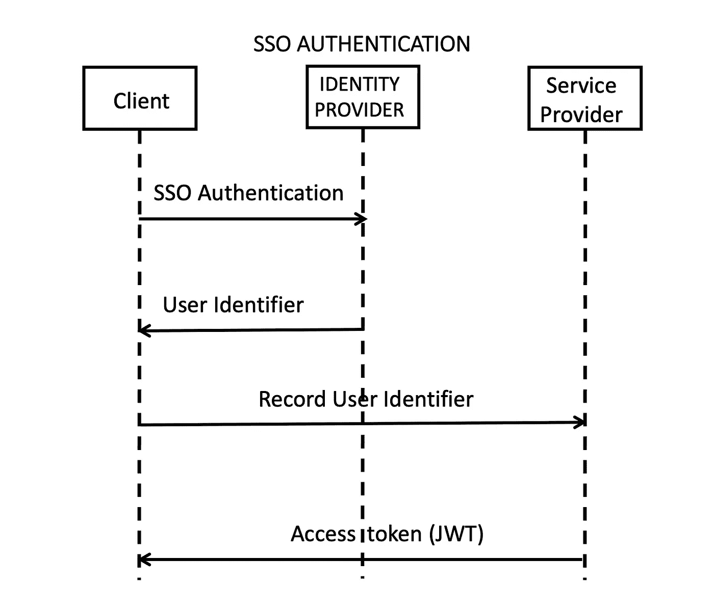

一旦您的应用程序已经集成了身份提供者，用户就不需要进行注册或登录，因为单点登录提供者使用的是一键式身份验证流程。

一旦提供者成功地识别了用户，它就返回一个带有用户标识符的回调，作为对应用程序的响应。

然后，应用程序可以使用这些信息记录到您的后端服务，作为您的资源服务的未来参考。

同样，您也可以根据提供的用户标识符来制定 JWT 响应。

通过这种方式，认证实现更加易于管理。


# 批准

相比之下，授权负责限制应用程序将累积的特定级别的资源。这包括但不限于被另一个用户标记为私有的信息以及被删除或存档的项目，

此外，它还与认证层配对。它需要累积在用户被认证之后给出的短期访问令牌，以便访问资源。


它是一个持有签名的 JWT 声明的身份提供者，应用程序使用该声明进行身份确认。

JWT 是一个开放标准( [RFC 7519](https://tools.ietf.org/html/rfc7519) )，其目的是保护 JSON 对象格式的服务间传输的信息。

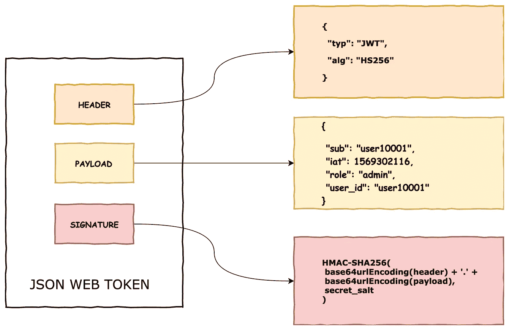

它由 3 部分组成，分别是报头、有效载荷和签名

**报头**或授权报头描述了用于生成令牌和类型的算法。

```
{
  "alg": "HS256",
  "typ": "JWT"
}
```

对于本例，JWT 令牌有一个包含 HS256 算法和 JWT 类型的授权头。

提示:如果可以的话，最好在你的系统上有一个可以改变每个用户算法的架构。另一方面，如果用户 1 使用 HS256 算法，则用户 2 不应与第一个用户相同。

```
{
  "sub": "1234567890",
  "name": "Jeffrey Forones",
}
```

**有效载荷**是描述你的用户实体的声明或陈述

实际上，有效载荷应该是短暂的，特别是当它包含有用的信息时。在这种情况下，防止系统出现安全漏洞。

此外，设置一个较短的到期时间至关重要。通常的做法是到期不应超过 15 分钟。

```
HMACSHA256(
  base64UrlEncode(header) + "." +
  base64UrlEncode(payload),
  secret)
```

**签名**是编码报头、有效载荷和密钥的组合

密钥是一个任意的数字或字符串，应该在加密通信中使用一次。在本例中，我们在 JWT 使用它。


这是一个数字签名的 JWT 令牌的例子，每种颜色代表红色部分是报头，粉红色是有效载荷，蓝绿色是签名，用点(.) .

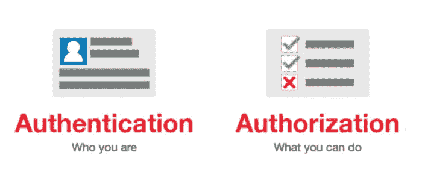

## 外卖

身份验证是为了验证和生成短期访问令牌。

授权是通过使用访问令牌来限制消费者的资源量并验证其访问权限。

# 传输中的数据

现在，由于我们已经详细描述了每个组件，我们现在继续讨论如何相互关联。因此，他们应该如何连接每个服务是非常重要的。

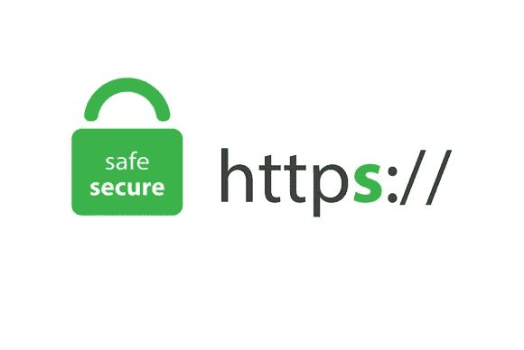

超文本传输协议安全

让我们从应该在 HTTPS 的传输协议开始，因为当信息从前端传输到后端服务时，HTTPS 加密并保护信息。

这可以防止中间人攻击在有效负载传输过程中读取请求的上下文。

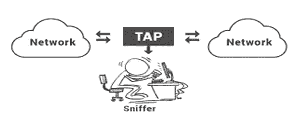

数据包嗅探器就是一个例子，它可以让你看到网络上传输的所有东西。

# 数据验证


因为所有的东西都不是放在一起的，我们没有忘记 2 个实体的验证原则，它们是你的前端和后端 API。

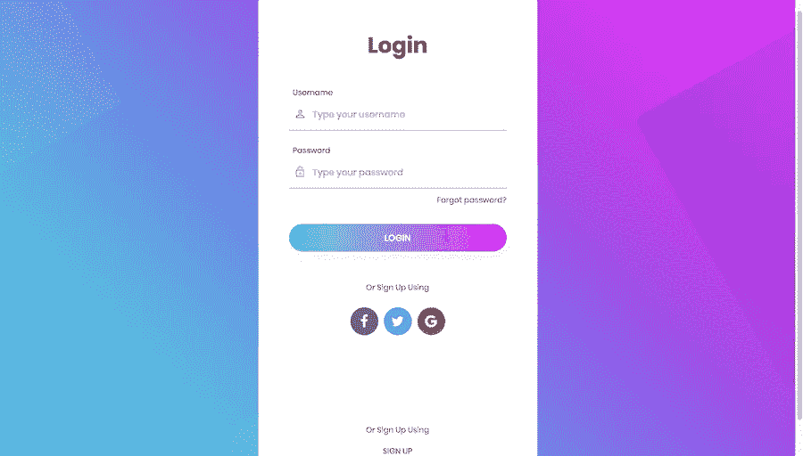

在登录页面，一般来说，验证将始终是一个要求。电子邮件字段应该是正确的格式，密码应该隐藏，所有字段都是必填项，然后我们提交。

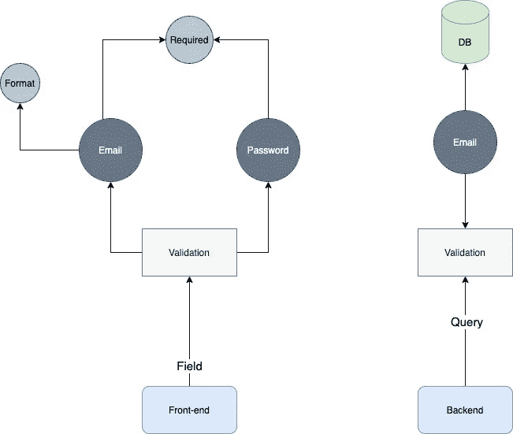

但在后端，字段验证通常是假定的，因为前端已经验证了字段，然后后端服务将直接进行查询验证。不知道这些小事会给你的应用程序带来大的缺陷。

# ⚠️小心！

有很多工具可以通过直接使用 API 请求信息来绕过前端。这将有助于你的后端开发独立于你的前端。

其中一个是邮递员

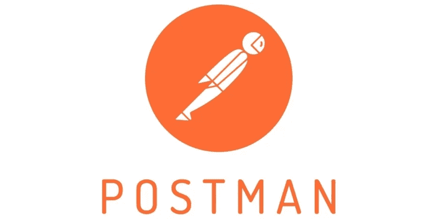

Postman 是创建后端服务的可靠工具，也是前端用于集成的良好文档工具。

但是对于那些试图破坏你的应用程序的人来说，这也是至关重要的。

因此，两个服务都有必要验证必填字段以防止攻击。

前端应该处理字段验证。

后端应该处理从前端发送的属性验证。

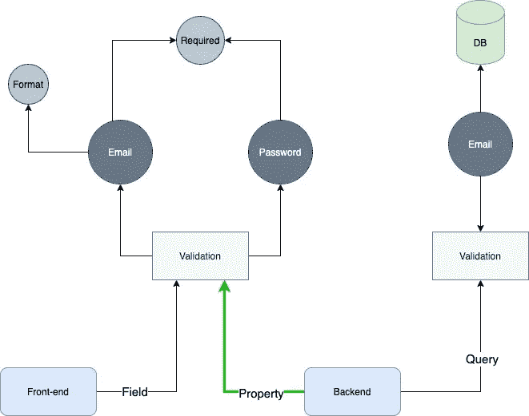

前端和后端应该在字段和属性中进行相同的验证检查

然后，后端可以在数据库查询下进行第二层验证，以识别用户身份。

但是请注意，这个原则应该适用于所有的应用程序，而不仅仅是你的登录页面。

我们总是在前端复制验证。正如我之前讨论过的。“每个服务不应该相互信任”

# 结论

作为本主题的总结，这里不提供任何编码。它不关心你将在你的网络、移动或后端服务中使用什么编程语言。

因为对我们来说，要理解现实世界的问题，更重要的是价值观和原则，这取决于我们成为更好的工程师的愿景。