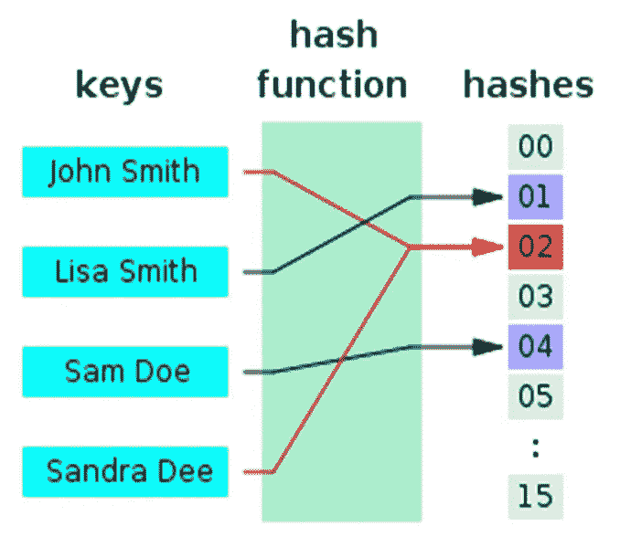
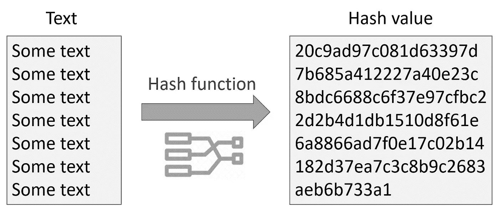

# Web 应用程序中的身份验证和授权、哈希

> 原文：<https://medium.com/geekculture/authentication-authorization-hashing-in-web-applications-5aafb79bdbaa?source=collection_archive---------11----------------------->

身份验证是一个令人兴奋的话题，因为你可以让某人登录到一个应用程序，你可以将信息与用户相关联，它还包括诸如哈希函数、授权、密码盐和加密算法等工作。

Photo by [Privecstasy](https://unsplash.com/@privecstasy?utm_source=medium&utm_medium=referral) on [Unsplash](https://unsplash.com?utm_source=medium&utm_medium=referral)

需要避开的这两个术语是身份验证和授权。认证是验证特定用户是谁或者验证他们是他们所说的那个人的过程。(“伪造身份管理 7.1 >认证和……”)

真实的人通常使用用户名和密码进行身份验证，但还有其他身份验证方式，如附加的安全问题，许多公司使用面部识别、指纹等，有许多身份验证方式，所以这是能够知道某人是谁的第一步。那就是认证。

现在，一个独立的想法是授权，这两者经常被混淆。**授权是验证用户可以做什么，他们可以访问什么，他们可以编辑什么，删除你网站的什么部分。**通常，这发生在某人通过认证之后。你注册，你登录，这是认证，然后授权是要检查这个人是否是管理员的代码，如果他们不是，那么不要让他们删除其他人的帖子。如果这个人是主持人，那就让他们来主持。虽然我们可以做不同程度的事情，但是这个人创造了这个评论吗？如果他们做了，他们被允许删除它，否则他们不能删除它，所以这是一种授权。

此外，认证是验证这个人是谁，授权是验证这个人能做什么或不能做什么。因此，这是两件不同的事情，我们将讨论这两件事情，但首先，我们将重点放在用户身份认证上，让我们从用户名和密码开始，这很简单，但要成功地对某人进行身份认证并安全地存储信息，需要做很多工作。

我们首先需要讨论的是我们如何存储密码。如果我们用用户名和密码注册用户，我们必须存储某人的用户名，或者在社交媒体的情况下，它是电子邮件或电话号码和密码，但我们需要在数据库中查找您的信息。让我们称之为用户名，然后我们需要一个密码，**所以你必须明白的第一件事，你必须永远记住，是永远不要在文本中存储密码**。因此，千万不要仅仅将密码保存在数据库中。这是一个灾难的处方。

例如，它是一个 Mongo DB 或 Postgress 或其他 SQL 数据库，这没有关系，但在这种情况下，想象一下这个 Mongo DB 本身从不存储密码。有几个原因，但最主要的是，如果有人得到了你的数据库，你就完了。更不用说很多用户，绝大多数，重复使用密码。从一个应用到下一个应用。

Practical Cryptography for Developers ([https://cryptobook.nakov.com/cryptographic-hash-functions](https://cryptobook.nakov.com/cryptographic-hash-functions))

因此，如果有人有凭证，他们可以去脸书或贝宝或其他任何地方，进入至少一定比例的用户账户，所以这是一场灾难。那么，我们该怎么办呢？我们破解了密码。

我们不是将密码以文本形式直接存储在数据库中，而是通过一种叫做哈希函数的东西来运行密码。然后，我们将哈希函数的结果存储在数据库中，理解这一点非常重要。我们从不存储纯文本密码。

Practical Cryptography for Developers ([https://cryptobook.nakov.com/cryptographic-hash-functions](https://cryptobook.nakov.com/cryptographic-hash-functions))

我们要在这里存放一些看起来像这样的东西。它看起来不完全是这样的。我们存储了一些非常奇怪、难以理解的散列函数输出。那么，哈希函数到底是什么？嗯，广义的定义是，哈希函数只是一般的函数，并不特定于 JavaScript 或 Python 或任何东西，但它们是这样的函数:**接受一些任意大小的输入数据**，它可以是一个大字符串，一个小字符串，作为任意大小的输入，**输出固定大小的输出。**

这是它的工作原理。如果这是我们的数据库，其中有用户名和密码，但密码不是以文本形式存储的，它们存储为密码的散列版本。当有人登录时，让我们假设一个密码为“pass123”的“用户”。

嗯，我们不只是看“用户”。

*   你的密码是“pass123”吗？。
*   不，我们没有那个。我们从未储存过。那么，我们该怎么办？

我们通过相同的算法运行“pass123 ”,我们使用相同的哈希函数来存储哈希密码，这给了我们一个输出。然后我们比较这两个输出。

*   它们是一样的吗？
*   如果是，那么这是一个你已经成功登录的匹配。
*   如果我们没有得到相同的输出匹配，我们已经存储在数据库中，这是不正确的，对不起，再试一次。

因此，这一切都取决于这样一个事实，即哈希函数必须始终为一个输入提供完全相同的输出，如果我对“pass123”进行哈希运算，并且它被哈希运算，让我们假设这是我们的哈希函数的实际输出，我应该始终为相同的输入获得此输出，然后每当有人试图登录时，我们就使用相同的哈希函数。我们把他们输入的任何东西，放进去，然后进行比较。

事实上，这是一门极其复杂的学科。

***参考文献***

*伪造身份管理 7.1 >认证和…* 。(未注明)。检索自[https://back stage . forge rock . com/docs/IDM/7.1/auth-guide/authentic ation . html](https://backstage.forgerock.com/docs/idm/7.1/auth-guide/authentication.html)