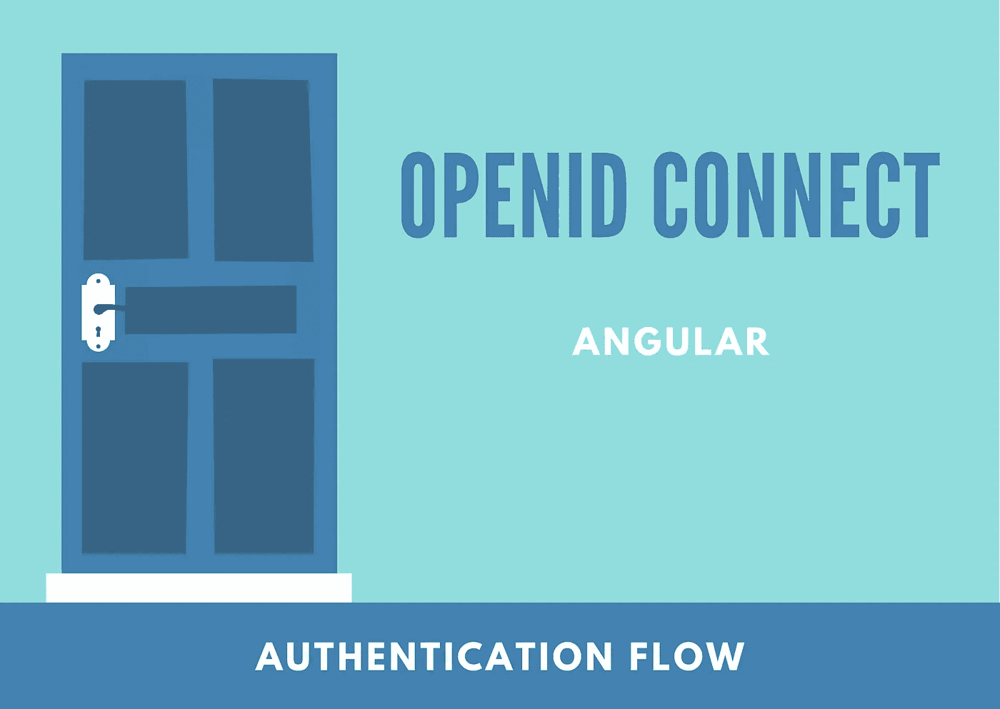
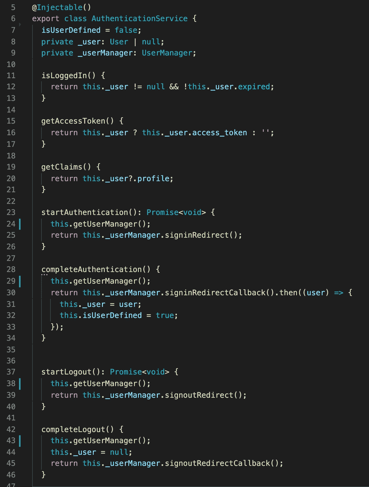
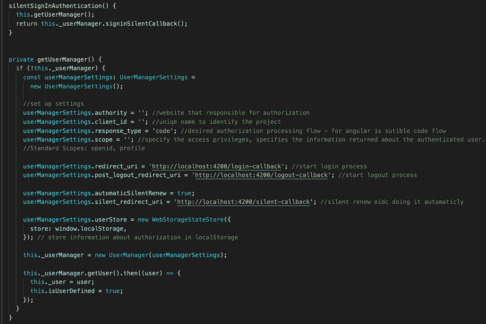
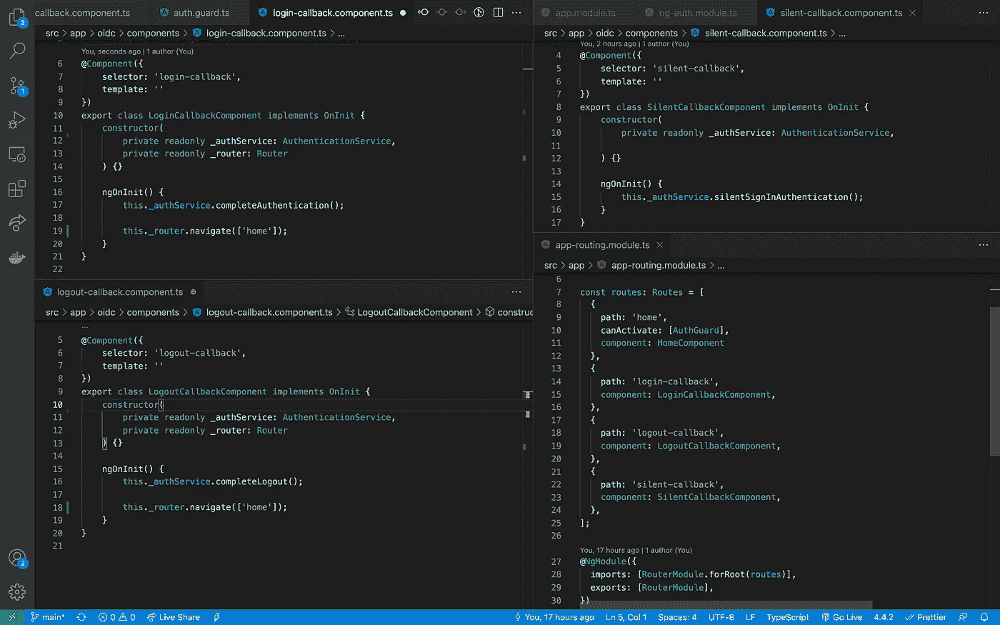
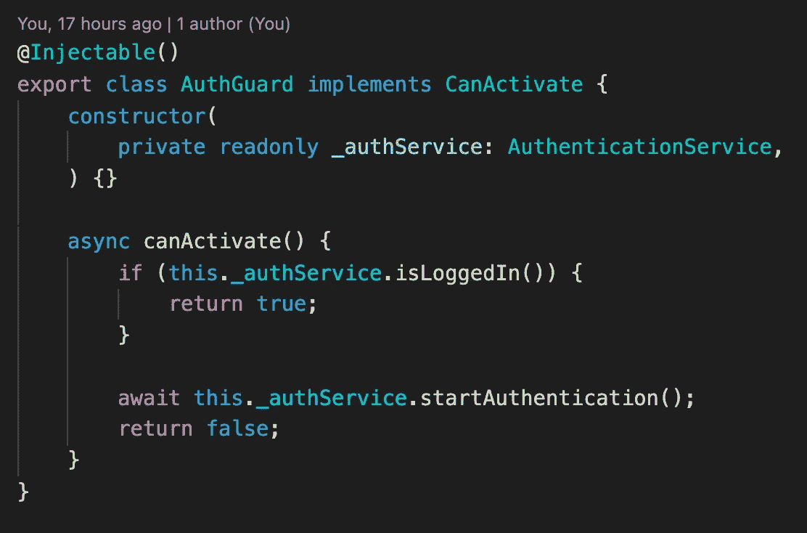
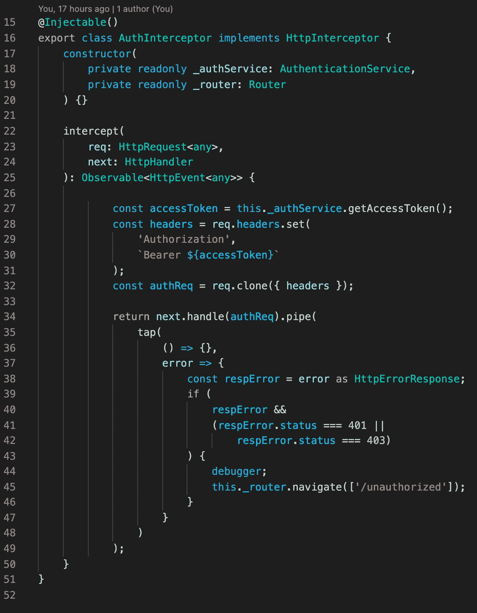

# Angular 中的认证流程

> 原文：<https://medium.com/geekculture/authentication-flow-in-angular-93bd79080908?source=collection_archive---------0----------------------->

## OpenId 连接

每个网站都有关闭的资源。为了获得这些资源，用户必须拥有这样做的权利。这意味着我们的网站必须有一个认证流程。在本文中，我们在一个 angular 项目中实现了 OpenId Connect/OAuth2。

在本文中，我们只讨论前端部分。但是前端离不开后端。我们的服务器必须有一个 OpenID 连接的实现。当服务器端准备就绪时，就该设置前端部分了。

首先，我们需要安装一个 oidc 客户端。根据 npm [网站](https://www.npmjs.com/package/oidc-client)的说法，我们需要编写一个命令

npm 安装 oidc-客户端

下一步是创建 AuthenticationService。

AuthenticationService 的主要部分是来自 oidc 的 UserManager。在我们使用 UserManager 之前，我们需要初始化它。

要初始化 UserManager，我们必须创建一个设置模型。我描述了我们需要填充的所有必要属性。如果你对这些属性有疑问，你需要阅读[文档](https://openid.net/connect/)。

在属性 redirect_uri、post_logout_redirect_uri、silent_redirect_uri 中，我们为使用我们的 AuthenticationService 的特定逻辑的组件编写 URL。

这些组件中的每一个都使用 AuthenticationService 中的方法，然后我们将用户重定向到 home 组件。只有静默重定向不会重定向用户，因为 oidc 是在幕后进行的。

在 route 模块中，您可以看到 home 路由有 AuthGuard。该安全检查是用户登录与否。

用户登录后，oidc 提供一个访问令牌。我们需要在请求中使用这个令牌。最好的方法是使用拦截器。

就是这样。现在，您的 angular 应用程序被读取以进行身份验证。

如果你需要仔细看看[这个项目，这里是](https://github.com/8Tesla8/angular-oidc) [的链接。](https://github.com/8Tesla8/angular-theme-scss)

*原载于 2021 年 9 月 10 日 http://tomorrowmeannever.wordpress.com**的* [*。*](https://tomorrowmeannever.wordpress.com/2021/09/10/authentication-flow-with-openid-connect-in-angular/)