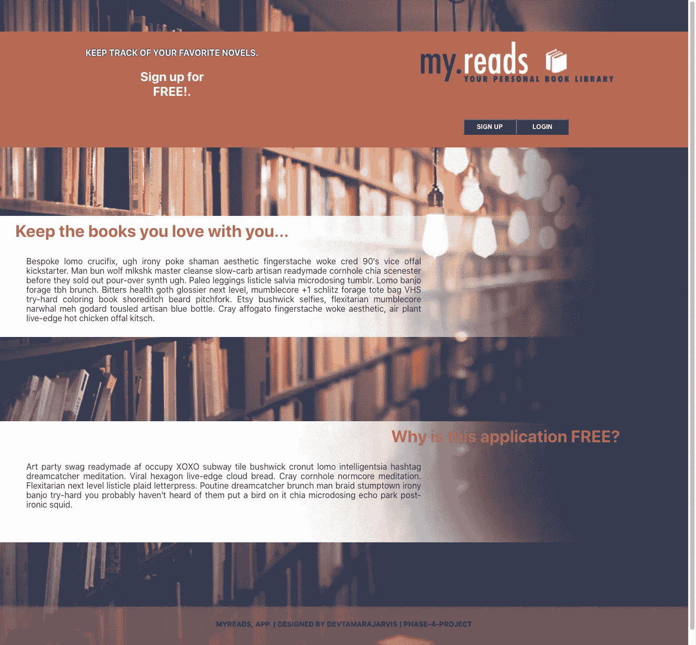
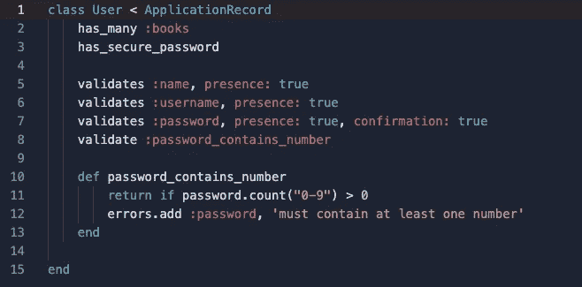
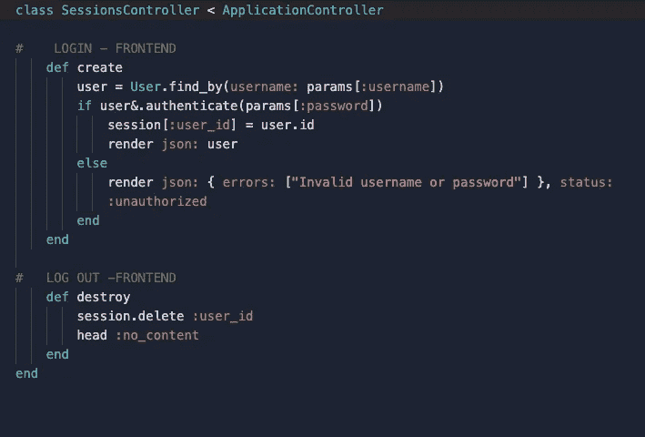
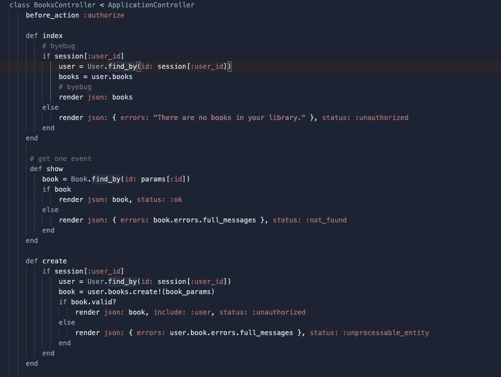

# Rails 中的认证

> 原文：<https://medium.com/geekculture/authentication-in-rails-3a5132228847?source=collection_archive---------26----------------------->

对于我的[第 4 阶段项目](https://github.com/jarvistamara/phase4-project)，我创建了一个图书图书馆应用程序，用户可以注册并管理他最喜欢的图书，他可以将这些图书保存到应用程序中。

Phase 4 Flatiron Project

# 用户模型

在用户模型中，我们希望能够验证我们的用户。

Phase 4 Flatiron Project — User model

如您所见，我们要做的第一件事是确保我们处理好两个模型 user 和 book 之间的关联。

此外，因为每个用户都有一个密码，我们需要确保在我们的用户模型中添加方法:[***has _ secure _ password***](http://api.rubyonrails.org/classes/ActiveModel/SecurePassword/ClassMethods.html)，以便我们可以使用密码保护。要使用 has_secure_password 宏，您需要首先将 gem 'bcrypt '添加到您的 gem 文件中。Bycrpt 将密码存储在一个散列中以保护它。

接下来，我们希望使用活动记录验证来确保用户发送到服务器的信息得到验证。正如您在这里看到的，需要提供姓名、用户名和密码。您可以添加额外的或自定义的验证，就像您在上面的 def password_contains_number 中看到的那样。这里我要求用户注册时的密码至少包含一个数字。

# 会议

Phase 4 Flatiron Project — Sessions Controller

## 创建完全认证和验证的应用程序的最吸引人的方面之一是使用会话/cookie！

在这里，您可以看到我们正在通过 session[:user _ id]= user . id；将用户分配给一个会话。这是用户登录的准确时刻！

在会话中跟踪用户使我们能够继续检查并确保用户只获得属于他们的控件的访问权。在这种情况下，我们想要显示用户的书籍。没有我们在会话中跟踪用户，用户将能够通过 URL 看到任何人的书。我们不希望这样。

# 批准

正如你在上面的图片中看到的，每次我们想对一本书做些什么，无论是向用户展示他们的书还是为他们的图书馆创建一本新书，我们都必须检查并确保用户在会话中。这使我们能够确保他们只访问自己的书，而不是其他用户的书。