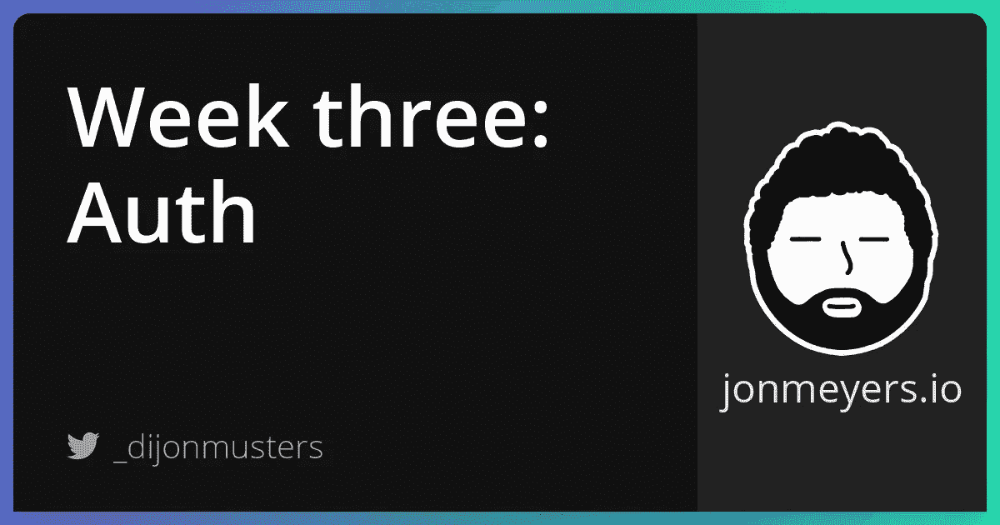

# 构建 SaaS 项目第三周:使用 Auth0 和 Next.js 进行身份验证

> 原文：<https://medium.com/geekculture/authentication-with-auth0-and-next-js-bd20da2a257d?source=collection_archive---------13----------------------->

## 本周我们将学习认证以及 Auth0 有多棒！我们使用他们的 nextjs-auth0 库来包装我们的 Next.js 应用程序，这使我们能够访问一些非常好的 auth helper 函数。这真的有助于抽象身份验证的复杂性，并让我们专注于构建一个真正好的产品——我们的用户付钱给我们是为了什么！



[项目回购](https://github.com/dijonmusters/courses)

本周的主题是用户和认证！我们 SaaS 项目的重点是提供可以单独购买的课程，或者提供可以访问所有内容的定期订阅。为了做到这一点，我们需要了解一些关于用户的事情！

## Auth0

鉴于我对复杂身份验证解决方案的有限经验，我希望尽可能依赖第三方服务。理想情况下，我希望所有的复杂性都被抽象出来，这样我就可以专注于构建真正好的内容——我实际销售的产品！

与 Gatsby 或自定义 React 应用程序相比，Next.js 的一大优势是我们可以在运行时访问服务器。这意味着我们可以验证用户是谁，他们应该看到什么——这是我们在客户端上无法真正信任的事情。

有许多与 Next.js 兼容的 auth 选项，在您需要编写的代码量上有很大的不同。我的主要要求是:

*   社交登录— GitHub
*   不需要编写会话 cookie 逻辑
*   锁定页面和 API 路径的便捷功能

本质上，我只是想问图书馆“我应该展示这个东西吗？”它给了我一个我可以信任答案！

Auth0 专门为 Next.js 开发了一个惊人的库，非常有创意地叫做 [nextjs-auth0](https://github.com/auth0/nextjs-auth0) 。这允许您使用 Auth0 的能力来管理帐户创建、登录和注销、会话 cookies 等，并提供了一组简单的功能，您可以使用这些功能来创建门控内容。

我们需要做的第一件事是创建一个免费的 auth0 帐户和一个租户，它可以用来将共享一个用户数据库的应用程序组合在一起。[这里有一个很好的指导](https://auth0.com/docs/get-started/learn-the-basics)来得到这个设置。

接下来我们需要在我们的项目中安装和配置 [@auth0/nextjs-auth0](https://github.com/auth0/nextjs-auth0) 。[自述文件](https://github.com/auth0/nextjs-auth0/blob/main/README.md)详细介绍了我们需要做些什么来实现这一目标！

> 记得按照相同的步骤从[托管在 Vercel 上，自动部署与 GitHub 和配置自定义域](https://jonmeyers.io/blog/build-a-saas-platform-with-stripe/hosting-on-vercel-automatic-deploys-with-github-and-configuring-custom-domains)添加所有这些 Auth0 秘密到 Vercel-没有这我们的托管应用将无法工作。

这给了我们一些超级棒的助手功能，其中我最喜欢的是:

## withPageAuthRequired

这是一个客户端功能，我们可以使用它来包装受保护的页面，我们只希望用户能够在登录后访问这些页面。如果他们没有登录，将被重定向到 auth0 登录页面。简单地将页面级组件包装在这个函数中，如下所示。

```
// pages/dashboard.js

import { withPageAuthRequired } from '@auth0/nextjs-auth0';

const Dashboard = withPageAuthRequired(({ user }) => {
  return <p>Welcome {user.name}</p>
})

export default Dashboard
```

## 使用用户

这是一个客户端 React 钩子，我们可以用它在任何组件的任何地方获取用户对象。

```
// pages/index.js

import { useUser } from '@auth0/nextjs-auth0';

const Home = () => {
  const { user, error, isLoading } = useUser();

  if (isLoading) return <div>Loading...</div>;
  if (error) return <div>{error.message}</div>;

  if (user) {
    return (
      <div>
        Welcome {user.name}! <a href="/api/auth/logout">Logout</a>
      </div>
    );
  }
  return <a href="/api/auth/login">Login</a>;
};

export default Home
```

## withPageAuthRequired

这是一个服务器端函数，我们可以将它包装在 Next.js 的 getServerSideProps 中，以确保用户在登录之前无法访问页面。

```
// pages/dashboard.js

import { withPageAuthRequired } from '@auth0/nextjs-auth0';

const Dashboard = ({ user }) => {
  return <div>Hello {user.name}</div>;
}

export const getServerSideProps = withPageAuthRequired();

export default Dashboard
```

## withApiAuthRequired

这是一个服务器端函数，我们可以包装我们的 API 路由，以确保只有经过身份验证的用户才能向它发送请求。

```
// pages/api/courses.js

import { withApiAuthRequired, getSession } from '@auth0/nextjs-auth0';

module.exports = withApiAuthRequired(async (req, res) => {
  const { user } = getSession(req, res)

  // validate user can view courses

  res.send(courses)
})
```

## 用户模式

Auth0 非常适合登录用户并验证他们的会话是否有效，但是，如果我们想跟踪其他信息，例如购买的课程，我们需要在 Prisma db 中创建一个用户。

让我们通过添加一个用户模型来扩展我们的模式。

```
// prisma/schema.prisma

model User {
  id           Int           @id @default(autoincrement())
  email        String        @unique
  courses      Course[]
  createdAt    DateTime      @default(now())
}
```

我们将使用来自 Auth0 的电子邮件来确定我们的用户是谁，因此，它需要是唯一的。

我们还将为每个课程添加一个用户列表。

```
// prisma/schema.prisma

model Course {
  id        Int      @id @default(autoincrement())
  title     String   @unique
  description     String
  lessons   Lesson[]
  users     User[]
  createdAt DateTime @default(now())
}
```

接下来，我们将使用 Prisma 的迁移 API 来捕获数据库结构的变化。

```
npx prisma migrate dev --name create-user-schema --preview-feature
```

> 这将创建一个名为“create-user-schema”的新迁移，我们需要添加“— preview-feature”，因为这仍然是实验性的。

这可能会提示您一些关于覆盖现有数据的问题。选择是。

如果它不能应用迁移，您可以尝试重置您的数据库——这将删除整个数据库，因此请确保您不要在没有考虑以后运行它！

```
npx prisma migrate reset --preview-feature
```

接下来，让我们将价格和 URL 添加到我们的课程模式中。

```
// prisma/schema.prisma

model Course {
  id        Int      @id @default(autoincrement())
  title     String   @unique
  description     String
  lessons   Lesson[]
  users     User[]
  price     Int
  slug      String  @unique
  createdAt DateTime @default(now())
}
```

也是我们课程的一个补充。

```
// prisma/schema.prisma

model Lesson {
  id        Int      @id @default(autoincrement())
  title     String   @unique
  description     String
  courseId  Int
  course    Course   @relation(fields: [courseId], references: [id])
  videoUrl  String
  slug      String  @unique
  createdAt DateTime @default(now())
}
```

整个文件应该是这样的。

```
// prisma/schema.prisma

generator client {
  provider = "prisma-client-js"
}

datasource db {
  provider = "postgresql"
  url      = env("DATABASE_URL")
}

model User {
  id           Int           @id @default(autoincrement())
  email        String        @unique
  courses      Course[]
  createdAt    DateTime      @default(now())
}

model Course {
  id        Int      @id @default(autoincrement())
  title     String   @unique
  description     String
  lessons   Lesson[]
  users     User[]
  price     Int
  slug      String  @unique
  createdAt DateTime @default(now())
}

model Lesson {
  id        Int      @id @default(autoincrement())
  title     String   @unique
  description     String
  courseId  Int
  course    Course   @relation(fields: [courseId], references: [id])
  videoUrl  String
  slug      String  @unique
  createdAt DateTime @default(now())
}
```

让我们再次运行 migration 命令来快照这些更改并更新我们的数据库。

```
npx prisma migrate dev --name add-slugs --preview-feature
```

厉害！现在，我们的应用程序使用 Auth0 进行身份验证，保护我们受保护的内容，并且我们的数据库模式已经准备就绪！

## 跟我来

[网站](https://jonmeyers.io/)

[推特](https://twitter.com/_dijonmusters)

[YouTube](https://www.youtube.com/channel/UCPitAIwktfCfcMR4kDWebDQ)

## 下星期

[使用 GitHub 和 Auth0 规则进行社交登录](https://jonmeyers.io/blog/build-a-saas-platform-with-stripe/social-login-with-github-and-auth0-rules)