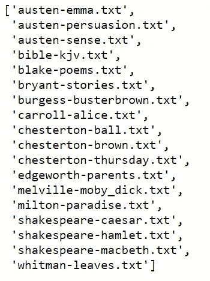
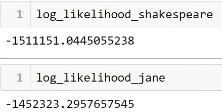

# 基于马尔可夫链的作者归属

> 原文：<https://medium.com/geekculture/authorship-attribution-through-markov-chain-922b01a40920?source=collection_archive---------0----------------------->

给定一件作品，我们如何识别它的作者？这篇文章旨在用马尔可夫链给出作者归属的一个简要的想法。

**作者归属** (AA)是识别给定文本的作者的任务。它不应该与作者信息(如年龄、性别或种族)相关的作者简介相混淆。

> 让我们从**假设**开始:

1.  AA 认为每个人都有自己独特的写作风格，并在工作中始终如一地运用。
2.  我们假设真正的作者在候选作者组中。也就是说:预测模型将从作者池中产生单个输出。

# **笔形特征**

AA 背后的主要思想是，通过提取一些可测量的文本特征(风格学特征)，我们可以辨别具有相似特征的给定文本的真正作者。

有许多类型的文体学特征，如词汇特征(单词)、字符特征(字母频率、n-gram 等)、句法特征(错误、短语结构)、语义特征(同义词、功能)和特定应用特征(HTML、电子邮件中问候语的使用)(Stamatatos 2009)。

在这里，我们关注字符级特征，它具有独立于语言(至少对于大多数语言)和对拼写错误(如错别字，与词汇特征相比)鲁棒的优点。

# **马尔可夫链:**

马尔可夫链是一种随机过程，仅通过其当前状态来模拟未来状态的概率。它是由俄罗斯数学家安德烈·马尔科夫引入的。

文本可以被视为一系列单词或字符，其中下一个单词或字符由作者的风格控制。

因此，可以应用马尔可夫链，并且字符之间的转移概率可以用作作者身份指纹来区分作者。

# 对数似然

文本序列的似然性是字符的所有概率的乘积。例如，我们有以下概率:

P(H|T) = 0.02，即给定当前 T，字符 H 的概率是 0.02

P(E|H) = 0.03，即给定当前 H，字符 E 的概率是 0.03

文本的可能性:则为 0.02 x 0.03 = 0.006

因此，出现一长串文本的可能性非常小，很难进行比较。相反，使用对数似然法。

文本的可能性:则为 log(0.02 x 0.03)= log(0.006)=-2.22

# **Python 实现**

我们将使用古登堡计划中的几本书作为我们的训练和测试数据集。

我们首先从 NLTK 导入 Gutenberg 数据集

```
import nltk
nltk.download('gutenberg')
nltk.corpus.gutenberg.fileids() 
```



Books in the NLTK Gutenberg corpus

NLTK 古腾堡语料库中有 18 本书，我们使用简·奥斯汀的 ***【奥斯汀-sense . txt】***作为测试数据，并与简·奥斯汀的 ***【奥斯汀-艾玛. txt】***和莎士比亚的 ***【莎士比亚-凯撒. txt】***作为训练数据进行比较。

```
emma = nltk.corpus.gutenberg.words('austen-emma.txt')
emma = ' '.join(emma)caesar = nltk.corpus.gutenberg.words('shakespeare-caesar.txt')
caesar = ' '.join(caesar)sense = nltk.corpus.gutenberg.words('austen-sense.txt')
sense = ' '.join(sense)
```

我们将马尔可夫链中的状态数限制为 26 个英文字符和一个空格字符(" ")。

```
state = ["a", "b", "c", "d", "e", "f", "g", "h", "i", "j", "k", "l", "m", "n", "o", "p","q", "r", "s", "t", "u", "v", "w", "x", "y", "z", " "]#create word2id and id2word dictionary
char2id_dict = {}for index, char in enumerate(state):
    char2id_dict[char] = index
```

接下来，让我们定义一个从给定文本中创建转移矩阵的函数

```
import numpy as npdef create_transition_matrix(text):
    transition_matrix = np.zeros((27, 27))

    for i in range(len(text)-1):
        current_char = text[i].lower()
        next_char = text[i+1].lower()

        if (current_char in state) & (next_char in state):
            current_char_id = char2id_dict[current_char]
            next_char_id = char2id_dict[next_char]
            transition_matrix[current_char_id][next_char_id] = transition_matrix[current_char_id][next_char_id] + 1sum_of_each_row_all  = np.sum(transition_matrix, 1)

    for i in range (27):
            single_row_sum = sum_of_each_row_all[i]
            if (sum_of_each_row_all [i] == 0):
                single_row_sum = 1

            transition_matrix[ i,: ] =  transition_matrix[ i,: ] / single_row_sum
    return transition_matrix
```

现在，让我们获得训练数据的转移矩阵

```
TM_emma = create_transition_matrix(emma)
TM_caesar = create_transition_matrix(caesar)
```

我们比较了简·奥斯汀和莎士比亚写的书***【Austen-sense . txt】***的对数似然。

```
log_likelihood_jane = 0
log_likelihood_shakespeare = 0for i in range(len(sense)-1):
    current_char = sense[i].lower()
    next_char = sense[i+1].lower()if (current_char in state) & (next_char in state):
        current_char_id = char2id_dict[current_char]
        next_char_id = char2id_dict[next_char]
        if TM_emma[current_char_id][next_char_id] != 0 and TM_caesar[current_char_id][next_char_id] != 0:
            log_likelihood_jane += np.log(TM_emma[current_char_id][next_char_id])
            log_likelihood_shakespeare += np.log(TM_caesar[current_char_id][next_char_id])
```

# 结果



因此，与莎士比亚相比，给定文本更有可能是简·奥斯汀写的。我们将指定文本的作者指定为简·奥斯汀。为了让演示简单明了，我们只使用了 1 本不知名的书和 2 个作者。您可以扩大训练集和测试集的大小。

GitHub 上传的完整的一阶马尔可夫链代码链接:[https://github.com/yuanxy33/Authorship-Attribution](https://github.com/yuanxy33/Authorship-Attribution)