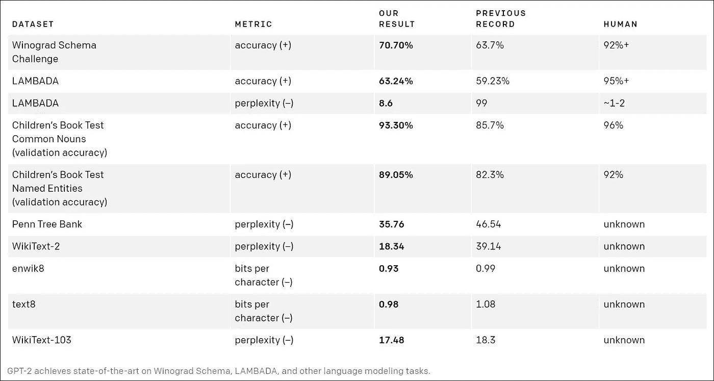
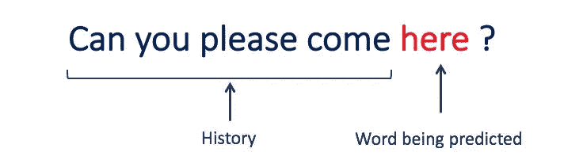
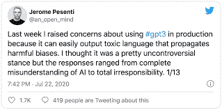

# 使用 GPT-2 的自动代码生成

> 原文：<https://medium.com/geekculture/auto-code-generation-using-gpt-2-4e81cb05430?source=collection_archive---------8----------------------->

## 用人工智能更快地编码

# 关于 GPT-2

> GPT-2 代表“**生成预测变换器**”。这是一个开源模型，经过超过 15 亿个参数的训练，用于生成给定序列的下一个文本序列。
> 
> GPT-2 具有生成文本的非凡能力，远远超出了传统语言模型的预期。

# “太危险了，不能释放。”

## 一个短语发布了 OpenAI 的新闻声明，以配合他们在 2019 年 2 月发布的 GPT-2 语言模型。


> 在今天的后事实信息生态系统中，人工智能驱动的错误信息的威胁已经成为一个尚未解决的巨大问题，特别是最近发布了更强大的 GPT-3。



Performance of GPT on different datasets

> "今天，联合国呼吁立即从世界上撤走所有核武器。"

***你刚才看的这句话既不是我写的，也不是编辑写的。这句话是 GPT 写的——2***

> GPT-2 是一个基于 1.5 位转换器的语言模型，在 800 万网页的数据库中训练。它被训练来简单地预测 40GB 互联网文本中的下一个单词。由于一些问题，研究人员发布了一个非常小的模型进行实验。

# GPT-2 的工作机制


Working og GPT-2 [[Source](https://openai.com/blog/better-language-models/)]

*   **生成:**这意味着模型被训练来预测给定记号序列中的下一个记号。该模型被给予大量原始文本，然后被要求使用统计特征生成更多文本，这当然涉及不同层和机制的实现，例如 RNN-LSTM 和注意力机制。
*   **预训练:** OpenAI 训练了一个庞大而强大的语言转换器模型，将其用于摘要、神经机器翻译等任务。现在，这个模型在 40 GB 的文本上被训练，被称为 WebText。


Transformer architecture

*   **变形金刚:**GPT-2 是用多层解码变形金刚建造的。



The text in blue is given as an input and the text in red is the predicted output

**GPT-2 架构基于变形金刚的概念。**

GPT-2 的工作机制涉及基于变换器的编码器解码器架构，以学习输入和输出相关性。

为了生成给定序列中的下一个输出，模型需要将之前生成的数据作为输入。

*   GPT-2 有很强的适应文本环境的能力，从而产生现实和连贯的输出。
*   该模型的工作原理是在创建时将每个令牌添加到输入序列中。在下一步中，新的序列成为模型的输入。这是一个叫做**“自动回归”**的想法。这是使 RNNs 不合理地有效的想法之一。

# 代码自动生成是什么意思？

## 自动代码生成基本上包括基于用户先前的输入和过去的习惯完成一系列代码。

*   许多商业平台，如 **TabNine 和 Kite** 已经可以在市场上完成这项任务。这两种方法都使用 GPT-2 根据用户提供的先前输入来预测下一个代码序列。
*   下面是一个简短的视频，展示了自动化代码生成过程的惊人能力:

A video demonstration by Tabnine of automatic code generation

# 为代码生成微调 GPT-2 的步骤:

## 1.克隆所需的存储库

*   在这里，我们克隆了 auto_coding 存储库，其中包含代码和脚本，用于微调 GPT-2 模型的自动代码生成。
*   我们需要以脚本的形式提供训练示例(示例:Python、C、C++、Java 和 Javascript)。
*   为了微调我们的 GPT-2 模型，我们使用了 scikit-learn 示例中的脚本。

```
!rm -rf auto_coding!git clone [https://github.com/aasthaengg/auto_coding](https://github.com/aasthaengg/auto_coding) && cd auto_coding && pip install -r requirements.txt && cd dataset && git clone [http://github.com/scikit-learn/examples.git](http://github.com/pytorch/examples.git) && python convert.py — segment_len 256 — stride 10 — dev_size 0.1
```

## **2。下载所需脚本**

现在，我们正在下载**的 convert.py 脚本。**

该脚本包含将我们的示例转换为模型所期望格式的训练数据的代码。

```
!wget [https://raw.githubusercontent.com/aasthaengg/auto_coding/master/dataset/convert.py](https://raw.githubusercontent.com/aasthaengg/auto_coding/master/dataset/convert.py) && cp convert.py /content/auto_coding/dataset/
```

## 3.导航到所需的方向

这里，我们正在执行 convert.py 脚本，其中**段长度为 256，步幅为 10，开发规模为 10%。**

90%的数据将用于训练，剩下的 10%将用于测试我们的模型。

```
!cd auto_coding && cd dataset && python convert.py — segment_len 256 — stride 10 — dev_size 0.1
```

## **4。执行训练脚本并选择模型为 distilgpt2**

我们有不同版本的模型可供微调。这里，选择 **distilgpt2** 进行微调。如果一个人有足够的计算资源和庞大的数据集，那么他们可能会选择有更多参数的版本。

```
!cd /content/auto_coding && python train.py — model_select distilgpt2
```

## 5.模型现在已经训练好了。让我们看看这个模型

训练 get 完成后，我们需要执行 **interact.py 脚本。**该脚本将运行模型进行测试。需要提供输入，模型将预测序列。

```
!python interact.py
```

# 这个用例如何帮助技术专业人员？

*   该解决方案已经在行业中使用。它允许开发者以 47%的击键次数更快地编写代码。这有助于开发人员提高工作效率。
*   此外，如果一个代码块已经提前写好了，那么用户只需要用几笔相同的单词，用户就会得到一个自动完成的代码块。
*   根据一些评论，这帮助开发人员减少了大量时间，因为他们只编写了 70%到 80%的代码，剩下的 20%到 30%的代码是自动生成的。
*   凭借所有这些优势，该行业还节省了大量时间。

# GPT 新协议的局限性

*   GPT-2 不能用于处理复杂和长的语言结构。

如果有人想生成一个与特定领域(如文学、金融或医学)相关的文本序列，那么它将无法很好地执行。

*   在计算资源方面存在某些限制。为了训练这样一个具有数十亿个参数的庞大模型，我们需要非常昂贵的计算资源来训练，以便模型能够更好地执行。

# 作者对 GPT 建筑的看法

*   GPT 无疑是自然语言处理领域的一项惊人发明，但它的能力仍然未知，因为由于一些严重的威胁，OpenAI 从未发布完整的预训练模型。
*   为了在自动代码生成上执行这个任务，我使用了 distilt-GPT 2，因为它体积小，模型微调相对便宜。为了更有效和清晰的预测，我们将序列生成大小限制为 15。
*   如果有人想到使用具有更多参数的 GPT-2 模型，那么序列的大小可以相应地增加，同时考虑到计算资源。



Here is a tweet from VP of AI at Facebook

我很清楚额外的风险，例如 GPT-3 的类似人类的文本生成能力被用于网络钓鱼、诈骗、垃圾邮件、散布虚假新闻或其他欺诈行为的可能性。因此，在使用这些模型时，应该牢记道德规范。

我们应该使用人工智能来改善我们的生活，而不是通过任何形式的犯罪活动。

# 结论

祝贺你一直坚持到这篇博客的结尾！非常感谢你花时间阅读这篇文章。我希望它对你的起床和出行有帮助。

**你喜欢 GPT 2 号的超能力吗？请在评论区让我知道，所有的想法和见解都是热切赞赏的。**