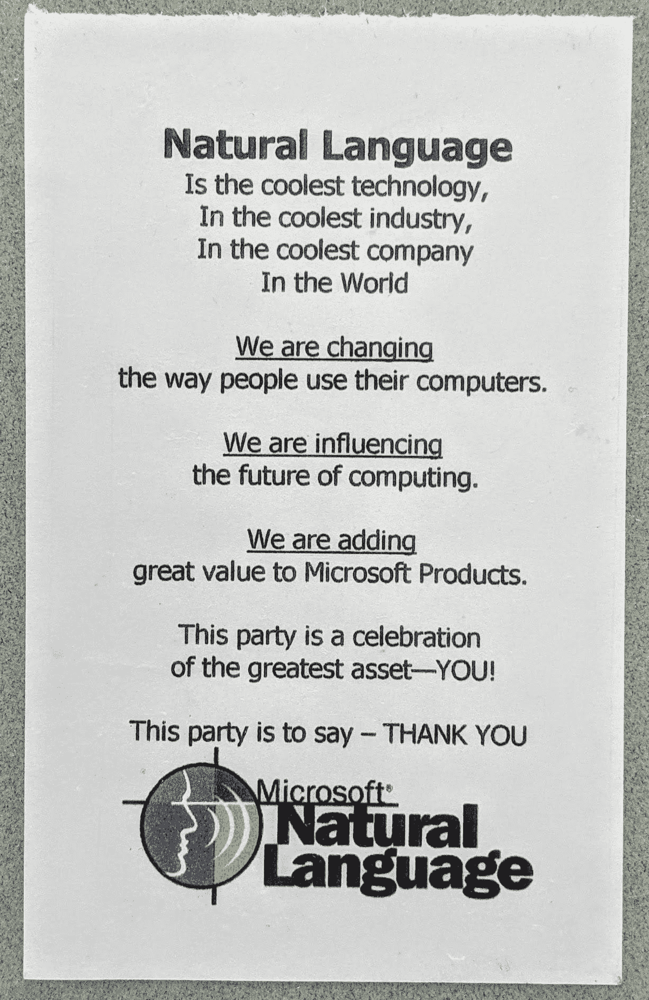
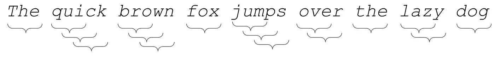
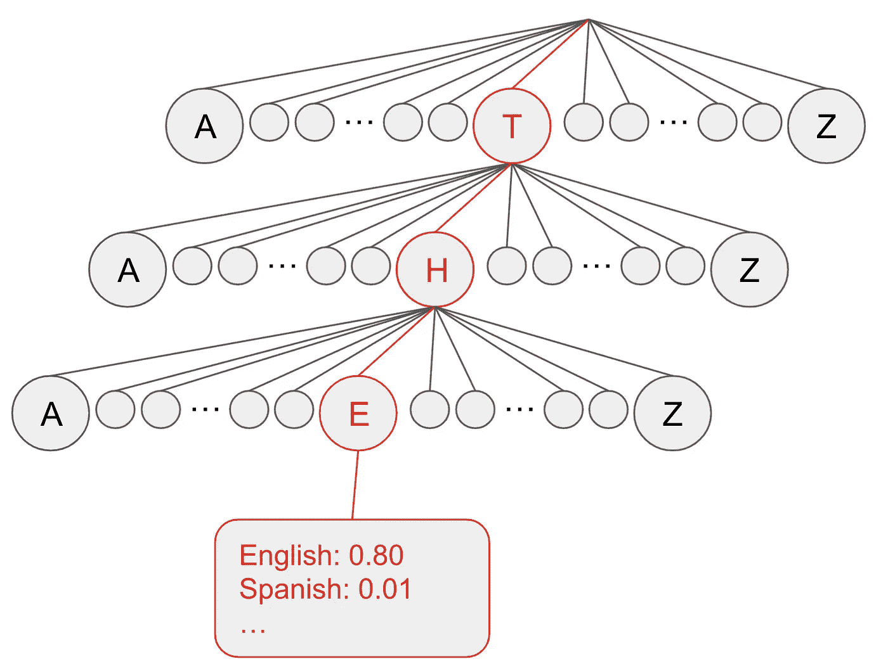
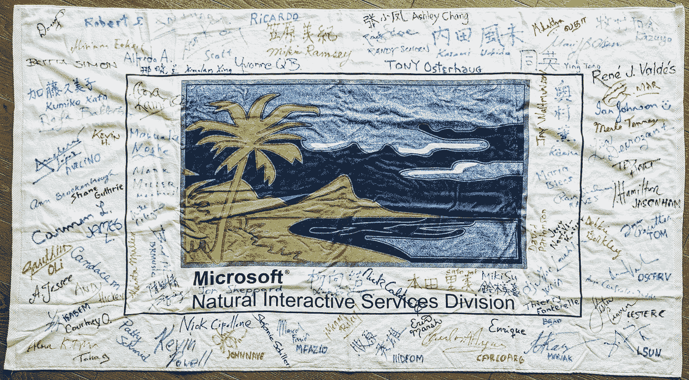

# 我们如何在微软 Word 中自动识别人类语言

> 原文：<https://medium.com/geekculture/auto-detecting-languages-in-microsoft-word-58356a9e1649?source=collection_archive---------6----------------------->

## 将我在大学学到的算法应用到现实生活中

我双击了微软 Word 2000 图标。那是 1998 年 1 月，所以这是一个早期的调试版本。我的硬盘疯狂地旋转，我的 400Mhz 奔腾 II 试图加载我刚刚安装的内存猪。最终，经过一分钟的努力，闪屏出现了，又过了一分钟，真正的窗口和菜单栏出现了。我开始用西班牙语打一个句子。因为 Word 的默认语言是英语，所以拼写者用红笔画出了每个单词。但是大约 5 个字之后，奇迹发生了！Word 识别该语言，并代表我自动切换拼写。我很敬畏。

我刚刚从大学毕业，[开始在微软工作，在自然语言小组，一个从微软研究院分离出来的 25 人的小公司，我会看着它在 5 年内成长为拥有 500 名工程师的庞然大物。我们的崇高目标是让计算机能够理解人类语言。微软研究院在这样的长期赌注上基本上没有任何让步。对我来说，在大学里完成了这么多理论上的、看似做作的作业后，在专业环境中剖析一个现实世界的问题，并看看我所学的一些计算机科学算法是如何实际应用于它的，这是非常令人着迷的。](https://link.medium.com/TqZqGyydThb)

Some old swag from the nineties

今天，我们似乎认为语言自动检测是理所当然的。微软 Office 和谷歌文档都在无处不在地运行它，只需输入几个单词，它们就悄悄地将校对工具(拼写检查、语法检查等)切换到正确的语言。你甚至不知道它正在发生。像我这样的双语者非常欣赏这一点，并且在有多种官方语言的国家广泛使用。

在 Office 97 和更早的版本中，您必须手动执行此操作。打开一个不同语言的文档是一个糟糕的客户体验，因为英语拼写者会踢进来，不认识任何外国单词，并高兴地在每个单词下面加上红色的波浪线。然后，你必须高亮显示整个文本，点击 4 或 5 次后，将语言设置为正确的语言(如果你知道要完成这项艰巨的任务必须遵循的晦涩的菜单项)。

想知道语言自动检测的魔力是如何工作的吗？我们花了一年时间来完善它，但基本算法出奇的简单。事实上，我今天花了一个小时用 150 行 Java 重新写了一遍，因为那是一个下雨的星期天，我很享受这段回忆之旅。你应该试试！这是一个有趣的小编码挑战。

直觉是:每种语言都有共同的模式，即在该语言中比在其他语言中出现频率更高的字符序列。例如，序列“t-h-e”在英语中比在西班牙语中出现得更频繁。如果我在一个句子中看到“the ”,我会立刻对这个句子是英语有更高的信心。当你看到越来越多的字符序列时，你所要做的就是积累信心，在某个时刻，你有足够的信心，这是语言 X 而不是任何其他语言。

这些 3 个字符的序列被称为*三元组*。我们看了看是否可以用二元模型或 n 元模型来做这件事，其中 n > 3，但实际上，3 是一个令人惊讶的好点。在句子“*敏捷的棕色狐狸跳过懒惰的狗*”**中，你的卦将是: *the，qui，uic，ick，bro，row，own，fox，* …**

How trigrams work

标记化(把你的句子分解成单词)实际上是第一个重要的问题。听起来很简单:一个简单的断字器只会在空白上断开。但是当你开始更详细地考虑它的时候，有各种各样的边缘情况和标点符号会使事情变得更难。这还只是英语。德语有疯狂的长复合词。日语没有空格。阿拉伯语和希伯来语从左到右，所以你的整个算法必须反向运行。当你这样做的时候，你需要从你的流中清除所有无用的字符:标点符号、多余的空格、数字等等。你也要思考如何看待大写和小写。但是让我们假设我们已经编写了一个像样的记号赋予器(或者，如果你只是为了好玩而写代码，你可以偷懒，在空白上分开，这里没有判断！).

如今，一些开源的 NLP 库做得非常出色。但是在那个时候，我们试图用自然语言做的一切都是在探索未知的领域。今天我要讲的一些事情看起来相当明显；他们那时还没回来。

对于 Microsoft Word 中的语言自动检测，我们为每种语言创建了一个*模型*。我们有语言的语料库(“语料库”或它的复数“语料库”是“一堆文本”的一个有趣的词)，我们把它分成简介[训练、验证和测试集](https://en.wikipedia.org/wiki/Training,_validation,_and_test_sets)。然后，我们需要一个数据结构来跟踪我们在训练集中看到的每个三元模型有多少个实例。因此，我们将该语言中的数千个句子解析成三元模型，然后跟踪每个三元模型的计数器。

您希望优化这种数据结构，以便实时检测语言。有什么好的数据结构可以快速查找这些三元模型的实例？嗯，一个 [trie](https://en.wikipedia.org/wiki/Trie) 非常适合这个，它是一个为搜索优化的树形数据结构。在查找三元模型“the”的情况下，我们在 trie 的最顶层找到节点“t”。然后，我们在“t”的孩子中找到“h”，在“h”的孩子中找到“e”。而“e”是叶节点，它具有三元模型在每种语言中出现的次数。您可以在 O(n)时间内遍历一个句子中的三元模型，并在 O(1)时间内查找每个三元模型的值。

Tries are awesome! Three little O(1) lookups and you’ve got a leaf node

一路上我们需要考虑一些细微的事情。

例如，因为我们用每种语言不同数量的句子进行训练，我们需要标准化数据，而不是保留原始数据，否则我们最终会得到扭曲的置信度。

或者，这并不像构建一个每层有 26 个节点的“a-z”trie 那么简单，因为许多语言都有[变音符号](https://en.wikipedia.org/wiki/Diacritic)，那些对字母的时髦的额外修饰，如ā、δ、á、σ、ģ、ķ、ü等。这些发音符号在识别语言时非常有用，应该在 trie 中有自己的节点。

我们还必须做出一些产品决策，例如:在什么时候我们告诉 Word 我们确信它是一种特定的语言？我们使用什么粒度？(一个段落可以合法地包含不同语言的句子)。我们默认每个句子都做这个*，所以每次有人按下点+空格。但是有时候句子太短了，所以我们必须继续。有时候，对于长句子，我们在句子结束之前就有足够的信心，这样我们就可以提前说出单词。有时，我们告诉 Word 这是一种特定的语言，然后当我们继续前进时，我们意识到我们错了，所以我们必须告诉 Word 返回并切换语言。所以我们必须建立撤销缓冲区和回溯决策的能力。*

*有些语言非常接近，比如西班牙语、葡萄牙语、意大利语和法语。区分这些是一场噩梦。所以我们决定只启用我们的客户实际安装了拼写器的语言。这提高了准确性，但也使测试矩阵变得更加复杂，因为我们支持 21 种语言，现在我们必须测试所有这些组合。*

*在其他情况下，我们可以用一些简单的带有 Unicode 范围检查的 if 语句来代替 trie。不使用[拉丁字母](https://en.wikipedia.org/wiki/Latin_alphabet)的语言，如阿拉伯语、希伯来语、印地语、孟加拉语、马拉地语、日语等，通常都有非常具体的 Unicode 范围，所以很容易识别。特里实际上只是为了使用拉丁字母的语言。*

*我们必须在测试方法上花很多心思。语言自动检测需要实时运行，否则它可能会在我们的客户键入时引入延迟，因此解析文本的延迟非常重要，我们测量了不同语言组合下每个字符的毫秒数。我们在 Microsoft Word 进程中作为 DLL 运行，所以我们的内存消耗也很重要，因为 Word 已经是一个内存猪。我想确保我们不会慢慢地泄漏内存(这是用老式的 C 语言编写的，为了好玩，在这里或那里加入了一些实际的汇编语言)，因为 Word 进程可能会运行数周，所以我在同一个进程中运行了数百万个句子。还记得你不得不频繁地点击“保存”吗？因为如果 Word 崩溃，你会丢失所有没有保存的东西。Word 没有在 try/catch 中包装他们对我们的调用，所以当我们崩溃时，我们崩溃了整个应用程序——所以可靠性很重要。最后，精确度和召回率为我们了解每种语言的表现提供了很好的衡量标准。*

*我们发了一个 DLL(【mslid.dll】，代表“微软语言标识符”)……不知道 Office 安装里还包含不包含？如果是这样，你看到的是 25 年前的 C 代码，现在还在运行！因为是 DLL，所以我所有的测试都是直接调用 DLL 的 CLI 工具，我从 MS-DOS 运行它们。但是，我们还必须确保 Office 中的对应部分正确集成了 DLL，所以我还必须编写一些驱动 Office UI 的基本健全性测试。太痛苦了，太不可靠了，尤其是针对那些没有好的理由就挂起一半时间的调试版本！*

*我们做了很多额外的试探法和调整来提高准确性或性能，但这只是基本算法。出奇的简洁优雅。我今天写了一个简单的版本，只是为了好玩，它有 80%的准确率。我们最终发布的产品 DLL 对大多数语言的准确度都在 90%以上。*

*多年来，我为 5 个版本的 Microsoft Office 和 40 种不同的语言提供了校对工具(语言自动检测、断词工具、拼写工具、语法检查工具、同义词库)。当我看到那些红色和绿色的曲线时，我仍然会微笑。最终，整个自然语言领域的进展比我想象的要慢得多。语法检查器和拼写器离计算机用你自己的语言与你自然交流的梦想还很遥远。他们是朝着那个目标迈出的谦卑的一步。但是今天，当我让我的谷歌助手做一些事情，或者当我对着我智能家居中的 11 个亚马逊 Alexas 中的一个大喊大叫，并思考自然语言处理的进展时，我可以看到技术是如何建立在技术之上的:无论如何，我们都站在前人的肩膀上。*

**

*A giant beach towel that we got as swag, I got it signed by all my co-workers in NLG! Among other things, these are all the engineers that wrote the spellers and grammar checkers in Microsoft Office.*