# 数据监控中的自动发现和自动操作或如何喝咖啡来代替日常任务

> 原文：<https://medium.com/geekculture/auto-discovering-and-auto-actions-in-data-monitoring-or-how-to-drink-coffee-instead-of-routine-cf3b31312efa?source=collection_archive---------16----------------------->

嗨中号！我是瑞克·莱瑟姆。我是一名 IT 工程师，在一家美国电信公司负责数据监控。直到今天，我只是一个谦虚的读者和害羞的内容消费者，但在花费多年时间进行日常手工活动并最终发现解决方案后，我觉得有必要分享。这是我的第一篇文章，希望你会觉得有趣和有用。我期待着你的反馈，但现在，让自己舒服，倒一些咖啡，享受！

# 顺便说一下，关于咖啡…

跷着二郎腿喝咖啡，看着系统所有元件附近的绿灯，是每个做 IT 监控的 IT 工程师的梦想。但根据我的经验，这通常只是一场梦。在我的工作中，我支持 100 多个不同的系统、服务和服务器，并且这个基础设施不断地扩展、改变、获取新的项目和连接。我与 Zabbix 一起工作，虽然它满足性能要求，但我不仅需要监控 it 基础设施，还需要监控我自己。如果我不在监控中加入新的元素，当这些元素之一没有响应时，我将不会收到警报。当然，直到当其中一个服务关闭时，愤怒的用户在我的部门的外部接口上模拟 DDoS 攻击。

为了避免此类事件，并确保我不会在冷汗中醒来，试图记住我是否将一个新的配置项目放在监控上，我决定寻找是否有一个解决方案来自动化这些过程并将这一日常工作分配给机器。我就是这样找到阿库雷的。不，这不是一个错别字，这是一个 AIOps 平台的名字——这个故事的主角。

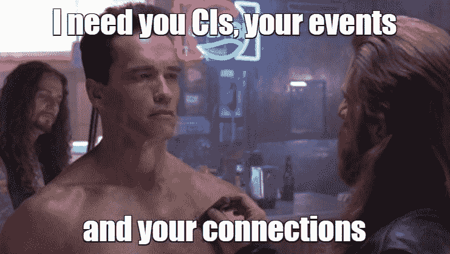

# 什么是 AIOps？

几年前我听说了“IT 运营的人工智能”这个术语，或“AIOps”，这要感谢 Gartner(还有谁？)这是定义:

> AIOps 平台利用大数据、现代机器学习和其他高级分析技术，通过主动、个性化和动态的洞察力，直接和间接增强 IT 运营(监控、自动化和服务台)功能。AIOps 平台支持同时使用多种数据源、数据收集方法、分析(实时和深度)技术和表示技术。

简而言之，AIOps 有两个方面——大数据和机器学习。现在你应该看到一个聪明的图片。

啊，在这里。

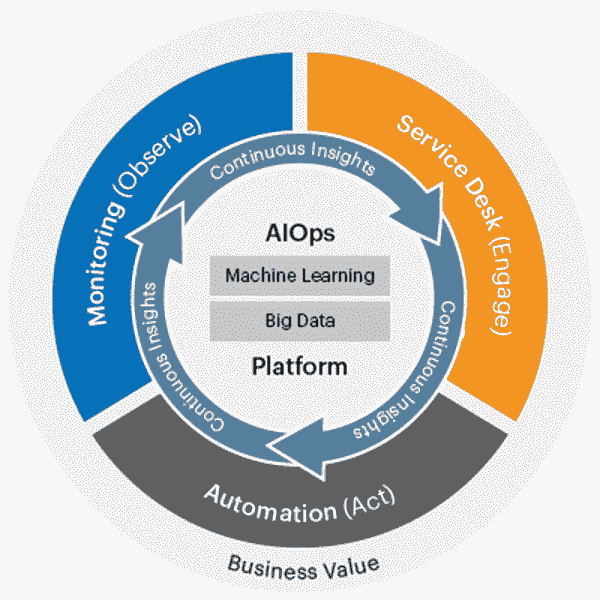

*The source: Gartner, Inc*

很明显，对于我的情况，我将从 AIOps 平台中受益，但我需要选择正确的平台。我遇到的问题是一个严重的成本障碍，因为我没有埃隆·马斯克那样的预算。所以我开始寻找免费的解决方案，找到了 [Acure.io.](https://acure.io/)

# 治愈方法？

一点 Acure 的背景。Acure 是一个新的事件控制和自动化平台，由拉脱维亚的一家公司创建，他们集成了许多功能。它引起了我的注意，因为他们将它推销为由工程师为工程师**制造，这对我很重要，因为没有人比一位同事工程师更了解 It 监控的所有痛点和内幕。它拥有灵活和开放的架构、根本原因和影响分析、拓扑模型、整个 It 系统状态的单一屏幕、与流行的监控系统的集成(当然包括 Zabbix)以及低代码引擎。这一切听起来都很棒，尤其是那些低代码，因为尽管我是一个 It 奇才，但我不是编码高手，所以我可以自己完成所有的配置和更改。**

很快 Acure 将发布 SaaS 版本，但他们也有企业内部许可证。我联系了团队，解释了我的需求，他们友好地给了我一个内部版本，让我可以测试它。我必须配置数据流，自动发现配置项目，对其进行监控，甚至启动自动修复脚本。所有这些过程在内容丰富的 Acure 用户指南中都有详细描述。

我只写了我的案例，展示了我的界面、设置、按钮和脚本，但不要担心大量的配置。配置完成后，Acure 将使您未来的工作流程更加轻松。

正如我提到的，Acure 是一个 SaaS 解决方案，本地版本需要单独申请。因此，我不会把重点放在安装过程上(在 SaaS 版本中，它只是意味着创建空间)，而是直接进入我的要点。

# 来自外部系统的事件的汇总和分析

首先，我建立了一个**数据流**来接收来自其他系统的数据。在 Acure 中，这个过程非常简单和直观。在*数据采集—数据流*部分，只需按下*+添加流*按钮，并填写以下字段。

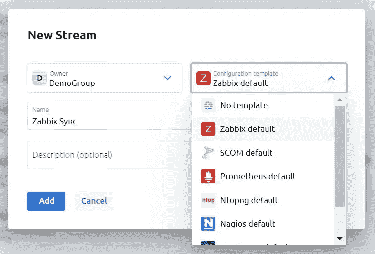

Acure 允许您选择一个带有预配置任务和处理程序的流行监控系统的模板，这是一个很棒的特性。你不需要为复杂的配置而困惑，因为系统会为你做好一切。

正如我已经说过的，我正在使用 Zabbix，所以我选择了它的模板。

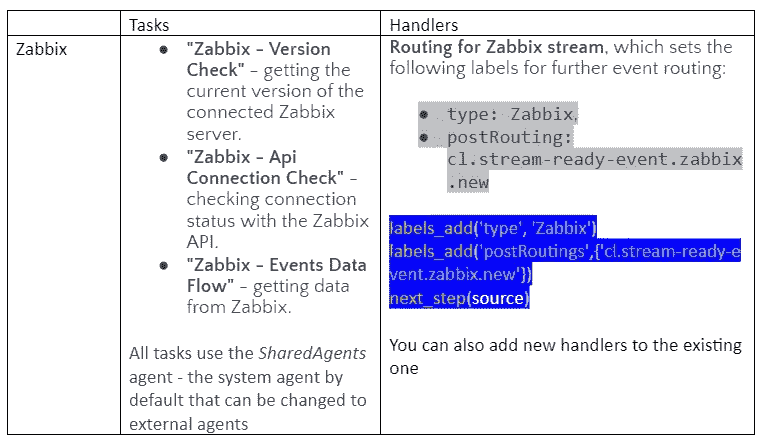

然后我使用连接 URL 连接 Zabbix 和 Acure，并登录到 Zabbix。

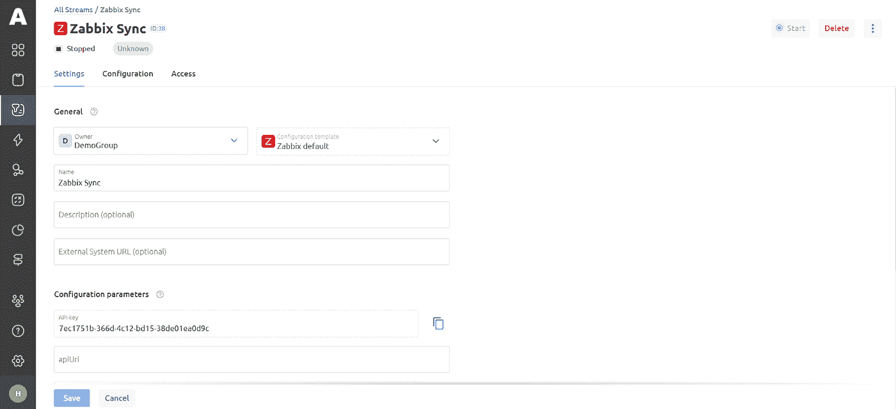

配置模板已经包含了将 Zabbix 绑定到 Acure 的任务，但是在我的例子中，我需要再添加一个自定义任务来从 Zabbix 获取数据，以便进一步创建拓扑。我在 YAML 写了这个脚本，并向 Zabbix API 提出了一个请求:

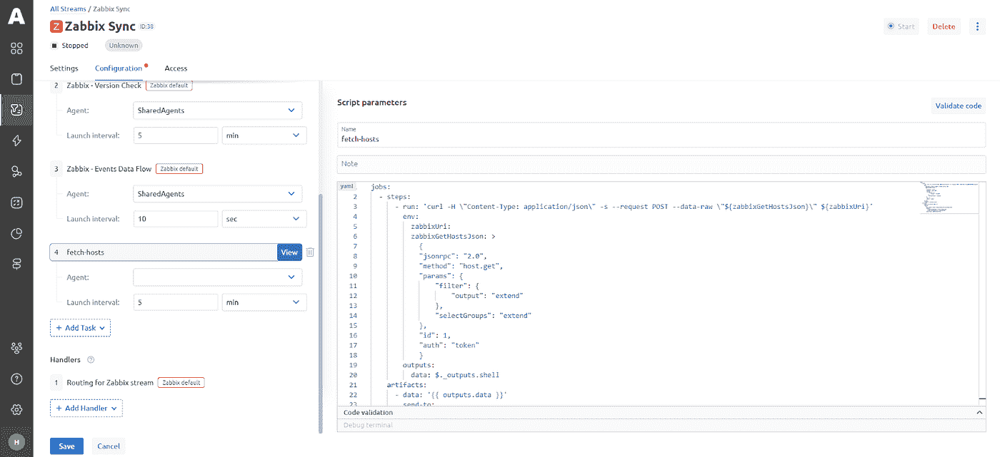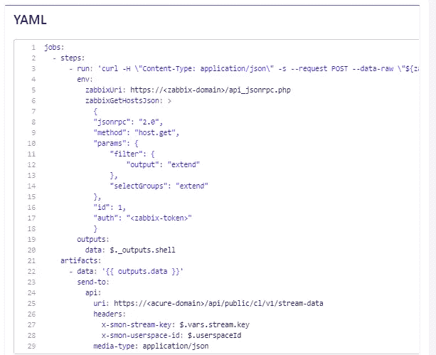

This script can easily be used as a template by inserting it manually and changing URL of primary system, the source for data receiving and token according to your data.

API 令牌取自 Zabbix:

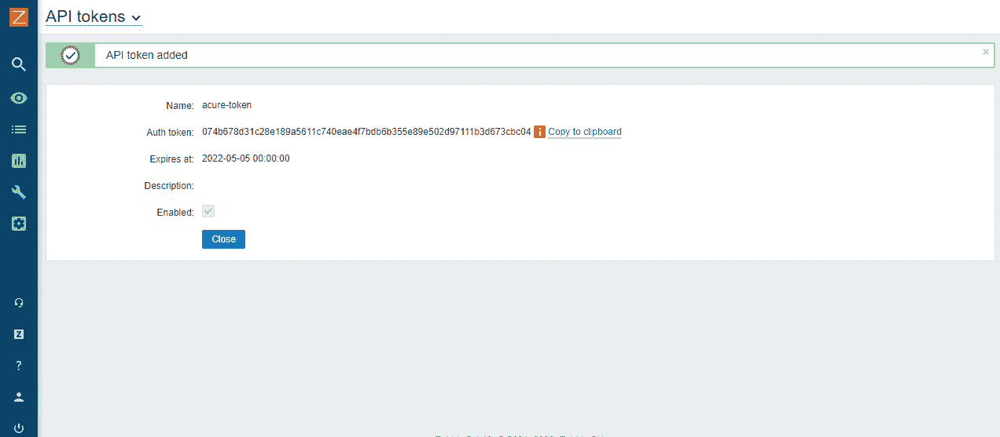

然后我保存了更改，瞧！该流被添加到数据流中

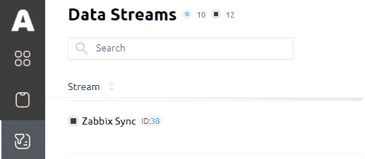

然而，魔法并不止于此。由于安全策略，拓扑数据收集任务无法在内部代理上运行。在运行它之前，我必须连接外部代理。这听起来可能有点复杂，但它真的没有那么糟糕。一旦这一步做好了，你就不需要再担心了。

然后，我添加了一个新的协调器，并在其中设置了自定义代理。

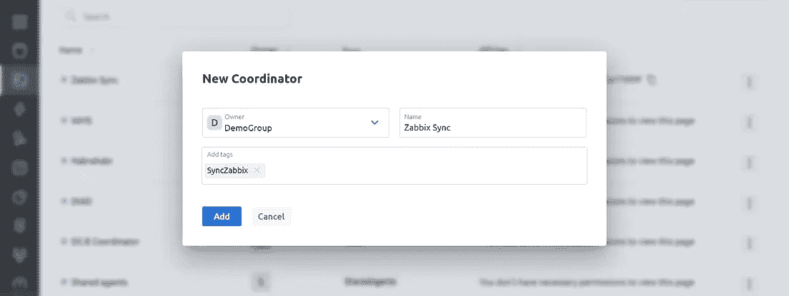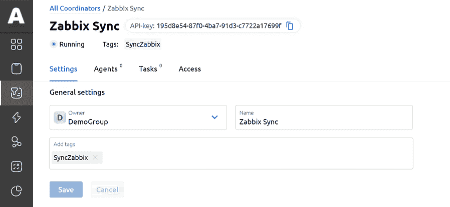

设置完成后，我返回到数据流，并将手动添加的定制任务中的代理更改为新创建的代理。

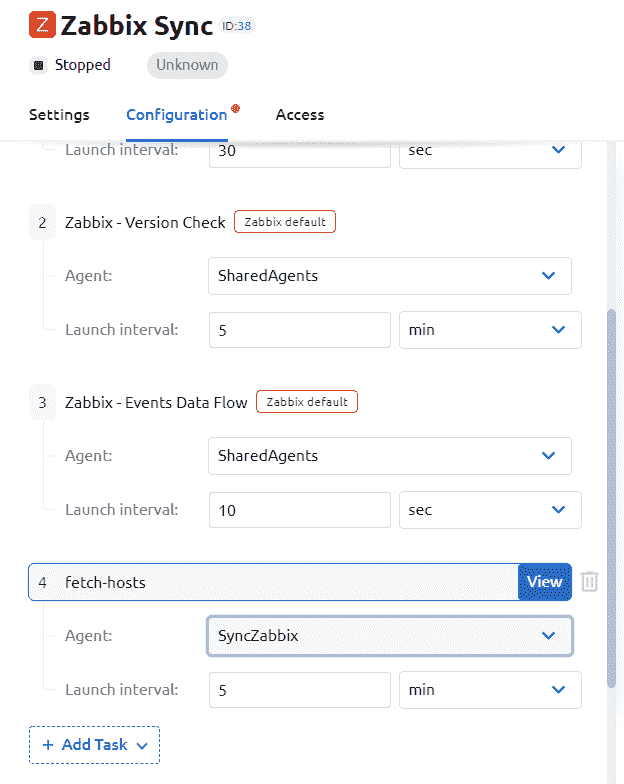

终于，我开始流了。在*事件和日志*中，我可以检查事件以确保系统正在收集数据。

在“陷入”一个报告问题的事件之后，我不仅看到了它的表视图，其中包含了 Zabbix 中所有元素的信息，还看到了 Zabbix 的标准 JSON 结构，例如:

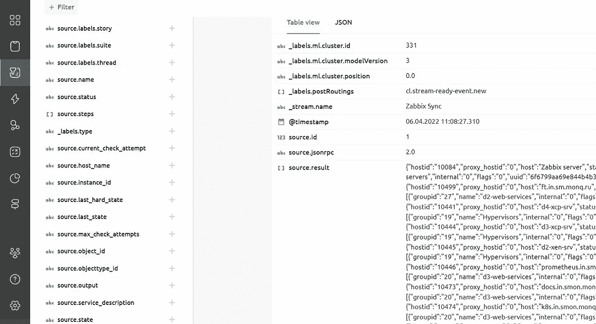

Info about the Zabbix hosts

*JSON structure for one of the Zabbix events*

基于来自主监控系统的事件，我构建了资源服务模型。

**资源服务模型的建立**

资源服务模型(RSM)是来自系统的配置项目(CI)以及它们之间的连接的列表。在 Acure 中，RSM 是基于拓扑的，但我不会超越自己。让我们回到 JSON 结构。以下参数是 RSM 的基础。

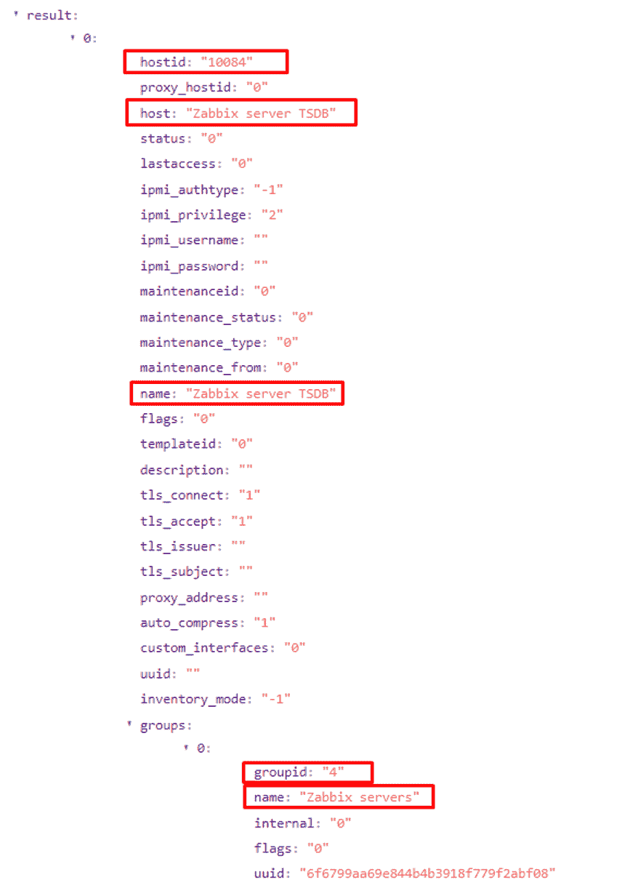

为了进一步自动创建配置项，我决定:

*CI 的名字== host.name (Zabbix 主机名)*

*父配置项的名称== host.groups[0]。名称*

*相关对象= > Zabbix 节点*

在自动化部分，我为我的工作组添加了一个新的场景。

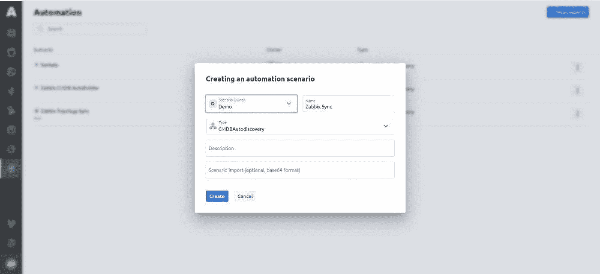

文档中清楚地描述了场景创建的过程。在阅读完它并查看了几个例子之后，任何人都可以创建一个任意复杂的场景，而无需任何硬编码。低代码引擎使得这个过程对于像我这样的非程序员来说非常容易。只需添加块，绑定它们，并创建脚本。

每个场景都从接收拓扑事件的“OnLogEvent”块开始。我的也不例外。

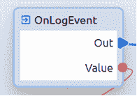

然后我检查了流:我的流名与脚本中的值匹配(在我的例子中，是 Zabbix Sync)，所以脚本被进一步执行。否则，脚本将不会执行。

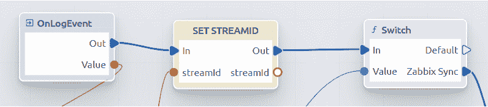

为了从一个信息系统扩展拓扑“bush ”,我通过 Service Model Graph 选项卡中的 CI 创建选项手动创建了一个根 CI。

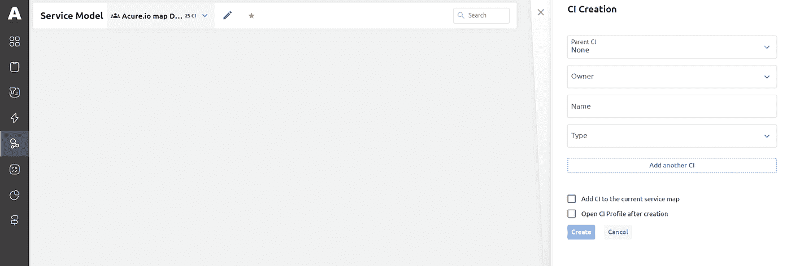

创建了一个配置项后，我从链接中取出它的 ID，并将其粘贴到脚本中的以下块中。

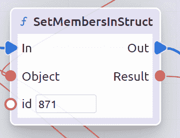

创建场景时，所有组都链接到该根配置项，该配置项显示拓扑上整个系统的运行状况。

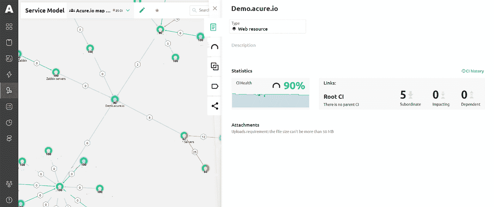

我还不想破坏拓扑结构，所以让我们回到创建一个脚本，这个脚本可以有条件地分为两个部分:

1.配置项(CI)的创建。

2.绑定主要监控系统的节点(用于进一步绑定触发器)。

我改进了我的脚本，进行了各种检查，添加了配置项的自动创建并配置了它们之间的绑定，编译并运行了该场景。

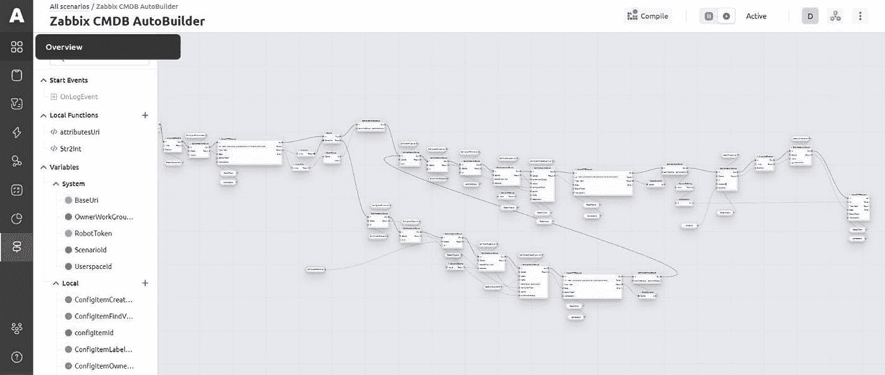

该脚本的执行向我展示了服务模型图，该图实时显示了所有组件的状态和系统的健康状况。

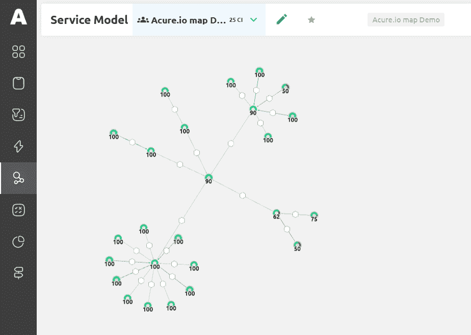

我添加了新的配置项来测试自动发现，并立即在地图上看到了它。为了确保系统没有欺骗我，我在事件日志中检查了新项目的添加。哇哦！所有新配置项都是自动添加的。

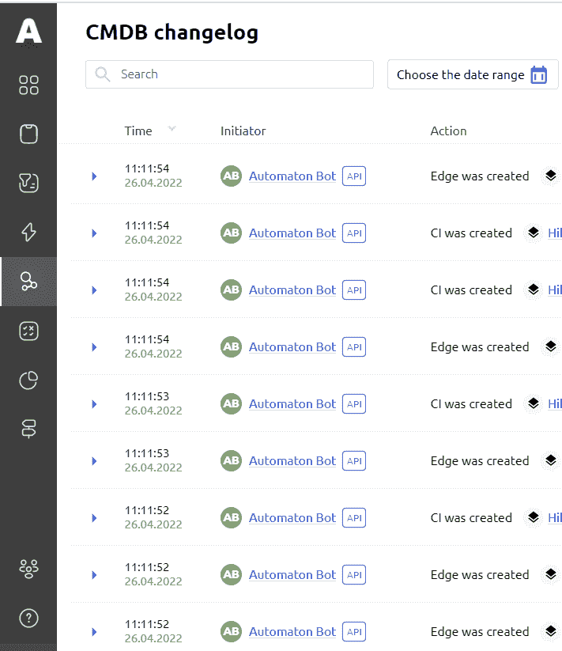

但是如果我把自己局限于自我发现，我就不是我了。

# 自动规则和自动操作

正如您已经了解的那样，Acure 接管了一些任务，并自动化了以前手动执行的常规流程。我决定检查系统本身是否能够执行由 CI 中的某些变化触发的某些操作和规则的算法。

在“规则和操作”部分，我为优先级为 2 或更高的所有配置项和事件添加了一条新规则。

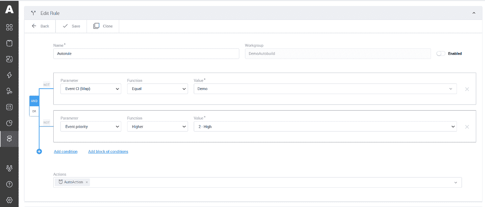

我配置了一个自动操作，如果触发该规则，将执行该操作。在我的例子中，有两个通过电子邮件发送的通知，时间间隔分别为 2 分钟和 30 分钟，如果在这段时间内没有修复事件，将执行自动修复脚本。

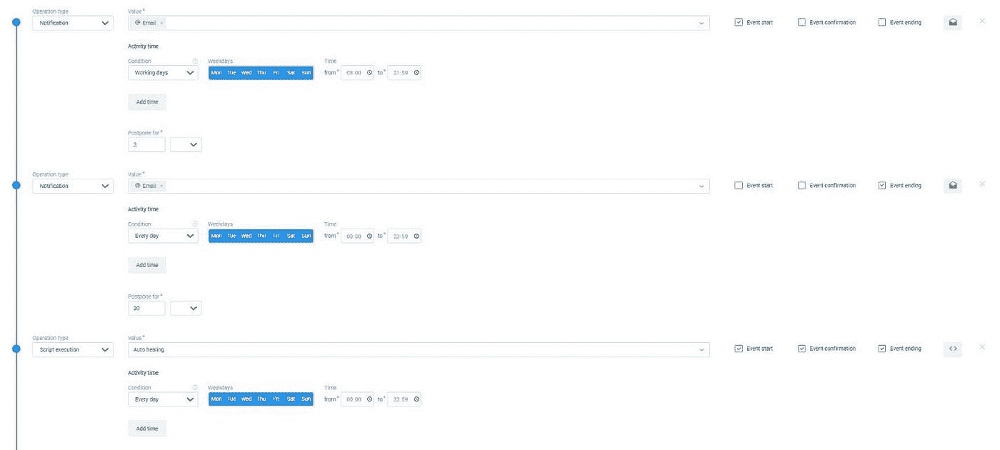

警报模板也可以在 Acure 中配置。我使用了预配置的模板，但也能够使用 Markdown 和 HTML 标记添加任何文本和附加必要的文件。

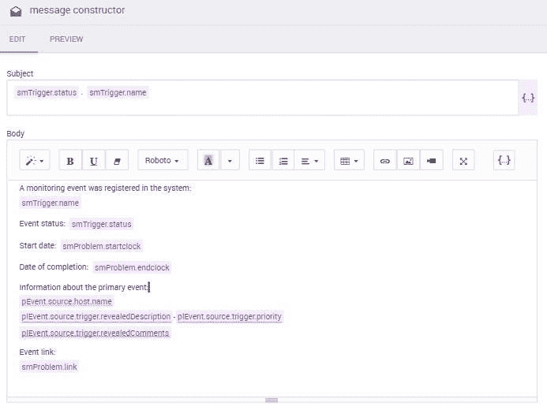

因此，当检测到具有高优先级的事件时，应该触发这个自动操作脚本:发送必要的通知并运行自动修复。自动！当你舒舒服服地把腿放在桌子上喝咖啡的时候。

# 结论

在本文中，以 Acure 平台为例，我展示了为什么在将日常工作委托给机器时没有理由紧张，以及它如何可以将您的时间释放出来用于更有趣的任务。

该系统有一个方便直观的界面和几个很酷的功能:与其他监控系统集成的能力，拓扑结构，低代码，在一个屏幕上显示整个基础设施的状态，以及从设置监控配置项目到运行自动脚本的全自动化过程。当事件进入系统时，它会改变服务模型本身或其状态。Acure 自动允许跟踪所有这些变化，并采取相关的行动。自动添加对象，自动绑定主要本地监控系统触发器，自动传播升级策略，自动计算系统健康状况，并运行自动化脚本。

如此简单的解决方案如此强大，真是太棒了。这是监控系统由使用这些系统的人自己制造的结果。

我也喜欢开发团队——他们反应迅速，迅速回答问题，并提供所有必要的信息和许可证。尽管 Acure 是一个年轻的平台，它有值得努力的地方，但我看到了巨大的潜力。

很快这些家伙就会发布新的 SaaS 版本，当然，我会一边喝咖啡一边期待；)

但现在分享你的想法，反馈，并在评论中看到你。