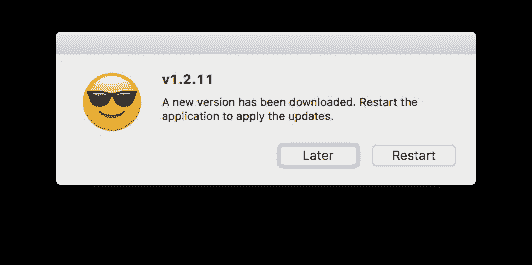

# 使用 Github 版本自动更新电子应用程序

> 原文：<https://medium.com/geekculture/auto-update-electron-apps-using-github-releases-c1c890f603e0?source=collection_archive---------3----------------------->

## 如何检查和自动安装电子应用程序的更新

Automatic updates for Electron app

如果你不通过应用商店发布你的电子应用，那么你需要一种方法来处理你的应用的自动更新。在这篇简短的文章中，我将带你通过一个电子应用程序检查更新和安装它的过程。在本文中，我们将…