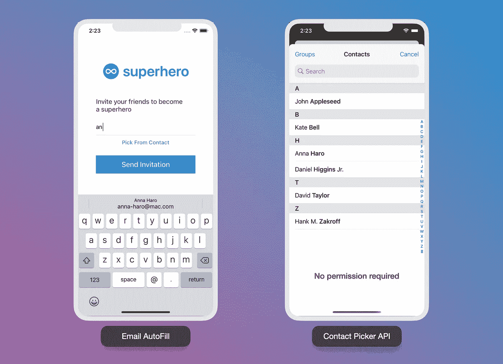
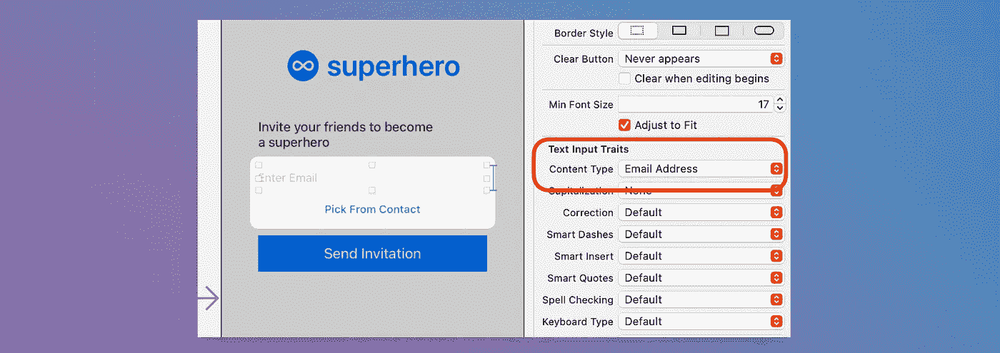

# iOS 开发中的自动填充和联系人选择器 API

> 原文：<https://medium.com/geekculture/autofill-and-contact-picker-api-in-ios-development-bdc7fb5f5de0?source=collection_archive---------20----------------------->

## 帮助您的用户快速输入数据

Photo by [La-Rel Easter](https://unsplash.com/@lastnameeaster?utm_source=unsplash&utm_medium=referral&utm_content=creditCopyText) on [Unsplash](https://unsplash.com/?utm_source=unsplash&utm_medium=referral&utm_content=creditCopyText)

# 概观

这是一个快速教程，介绍了我们如何在 iOS 应用中实现自动填充功能，以改善处理多个输入字段时的用户体验。根据指定的输入类型，在每个输入字段上都会有一个建议。

自动填充在 [WWDC20](https://developer.apple.com/videos/play/wwdc2020/10115/) 中有详细解释，它支持多种类型的输入，包括姓名、地址、位置、电子邮件、用户名、密码、强生成密码和安全代码。没有什么是花哨复杂的。我们只需要使用 UITextContentType API 来指定每个文本字段的内容类型。

太好了。让我们来看看这个场景。有一个网页，用户可以通过电子邮件邀请他们的朋友。那么，我们如何帮助用户快速找到预期的收件人呢？

有两个简单的解决方案，自动填充和联系 API

Image source: Author

# 1.自动填充-键入时联系建议

我们可以通过使用 Storyboard/xib 或以编程方式编写来实现这一点。

先来看看故事板。我们可以简单地通过点击文本字段来指定上下文类型，然后转到“属性检查器>文本输入特征>内容类型”，并将其更改为“电子邮件地址”。

如果我们想写代码，一旦你将文本域链接到 IBOutlet，设置文本域`textContentType`到`.emailAddress`，如下面的示例代码所示。因此，我们的文本字段将在键盘顶部填充联系建议电子邮件(QuickType 栏)。

现在，如果我们运行我们的代码，我们将得到类似如下。

## 其他输入类型呢？

对于 QuickType 栏上的自动建议，我们只需相应地指定上下文类型。以下是基于表单的页面应用程序中常用的类型。

*   `.location`
*   `.fullAddress`
*   `.telephoneNumber`
*   `.username`
*   `.password`

你可以参考苹果[文档](https://developer.apple.com/documentation/uikit/uitextcontenttype)中完全支持的类型。

对于[强生成密码](https://developer.apple.com/documentation/security/password_autofill/about_the_password_autofill_workflow?language=objc)输入和安全码，您可以参考这个 WWDC2018 [视频](https://developer.apple.com/videos/play/wwdc2018/204/)了解详情，因为它需要更多的步骤来完成。

# 2.联系人选取器 API

Showing contacts using Contact Picker API

联系人选择器是一个非常有用的 API，可以显示所有用户的联系人，不需要任何权限。用户不会被提示联系人访问权限，他们会对自己的数据感到安全。是不是很牛逼？

参见下面的代码。首先，我们需要从按钮链接 IBAction。单击按钮后，我们只需调用联系人选择器，并在用户选择联系人时处理 delegate 方法。

# 任务已完成

太棒了。我希望你喜欢这个教程，并开始在你的应用程序中实现自动填充功能，让我们的用户在处理输入表单时感觉更方便。

希望本文能帮助您提高开发技能。请分享，并感谢您的阅读。非常感谢您的反馈。祝编码愉快！

# 参考

[https://developer . apple . com/documentation/ui kit/uitextcontenttype](https://developer.apple.com/documentation/uikit/uitextcontenttype)

【https://developer.apple.com/videos/play/wwdc2020/10115/ 号

【https://developer.apple.com/videos/play/wwdc2018/204/ 

[https://developer . apple . com/documentation/security/password _ auto fill/about _ the _ password _ auto fill _ workflow？language=objc](https://developer.apple.com/documentation/security/password_autofill/about_the_password_autofill_workflow?language=objc)